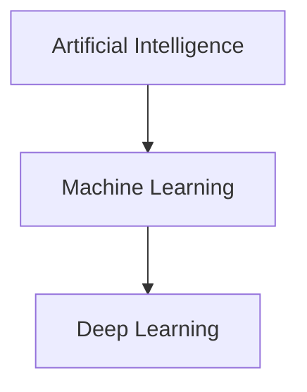

# Introduction to Artificial Intelligence

Welcome to your first lesson in AI! In this lesson, we'll explore what artificial intelligence is and why it's transforming the world.

## What is Artificial Intelligence?

Artificial Intelligence (AI) is the simulation of human intelligence processes by machines, especially computer systems. These processes include:

- **Learning** - acquiring information and rules for using it
- **Reasoning** - using rules to reach approximate or definite conclusions
- **Self-correction** - continuously improving through feedback

<Callout type="info" title="Key Insight">
AI is not just about making computers smart - it's about creating systems that can learn and adapt from experience, much like humans do.
</Callout>

## Types of AI

### 1. Narrow AI (Weak AI)
AI systems designed for specific tasks, like:
- Image recognition
- Voice assistants (Siri, Alexa)
- Recommendation systems (Netflix, Amazon)

### 2. General AI (Strong AI)
Hypothetical AI that can perform any intellectual task a human can do. This doesn't exist yet!

### 3. Super AI
AI that surpasses human intelligence. Still science fiction!

<Callout type="warning" title="Current Reality">
All AI systems today are Narrow AI. General AI and Super AI remain theoretical concepts.
</Callout>

## Machine Learning vs Deep Learning

- **AI**: The broadest concept - any technique enabling computers to mimic human behavior
- **Machine Learning**: A subset of AI where systems learn from data
- **Deep Learning**: A subset of ML using neural networks with multiple layers

## Real-World Applications

<Exercise title="Identify AI Applications" difficulty="easy">
Think about your daily life. List 3 AI applications you interact with regularly. Consider:
- Your smartphone
- Social media
- Online shopping
- Entertainment

Share your examples and discuss how they use AI.
</Exercise>

## Quiz Time!

<Quiz
  question="What is the main difference between Narrow AI and General AI?"
  options={[
    {
      text: "Narrow AI is cheaper to build",
      correct: false,
      explanation: "Cost is not the defining difference between these types of AI."
    },
    {
      text: "Narrow AI is designed for specific tasks, while General AI can perform any intellectual task",
      correct: true,
      explanation: "Correct! Narrow AI excels at specific tasks, while General AI (still theoretical) would match human-level intelligence across all domains."
    },
    {
      text: "General AI already exists in smartphones",
      correct: false,
      explanation: "General AI doesn't exist yet. Smartphones use Narrow AI for specific tasks."
    },
    {
      text: "There is no difference",
      correct: false,
      explanation: "There are significant differences in scope and capability between Narrow and General AI."
    }
  ]}
/>

## Summary

In this lesson, you learned:
- ✅ AI simulates human intelligence in machines
- ✅ Current AI is all Narrow AI (task-specific)
- ✅ Machine Learning is a subset of AI that learns from data
- ✅ Deep Learning uses neural networks for complex pattern recognition
- ✅ AI is already integrated into many aspects of daily life

<Callout type="success" title="Next Steps">
In the next lesson, we'll dive into Machine Learning algorithms and how they work!
</Callout>
