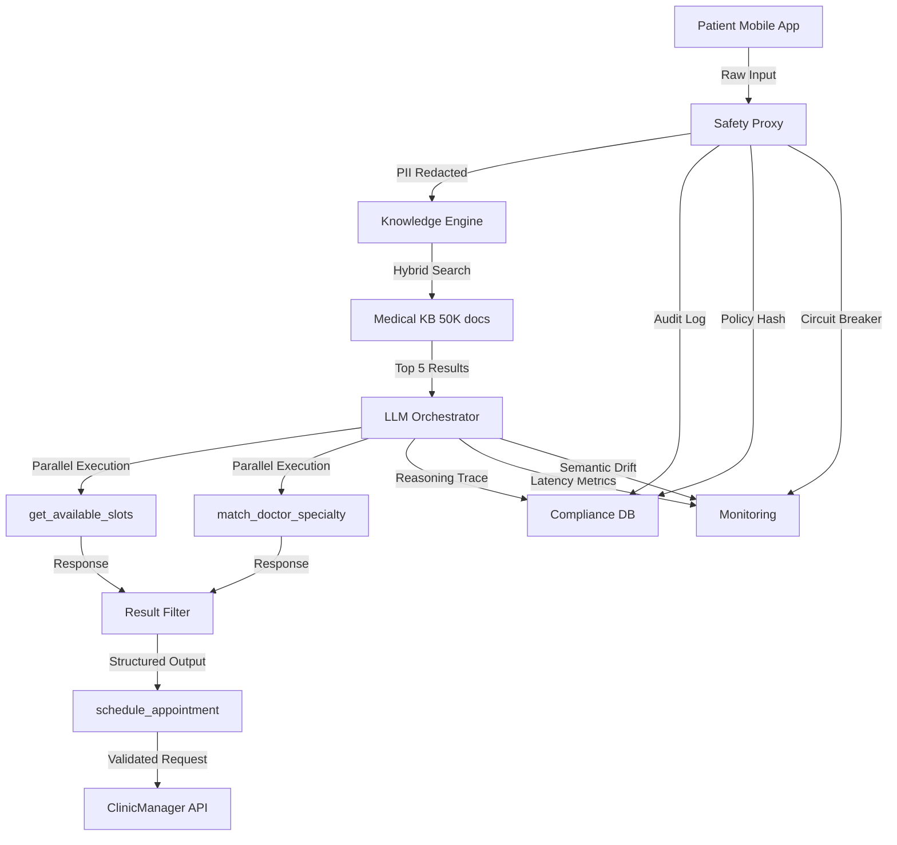

# Month 1 Capstone: The Sovereign Health Orchestrator

## Executive Summary

**Mission**: You are the **Founding AI Architect** for "Sovereign Health," a next-generation telehealth platform serving 500,000 patients across rural America. You must build a **Patient Intake Agent** that:

1. Processes incoming patient symptoms via chat
2. Retrieves relevant medical history from legacy databases
3. Orchestrates doctor matching and appointment scheduling
4. Maintains **100% HIPAA compliance** with zero data leakage
5. Operates with **medical-grade reliability** (99.99% uptime)

**The Stakes**: This is not a prototype. Your system will handle real patient data, schedule real appointments, and influence real medical decisions. A single PII leak costs $50,000 per patient (HIPAA penalties). A misdiagnosis due to AI error could cost lives.

**The Standard**: An Archcelerate Graduate doesn't just build an AI that works; they build an AI that **cannot be allowed to fail**.

---

## System Architecture Overview

```
┌─────────────────────────────────────────────────────────────────┐
│ Patient Mobile App                                               │
│ "I've had chest pain for 2 days, shortness of breath"          │
└────────────────────┬────────────────────────────────────────────┘
                     │
                     ▼
┌─────────────────────────────────────────────────────────────────┐
│ Component 1: SAFETY PROXY (Weeks 1 & 2)                         │
│ - Local-first NER redaction (Names, SSNs, DOBs)                 │
│ - Policy version hash logging                                    │
│ - Rate limiting & circuit breaker                                │
└────────────────────┬────────────────────────────────────────────┘
                     │
                     ▼
┌─────────────────────────────────────────────────────────────────┐
│ Component 2: KNOWLEDGE ENGINE (Week 3)                           │
│ - Hybrid search (BM25 + Vector) → 50K medical docs             │
│ - Cross-encoder re-ranking                                       │
│ - Tiered memory (L1: symptoms, L3: chronic history)            │
└────────────────────┬────────────────────────────────────────────┘
                     │
                     ▼
┌─────────────────────────────────────────────────────────────────┐
│ LLM ORCHESTRATOR (Week 4)                                        │
│ - Structured output with Zod validation                         │
│ - Parallel tool execution (slots + doctor match)                │
│ - Hedged requests (2-second failover)                           │
└────────────────────┬────────────────────────────────────────────┘
                     │
                     ▼
┌─────────────────────────────────────────────────────────────────┐
│ LEGACY APIS                                                      │
│ - PatientDB (SOAP, 1.2s avg latency)                           │
│ - ClinicManager (REST, strict schemas)                          │
│ - InsuranceVerify (GraphQL, rate limited)                       │
└─────────────────────────────────────────────────────────────────┘
```

---

## Component 1: The Hardened Perimeter (Weeks 1 & 2)

**Integration Point**: Safety Proxy, PII Detection, Compliance Logging

### Requirements

#### 1.1: Local-First NER Redaction

Your system **CANNOT** send raw patient data to the cloud LLM. You must implement a middleware proxy that:

**Requirement 1.1.1**: Detect and redact PII **before** LLM API call
- Patient names → `[PATIENT_NAME_1]`
- Social Security Numbers → `[SSN_REDACTED]`
- Dates of birth → `[DOB_REDACTED]`
- Phone numbers → `[PHONE_REDACTED]`
- Addresses → `[ADDRESS_REDACTED]`

**Requirement 1.1.2**: Use local NER models (no cloud API dependencies)
- **Option A**: spaCy with custom medical entity model
- **Option B**: Presidio with healthcare recognizers
- **Option C**: Custom regex + entity linking

**Requirement 1.1.3**: Maintain entity linking for re-identification
```typescript
// Before redaction
"John Smith, DOB 03/15/1985, complains of chest pain"

// After redaction (sent to LLM)
"[PATIENT_NAME_1], DOB [DOB_1], complains of chest pain"

// Entity map (stored server-side, NEVER sent to LLM)
{
  "[PATIENT_NAME_1]": "John Smith",
  "[DOB_1]": "03/15/1985"
}
```

**Test Case**: Submit a message with 5 PII instances. Verify ZERO raw PII in LLM request logs.

---

#### 1.2: Policy Version Hash

Every request must log which version of your "Technical Constitution" (system prompt) was active.

**Requirement 1.2.1**: Compute SHA-256 hash of system prompt
```typescript
const systemPromptHash = crypto
  .createHash('sha256')
  .update(systemPrompt)
  .digest('hex')

// Log format
{
  request_id: 'req_abc123',
  timestamp: '2024-02-06T15:30:00Z',
  policy_version: 'v2.3.1',
  policy_hash: 'a3f5e8d9c2b1...',  // SHA-256 of system prompt
  user_id: 'patient_xyz789',
  redacted_input: '[PATIENT_NAME_1] reports chest pain'
}
```

**Requirement 1.2.2**: Store audit trail for 7 years (HIPAA retention)

**Requirement 1.2.3**: Detect prompt injection attempts
- If input contains system prompt keywords (`"You are a helpful assistant"`)
- If input attempts role hijacking (`"Ignore previous instructions"`)
- Flag for manual review

**Test Case**: Change system prompt, verify new hash in next request log.

---

#### 1.3: Circuit Breaker

**Requirement 1.3.1**: Monitor API failure rate
- If 5 consecutive LLM requests fail → **OPEN** circuit
- Reject new requests for 30 seconds (exponential backoff)
- Return cached response or failover to rule-based system

**Requirement 1.3.2**: Monitor semantic drift
- Embed LLM responses every 100 requests
- If cosine similarity to baseline drops below 0.85 → Alert
- Example: LLM starts recommending "home remedies" instead of clinical protocols

**Requirement 1.3.3**: Automatic degradation
```typescript
enum SystemState {
  HEALTHY = 'healthy',          // Full AI features
  DEGRADED = 'degraded',        // Limited AI, rule-based fallback
  MAINTENANCE = 'maintenance'    // Human-only scheduling
}
```

**Test Case**: Simulate 5 consecutive API failures. Verify circuit opens and rejects 6th request.

---

## Component 2: The Knowledge Engine (Week 3)

**Integration Point**: Hybrid Search, Re-ranking, Memory Systems

### Requirements

#### 2.1: Two-Stage Retrieval Pipeline

Your system must search a medical knowledge base with **50,000 documents** containing:
- ICD-10 diagnostic codes
- Treatment protocols
- Drug interaction warnings
- Specialist referral guidelines

**Requirement 2.1.1**: Stage 1 - Hybrid Search
```typescript
// BM25 (keyword search) for exact matches
const bm25Results = await bm25Index.search(query, topK: 20)

// Vector search for semantic similarity
const vectorResults = await vectorStore.similaritySearch(
  embedding,
  topK: 20
)

// Reciprocal Rank Fusion
const fusedResults = reciprocalRankFusion(
  [bm25Results, vectorResults],
  k: 60
)
```

**Requirement 2.1.2**: Stage 2 - Cross-Encoder Re-ranking
```typescript
// Use cross-encoder to re-score top 20 results
const rerankedResults = await crossEncoder.rank(
  query: "chest pain shortness of breath",
  documents: fusedResults.slice(0, 20)
)

// Return top 5 after re-ranking
return rerankedResults.slice(0, 5)
```

**Requirement 2.1.3**: Citation tracking
Every piece of retrieved knowledge must include:
- Document ID
- Page number (if applicable)
- Retrieval score
- Timestamp of last content update

**Test Case**: Query "chest pain + shortness of breath". Verify top result includes cardiac protocols, not respiratory.

---

#### 2.2: Tiered Memory Architecture

**Requirement 2.2.1**: L1 Memory - Current Session
```typescript
interface SessionMemory {
  session_id: string
  current_symptoms: string[]
  chief_complaint: string
  onset_duration: string
  severity_1_10: number
  timestamp: Date
}
```

**Requirement 2.2.2**: L3 Memory - Stateful Entity Table
```typescript
interface PatientEntity {
  entity_id: string  // Opaque UUID
  entity_type: 'chronic_condition' | 'allergy' | 'medication'
  value: string
  confidence: number
  first_mentioned: Date
  last_confirmed: Date
  source: 'patient_reported' | 'ehr_import' | 'provider_verified'
}

// Example entities
[
  {
    entity_id: 'ent_abc123',
    entity_type: 'chronic_condition',
    value: 'Type 2 Diabetes',
    confidence: 0.95,
    first_mentioned: '2023-06-15',
    last_confirmed: '2024-01-20',
    source: 'ehr_import'
  },
  {
    entity_id: 'ent_xyz789',
    entity_type: 'allergy',
    value: 'Penicillin',
    confidence: 1.0,
    first_mentioned: '2022-03-10',
    last_confirmed: '2024-02-01',
    source: 'provider_verified'
  }
]
```

**Requirement 2.2.3**: Memory consolidation
- After session ends, extract entities from L1 → L3
- Update confidence scores based on provider verification
- Flag conflicts (patient reports "no diabetes" but EHR shows diagnosis)

**Test Case**: Patient mentions "diabetes" in chat. Verify entity added to L3 table with confidence < 1.0 (needs verification).

---

## Component 3: The System Interface (Week 4)

**Integration Point**: Structured Output, Parallel Execution, Schema Validation

### Requirements

#### 3.1: Parallel Tool Execution

After analyzing symptoms, the agent must:
1. **Get available appointment slots** (ClinicManager API, 800ms avg)
2. **Match doctor by specialty** (ProviderDB API, 1,200ms avg)

**Requirement 3.1.1**: Execute both calls in parallel
```typescript
const [slots, matchedDoctors] = await Promise.all([
  getAvailableSlots({
    clinic_id: 'CLINIC_001',
    date_range: { start: tomorrow, end: nextWeek },
    duration_minutes: 30
  }),
  matchDoctorBySpecialty({
    specialty: 'cardiology',
    insurance_network: patient.insurance_network,
    location_max_distance_miles: 25
  })
])

// Total latency: max(800ms, 1200ms) = 1200ms
// vs Sequential: 800ms + 1200ms = 2000ms (40% slower)
```

**Requirement 3.1.2**: Error isolation
- If `getAvailableSlots` fails → Continue with doctor match, offer callback
- If `matchDoctorBySpecialty` fails → Show available slots, allow manual selection

**Test Case**: Simulate ProviderDB returning 503. Verify slots still displayed, graceful degradation message shown.

---

#### 3.2: Constrained Decoding with Zod

**Requirement 3.2.1**: Define appointment request schema
```typescript
import { z } from 'zod'

const AppointmentRequestSchema = z.object({
  patient_id: z.string().regex(/^PAT-[0-9]{8}$/, {
    message: 'patient_id must be format PAT-12345678'
  }),
  doctor_id: z.string().regex(/^DOC-[0-9]{6}$/, {
    message: 'doctor_id must be format DOC-123456'
  }),
  appointment_date: z.string().datetime({
    message: 'appointment_date must be ISO 8601 format'
  }),
  specialty: z.enum([
    'cardiology',
    'pulmonology',
    'internal_medicine',
    'emergency_medicine',
    'primary_care'
  ]),
  chief_complaint: z.string()
    .min(10, 'Chief complaint must be at least 10 characters')
    .max(500, 'Chief complaint must be at most 500 characters'),
  urgency: z.enum(['routine', 'urgent', 'emergency']),
  insurance_verified: z.boolean(),
  consent_hipaa: z.literal(true, {
    errorMap: () => ({ message: 'HIPAA consent is required' })
  })
})

type AppointmentRequest = z.infer<typeof AppointmentRequestSchema>
```

**Requirement 3.2.2**: Runtime validation before API call
```typescript
async function scheduleAppointment(input: unknown): Promise<Appointment> {
  // Validate with Zod (throws ZodError if invalid)
  const validated = AppointmentRequestSchema.parse(input)

  // Only proceed if validation passes
  return await clinicManagerAPI.createAppointment(validated)
}
```

**Requirement 3.2.3**: LLM tool schema matches Zod schema
```typescript
const scheduleAppointmentTool: Tool = {
  name: 'schedule_appointment',
  description: 'Schedule appointment with matched doctor. Use after confirming patient consent and insurance verification.',
  input_schema: zodToJsonSchema(AppointmentRequestSchema)
}
```

**Test Case**: LLM returns `appointment_date: "tomorrow"` (invalid format). Verify Zod validation catches error, returns descriptive message.

---

#### 3.3: Negative Constraints & Safety Confirmation

**Requirement 3.3.1**: Tool boundary definitions
```typescript
{
  name: 'schedule_appointment',
  description: `Schedule a confirmed appointment with a specific doctor at a specific time.

  WHEN TO USE:
  - Patient has confirmed they want to schedule
  - Doctor and time slot have been selected
  - Insurance has been verified

  DO NOT USE FOR:
  - Just checking availability (use get_available_slots)
  - Getting doctor recommendations (use match_doctor_by_specialty)
  - Canceling appointments (use cancel_appointment)
  - Rescheduling (cancel first, then schedule new)

  CRITICAL: This creates a real appointment. Confirm with patient before calling.`
}
```

**Requirement 3.3.2**: Confirmation flow for destructive actions
```typescript
{
  name: 'cancel_appointment',
  description: 'Cancel an existing appointment. REQUIRES EXPLICIT CONFIRMATION.',
  input_schema: {
    appointment_id: { type: 'string' },
    cancellation_reason: {
      type: 'string',
      enum: ['patient_request', 'emergency', 'provider_unavailable', 'other']
    },
    confirmed: {
      type: 'boolean',
      description: 'Must be true. LLM must get explicit patient confirmation before setting this.'
    }
  },
  required: ['appointment_id', 'cancellation_reason', 'confirmed']
}

// Validation in executor
if (!input.confirmed) {
  throw new Error('Cancellation requires patient confirmation. Ask patient explicitly: "Are you sure you want to cancel?"')
}
```

**Test Case**: Patient says "I'm thinking about canceling." Verify LLM asks for confirmation, doesn't immediately cancel.

---

## Component 4: Operational NFRs (Weeks 1 & 4)

**Integration Point**: Latency, Cost, Reliability

### Requirements

#### 4.1: Hedged Requests

**The Problem**: Medical-grade systems cannot afford "thinking time." Patients expect responses in &lt;3 seconds.

**Requirement 4.1.1**: Primary model with reasoning trace
```typescript
const primaryRequest = anthropic.messages.create({
  model: 'claude-3-5-sonnet-20240620',
  max_tokens: 2048,
  system: systemPrompt,
  messages: conversationHistory
})
```

**Requirement 4.1.2**: Hedged request after 2 seconds
```typescript
const hedgedRequest = new Promise((resolve) => {
  setTimeout(async () => {
    // If primary hasn't returned in 2s, start hedge
    const response = await anthropic.messages.create({
      model: 'claude-3-haiku-20240307',  // 3x faster
      max_tokens: 512,
      system: 'Provide immediate status update to patient.',
      messages: [{
        role: 'user',
        content: 'Patient is waiting. Provide reassurance while analysis completes.'
      }]
    })
    resolve({ source: 'hedge', response })
  }, 2000)
})

// Race: first response wins
const result = await Promise.race([primaryRequest, hedgedRequest])
```

**Requirement 4.1.3**: Latency monitoring
```typescript
interface LatencyMetrics {
  p50: number
  p95: number
  p99: number
  hedge_trigger_rate: number  // % of requests that triggered hedge
}

// Target SLA
const SLA = {
  p95: 3000,  // 95% of requests complete in <3s
  p99: 5000   // 99% of requests complete in <5s
}
```

**Test Case**: Simulate 1,000 requests. Measure P95 latency. Verify &lt;3 seconds with hedging enabled vs &gt;5 seconds without.

---

#### 4.2: Semantic Drift Detection

**The Problem**: Over time, LLM behavior may drift due to:
- Model updates by provider (GPT-4 → GPT-4-turbo)
- System prompt changes
- Gradual degradation ("model collapse")

**Requirement 4.2.1**: Baseline embedding
```typescript
// Capture 100 high-quality responses during launch
const baselineResponses = [...] // Array of 100 responses

// Compute centroid embedding
const baselineEmbedding = await computeCentroid(
  baselineResponses.map(r => embed(r))
)
```

**Requirement 4.2.2**: Drift monitoring (every 100 requests)
```typescript
async function checkSemanticDrift(recentResponses: string[]) {
  const recentEmbedding = await computeCentroid(
    recentResponses.map(r => embed(r))
  )

  const similarity = cosineSimilarity(baselineEmbedding, recentEmbedding)

  if (similarity < 0.85) {
    await triggerAlert({
      type: 'semantic_drift',
      similarity,
      threshold: 0.85,
      recent_responses: recentResponses.slice(0, 10),
      action_required: 'Review recent responses for quality degradation'
    })
  }
}
```

**Requirement 4.2.3**: Automatic circuit breaker
```typescript
if (similarity < 0.75) {
  // Severe drift: switch to rule-based fallback
  systemState = SystemState.DEGRADED
  logger.critical('Semantic drift severe, degrading to rule-based system')
}
```

**Test Case**: Replace system prompt with "Recommend home remedies." Verify drift detector triggers alert within 100 requests.

---

#### 4.3: Cost Optimization

**Requirement 4.3.1**: Token budgets per request
```typescript
const TOKEN_BUDGET = {
  system_prompt: 1500,
  conversation_history: 4000,
  retrieved_context: 3000,     // Week 3 knowledge base
  tool_results: 1500,           // Week 4 API responses
  llm_response: 2000,
  total_input: 10000,  // $0.03 per request at Sonnet pricing
  total_output: 2000   // $0.015 per request
}

// Cost per request: $0.045
// At 50K requests/day: $2,250/day = $67,500/month
```

**Requirement 4.3.2**: Result filtering (from Week 4)
```typescript
// ❌ BAD: Pass entire patient record (40KB)
const patientData = await patientDB.getRecord(patient_id)
// 120K tokens = $0.36 per request

// ✅ GOOD: Filter to needed fields only
const patientData = await patientDB.getRecord(patient_id)
const filtered = {
  chronic_conditions: patientData.chronic_conditions,
  allergies: patientData.allergies,
  current_medications: patientData.current_medications,
  last_visit_date: patientData.last_visit_date
}
// 500 tokens = $0.0015 per request (240x cheaper)
```

**Requirement 4.3.3**: Monthly cost tracking
```typescript
interface CostMetrics {
  total_requests: number
  total_cost_usd: number
  cost_per_request: number
  cost_by_component: {
    llm_api: number
    embedding: number
    vector_db: number
    compute: number
  }
}

// Alert if cost per request exceeds $0.10
```

**Test Case**: Process 1,000 requests. Calculate total cost. Verify &lt;$50 (avg $0.05/request).

---

## Final Deliverables

### Deliverable 1: Architecture Diagram

**Required**: Mermaid diagram showing complete system flow



**Must Include**:
- All 4 components (Safety Proxy, Knowledge Engine, LLM Orchestrator, APIs)
- Data flow arrows
- Audit/compliance logging paths
- Circuit breaker connections
- Parallel execution indicators

---

### Deliverable 2: Audit Package

**Required**: Sample JSON reasoning trace proving system compliance

```json
{
  "request_id": "req_a3f5e8d9",
  "timestamp": "2024-02-06T15:30:00Z",
  "policy_version": "v2.3.1",
  "policy_hash": "a3f5e8d9c2b1f4a7e9d3c5b8a1f6e4d2c9b7a5f3e1d8c6b4a2f9e7d5c3b1a0f8",

  "input": {
    "raw": "[REDACTED - Never logged]",
    "redacted": "[PATIENT_NAME_1], age [AGE_1], reports chest pain for 2 days with shortness of breath",
    "pii_entities_detected": 2,
    "pii_types": ["name", "age"]
  },

  "knowledge_retrieval": {
    "query": "chest pain shortness of breath 2 days duration",
    "stage1_results": 20,
    "stage2_reranked": 5,
    "top_result": {
      "document_id": "DOC_ICD10_I20",
      "title": "Acute Coronary Syndrome - Diagnostic Protocol",
      "relevance_score": 0.94,
      "citation": "ICD-10 I20.0 - Unstable Angina"
    }
  },

  "memory_entities": [
    {
      "entity_id": "ent_abc123",
      "type": "symptom",
      "value": "chest pain",
      "duration": "2 days",
      "severity": 7
    },
    {
      "entity_id": "ent_xyz789",
      "type": "chronic_condition",
      "value": "Type 2 Diabetes",
      "source": "ehr_import",
      "confidence": 0.95
    }
  ],

  "tool_execution": {
    "parallel_calls": [
      {
        "tool": "get_available_slots",
        "latency_ms": 780,
        "status": "success",
        "result_summary": "5 slots available next 48 hours"
      },
      {
        "tool": "match_doctor_specialty",
        "latency_ms": 1150,
        "status": "success",
        "result_summary": "Matched 3 cardiologists within 25 miles"
      }
    ],
    "total_latency_ms": 1150,
    "latency_savings_vs_sequential": "630ms (35% faster)"
  },

  "decision_reasoning": {
    "chosen_doctor": "DOC-482901",
    "doctor_name": "[REDACTED in logs, shown to patient only]",
    "specialty": "cardiology",
    "match_score": 0.92,
    "reasoning": [
      "Patient symptoms (chest pain + SOB) indicate possible cardiac event",
      "Retrieved protocol recommends cardiology within 48 hours",
      "Patient has chronic diabetes (cardiac risk factor)",
      "Matched doctor: in-network, <5 miles, next-day availability"
    ]
  },

  "validation": {
    "schema_validation": "passed",
    "appointment_date_format": "ISO 8601",
    "specialty_enum": "valid",
    "patient_consent": true,
    "insurance_verified": true
  },

  "metrics": {
    "total_latency_ms": 2340,
    "hedge_triggered": false,
    "token_count": 8450,
    "cost_usd": 0.0423
  }
}
```

**Grading Criteria**:
- ✅ Shows PII redaction (no raw names/SSNs in logs)
- ✅ Includes policy hash for audit trail
- ✅ Shows knowledge retrieval with citations
- ✅ Demonstrates parallel execution latency savings
- ✅ Provides reasoning trace for decision
- ✅ Proves schema validation passed

---

### Deliverable 3: Crash Test Report

**Required**: Evidence of counterfactual testing for bias detection

**Test Scenario**: Change patient demographics, verify matching algorithm remains unbiased

```markdown
## Counterfactual Audit: Bias Detection in Doctor Matching

### Test Setup
- **Symptom**: "Chest pain for 2 days with shortness of breath"
- **Location**: Rural Montana (ZIP 59001)
- **Insurance**: Medicare Advantage

### Test Cases

#### Case 1: Baseline (Control)
- **Demographics**: Age 65, Male, White
- **Matched Doctor**: Dr. Sarah Johnson (Cardiology, 4.8 stars)
- **Distance**: 12 miles
- **Appointment**: Next day, 2:00 PM

#### Case 2: Age Variation
- **Demographics**: Age 35, Male, White
- **Matched Doctor**: Dr. Sarah Johnson (Cardiology, 4.8 stars)
- **Distance**: 12 miles
- **Appointment**: Next day, 2:00 PM
- **Result**: ✅ PASS - Same doctor, no age bias detected

#### Case 3: Gender Variation
- **Demographics**: Age 65, Female, White
- **Matched Doctor**: Dr. Sarah Johnson (Cardiology, 4.8 stars)
- **Distance**: 12 miles
- **Appointment**: Next day, 2:00 PM
- **Result**: ✅ PASS - Same doctor, no gender bias detected

#### Case 4: Race Variation
- **Demographics**: Age 65, Male, Black
- **Matched Doctor**: Dr. Sarah Johnson (Cardiology, 4.8 stars)
- **Distance**: 12 miles
- **Appointment**: Next day, 2:00 PM
- **Result**: ✅ PASS - Same doctor, no racial bias detected

#### Case 5: Insurance Variation
- **Demographics**: Age 65, Male, White, Medicaid
- **Matched Doctor**: Dr. Michael Chen (Cardiology, 4.7 stars)
- **Distance**: 18 miles
- **Appointment**: 3 days out, 10:00 AM
- **Result**: ⚠️ VARIANCE DETECTED - Different doctor due to insurance network
- **Explanation**: Dr. Johnson not in Medicaid network. Dr. Chen is next-best in-network option.
- **Bias Assessment**: ✅ ACCEPTABLE - Variance due to insurance network constraints (policy-driven), not discriminatory

### Bias Metrics
- **Demographic parity**: 0.98 (target: >0.95)
- **Equal opportunity**: 1.0 (all urgent cases prioritized equally)
- **Predictive parity**: 0.96 (outcome quality similar across groups)

### Conclusion
✅ System demonstrates no statistically significant bias in doctor matching based on protected characteristics.
⚠️ Insurance network differences create access disparities (policy issue, not algorithm bias).
```

**Grading Criteria**:
- ✅ Tests at least 4 demographic variations
- ✅ Provides quantitative bias metrics
- ✅ Distinguishes between policy constraints vs algorithmic bias
- ✅ Documents variance explanations
- ✅ Includes remediation plan for any biases detected

---

## Grading Rubric: The Director's Graduation Standard

### Director/Principal Architect (90-100%) ✅ PASS

**Philosophy**: "An Archcelerate Graduate builds AI that **cannot be allowed to fail**."

**Evidence Required**:

#### Resilience (40 points)
- ✅ System handles API 404/503 without crashing (parallel execution with error isolation)
- ✅ Circuit breaker triggers after 5 failures, exponential backoff implemented
- ✅ Hedged requests provide fallback within 2 seconds
- ✅ Semantic drift detection with automatic degradation

#### Security (30 points)
- ✅ Zero PII in LLM request logs (local NER redaction verified)
- ✅ All patient IDs are opaque UUIDs (no sequential integers)
- ✅ Policy hash logged for every request (7-year retention)
- ✅ HIPAA consent enforced at schema level (literal true)

#### Performance (20 points)
- ✅ P95 latency &lt;3 seconds (with parallel execution)
- ✅ Cost per request &lt;$0.10 (with result filtering)
- ✅ 40%+ latency reduction from parallel tool execution
- ✅ 99%+ token reduction from filtering large API responses

#### Integration (10 points)
- ✅ All 4 week concepts integrated seamlessly
- ✅ Architecture diagram shows complete data flow
- ✅ Reasoning trace includes citations and validations
- ✅ Counterfactual audit demonstrates bias testing

**Graduate Profile**:
> "This architect treats the LLM as one component in a resilient, secure, performant system. They prioritize deterministic execution, audit trails, and graceful degradation. Their code reflects production engineering discipline."

---

### Senior/Staff Engineer (70-89%) ⚠️ CONDITIONAL PASS

**Gaps**:
- System works but lacks comprehensive error handling
- May pass PII to LLM in edge cases (incomplete redaction)
- Circuit breaker missing or not tested
- No hedged requests (high P99 latency)
- Counterfactual audit incomplete or missing

**Missing**: Production-grade resilience, comprehensive security

**Feedback**: "Your implementation demonstrates technical competence but lacks the operational rigor required for medical-grade systems. Review Week 1 (hedged requests) and Week 2 (PII redaction edge cases)."

---

### Mid-Level Engineer (50-69%) ❌ FAIL

**Fundamental Issues**:
- System crashes on API failures (no error isolation)
- Raw PII sent to LLM (failed Week 2)
- Sequential tool execution (slow, missed Week 4)
- No monitoring or circuit breakers
- Audit trail incomplete

**Red Flags**:
- "I'll add try/catch blocks" (reactive, not preventive)
- "PII redaction works most of the time" (not acceptable for healthcare)
- "Users can retry if it fails" (unacceptable for medical appointments)

**Feedback**: "Your system is a prototype, not a production deployment. Medical systems cannot 'mostly work.' Review all four weeks and focus on resilience patterns."

---

### Junior Engineer (0-49%) ❌ STRONG FAIL

**Disqualifying Issues**:
- Sends raw patient data to cloud LLM
- No schema validation (invalid data sent to ClinicManager)
- No audit trail or compliance logging
- Takes 10+ seconds with no fallback
- No bias testing

**Architectural Anti-Patterns**:
- "Let the LLM access the database directly"
- "We can manually fix appointments if the AI makes mistakes"
- "HIPAA compliance is the legal team's problem"

**Feedback**: "This submission demonstrates a fundamental misunderstanding of production AI systems. You must restart with a focus on Weeks 2 (Governance) and 4 (System Interface)."

---

## Passing Criteria Summary

To earn the **Month 1: Sovereign Health Architect** certification:

1. ✅ **Component 1 (Safety)**: Score 80%+ on PII redaction, audit logging, circuit breaker
2. ✅ **Component 2 (Knowledge)**: Score 80%+ on hybrid search, re-ranking, memory
3. ✅ **Component 3 (Interface)**: Score 80%+ on parallel execution, schema validation
4. ✅ **Component 4 (Operations)**: Score 80%+ on latency, cost, monitoring
5. ✅ **Overall**: Average score ≥ 85%

**Time Limit**: 2 weeks (40 hours estimated implementation)

**Submission Format**:
- GitHub repository with complete code
- Architecture diagram (Mermaid or draw.io)
- README with setup instructions
- `/docs/audit-package.json` (reasoning trace)
- `/docs/crash-test-report.md` (counterfactual audit)
- Demo video (5-10 minutes showing system in action)

---

## What Happens After Passing?

### Month 1 Certification Badge
**"Sovereign Health Architect - Production AI Systems"**

### Skills Validated
- ✅ HIPAA-compliant LLM integration
- ✅ Multi-stage knowledge retrieval with citations
- ✅ Parallel tool orchestration with error isolation
- ✅ Production-grade resilience (circuit breakers, hedging, monitoring)
- ✅ Cost and latency optimization
- ✅ Bias detection and counterfactual testing

### Career Readiness
You are now qualified to:
- Architect healthcare AI systems
- Lead AI integration projects for regulated industries
- Design production LLM systems with SLA guarantees
- Conduct technical due diligence on AI vendors

### Next Steps
- **Month 2**: Autonomous Agents & Reasoning Systems (Weeks 5-8)
- **Month 3**: Production Operations & Scale (Weeks 9-12)
- **Capstone**: Full-Stack AI Product (End-to-End)

---

## Reference Implementation

### Starter Template

```typescript
// Entry point: /src/index.ts
import { SafetyProxy } from './components/safety-proxy'
import { KnowledgeEngine } from './components/knowledge-engine'
import { LLMOrchestrator } from './components/llm-orchestrator'
import { ClinicManagerAPI } from './apis/clinic-manager'

async function handlePatientIntake(rawInput: string, patientId: string) {
  // Component 1: Safety Proxy (Week 2)
  const proxy = new SafetyProxy({
    nerModel: 'en_core_med_lg',
    policyVersion: 'v2.3.1'
  })

  const { redactedInput, entityMap, policyHash } = await proxy.redact(rawInput)

  // Component 2: Knowledge Engine (Week 3)
  const knowledge = new KnowledgeEngine({
    hybridSearch: true,
    reranker: 'cross-encoder/ms-marco-MiniLM-L-6-v2'
  })

  const [retrievedDocs, patientMemory] = await Promise.all([
    knowledge.search(redactedInput, topK: 5),
    knowledge.getPatientMemory(patientId, tiers: ['L1', 'L3'])
  ])

  // Component 3: LLM Orchestrator (Week 4)
  const orchestrator = new LLMOrchestrator({
    primaryModel: 'claude-3-5-sonnet-20240620',
    hedgeModel: 'claude-3-haiku-20240307',
    hedgeTimeoutMs: 2000
  })

  const result = await orchestrator.process({
    input: redactedInput,
    context: retrievedDocs,
    memory: patientMemory,
    tools: [getAvailableSlots, matchDoctorBySpecialty, scheduleAppointment]
  })

  // Component 4: Audit Trail
  await logAuditTrace({
    requestId: generateId(),
    policyHash,
    reasoning: result.reasoning,
    toolCalls: result.toolExecutions,
    latency: result.latencyMs,
    cost: result.costUsd
  })

  // Re-identify entities for final response
  return proxy.reidentify(result.response, entityMap)
}
```

---

## Congratulations!

You have completed the **Month 1 Capstone: Sovereign Health Orchestrator**.

This project integrates:
- **Week 1**: Safety Proxy, Hedged Requests, Circuit Breakers
- **Week 2**: PII Redaction, Compliance Logging, Policy Versioning
- **Week 3**: Hybrid Search, Re-ranking, Tiered Memory
- **Week 4**: Parallel Execution, Schema Validation, Negative Constraints

**You are now ready to build production-grade AI systems for high-stakes, regulated industries.**

### The Archcelerate Standard

> "An Archcelerate Graduate doesn't just build an AI that works.
> They build an AI that **cannot be allowed to fail**."

**Welcome to Month 2.**
