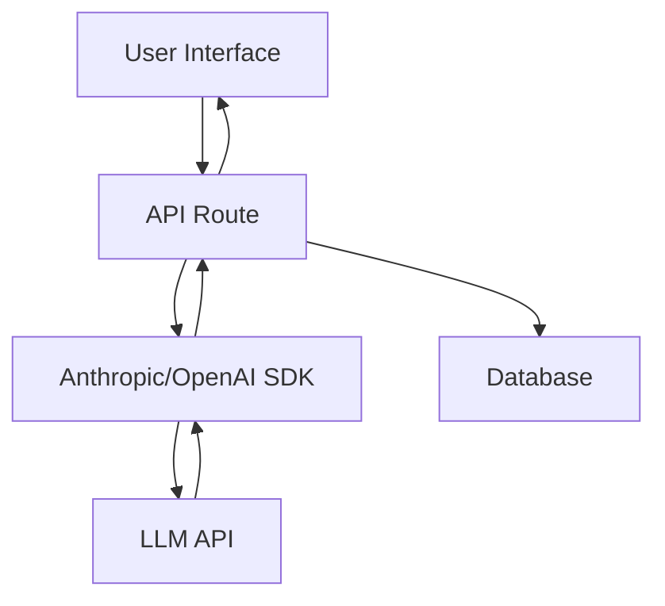

# Building a Chat Assistant

Now it's time to apply what you've learned by building a production-ready chat assistant. You'll integrate with an LLM API, handle streaming responses, and implement conversation history.

## Architecture Overview



A typical chat assistant has:
- **Frontend**: Input field, message display, loading states
- **API layer**: Handles requests, manages API keys
- **LLM integration**: Calls the AI service
- **Storage**: Persists conversation history

## Prerequisites

Make sure you have:
- Node.js installed (v18+)
- An API key from Anthropic or OpenAI
- Basic React/Next.js knowledge

## Step 1: Setting Up the API Route

We'll use Next.js API routes with streaming.

```typescript
// app/api/chat/route.ts
import Anthropic from '@anthropic-ai/sdk'

const anthropic = new Anthropic({
  apiKey: process.env.ANTHROPIC_API_KEY!,
})

export async function POST(req: Request) {
  const { messages } = await req.json()

  const stream = await anthropic.messages.create({
    model: 'claude-3-haiku-20240307',
    max_tokens: 1024,
    messages: messages,
    stream: true,
  })

  const encoder = new TextEncoder()

  const readableStream = new ReadableStream({
    async start(controller) {
      for await (const chunk of stream) {
        if (
          chunk.type === 'content_block_delta' &&
          chunk.delta.type === 'text_delta'
        ) {
          controller.enqueue(encoder.encode(chunk.delta.text))
        }
      }
      controller.close()
    },
  })

  return new Response(readableStream, {
    headers: { 'Content-Type': 'text/plain; charset=utf-8' },
  })
}
```

**Key points:**
- We use streaming for better UX
- Messages follow the Anthropic format
- We encode chunks as they arrive

## Step 2: Building the Chat UI

Create a component that handles user input and displays messages:

```typescript
'use client'

import { useState } from 'react'

interface Message {
  role: 'user' | 'assistant'
  content: string
}

export default function ChatInterface() {
  const [messages, setMessages] = useState<Message[]>([])
  const [input, setInput] = useState('')
  const [loading, setLoading] = useState(false)

  const sendMessage = async () => {
    if (!input.trim()) return

    const userMessage: Message = { role: 'user', content: input }
    setMessages(prev => [...prev, userMessage])
    setInput('')
    setLoading(true)

    try {
      const response = await fetch('/api/chat', {
        method: 'POST',
        headers: { 'Content-Type': 'application/json' },
        body: JSON.stringify({
          messages: [...messages, userMessage],
        }),
      })

      const reader = response.body?.getReader()
      const decoder = new TextDecoder()
      let assistantMessage = ''

      while (true) {
        const { done, value } = await reader!.read()
        if (done) break

        const text = decoder.decode(value)
        assistantMessage += text

        // Update UI with partial response
        setMessages(prev => {
          const newMessages = [...prev]
          const lastMessage = newMessages[newMessages.length - 1]

          if (lastMessage?.role === 'assistant') {
            lastMessage.content = assistantMessage
          } else {
            newMessages.push({
              role: 'assistant',
              content: assistantMessage,
            })
          }

          return newMessages
        })
      }
    } catch (error) {
      console.error('Chat error:', error)
    } finally {
      setLoading(false)
    }
  }

  return (
    <div className="flex flex-col h-screen">
      {/* Messages */}
      <div className="flex-1 overflow-y-auto p-4 space-y-4">
        {messages.map((msg, idx) => (
          <div
            key={idx}
            className={`p-3 rounded ${
              msg.role === 'user'
                ? 'bg-blue-100 ml-auto max-w-[80%]'
                : 'bg-gray-100 mr-auto max-w-[80%]'
            }`}
          >
            {msg.content}
          </div>
        ))}
      </div>

      {/* Input */}
      <div className="p-4 border-t">
        <div className="flex gap-2">
          <input
            type="text"
            value={input}
            onChange={e => setInput(e.target.value)}
            onKeyPress={e => e.key === 'Enter' && sendMessage()}
            placeholder="Type a message..."
            className="flex-1 p-2 border rounded"
          />
          <button
            onClick={sendMessage}
            disabled={loading}
            className="px-4 py-2 bg-blue-600 text-white rounded"
          >
            Send
          </button>
        </div>
      </div>
    </div>
  )
}
```

## Step 3: Adding System Prompts

Customize the AI's behavior with a system prompt:

```typescript
const stream = await anthropic.messages.create({
  model: 'claude-3-haiku-20240307',
  max_tokens: 1024,
  system: `You are a helpful coding assistant.
  You provide clear, concise answers.
  You format code with markdown.
  You ask clarifying questions when needed.`,
  messages: messages,
  stream: true,
})
```

## Step 4: Conversation Persistence

Store conversations in a database:

```typescript
// After streaming completes
await prisma.conversation.create({
  data: {
    userId: session.user.id,
    messages: messages,
    title: generateTitle(messages[0].content),
  },
})
```

## Step 5: Error Handling

Handle common issues:

```typescript
try {
  const stream = await anthropic.messages.create(...)
} catch (error) {
  if (error.status === 429) {
    return new Response('Rate limited', { status: 429 })
  }
  if (error.status === 401) {
    return new Response('Invalid API key', { status: 401 })
  }
  return new Response('Internal error', { status: 500 })
}
```

## Step 6: Rate Limiting

Protect your API from abuse:

```typescript
import { rateLimit } from '@/lib/rate-limit'

export async function POST(req: Request) {
  const identifier = await getRequestIdentifier(req)

  const { success } = await rateLimit(identifier, {
    requests: 10,
    window: '1m',
  })

  if (!success) {
    return new Response('Too many requests', { status: 429 })
  }

  // Continue with chat logic...
}
```

## Best Practices

### 1. Security
- Never expose API keys to the client
- Validate and sanitize user input
- Implement rate limiting
- Use authentication

### 2. User Experience
- Show loading states
- Stream responses for faster perceived performance
- Handle errors gracefully
- Auto-scroll to new messages

### 3. Cost Optimization
- Cache common responses
- Limit message history sent to API
- Use appropriate max_tokens
- Choose the right model (Haiku for simple tasks)

### 4. Context Management

Don't send the entire conversation history every time:

```typescript
const trimmedMessages = messages.slice(-10) // Last 10 messages
```

## Advanced Features

### Conversation Branching
Allow users to edit previous messages and create new branches.

### Suggested Prompts
Provide quick-start prompts:
```typescript
const suggestions = [
  "Explain this code snippet",
  "Help me debug an error",
  "Review my architecture",
]
```

### Code Highlighting
Use `rehype-highlight` for syntax highlighting in responses.

### Export Conversations
Let users download their chat history.

## Testing Your Assistant

Test these scenarios:

1. **Basic conversation**: Send a simple message
2. **Multi-turn**: Have a conversation with context
3. **Long response**: Request a detailed explanation
4. **Error handling**: Send invalid input
5. **Rate limiting**: Send requests rapidly
6. **Edge cases**: Empty messages, very long input

## Common Issues

### Streaming not working
- Check that your API route uses `ReadableStream`
- Verify response headers include streaming content type
- Ensure client handles streams correctly

### Context not maintained
- Verify you're sending previous messages
- Check message format matches API requirements
- Ensure messages array includes both roles

### High latency
- Use streaming to show responses immediately
- Choose faster models (Haiku vs Opus)
- Implement caching for common queries

## Lab: Build Your First Assistant

Create a specialized assistant for one of these use cases:

1. **Code Reviewer**: Reviews code and suggests improvements
2. **Learning Buddy**: Explains concepts with examples
3. **Debug Helper**: Helps troubleshoot errors

Requirements:
- Custom system prompt for your use case
- At least 3 example conversations
- Error handling
- Basic UI

## Real-World Applications

This pattern powers:
- **Customer support bots**: Answer common questions
- **Code assistants**: Like GitHub Copilot Chat
- **Writing aids**: Grammar, style, content generation
- **Tutoring systems**: Interactive learning
- **Research tools**: Summarize papers, answer questions

## Key Takeaways

- Chat assistants combine LLM APIs with good UX design
- Streaming provides better user experience
- System prompts customize AI behavior
- Proper error handling and rate limiting are essential
- Context management affects both cost and quality

## Next Steps

You've completed Sprint 1! You now understand:
- How LLMs work fundamentally
- How to craft effective prompts
- How to build production chat interfaces

**What's next?**
- Sprint 2: RAG (Retrieval-Augmented Generation)
- Sprint 3: AI Agents and Function Calling
- Sprint 4: Fine-tuning and Advanced Techniques

## Additional Resources

- [Anthropic API Docs](https://docs.anthropic.com)
- [OpenAI API Docs](https://platform.openai.com/docs)
- [Next.js Streaming](https://nextjs.org/docs/app/building-your-application/routing/route-handlers#streaming)
- [Prompt Engineering Guide](https://www.promptingguide.ai)

Congratulations on building your first AI-powered application!
