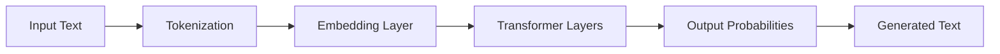

# LLM Fundamentals

Large Language Models (LLMs) have revolutionized how we interact with computers. In this lesson, you'll learn the core concepts that power modern AI applications.

## What is an LLM?

A **Large Language Model** is a neural network trained on massive amounts of text data to understand and generate human-like text. Think of it as a sophisticated pattern recognition system that learned from billions of examples.

### Key Characteristics

- **Scale**: Models like GPT-4 and Claude have billions of parameters
- **Pre-training**: Trained on diverse internet text before any specific task
- **Few-shot learning**: Can perform new tasks with minimal examples
- **Context window**: Can process thousands of tokens at once

## How LLMs Work



### The Architecture

1. **Tokenization**: Text is broken into tokens (sub-words)
2. **Embeddings**: Tokens are converted to numerical vectors
3. **Transformers**: Self-attention mechanisms process relationships
4. **Output**: Model predicts the next token probability distribution

## Training Process

LLMs go through multiple training phases:

### Pre-training
The model learns language patterns from massive text corpora. It predicts the next word in a sequence, learning grammar, facts, and reasoning patterns.

### Fine-tuning
The model is adapted for specific tasks or behaviors, like following instructions or having conversations.

### RLHF (Reinforcement Learning from Human Feedback)
Human evaluators rank model outputs, teaching the model to produce more helpful, harmless, and honest responses.

## Key Concepts

### Tokens
LLMs don't see words—they see tokens. A token can be:
- A whole word: "cat"
- Part of a word: "un" + "believe" + "able"
- Punctuation: "!"

**Rule of thumb**: ~4 characters = 1 token in English

### Temperature
Controls randomness in output:
- Low (0-0.3): Focused, deterministic
- Medium (0.5-0.7): Balanced
- High (0.8-1.0): Creative, diverse

### Context Window
The amount of text an LLM can "remember" at once:
- GPT-3.5: 4K tokens (~3,000 words)
- GPT-4: 8K-128K tokens
- Claude: 100K-200K tokens

## Limitations

Understanding LLM limitations is crucial:

1. **Knowledge cutoff**: No access to events after training
2. **Hallucinations**: Can confidently state false information
3. **Context limits**: Can't process infinite text
4. **No real understanding**: Pattern matching, not true comprehension
5. **Bias**: Reflects biases in training data

## Practical Example

Let's see how different prompts affect output:

**Poor prompt:**
```
Write about AI
```

**Better prompt:**
```
Explain how transformers work in LLMs
to a software engineer with no ML background.
Use analogies to familiar concepts.
```

The second prompt is:
- Specific about the topic
- Clear about the audience
- Requests a particular approach

## Lab: Token Counting

Try these exercises to understand tokenization:

1. Estimate tokens in: "The quick brown fox jumps"
2. Which uses more tokens: "unbelievable" or "unreal"?
3. Why do coding snippets use many tokens?

<details>
<summary>Answers</summary>

1. ~5-6 tokens (each word is typically 1 token)
2. "unbelievable" (~2-3 tokens) vs "unreal" (1-2 tokens)
3. Code has many special characters and varied spacing, each often becoming separate tokens

</details>

## Key Takeaways

- LLMs predict the next token based on patterns learned from massive datasets
- They have no true understanding, just sophisticated pattern matching
- Temperature, context window, and prompt quality dramatically affect output
- Knowing their limitations helps you use them effectively

## Next Steps

Now that you understand LLM fundamentals, you're ready to learn how to communicate effectively with these models through **Prompt Engineering**.
