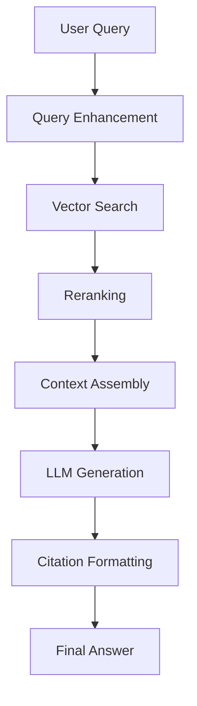

# Retrieval Pipelines & Citation Tracking

Now that you understand embeddings and chunking, let's build complete RAG systems that retrieve relevant information and generate cited answers.

## RAG Pipeline Architecture



## Step 1: Query Enhancement

Transform user queries for better retrieval:

### Query Expansion

```typescript
async function expandQuery(query: string): Promise<string> {
  const prompt = `Given this user question, generate 2-3 alternative phrasings:

Question: ${query}

Alternative phrasings (one per line):`

  const response = await claude.messages.create({
    model: 'claude-3-haiku-20240307',
    max_tokens: 200,
    messages: [{ role: 'user', content: prompt }],
  })

  const alternatives = response.content[0].text.split('\n')
  return [query, ...alternatives].join(' ')
}
```

### Hypothetical Document Embeddings (HyDE)

Generate an ideal answer, then search for documents matching it:

```typescript
async function hypotheticalAnswer(query: string): Promise<string> {
  const prompt = `Write a passage that would answer this question:

Question: ${query}

Passage:`

  const response = await claude.messages.create({
    model: 'claude-3-haiku-20240307',
    max_tokens: 500,
    messages: [{ role: 'user', content: prompt }],
  })

  return response.content[0].text
}

// Then embed and search with this hypothetical answer
const hydeText = await hypotheticalAnswer(query)
const embedding = await getEmbedding(hydeText)
const results = await vectorSearch(embedding)
```

## Step 2: Vector Search

Retrieve top-k most similar chunks:

```typescript
interface SearchResult {
  chunkId: string
  content: string
  similarity: number
  metadata: {
    documentId: string
    documentTitle: string
    pageNumber?: number
    section?: string
  }
}

async function vectorSearch(
  query: string,
  topK: number = 20
): Promise<SearchResult[]> {
  const queryEmbedding = await getEmbedding(query)

  // Using pgvector
  const results = await prisma.$queryRaw<SearchResult[]>`
    SELECT
      id as "chunkId",
      content,
      1 - (embedding &lt;=&gt; ${`[${queryEmbedding.join(',')}]`}::vector) as similarity,
      metadata
    FROM document_chunks
    WHERE 1 - (embedding &lt;=&gt; ${`[${queryEmbedding.join(',')}]`}::vector) &gt; 0.7
    ORDER BY embedding &lt;=&gt; ${`[${queryEmbedding.join(',')}]`}::vector
    LIMIT ${topK}
  `

  return results
}
```

### Hybrid Search (Vector + Keyword)

Combine semantic and keyword search:

```typescript
async function hybridSearch(
  query: string,
  topK: number = 20
): Promise<SearchResult[]> {
  // Vector search
  const vectorResults = await vectorSearch(query, topK)

  // Keyword search (PostgreSQL full-text search)
  const keywordResults = await prisma.$queryRaw<SearchResult[]>`
    SELECT
      id as "chunkId",
      content,
      ts_rank(to_tsvector('english', content), plainto_tsquery('english', ${query})) as similarity,
      metadata
    FROM document_chunks
    WHERE to_tsvector('english', content) @@ plainto_tsquery('english', ${query})
    ORDER BY similarity DESC
    LIMIT ${topK}
  `

  // Merge and rerank
  return mergeResults(vectorResults, keywordResults)
}

function mergeResults(
  vectorResults: SearchResult[],
  keywordResults: SearchResult[]
): SearchResult[] {
  const merged = new Map<string, SearchResult>()

  // RRF (Reciprocal Rank Fusion)
  const k = 60

  vectorResults.forEach((result, i) => {
    const score = 1 / (k + i + 1)
    merged.set(result.chunkId, { ...result, similarity: score })
  })

  keywordResults.forEach((result, i) => {
    const score = 1 / (k + i + 1)
    const existing = merged.get(result.chunkId)
    if (existing) {
      existing.similarity += score
    } else {
      merged.set(result.chunkId, { ...result, similarity: score })
    }
  })

  return Array.from(merged.values())
    .sort((a, b) => b.similarity - a.similarity)
    .slice(0, 20)
}
```

## Step 3: Reranking

Use a more powerful model to rerank top results:

```typescript
async function rerank(
  query: string,
  results: SearchResult[],
  topK: number = 5
): Promise<SearchResult[]> {
  // Score each result's relevance to query
  const scored = await Promise.all(
    results.map(async (result) => {
      const prompt = `On a scale of 0-10, how relevant is this passage to the question?

Question: ${query}

Passage: ${result.content}

Relevance score (just the number):`

      const response = await claude.messages.create({
        model: 'claude-3-haiku-20240307',
        max_tokens: 10,
        messages: [{ role: 'user', content: prompt }],
      })

      const score = parseInt(response.content[0].text.trim()) || 0

      return { ...result, rerankScore: score }
    })
  )

  return scored
    .sort((a, b) => b.rerankScore - a.rerankScore)
    .slice(0, topK)
}
```

## Step 4: Context Assembly

Prepare context for LLM:

```typescript
function assembleContext(results: SearchResult[]): string {
  return results
    .map((result, i) => {
      const citation = `[${i + 1}]`
      const source = result.metadata.pageNumber
        ? `${result.metadata.documentTitle}, page ${result.metadata.pageNumber}`
        : result.metadata.documentTitle

      return `${citation} From "${source}":
${result.content}
`
    })
    .join('\n\n')
}
```

## Step 5: LLM Generation with Citations

Generate answer with source attribution:

```typescript
interface CitedAnswer {
  answer: string
  citations: Array<{
    number: number
    documentTitle: string
    pageNumber?: number
    chunkId: string
  }>
}

async function generateCitedAnswer(
  query: string,
  context: string,
  results: SearchResult[]
): Promise<CitedAnswer> {
  const prompt = `Answer the question using ONLY the provided context. Cite sources using [1], [2], etc.

Context:
${context}

Question: ${query}

Instructions:
- Use ONLY information from the context
- Cite sources after each claim: [1]
- If the context doesn't contain the answer, say "I don't have enough information to answer this question."
- Be concise and direct

Answer:`

  const response = await claude.messages.create({
    model: 'claude-3-5-sonnet-20241022',
    max_tokens: 1000,
    messages: [{ role: 'user', content: prompt }],
  })

  const answer = response.content[0].text

  // Extract citations from results
  const citations = results.map((result, i) => ({
    number: i + 1,
    documentTitle: result.metadata.documentTitle,
    pageNumber: result.metadata.pageNumber,
    chunkId: result.chunkId,
  }))

  return { answer, citations }
}
```

## Complete RAG Pipeline

Put it all together:

```typescript
async function ragPipeline(query: string): Promise<CitedAnswer> {
  console.log('1. Enhancing query...')
  const enhancedQuery = await expandQuery(query)

  console.log('2. Vector search...')
  const searchResults = await vectorSearch(enhancedQuery, 20)

  console.log('3. Reranking...')
  const reranked = await rerank(query, searchResults, 5)

  console.log('4. Assembling context...')
  const context = assembleContext(reranked)

  console.log('5. Generating answer...')
  const answer = await generateCitedAnswer(query, context, reranked)

  return answer
}

// Usage
const result = await ragPipeline("What are the payment terms in the contract?")
console.log(result.answer)
console.log('\nSources:')
result.citations.forEach(c => {
  console.log(`[${c.number}] ${c.documentTitle}${c.pageNumber ? `, page ${c.pageNumber}` : ''}`)
})
```

## Citation Formatting

### Inline Citations

```
The contract expires on December 31, 2024 [1], with an option to renew for one additional year [2].
```

### Footnote Citations

```
Answer: The contract expires on December 31, 2024.

Sources:
[1] Master Service Agreement, page 5
[2] Amendment No. 3, page 2
```

### Clickable Citations

```typescript
interface InteractiveCitation {
  text: string
  documentId: string
  chunkId: string
  pageNumber?: number
}

function formatInteractiveCitation(
  answer: string,
  citations: InteractiveCitation[]
): React.ReactNode {
  // Replace [1], [2], etc. with clickable links
  let formatted = answer
  citations.forEach((citation, i) => {
    const citationMark = `[${i + 1}]`
    formatted = formatted.replace(
      citationMark,
      `<a href="/document/${citation.documentId}?page=${citation.pageNumber}" class="citation">${citationMark}</a>`
    )
  })

  return <div dangerouslySetInnerHTML={{ __html: formatted }} />
}
```

## Advanced Techniques

### 1. Contextual Compression

Remove irrelevant parts from retrieved chunks:

```typescript
async function compressContext(
  query: string,
  chunks: string[]
): Promise<string[]> {
  return Promise.all(
    chunks.map(async (chunk) => {
      const prompt = `Extract ONLY the parts of this passage relevant to the question:

Question: ${query}

Passage: ${chunk}

Relevant excerpt:`

      const response = await claude.messages.create({
        model: 'claude-3-haiku-20240307',
        max_tokens: 500,
        messages: [{ role: 'user', content: prompt }],
      })

      return response.content[0].text
    })
  )
}
```

### 2. Multi-Hop Retrieval

Answer complex questions requiring multiple lookups:

```typescript
async function multiHopRAG(query: string): Promise<CitedAnswer> {
  // Step 1: Initial retrieval
  const step1Results = await vectorSearch(query, 5)
  const step1Context = assembleContext(step1Results)

  // Step 2: Generate follow-up questions
  const followUpPrompt = `Based on this context, what follow-up question would help answer the original question?

Original question: ${query}
Context: ${step1Context}

Follow-up question:`

  const followUp = await claude.messages.create({
    model: 'claude-3-5-sonnet-20241022',
    max_tokens: 100,
    messages: [{ role: 'user', content: followUpPrompt }],
  })

  // Step 3: Second retrieval
  const step2Results = await vectorSearch(followUp.content[0].text, 5)

  // Step 4: Combine contexts
  const allResults = [...step1Results, ...step2Results]
  const finalContext = assembleContext(allResults)

  // Step 5: Generate final answer
  return generateCitedAnswer(query, finalContext, allResults)
}
```

### 3. Confidence Scoring

Indicate how confident the answer is:

```typescript
interface ConfidentAnswer extends CitedAnswer {
  confidence: 'high' | 'medium' | 'low'
  reasoning: string
}

async function generateConfidentAnswer(
  query: string,
  context: string,
  results: SearchResult[]
): Promise<ConfidentAnswer> {
  const prompt = `Answer the question and rate your confidence.

Context:
${context}

Question: ${query}

Provide:
1. Answer with citations [1], [2], etc.
2. Confidence (high/medium/low)
3. Reasoning for confidence level

Format:
ANSWER: [your answer]
CONFIDENCE: [high/medium/low]
REASONING: [why this confidence level]`

  const response = await claude.messages.create({
    model: 'claude-3-5-sonnet-20241022',
    max_tokens: 1000,
    messages: [{ role: 'user', content: prompt }],
  })

  const text = response.content[0].text
  const answer = text.match(/ANSWER: (.+?)(?=CONFIDENCE:|$)/s)?.[1]?.trim() || ''
  const confidence = text.match(/CONFIDENCE: (high|medium|low)/)?.[1] as 'high' | 'medium' | 'low' || 'low'
  const reasoning = text.match(/REASONING: (.+?)$/s)?.[1]?.trim() || ''

  const citations = results.map((result, i) => ({
    number: i + 1,
    documentTitle: result.metadata.documentTitle,
    pageNumber: result.metadata.pageNumber,
    chunkId: result.chunkId,
  }))

  return { answer, confidence, reasoning, citations }
}
```

## Production Considerations

### 1. Caching

Cache embeddings and search results:

```typescript
import Redis from 'ioredis'

const redis = new Redis(process.env.REDIS_URL)

async function cachedEmbedding(text: string): Promise<number[]> {
  const cacheKey = `embedding:${hashString(text)}`
  const cached = await redis.get(cacheKey)

  if (cached) {
    return JSON.parse(cached)
  }

  const embedding = await getEmbedding(text)
  await redis.setex(cacheKey, 86400, JSON.stringify(embedding)) // 24h TTL

  return embedding
}
```

### 2. Rate Limiting

Prevent abuse:

```typescript
import rateLimit from 'express-rate-limit'

const ragLimiter = rateLimit({
  windowMs: 60 * 1000, // 1 minute
  max: 10, // 10 requests per minute
  message: 'Too many RAG queries, please try again later',
})

app.post('/api/rag/query', ragLimiter, async (req, res) => {
  const { query } = req.body
  const answer = await ragPipeline(query)
  res.json(answer)
})
```

### 3. Cost Monitoring

Track API usage:

```typescript
async function trackedEmbedding(text: string, userId: string): Promise<number[]> {
  const embedding = await getEmbedding(text)

  // Log usage
  await prisma.apiUsage.create({
    data: {
      userId,
      service: 'openai-embedding',
      tokens: estimateTokens(text),
      cost: estimateTokens(text) * 0.00002, // $0.02 per 1M tokens
    },
  })

  return embedding
}
```

### 4. Error Handling

Graceful degradation:

```typescript
async function robustRAG(query: string): Promise<CitedAnswer> {
  try {
    return await ragPipeline(query)
  } catch (error) {
    console.error('RAG pipeline error:', error)

    // Fallback: Direct LLM without retrieval
    const response = await claude.messages.create({
      model: 'claude-3-5-sonnet-20241022',
      max_tokens: 1000,
      messages: [{
        role: 'user',
        content: `Answer this question to the best of your ability:\n\n${query}\n\nNote: Document context temporarily unavailable.`
      }],
    })

    return {
      answer: response.content[0].text + '\n\n⚠️ Note: This answer is based on general knowledge, not your documents.',
      citations: [],
    }
  }
}
```

## Evaluation

### Metrics

1. **Retrieval Precision**: % of retrieved chunks that are relevant
2. **Retrieval Recall**: % of relevant chunks that were retrieved
3. **Answer Accuracy**: Human eval of answer correctness
4. **Citation Accuracy**: Do citations point to correct sources?
5. **Latency**: Time to generate answer

### Simple Evaluation

```typescript
interface EvalCase {
  query: string
  expectedAnswer: string
  expectedSources: string[]
}

async function evaluateRAG(cases: EvalCase[]): Promise<void> {
  for (const testCase of cases) {
    const result = await ragPipeline(testCase.query)

    // Check answer relevance
    const answerScore = await scoreAnswer(testCase.query, result.answer, testCase.expectedAnswer)

    // Check citation coverage
    const citationScore = result.citations.some(c =>
      testCase.expectedSources.includes(c.documentTitle)
    ) ? 1 : 0

    console.log(`Query: ${testCase.query}`)
    console.log(`Answer Score: ${answerScore}/10`)
    console.log(`Citation Score: ${citationScore}`)
  }
}
```

## Common Pitfalls

1. **Too few chunks retrieved**: Increase top-k to 20-50 before reranking
2. **No reranking**: Initial retrieval isn't always accurate
3. **Ignoring metadata**: Citation quality suffers
4. **No confidence scoring**: Users don't know when to trust answers
5. **Embedding query directly**: Query expansion improves results

## Next Steps

You're ready to build the Sprint 2 project: a Document Q&A System that uploads PDFs, chunks them, embeds them, and answers questions with citations.

## Resources

- [LangChain RAG Tutorial](https://js.langchain.com/docs/use_cases/question_answering/)
- [Anthropic Contextual Retrieval](https://www.anthropic.com/news/contextual-retrieval)
- [RAG Best Practices](https://www.pinecone.io/learn/retrieval-augmented-generation/)
