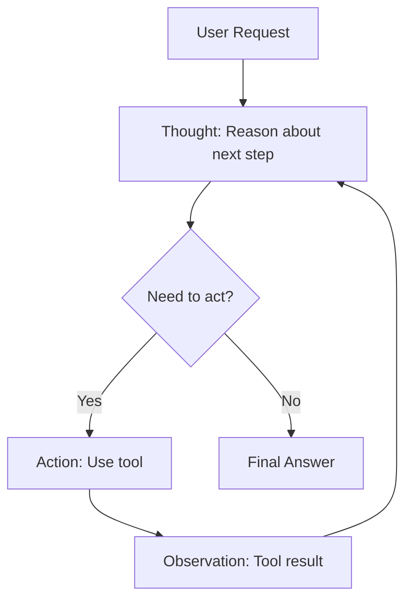
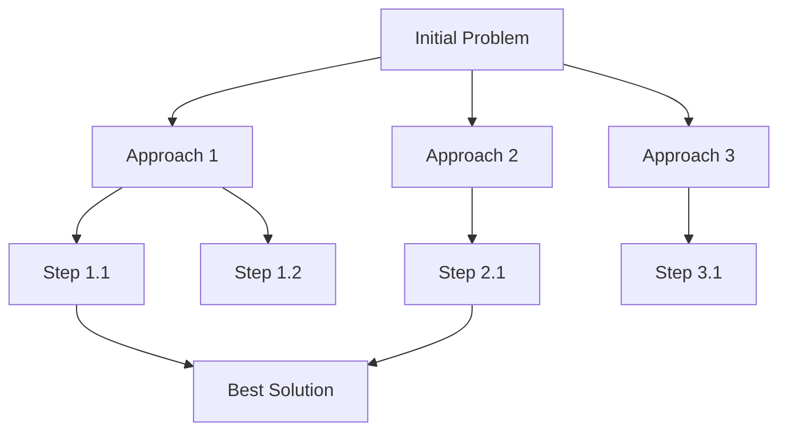
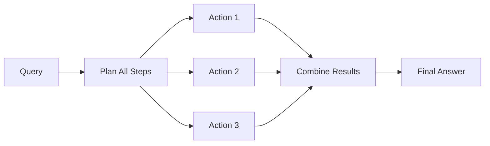

# Agent Architectures & ReAct Pattern

AI agents go beyond simple chatbots by autonomously breaking down complex tasks, using tools, and adapting based on results. This lesson covers the core architectures that make agents possible.

## Learning Objectives

By the end of this lesson, you'll understand:
- What distinguishes AI agents from basic LLM applications
- The ReAct (Reasoning + Acting) pattern
- Different planning approaches (chain-of-thought, tree-of-thought)
- How agent execution loops work
- Real-world agent use cases and limitations

## What Are AI Agents?

### Definition

An **AI agent** is an autonomous system that:
1. **Perceives** its environment (reads input, observes tool results)
2. **Reasons** about what to do next
3. **Acts** by calling tools or generating responses
4. **Learns** from observations to improve future actions

### Agent vs. Simple LLM Application

| Simple LLM App | AI Agent |
|----------------|----------|
| Single prompt → response | Multi-step reasoning loop |
| No tool use | Can use multiple tools |
| Stateless | Maintains state across steps |
| No error recovery | Adapts when tools fail |
| User drives flow | Agent drives flow |

### Example Comparison

**Simple chatbot**:
```
User: "What's the weather in Paris?"
LLM: "I don't have real-time weather data."
```

**AI agent**:
```
User: "What's the weather in Paris?"
Agent: [Thinks: I need weather data]
Agent: [Action: calls weather_api("Paris")]
Agent: [Observes: 18°C, partly cloudy]
Agent: "It's currently 18°C and partly cloudy in Paris."
```

## The ReAct Pattern

**ReAct** (Reasoning and Acting) is the foundational pattern for AI agents. It interleaves thinking and acting in a loop.

### Core Loop



### The Three Components

1. **Thought**: Agent reasons about what to do
2. **Action**: Agent executes a tool or takes an action
3. **Observation**: Agent sees the result

### ReAct in Practice

```typescript
interface ReActStep {
  thought: string
  action?: {
    tool: string
    input: any
  }
  observation?: string
  finalAnswer?: string
}

async function reactAgent(userQuery: string): Promise<string> {
  const steps: ReActStep[] = []
  let maxSteps = 10

  while (steps.length < maxSteps) {
    // Step 1: Reason (Thought)
    const thought = await generateThought(userQuery, steps)

    // Step 2: Decide action
    const decision = await decideAction(thought, steps)

    if (decision.type === 'final_answer') {
      return decision.answer
    }

    // Step 3: Execute action
    const observation = await executeAction(decision.action)

    steps.push({
      thought,
      action: decision.action,
      observation,
    })
  }

  throw new Error('Agent exceeded max steps')
}
```

### Example Execution Trace

**Query**: "What's the capital of the country that won the 2022 World Cup?"

```
Thought 1: I need to find out which country won the 2022 World Cup.
Action 1: search_web("2022 World Cup winner")
Observation 1: Argentina won the 2022 FIFA World Cup.

Thought 2: Now I need to find the capital of Argentina.
Action 2: search_web("capital of Argentina")
Observation 2: Buenos Aires is the capital of Argentina.

Thought 3: I have all the information needed to answer.
Final Answer: Buenos Aires is the capital of Argentina, which won the 2022 World Cup.
```

## Planning Approaches

### 1. Chain-of-Thought (CoT)

Linear reasoning, one step at a time.

```typescript
// Chain-of-Thought prompt
const cotPrompt = `
Let's solve this step by step:

Question: ${userQuery}

Step 1: [First reasoning step]
Step 2: [Second reasoning step]
Step 3: [Final conclusion]
`

async function chainOfThought(query: string): Promise<string> {
  const response = await claude.messages.create({
    model: 'claude-3-5-sonnet-20241022',
    max_tokens: 1000,
    messages: [{
      role: 'user',
      content: `${query}\n\nLet's think step by step:`
    }],
  })

  return response.content[0].text
}
```

**Pros**: Simple, interpretable, works for many tasks
**Cons**: Can't backtrack, struggles with complex branching logic

**Best for**: Math problems, logical reasoning, straightforward multi-step tasks

### 2. Tree-of-Thought (ToT)

Explores multiple reasoning paths simultaneously.



```typescript
interface ThoughtNode {
  thought: string
  score: number
  children: ThoughtNode[]
}

async function treeOfThought(
  query: string,
  depth: number = 3,
  breadth: number = 3
): Promise<string> {
  // Generate multiple initial approaches
  const initialThoughts = await generateThoughts(query, breadth)

  // Build tree by expanding promising nodes
  const tree: ThoughtNode = {
    thought: query,
    score: 0,
    children: initialThoughts,
  }

  // Explore tree depth-first, scoring each path
  for (let d = 0; d < depth; d++) {
    for (const node of getLeafNodes(tree)) {
      // Generate next steps for this thought
      const nextThoughts = await generateThoughts(node.thought, breadth)

      // Score each thought
      const scored = await Promise.all(
        nextThoughts.map(async (t) => ({
          ...t,
          score: await scoreThought(t.thought, query),
        }))
      )

      node.children = scored
    }
  }

  // Return best path
  return findBestPath(tree)
}

async function scoreThought(thought: string, query: string): Promise<number> {
  const prompt = `Rate how promising this reasoning step is (0-10):

Original question: ${query}
Reasoning step: ${thought}

Score:`

  const response = await claude.messages.create({
    model: 'claude-3-haiku-20240307',
    max_tokens: 10,
    messages: [{ role: 'user', content: prompt }],
  })

  return parseInt(response.content[0].text) || 0
}
```

**Pros**: Finds better solutions, can explore creative approaches
**Cons**: Expensive (many LLM calls), slower

**Best for**: Creative writing, game playing, optimization problems

### 3. ReWOO (Reasoning WithOut Observation)

Plans all actions upfront, then executes in parallel.



```typescript
interface Plan {
  steps: Array<{
    tool: string
    input: string
    dependsOn?: number[]
  }>
}

async function rewoo(query: string): Promise<string> {
  // Step 1: Generate complete plan
  const plan = await generatePlan(query)

  // Step 2: Execute steps in parallel (respecting dependencies)
  const results = await executePlan(plan)

  // Step 3: Generate final answer from results
  return await synthesizeAnswer(query, results)
}

async function generatePlan(query: string): Promise<Plan> {
  const prompt = `Create a plan to answer this question. List all tools needed.

Question: ${query}

Available tools:
- search_web(query): Search the internet
- calculator(expression): Evaluate math
- get_weather(city): Get current weather

Plan (JSON format):
{
  "steps": [
    {"tool": "search_web", "input": "...", "dependsOn": []},
    {"tool": "calculator", "input": "...", "dependsOn": [0]}
  ]
}`

  const response = await claude.messages.create({
    model: 'claude-3-5-sonnet-20241022',
    max_tokens: 1000,
    messages: [{ role: 'user', content: prompt }],
  })

  return JSON.parse(response.content[0].text)
}

async function executePlan(plan: Plan): Promise<any[]> {
  const results: any[] = []

  for (const step of plan.steps) {
    // Wait for dependencies
    const deps = step.dependsOn || []
    await Promise.all(deps.map(i => results[i]))

    // Execute step
    const result = await executeAction(step.tool, step.input)
    results.push(result)
  }

  return results
}
```

**Pros**: Fast (parallel execution), predictable cost
**Cons**: Can't adapt to unexpected results, rigid planning

**Best for**: Well-defined tasks, cost-sensitive applications

## Agent Execution Flow

### Complete Agent Architecture

```typescript
interface AgentConfig {
  model: string
  tools: Tool[]
  maxSteps: number
  maxThinkingTime: number
}

interface Tool {
  name: string
  description: string
  inputSchema: object
  execute: (input: any) => Promise<any>
}

interface AgentState {
  steps: ReActStep[]
  startTime: number
  toolCalls: number
}

class ReActAgent {
  constructor(private config: AgentConfig) {}

  async run(userQuery: string): Promise<string> {
    const state: AgentState = {
      steps: [],
      startTime: Date.now(),
      toolCalls: 0,
    }

    while (this.shouldContinue(state)) {
      // Generate thought
      const thought = await this.think(userQuery, state)

      // Decide action
      const action = await this.decide(thought, state)

      // Check for final answer
      if (action.type === 'final_answer') {
        return action.content
      }

      // Execute tool
      const observation = await this.act(action.tool, action.input)

      // Record step
      state.steps.push({ thought, action, observation })
      state.toolCalls++
    }

    // Fallback if max steps reached
    return this.generateFallbackAnswer(userQuery, state)
  }

  private async think(query: string, state: AgentState): Promise<string> {
    const context = this.formatContext(query, state)

    const prompt = `You are an AI agent. Think about what to do next.

${context}

Thought (what should I do next?):`

    const response = await claude.messages.create({
      model: this.config.model,
      max_tokens: 500,
      messages: [{ role: 'user', content: prompt }],
    })

    return response.content[0].text
  }

  private async decide(
    thought: string,
    state: AgentState
  ): Promise<any> {
    const toolDescriptions = this.config.tools
      .map(t => `- ${t.name}: ${t.description}`)
      .join('\n')

    const prompt = `Based on your thought, choose an action.

Thought: ${thought}

Available tools:
${toolDescriptions}
- final_answer: Provide the final answer to the user

Choose ONE action (JSON format):
{"type": "tool", "tool": "tool_name", "input": {...}}
OR
{"type": "final_answer", "content": "..."}`

    const response = await claude.messages.create({
      model: this.config.model,
      max_tokens: 500,
      messages: [{ role: 'user', content: prompt }],
    })

    return JSON.parse(response.content[0].text)
  }

  private async act(toolName: string, input: any): Promise<string> {
    const tool = this.config.tools.find(t => t.name === toolName)

    if (!tool) {
      return `Error: Tool "${toolName}" not found`
    }

    try {
      const result = await tool.execute(input)
      return JSON.stringify(result)
    } catch (error) {
      return `Error: ${error.message}`
    }
  }

  private shouldContinue(state: AgentState): boolean {
    // Check step limit
    if (state.steps.length >= this.config.maxSteps) {
      return false
    }

    // Check time limit
    const elapsed = Date.now() - state.startTime
    if (elapsed > this.config.maxThinkingTime) {
      return false
    }

    return true
  }

  private formatContext(query: string, state: AgentState): string {
    const history = state.steps
      .map((step, i) => `
Step ${i + 1}:
Thought: ${step.thought}
Action: ${step.action?.tool}(${JSON.stringify(step.action?.input)})
Observation: ${step.observation}
`)
      .join('\n')

    return `Original Question: ${query}\n\n${history}`
  }

  private async generateFallbackAnswer(
    query: string,
    state: AgentState
  ): Promise<string> {
    // If max steps reached, synthesize best answer from what we learned
    const context = this.formatContext(query, state)

    const prompt = `Based on the work so far, provide the best answer you can.

${context}

Final Answer:`

    const response = await claude.messages.create({
      model: this.config.model,
      max_tokens: 1000,
      messages: [{ role: 'user', content: prompt }],
    })

    return response.content[0].text
  }
}
```

### Using the Agent

```typescript
// Define tools
const tools: Tool[] = [
  {
    name: 'search_web',
    description: 'Search the internet for current information',
    inputSchema: { query: 'string' },
    execute: async (input) => {
      // Call search API
      return await searchAPI(input.query)
    },
  },
  {
    name: 'calculator',
    description: 'Evaluate mathematical expressions',
    inputSchema: { expression: 'string' },
    execute: async (input) => {
      return eval(input.expression) // Don't do this in production!
    },
  },
]

// Create agent
const agent = new ReActAgent({
  model: 'claude-3-5-sonnet-20241022',
  tools,
  maxSteps: 10,
  maxThinkingTime: 30000, // 30 seconds
})

// Run query
const answer = await agent.run(
  "What's 25% of the population of France?"
)
```

## Real-World Examples

### 1. Research Assistant

**Task**: "Summarize recent developments in quantum computing"

```
Step 1: Search for "quantum computing 2024 breakthroughs"
Step 2: Extract key findings from top 3 results
Step 3: Search for "quantum computing companies 2024"
Step 4: Synthesize findings into summary
```

### 2. Travel Planner

**Task**: "Plan a 3-day trip to Tokyo under $2000"

```
Step 1: Get flight prices to Tokyo
Step 2: Search for hotels under $150/night
Step 3: Calculate remaining budget for activities
Step 4: Search for top Tokyo attractions
Step 5: Create itinerary within budget
```

### 3. Code Debugger

**Task**: "Why is my API returning 500 errors?"

```
Step 1: Read error logs
Step 2: Search codebase for relevant handler
Step 3: Check recent commits for changes
Step 4: Search documentation for error code
Step 5: Suggest fix based on findings
```

## Best Practices

### 1. Tool Design

**Good tool**: Specific, well-documented, handles errors
```typescript
{
  name: 'get_user_profile',
  description: 'Fetch user profile by ID. Returns null if user not found.',
  inputSchema: {
    userId: { type: 'string', required: true }
  },
  execute: async ({ userId }) => {
    try {
      return await db.users.findUnique({ where: { id: userId } })
    } catch (error) {
      return { error: error.message }
    }
  }
}
```

**Bad tool**: Vague, undocumented, crashes on errors
```typescript
{
  name: 'get_data',
  description: 'Gets data',
  execute: async (input) => {
    return await db.query(input) // What data? What format?
  }
}
```

### 2. Limit Agent Steps

Always set `maxSteps` to prevent infinite loops:
- Simple tasks: 3-5 steps
- Complex tasks: 10-15 steps
- Never: Unlimited

### 3. Provide Clear Tool Descriptions

The agent decides which tool to use based on descriptions:

```typescript
// Good: Clear, specific
{
  name: 'send_email',
  description: 'Send an email to a user. Requires: recipient email, subject, body. Returns: success boolean.',
}

// Bad: Vague
{
  name: 'send_email',
  description: 'Sends email',
}
```

### 4. Handle Tool Failures Gracefully

```typescript
async function executeToolSafely(tool: Tool, input: any): Promise<string> {
  try {
    const result = await tool.execute(input)
    return `Success: ${JSON.stringify(result)}`
  } catch (error) {
    return `Error using ${tool.name}: ${error.message}. Try a different approach.`
  }
}
```

### 5. Log Everything

```typescript
interface AgentLog {
  timestamp: Date
  step: number
  thought: string
  action?: string
  observation?: string
  cost: number
}

const logs: AgentLog[] = []

// Track every step for debugging and cost monitoring
```

## Common Pitfalls

### 1. Infinite Loops

**Problem**: Agent keeps repeating the same failed action

**Solution**: Track action history, prevent repeats
```typescript
if (state.steps.some(s => s.action?.tool === action.tool &&
                           s.action?.input === action.input)) {
  return 'Error: Already tried this action. Try something different.'
}
```

### 2. Tool Hallucination

**Problem**: Agent invents tools that don't exist

**Solution**: Strict validation
```typescript
if (!availableTools.includes(action.tool)) {
  return `Error: Tool "${action.tool}" not available. Choose from: ${availableTools.join(', ')}`
}
```

### 3. Poor Context Management

**Problem**: Agent forgets earlier observations

**Solution**: Include full history in each prompt
```typescript
const context = `
Original Question: ${query}

Previous Steps:
${steps.map(formatStep).join('\n')}

What should you do next?
`
```

### 4. No Fallback

**Problem**: Agent fails to provide answer when uncertain

**Solution**: Always generate best-effort answer
```typescript
if (steps.length >= maxSteps) {
  return await generateFallbackAnswer(query, steps)
}
```

## Next Steps

In the next lesson, you'll learn how to implement Tool Use and Function Calling, giving your agents the ability to interact with external APIs, databases, and services.

## Resources

- [ReAct Paper (Yao et al., 2023)](https://arxiv.org/abs/2210.03629)
- [Tree-of-Thought Paper](https://arxiv.org/abs/2305.10601)
- [Anthropic Tool Use Guide](https://docs.anthropic.com/claude/docs/tool-use)
- [LangChain Agents](https://js.langchain.com/docs/modules/agents/)
