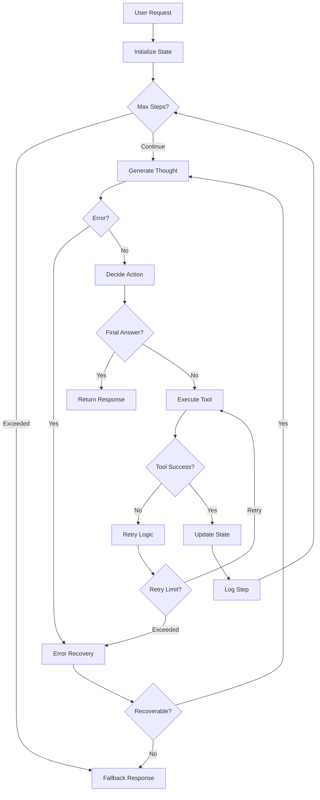
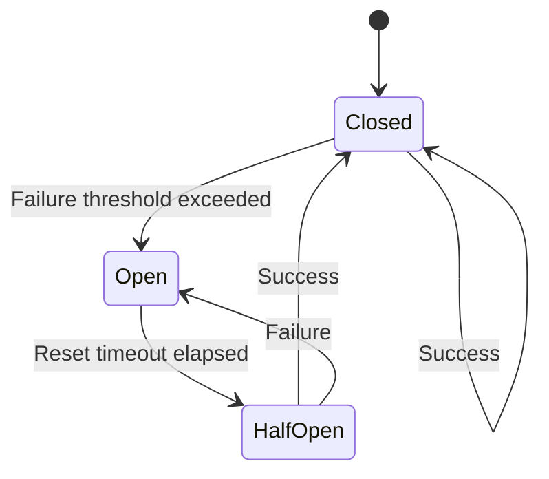

# Agent Loops & Error Recovery

Production AI agents must handle failures gracefully, retry operations intelligently, and degrade elegantly when tools fail. This lesson covers the patterns and strategies that make agents production-ready.

## Learning Objectives

By the end of this lesson, you'll understand:
- How to structure robust agent execution loops
- Retry strategies and exponential backoff
- Circuit breaker patterns for failing services
- State management across agent steps
- Error classification and recovery strategies
- Graceful degradation techniques
- Monitoring and observability for production agents
- Production deployment patterns

## Agent Loop Architecture

### Core Loop Structure

A production agent loop needs to handle multiple concerns beyond simple tool execution.



### Production Agent Loop Implementation

```typescript
interface AgentConfig {
  model: string
  maxSteps: number
  maxRetries: number
  timeout: number
  fallbackModel?: string
  enableCircuitBreaker: boolean
}

interface AgentState {
  steps: AgentStep[]
  startTime: number
  toolCallCount: number
  retryCount: number
  errors: AgentError[]
  metadata: Record<string, any>
}

interface AgentStep {
  stepNumber: number
  timestamp: number
  thought?: string
  action?: ToolCall
  observation?: ToolResult
  error?: AgentError
  retries: number
  duration: number
}

interface ToolCall {
  tool: string
  input: any
  callId: string
}

interface ToolResult {
  success: boolean
  data?: any
  error?: string
  cached?: boolean
  duration: number
}

interface AgentError {
  type: 'tool_error' | 'llm_error' | 'timeout' | 'validation' | 'system'
  message: string
  recoverable: boolean
  retryable: boolean
  timestamp: number
  context?: any
}

class ProductionAgent {
  private state: AgentState
  private circuitBreaker: CircuitBreaker
  private rateLimiter: RateLimiter
  private metrics: MetricsCollector

  constructor(
    private config: AgentConfig,
    private tools: Map<string, Tool>
  ) {
    this.circuitBreaker = new CircuitBreaker({
      failureThreshold: 5,
      resetTimeout: 60000,
    })
    this.rateLimiter = new RateLimiter()
    this.metrics = new MetricsCollector()
  }

  async run(userQuery: string, context?: any): Promise<AgentResponse> {
    // Initialize state
    this.state = {
      steps: [],
      startTime: Date.now(),
      toolCallCount: 0,
      retryCount: 0,
      errors: [],
      metadata: { userQuery, context },
    }

    try {
      // Main execution loop
      while (this.shouldContinue()) {
        const stepStartTime = Date.now()

        // Execute single step with error handling
        const stepResult = await this.executeStep(userQuery)

        // Record step
        this.state.steps.push({
          stepNumber: this.state.steps.length + 1,
          timestamp: stepStartTime,
          ...stepResult,
          duration: Date.now() - stepStartTime,
        })

        // Check if we have final answer
        if (stepResult.finalAnswer) {
          return this.buildSuccessResponse(stepResult.finalAnswer)
        }

        // Emit progress event
        this.emitProgress()
      }

      // Max steps reached - generate fallback
      return await this.generateFallback()

    } catch (error) {
      // Top-level error handler
      return this.handleFatalError(error)
    } finally {
      // Always record metrics
      this.recordMetrics()
    }
  }

  private async executeStep(userQuery: string): Promise<any> {
    try {
      // Generate thought with retry
      const thought = await this.withRetry(() =>
        this.generateThought(userQuery)
      )

      // Decide action with validation
      const action = await this.withRetry(() =>
        this.decideAction(thought)
      )

      // Check for final answer
      if (action.type === 'final_answer') {
        return { thought, finalAnswer: action.content }
      }

      // Validate tool exists
      if (!this.tools.has(action.tool)) {
        throw new AgentError({
          type: 'validation',
          message: `Tool "${action.tool}" not found`,
          recoverable: true,
          retryable: false,
        })
      }

      // Execute tool with circuit breaker
      const observation = await this.executeToolWithProtection(
        action.tool,
        action.input
      )

      return { thought, action, observation }

    } catch (error) {
      // Classify and handle error
      return this.handleStepError(error)
    }
  }

  private async executeToolWithProtection(
    toolName: string,
    input: any
  ): Promise<ToolResult> {
    const startTime = Date.now()

    // Check circuit breaker
    if (!this.circuitBreaker.canExecute(toolName)) {
      throw new AgentError({
        type: 'system',
        message: `Circuit breaker open for tool "${toolName}"`,
        recoverable: true,
        retryable: false,
      })
    }

    // Check rate limits
    await this.rateLimiter.checkLimit(toolName)

    try {
      // Execute with timeout
      const result = await this.withTimeout(
        () => this.executeTool(toolName, input),
        this.config.timeout
      )

      // Record success
      this.circuitBreaker.recordSuccess(toolName)
      this.state.toolCallCount++

      return {
        success: true,
        data: result,
        duration: Date.now() - startTime,
      }

    } catch (error) {
      // Record failure
      this.circuitBreaker.recordFailure(toolName)

      throw new AgentError({
        type: 'tool_error',
        message: error.message,
        recoverable: this.isRecoverable(error),
        retryable: this.isRetryable(error),
        context: { toolName, input },
      })
    }
  }

  private shouldContinue(): boolean {
    // Check step limit
    if (this.state.steps.length &gt;= this.config.maxSteps) {
      this.metrics.record('max_steps_reached', 1)
      return false
    }

    // Check time limit
    const elapsed = Date.now() - this.state.startTime
    if (elapsed > this.config.timeout) {
      this.metrics.record('timeout_reached', 1)
      return false
    }

    // Check error threshold
    const recentErrors = this.state.errors.filter(
      e => Date.now() - e.timestamp < 60000
    ).length
    if (recentErrors &gt; 10) {
      this.metrics.record('error_threshold_exceeded', 1)
      return false
    }

    return true
  }

  private async generateFallback(): Promise<AgentResponse> {
    // Try to generate best-effort answer from accumulated knowledge
    try {
      const context = this.buildContext()
      const fallbackAnswer = await this.generateFallbackAnswer(context)

      return {
        success: true,
        answer: fallbackAnswer,
        metadata: {
          type: 'fallback',
          steps: this.state.steps.length,
          errors: this.state.errors.length,
        },
      }
    } catch (error) {
      return {
        success: false,
        answer: "I apologize, but I wasn't able to complete this task. Please try rephrasing your request.",
        error: error.message,
      }
    }
  }
}
```

## Retry Strategies

### Exponential Backoff

Retry with increasing delays to avoid overwhelming failing services.

```typescript
interface RetryConfig {
  maxRetries: number
  baseDelay: number
  maxDelay: number
  backoffMultiplier: number
  jitter: boolean
}

class RetryHandler {
  constructor(private config: RetryConfig) {}

  async withRetry<T>(
    operation: () => Promise<T>,
    context?: string
  ): Promise<T> {
    let lastError: Error

    for (let attempt = 0; attempt &lt;= this.config.maxRetries; attempt++) {
      try {
        return await operation()
      } catch (error) {
        lastError = error

        // Don't retry on non-retryable errors
        if (!this.isRetryable(error)) {
          throw error
        }

        // Last attempt - don't wait
        if (attempt === this.config.maxRetries) {
          break
        }

        // Calculate backoff delay
        const delay = this.calculateDelay(attempt)

        // Log retry attempt
        console.warn(`Retry attempt ${attempt + 1}/${this.config.maxRetries} after ${delay}ms`, {
          context,
          error: error.message,
        })

        // Wait before retry
        await this.sleep(delay)
      }
    }

    // All retries exhausted
    throw new Error(
      `Operation failed after ${this.config.maxRetries} retries: ${lastError.message}`
    )
  }

  private calculateDelay(attempt: number): number {
    // Exponential backoff: baseDelay * (multiplier ^ attempt)
    let delay = this.config.baseDelay * Math.pow(
      this.config.backoffMultiplier,
      attempt
    )

    // Cap at max delay
    delay = Math.min(delay, this.config.maxDelay)

    // Add jitter to prevent thundering herd
    if (this.config.jitter) {
      const jitterAmount = delay * 0.25 // 25% jitter
      delay += Math.random() * jitterAmount - jitterAmount / 2
    }

    return Math.floor(delay)
  }

  private isRetryable(error: any): boolean {
    // Network errors - retry
    if (error.code === 'ECONNREFUSED' || error.code === 'ETIMEDOUT') {
      return true
    }

    // Rate limit errors - retry with backoff
    if (error.status === 429 || error.code === 'RATE_LIMIT_EXCEEDED') {
      return true
    }

    // Server errors (5xx) - retry
    if (error.status &gt;= 500 && error.status < 600) {
      return true
    }

    // Timeout errors - retry
    if (error.name === 'TimeoutError') {
      return true
    }

    // Client errors (4xx) - don't retry
    if (error.status &gt;= 400 && error.status < 500) {
      return false
    }

    // Validation errors - don't retry
    if (error.type === 'validation') {
      return false
    }

    // Default to not retrying unknown errors
    return false
  }

  private sleep(ms: number): Promise<void> {
    return new Promise(resolve => setTimeout(resolve, ms))
  }
}

// Usage
const retryHandler = new RetryHandler({
  maxRetries: 3,
  baseDelay: 1000,      // Start with 1 second
  maxDelay: 30000,      // Cap at 30 seconds
  backoffMultiplier: 2, // Double each time
  jitter: true,         // Add randomness
})

// Retry a tool call
const result = await retryHandler.withRetry(
  () => executeTool('search_api', { query: 'AI agents' }),
  'search_api_call'
)
```

### Adaptive Retry Strategy

Adjust retry behavior based on error patterns.

```typescript
interface ErrorPattern {
  errorType: string
  count: number
  lastSeen: number
  successRate: number
}

class AdaptiveRetryHandler extends RetryHandler {
  private errorPatterns: Map<string, ErrorPattern> = new Map()

  async withAdaptiveRetry<T>(
    operation: () => Promise<T>,
    operationId: string
  ): Promise<T> {
    const pattern = this.errorPatterns.get(operationId)

    // Adjust config based on historical patterns
    const adaptedConfig = this.adaptConfig(pattern)
    const handler = new RetryHandler(adaptedConfig)

    try {
      const result = await handler.withRetry(operation, operationId)

      // Record success
      this.recordSuccess(operationId)

      return result
    } catch (error) {
      // Record failure pattern
      this.recordFailure(operationId, error)
      throw error
    }
  }

  private adaptConfig(pattern?: ErrorPattern): RetryConfig {
    if (!pattern) {
      // No history - use defaults
      return {
        maxRetries: 3,
        baseDelay: 1000,
        maxDelay: 30000,
        backoffMultiplier: 2,
        jitter: true,
      }
    }

    // Low success rate - be more aggressive with retries
    if (pattern.successRate < 0.5) {
      return {
        maxRetries: 5,
        baseDelay: 2000,     // Wait longer initially
        maxDelay: 60000,     // Allow longer waits
        backoffMultiplier: 3, // Back off faster
        jitter: true,
      }
    }

    // High success rate - be more optimistic
    if (pattern.successRate &gt; 0.9) {
      return {
        maxRetries: 2,
        baseDelay: 500,
        maxDelay: 10000,
        backoffMultiplier: 2,
        jitter: false,
      }
    }

    // Default moderate approach
    return {
      maxRetries: 3,
      baseDelay: 1000,
      maxDelay: 30000,
      backoffMultiplier: 2,
      jitter: true,
    }
  }

  private recordSuccess(operationId: string): void {
    const pattern = this.errorPatterns.get(operationId) || {
      errorType: '',
      count: 0,
      lastSeen: Date.now(),
      successRate: 1,
    }

    // Update success rate (exponential moving average)
    pattern.successRate = 0.9 * pattern.successRate + 0.1 * 1

    this.errorPatterns.set(operationId, pattern)
  }

  private recordFailure(operationId: string, error: any): void {
    const pattern = this.errorPatterns.get(operationId) || {
      errorType: error.type || 'unknown',
      count: 0,
      lastSeen: Date.now(),
      successRate: 0,
    }

    pattern.count++
    pattern.lastSeen = Date.now()
    pattern.errorType = error.type || 'unknown'
    pattern.successRate = 0.9 * pattern.successRate + 0.1 * 0

    this.errorPatterns.set(operationId, pattern)
  }
}
```

## Circuit Breaker Pattern

Prevent cascading failures by temporarily blocking calls to failing services.



### Circuit Breaker Implementation

```typescript
enum CircuitState {
  CLOSED = 'closed',     // Normal operation
  OPEN = 'open',         // Blocking calls
  HALF_OPEN = 'half_open' // Testing recovery
}

interface CircuitBreakerConfig {
  failureThreshold: number    // Failures before opening
  resetTimeout: number        // Time before trying again (ms)
  successThreshold: number    // Successes needed to close
  monitoringPeriod: number    // Window for counting failures (ms)
}

class CircuitBreaker {
  private states: Map<string, CircuitBreakerState> = new Map()

  constructor(private config: CircuitBreakerConfig) {}

  canExecute(resourceId: string): boolean {
    const state = this.getState(resourceId)

    if (state.state === CircuitState.CLOSED) {
      return true
    }

    if (state.state === CircuitState.OPEN) {
      // Check if enough time has passed to try again
      if (Date.now() - state.openedAt &gt;= this.config.resetTimeout) {
        this.transition(resourceId, CircuitState.HALF_OPEN)
        return true
      }
      return false
    }

    if (state.state === CircuitState.HALF_OPEN) {
      return true
    }

    return false
  }

  recordSuccess(resourceId: string): void {
    const state = this.getState(resourceId)

    if (state.state === CircuitState.HALF_OPEN) {
      state.consecutiveSuccesses++

      if (state.consecutiveSuccesses &gt;= this.config.successThreshold) {
        this.transition(resourceId, CircuitState.CLOSED)
      }
    }

    // Record success timestamp
    state.lastSuccess = Date.now()

    // Reset failure count in closed state
    if (state.state === CircuitState.CLOSED) {
      this.pruneOldFailures(state)
    }
  }

  recordFailure(resourceId: string): void {
    const state = this.getState(resourceId)

    state.failures.push(Date.now())
    state.consecutiveSuccesses = 0

    // Prune old failures outside monitoring window
    this.pruneOldFailures(state)

    // Check if we should open the circuit
    if (state.state === CircuitState.CLOSED) {
      if (state.failures.length &gt;= this.config.failureThreshold) {
        this.transition(resourceId, CircuitState.OPEN)
      }
    }

    // If failure in half-open state, go back to open
    if (state.state === CircuitState.HALF_OPEN) {
      this.transition(resourceId, CircuitState.OPEN)
    }
  }

  getStats(resourceId: string) {
    const state = this.getState(resourceId)
    return {
      state: state.state,
      failures: state.failures.length,
      lastFailure: state.failures[state.failures.length - 1],
      lastSuccess: state.lastSuccess,
      openedAt: state.openedAt,
    }
  }

  private getState(resourceId: string): CircuitBreakerState {
    if (!this.states.has(resourceId)) {
      this.states.set(resourceId, {
        state: CircuitState.CLOSED,
        failures: [],
        consecutiveSuccesses: 0,
        lastSuccess: null,
        openedAt: null,
      })
    }
    return this.states.get(resourceId)!
  }

  private transition(resourceId: string, newState: CircuitState): void {
    const state = this.getState(resourceId)
    const oldState = state.state

    state.state = newState

    if (newState === CircuitState.OPEN) {
      state.openedAt = Date.now()
      state.consecutiveSuccesses = 0
    }

    if (newState === CircuitState.CLOSED) {
      state.failures = []
      state.openedAt = null
    }

    // Log transition
    console.info(`Circuit breaker for ${resourceId}: ${oldState} -> ${newState}`)
  }

  private pruneOldFailures(state: CircuitBreakerState): void {
    const cutoff = Date.now() - this.config.monitoringPeriod
    state.failures = state.failures.filter(timestamp => timestamp > cutoff)
  }
}

interface CircuitBreakerState {
  state: CircuitState
  failures: number[]
  consecutiveSuccesses: number
  lastSuccess: number | null
  openedAt: number | null
}

// Usage
const circuitBreaker = new CircuitBreaker({
  failureThreshold: 5,        // Open after 5 failures
  resetTimeout: 60000,        // Try again after 1 minute
  successThreshold: 3,        // Close after 3 consecutive successes
  monitoringPeriod: 120000,   // Count failures in 2-minute window
})

async function callExternalAPI(endpoint: string, data: any) {
  // Check circuit breaker
  if (!circuitBreaker.canExecute(endpoint)) {
    throw new Error(`Circuit breaker open for ${endpoint}`)
  }

  try {
    const result = await fetch(endpoint, {
      method: 'POST',
      body: JSON.stringify(data),
    })

    circuitBreaker.recordSuccess(endpoint)
    return result
  } catch (error) {
    circuitBreaker.recordFailure(endpoint)
    throw error
  }
}
```

## Error Classification & Recovery

### Error Taxonomy

```typescript
class AgentErrorClassifier {
  classify(error: any): ErrorClassification {
    return {
      type: this.getErrorType(error),
      severity: this.getSeverity(error),
      recoverable: this.isRecoverable(error),
      retryable: this.isRetryable(error),
      userFacing: this.isUserFacing(error),
      recovery: this.getRecoveryStrategy(error),
    }
  }

  private getErrorType(error: any): ErrorType {
    // Network errors
    if (error.code === 'ECONNREFUSED' || error.code === 'ETIMEDOUT') {
      return ErrorType.NETWORK
    }

    // API errors
    if (error.status === 429) return ErrorType.RATE_LIMIT
    if (error.status === 401 || error.status === 403) return ErrorType.AUTH
    if (error.status &gt;= 500) return ErrorType.SERVER
    if (error.status &gt;= 400) return ErrorType.CLIENT

    // LLM errors
    if (error.type === 'invalid_request_error') return ErrorType.VALIDATION
    if (error.type === 'overloaded_error') return ErrorType.OVERLOAD

    // Tool errors
    if (error.toolNotFound) return ErrorType.TOOL_NOT_FOUND
    if (error.toolTimeout) return ErrorType.TIMEOUT

    // System errors
    if (error instanceof TypeError || error instanceof ReferenceError) {
      return ErrorType.SYSTEM
    }

    return ErrorType.UNKNOWN
  }

  private getSeverity(error: any): ErrorSeverity {
    const type = this.getErrorType(error)

    switch (type) {
      case ErrorType.SYSTEM:
      case ErrorType.AUTH:
        return ErrorSeverity.CRITICAL

      case ErrorType.SERVER:
      case ErrorType.TIMEOUT:
      case ErrorType.TOOL_NOT_FOUND:
        return ErrorSeverity.HIGH

      case ErrorType.RATE_LIMIT:
      case ErrorType.NETWORK:
      case ErrorType.OVERLOAD:
        return ErrorSeverity.MEDIUM

      case ErrorType.CLIENT:
      case ErrorType.VALIDATION:
        return ErrorSeverity.LOW

      default:
        return ErrorSeverity.MEDIUM
    }
  }

  private isRecoverable(error: any): boolean {
    const type = this.getErrorType(error)

    const unrecoverableTypes = [
      ErrorType.SYSTEM,
      ErrorType.AUTH,
      ErrorType.VALIDATION,
      ErrorType.TOOL_NOT_FOUND,
    ]

    return !unrecoverableTypes.includes(type)
  }

  private isRetryable(error: any): boolean {
    const type = this.getErrorType(error)

    const retryableTypes = [
      ErrorType.NETWORK,
      ErrorType.RATE_LIMIT,
      ErrorType.SERVER,
      ErrorType.TIMEOUT,
      ErrorType.OVERLOAD,
    ]

    return retryableTypes.includes(type)
  }

  private isUserFacing(error: any): boolean {
    const type = this.getErrorType(error)

    // Don't show system errors to users
    return type !== ErrorType.SYSTEM
  }

  private getRecoveryStrategy(error: any): RecoveryStrategy {
    const type = this.getErrorType(error)

    switch (type) {
      case ErrorType.RATE_LIMIT:
        return RecoveryStrategy.EXPONENTIAL_BACKOFF

      case ErrorType.NETWORK:
      case ErrorType.TIMEOUT:
        return RecoveryStrategy.RETRY

      case ErrorType.TOOL_NOT_FOUND:
        return RecoveryStrategy.FALLBACK_TOOL

      case ErrorType.SERVER:
      case ErrorType.OVERLOAD:
        return RecoveryStrategy.CIRCUIT_BREAKER

      case ErrorType.VALIDATION:
        return RecoveryStrategy.REFORMULATE

      case ErrorType.AUTH:
        return RecoveryStrategy.ABORT

      default:
        return RecoveryStrategy.GRACEFUL_DEGRADATION
    }
  }
}

enum ErrorType {
  NETWORK = 'network',
  RATE_LIMIT = 'rate_limit',
  AUTH = 'auth',
  SERVER = 'server',
  CLIENT = 'client',
  VALIDATION = 'validation',
  OVERLOAD = 'overload',
  TOOL_NOT_FOUND = 'tool_not_found',
  TIMEOUT = 'timeout',
  SYSTEM = 'system',
  UNKNOWN = 'unknown',
}

enum ErrorSeverity {
  LOW = 'low',
  MEDIUM = 'medium',
  HIGH = 'high',
  CRITICAL = 'critical',
}

enum RecoveryStrategy {
  RETRY = 'retry',
  EXPONENTIAL_BACKOFF = 'exponential_backoff',
  CIRCUIT_BREAKER = 'circuit_breaker',
  FALLBACK_TOOL = 'fallback_tool',
  REFORMULATE = 'reformulate',
  GRACEFUL_DEGRADATION = 'graceful_degradation',
  ABORT = 'abort',
}

interface ErrorClassification {
  type: ErrorType
  severity: ErrorSeverity
  recoverable: boolean
  retryable: boolean
  userFacing: boolean
  recovery: RecoveryStrategy
}
```

### Error Recovery Orchestrator

```typescript
class ErrorRecoveryOrchestrator {
  constructor(
    private classifier: AgentErrorClassifier,
    private retryHandler: AdaptiveRetryHandler,
    private circuitBreaker: CircuitBreaker
  ) {}

  async handleError(
    error: any,
    context: ErrorContext
  ): Promise<RecoveryResult> {
    // Classify error
    const classification = this.classifier.classify(error)

    // Log error with classification
    this.logError(error, classification, context)

    // Execute recovery strategy
    switch (classification.recovery) {
      case RecoveryStrategy.RETRY:
        return await this.retryRecovery(error, context)

      case RecoveryStrategy.EXPONENTIAL_BACKOFF:
        return await this.backoffRecovery(error, context)

      case RecoveryStrategy.CIRCUIT_BREAKER:
        return await this.circuitBreakerRecovery(error, context)

      case RecoveryStrategy.FALLBACK_TOOL:
        return await this.fallbackToolRecovery(error, context)

      case RecoveryStrategy.REFORMULATE:
        return await this.reformulateRecovery(error, context)

      case RecoveryStrategy.GRACEFUL_DEGRADATION:
        return await this.gracefulDegradation(error, context)

      case RecoveryStrategy.ABORT:
        return this.abortRecovery(error, classification)

      default:
        return this.defaultRecovery(error, context)
    }
  }

  private async retryRecovery(
    error: any,
    context: ErrorContext
  ): Promise<RecoveryResult> {
    try {
      const result = await this.retryHandler.withRetry(
        context.operation,
        context.operationId
      )

      return {
        success: true,
        result,
        strategy: RecoveryStrategy.RETRY,
      }
    } catch (retryError) {
      return {
        success: false,
        error: retryError,
        strategy: RecoveryStrategy.RETRY,
        fallbackNeeded: true,
      }
    }
  }

  private async fallbackToolRecovery(
    error: any,
    context: ErrorContext
  ): Promise<RecoveryResult> {
    // Find alternative tool
    const fallbackTool = this.findFallbackTool(context.toolName)

    if (!fallbackTool) {
      return {
        success: false,
        error: new Error('No fallback tool available'),
        strategy: RecoveryStrategy.FALLBACK_TOOL,
        fallbackNeeded: true,
      }
    }

    try {
      // Try fallback tool
      const result = await fallbackTool.execute(context.input)

      return {
        success: true,
        result,
        strategy: RecoveryStrategy.FALLBACK_TOOL,
        metadata: { fallbackTool: fallbackTool.name },
      }
    } catch (fallbackError) {
      return {
        success: false,
        error: fallbackError,
        strategy: RecoveryStrategy.FALLBACK_TOOL,
        fallbackNeeded: true,
      }
    }
  }

  private async reformulateRecovery(
    error: any,
    context: ErrorContext
  ): Promise<RecoveryResult> {
    // Ask LLM to reformulate the request
    const reformulatedInput = await this.reformulateInput(
      context.input,
      error.message
    )

    try {
      const result = await context.operation(reformulatedInput)

      return {
        success: true,
        result,
        strategy: RecoveryStrategy.REFORMULATE,
        metadata: { reformulated: true },
      }
    } catch (reformulationError) {
      return {
        success: false,
        error: reformulationError,
        strategy: RecoveryStrategy.REFORMULATE,
        fallbackNeeded: true,
      }
    }
  }

  private async gracefulDegradation(
    error: any,
    context: ErrorContext
  ): Promise<RecoveryResult> {
    // Return partial results or cached data
    const cachedResult = await this.getCachedResult(context.operationId)

    if (cachedResult) {
      return {
        success: true,
        result: cachedResult,
        strategy: RecoveryStrategy.GRACEFUL_DEGRADATION,
        metadata: { cached: true, stale: true },
      }
    }

    // Generate best-effort answer
    return {
      success: false,
      error,
      strategy: RecoveryStrategy.GRACEFUL_DEGRADATION,
      fallbackNeeded: true,
    }
  }
}

interface ErrorContext {
  operationId: string
  toolName?: string
  input: any
  operation: (input?: any) => Promise<any>
  attempt: number
}

interface RecoveryResult {
  success: boolean
  result?: any
  error?: any
  strategy: RecoveryStrategy
  fallbackNeeded?: boolean
  metadata?: Record<string, any>
}
```

## Monitoring & Observability

### Metrics Collection

```typescript
interface AgentMetrics {
  executionTime: number
  stepCount: number
  toolCallCount: number
  retryCount: number
  errorCount: number
  successRate: number
  averageStepTime: number
  cacheHitRate: number
}

class MetricsCollector {
  private metrics: Map<string, Metric[]> = new Map()

  record(metricName: string, value: number, tags?: Record<string, string>): void {
    if (!this.metrics.has(metricName)) {
      this.metrics.set(metricName, [])
    }

    this.metrics.get(metricName)!.push({
      timestamp: Date.now(),
      value,
      tags: tags || {},
    })

    // Send to monitoring service
    this.sendToMonitoring(metricName, value, tags)
  }

  gauge(metricName: string, value: number, tags?: Record<string, string>): void {
    this.record(metricName, value, tags)
  }

  increment(metricName: string, tags?: Record<string, string>): void {
    this.record(metricName, 1, tags)
  }

  timing(metricName: string, duration: number, tags?: Record<string, string>): void {
    this.record(`${metricName}.duration`, duration, tags)
  }

  private sendToMonitoring(
    metricName: string,
    value: number,
    tags?: Record<string, string>
  ): void {
    // Send to DataDog, New Relic, CloudWatch, etc.
    // Implementation depends on your monitoring service
  }

  getStats(metricName: string, window: number = 3600000): MetricStats {
    const metrics = this.metrics.get(metricName) || []
    const cutoff = Date.now() - window

    const recent = metrics
      .filter(m => m.timestamp > cutoff)
      .map(m => m.value)

    if (recent.length === 0) {
      return { count: 0, sum: 0, avg: 0, min: 0, max: 0, p50: 0, p95: 0, p99: 0 }
    }

    const sorted = recent.sort((a, b) => a - b)

    return {
      count: recent.length,
      sum: recent.reduce((a, b) => a + b, 0),
      avg: recent.reduce((a, b) => a + b, 0) / recent.length,
      min: sorted[0],
      max: sorted[sorted.length - 1],
      p50: sorted[Math.floor(sorted.length * 0.5)],
      p95: sorted[Math.floor(sorted.length * 0.95)],
      p99: sorted[Math.floor(sorted.length * 0.99)],
    }
  }
}

interface Metric {
  timestamp: number
  value: number
  tags: Record<string, string>
}

interface MetricStats {
  count: number
  sum: number
  avg: number
  min: number
  max: number
  p50: number
  p95: number
  p99: number
}
```

### Structured Logging

```typescript
enum LogLevel {
  DEBUG = 'debug',
  INFO = 'info',
  WARN = 'warn',
  ERROR = 'error',
  CRITICAL = 'critical',
}

interface LogEntry {
  timestamp: string
  level: LogLevel
  message: string
  context: Record<string, any>
  traceId: string
  spanId?: string
}

class StructuredLogger {
  constructor(
    private serviceName: string,
    private environment: string
  ) {}

  debug(message: string, context?: Record<string, any>): void {
    this.log(LogLevel.DEBUG, message, context)
  }

  info(message: string, context?: Record<string, any>): void {
    this.log(LogLevel.INFO, message, context)
  }

  warn(message: string, context?: Record<string, any>): void {
    this.log(LogLevel.WARN, message, context)
  }

  error(message: string, error?: Error, context?: Record<string, any>): void {
    this.log(LogLevel.ERROR, message, {
      ...context,
      error: error ? {
        message: error.message,
        stack: error.stack,
        name: error.name,
      } : undefined,
    })
  }

  critical(message: string, error?: Error, context?: Record<string, any>): void {
    this.log(LogLevel.CRITICAL, message, {
      ...context,
      error: error ? {
        message: error.message,
        stack: error.stack,
        name: error.name,
      } : undefined,
    })

    // Also send alerts for critical errors
    this.sendAlert(message, error, context)
  }

  private log(
    level: LogLevel,
    message: string,
    context?: Record<string, any>
  ): void {
    const entry: LogEntry = {
      timestamp: new Date().toISOString(),
      level,
      message,
      context: {
        service: this.serviceName,
        environment: this.environment,
        ...context,
      },
      traceId: this.getTraceId(),
      spanId: this.getSpanId(),
    }

    // Output to console (structured JSON)
    console.log(JSON.stringify(entry))

    // Send to logging service (e.g., ELK, Splunk, CloudWatch)
    this.sendToLoggingService(entry)
  }

  private getTraceId(): string {
    // Get from async context or generate
    return 'trace-' + Math.random().toString(36).substring(7)
  }

  private getSpanId(): string | undefined {
    // Get from async context if in a span
    return undefined
  }

  private sendToLoggingService(entry: LogEntry): void {
    // Implementation depends on your logging service
  }

  private sendAlert(
    message: string,
    error?: Error,
    context?: Record<string, any>
  ): void {
    // Send to PagerDuty, Slack, etc.
  }
}

// Usage in agent
class InstrumentedAgent extends ProductionAgent {
  private logger: StructuredLogger

  constructor(config: AgentConfig, tools: Map<string, Tool>) {
    super(config, tools)
    this.logger = new StructuredLogger('ai-agent', process.env.NODE_ENV)
  }

  async run(userQuery: string): Promise<AgentResponse> {
    const startTime = Date.now()

    this.logger.info('Agent execution started', {
      query: userQuery,
      maxSteps: this.config.maxSteps,
    })

    try {
      const result = await super.run(userQuery)

      this.logger.info('Agent execution completed', {
        success: result.success,
        steps: this.state.steps.length,
        duration: Date.now() - startTime,
      })

      return result
    } catch (error) {
      this.logger.error('Agent execution failed', error, {
        query: userQuery,
        steps: this.state?.steps.length || 0,
        duration: Date.now() - startTime,
      })

      throw error
    }
  }
}
```

## Production Best Practices

### 1. Timeout Management

Always set timeouts at multiple levels.

```typescript
class TimeoutManager {
  // Overall agent timeout
  async runWithTimeout<T>(
    operation: () => Promise<T>,
    timeout: number
  ): Promise<T> {
    return Promise.race([
      operation(),
      this.timeoutPromise(timeout),
    ])
  }

  // Per-step timeout
  async executeStepWithTimeout(
    step: () => Promise<any>,
    timeout: number
  ): Promise<any> {
    try {
      return await this.runWithTimeout(step, timeout)
    } catch (error) {
      if (error.name === 'TimeoutError') {
        // Log timeout
        console.warn('Step timeout exceeded', { timeout })
        throw error
      }
      throw error
    }
  }

  private timeoutPromise(ms: number): Promise<never> {
    return new Promise((_, reject) => {
      setTimeout(() => {
        const error: any = new Error(`Operation timed out after ${ms}ms`)
        error.name = 'TimeoutError'
        reject(error)
      }, ms)
    })
  }
}
```

### 2. State Persistence

Persist state for long-running agents.

```typescript
interface PersistedState {
  agentId: string
  userQuery: string
  steps: AgentStep[]
  startTime: number
  lastUpdate: number
  status: 'running' | 'completed' | 'failed'
}

class StatefulAgent extends ProductionAgent {
  async run(userQuery: string, resumeId?: string): Promise<AgentResponse> {
    // Resume from saved state if provided
    if (resumeId) {
      const saved = await this.loadState(resumeId)
      if (saved) {
        this.state = saved
        return this.resume()
      }
    }

    // Run normally with periodic state saves
    return super.run(userQuery)
  }

  private async saveState(): Promise<void> {
    const persistedState: PersistedState = {
      agentId: this.generateAgentId(),
      userQuery: this.state.metadata.userQuery,
      steps: this.state.steps,
      startTime: this.state.startTime,
      lastUpdate: Date.now(),
      status: 'running',
    }

    await db.agentStates.upsert({
      where: { agentId: persistedState.agentId },
      create: persistedState,
      update: persistedState,
    })
  }

  private async loadState(agentId: string): Promise<AgentState | null> {
    const persisted = await db.agentStates.findUnique({
      where: { agentId },
    })

    if (!persisted) return null

    return {
      steps: persisted.steps,
      startTime: persisted.startTime,
      toolCallCount: persisted.steps.filter(s => s.action).length,
      retryCount: 0,
      errors: [],
      metadata: { userQuery: persisted.userQuery },
    }
  }
}
```

### 3. Cost Control

Monitor and limit costs.

```typescript
class CostController {
  private costs: Map<string, number> = new Map()

  async trackCost(
    modelName: string,
    inputTokens: number,
    outputTokens: number
  ): Promise<number> {
    const cost = this.calculateCost(modelName, inputTokens, outputTokens)

    const currentCost = this.costs.get(modelName) || 0
    this.costs.set(modelName, currentCost + cost)

    // Check budget limits
    if (currentCost + cost &gt; this.getBudgetLimit(modelName)) {
      throw new Error(`Budget limit exceeded for ${modelName}`)
    }

    return cost
  }

  private calculateCost(
    modelName: string,
    inputTokens: number,
    outputTokens: number
  ): number {
    const pricing = {
      'claude-3-5-sonnet-20250129': {
        input: 0.003,  // per 1K tokens
        output: 0.015, // per 1K tokens
      },
      'claude-3-haiku-20240307': {
        input: 0.00025,
        output: 0.00125,
      },
    }

    const rates = pricing[modelName] || pricing['claude-3-haiku-20240307']

    return (inputTokens / 1000) * rates.input + (outputTokens / 1000) * rates.output
  }

  private getBudgetLimit(modelName: string): number {
    // Get from config or environment
    return parseFloat(process.env.MODEL_BUDGET_LIMIT || '10.00')
  }
}
```

## Next Steps

You've now learned how to build production-ready AI agents with robust error handling, retry logic, and graceful degradation. In the next sprint, you'll learn about advanced topics like multi-agent systems, agent memory, and scaling agents in production.

## Resources

- [AWS Architecture Blog: Circuit Breaker Pattern](https://aws.amazon.com/builders-library/implementing-health-checks/)
- [Google SRE Book: Handling Overload](https://sre.google/sre-book/handling-overload/)
- [Microsoft: Retry Pattern](https://learn.microsoft.com/en-us/azure/architecture/patterns/retry)
- [Anthropic: Production Best Practices](https://docs.anthropic.com/claude/docs/production-best-practices)
- [OpenAI: Safety Best Practices](https://platform.openai.com/docs/guides/safety-best-practices)
