# Tool Use & Function Calling

AI agents become truly powerful when they can interact with the real world. Tool use (also called function calling) enables AI models to call external APIs, execute code, query databases, and perform actions beyond text generation.

## Learning Objectives

By the end of this lesson, you'll understand:
- What tool use and function calling are
- How Claude's tool use API works
- How to define tools with proper schemas
- Tool execution patterns and best practices
- Common tool categories and use cases
- Security considerations for production systems
- Error handling and validation strategies

## What Is Tool Use?

### Definition

**Tool use** (or **function calling**) is the ability for an AI model to:
1. Recognize when it needs external data or actions
2. Select the appropriate tool for the task
3. Generate properly formatted tool inputs
4. Process tool results to continue reasoning

### How It Works

```mermaid
sequenceDiagram
    participant User
    participant Agent
    participant LLM as Claude
    participant Tool as External Tool

    User->>Agent: "What's the weather in Tokyo?"
    Agent->>LLM: Query + Available Tools
    LLM->>Agent: tool_use block (get_weather)
    Agent->>Tool: Execute get_weather("Tokyo")
    Tool->>Agent: {temp: 18, condition: "sunny"}
    Agent->>LLM: Tool result
    LLM->>Agent: Final response
    Agent->>User: "It's 18°C and sunny in Tokyo"
```



### Why Tool Use Matters

Without tools, LLMs are limited to:
- Knowledge from training data (outdated)
- Pure reasoning and text manipulation
- No ability to access real-time data
- No way to take actions

With tools, LLMs can:
- Access current information (APIs, databases)
- Perform calculations and data processing
- Interact with external systems
- Execute code and run computations
- Take real-world actions (send emails, create records)

## Claude's Tool Use API

### Basic Structure

Claude's tool use follows a conversation pattern with special `tool_use` and `tool_result` content blocks.

```typescript
import Anthropic from '@anthropic-ai/sdk'

const client = new Anthropic({
  apiKey: process.env.ANTHROPIC_API_KEY,
})

// Define available tools
const tools = [
  {
    name: 'get_weather',
    description: 'Get current weather for a city',
    input_schema: {
      type: 'object',
      properties: {
        city: {
          type: 'string',
          description: 'The city name, e.g., Tokyo, London, Paris',
        },
        unit: {
          type: 'string',
          enum: ['celsius', 'fahrenheit'],
          description: 'Temperature unit',
        },
      },
      required: ['city'],
    },
  },
]

// Make request with tools
const response = await client.messages.create({
  model: 'claude-3-5-sonnet-20250129', // Latest model as of January 2025
  max_tokens: 1024,
  tools,
  messages: [
    {
      role: 'user',
      content: "What's the weather in Tokyo?",
    },
  ],
})
```

### Response Format

When Claude wants to use a tool, it returns a `tool_use` content block:

```typescript
{
  id: 'msg_01234',
  type: 'message',
  role: 'assistant',
  content: [
    {
      type: 'text',
      text: 'Let me check the current weather in Tokyo.',
    },
    {
      type: 'tool_use',
      id: 'toolu_01234',
      name: 'get_weather',
      input: {
        city: 'Tokyo',
        unit: 'celsius',
      },
    },
  ],
  stop_reason: 'tool_use',
}
```

### Handling Tool Results

After executing the tool, you send the results back to Claude:

```typescript
// Execute the tool
const weatherResult = await getWeather('Tokyo', 'celsius')

// Send result back to Claude
const finalResponse = await client.messages.create({
  model: 'claude-3-5-sonnet-20250129', // Latest model as of January 2025
  max_tokens: 1024,
  tools,
  messages: [
    {
      role: 'user',
      content: "What's the weather in Tokyo?",
    },
    {
      role: 'assistant',
      content: response.content,
    },
    {
      role: 'user',
      content: [
        {
          type: 'tool_result',
          tool_use_id: 'toolu_01234',
          content: JSON.stringify(weatherResult),
        },
      ],
    },
  ],
})
```

## Tool Definition Schema

### Schema Structure

Tools are defined using JSON Schema. Claude uses these definitions to understand when and how to call each tool.

```typescript
interface ToolDefinition {
  name: string          // Unique identifier
  description: string   // What the tool does (critical!)
  input_schema: {       // JSON Schema for inputs
    type: 'object'
    properties: object
    required?: string[]
  }
}
```

### Example: Search Tool

```typescript
const searchTool = {
  name: 'search_knowledge_base',
  description: `Search the company knowledge base for information.
Use this when the user asks about company policies, procedures, or internal documentation.
Returns the top 3 most relevant documents.`,
  input_schema: {
    type: 'object',
    properties: {
      query: {
        type: 'string',
        description: 'The search query. Be specific and use keywords from the user question.',
      },
      filters: {
        type: 'object',
        properties: {
          category: {
            type: 'string',
            enum: ['hr', 'engineering', 'sales', 'marketing'],
            description: 'Filter by document category',
          },
          date_range: {
            type: 'string',
            enum: ['last_week', 'last_month', 'last_year', 'all_time'],
            description: 'Filter by document recency',
          },
        },
      },
    },
    required: ['query'],
  },
}
```

### Example: Database Query Tool

```typescript
const databaseTool = {
  name: 'query_database',
  description: `Execute a SQL query against the customer database.
Use this to retrieve customer data, order history, or analytics.
Only SELECT queries are allowed. Returns up to 100 rows.`,
  input_schema: {
    type: 'object',
    properties: {
      sql: {
        type: 'string',
        description: 'The SQL SELECT query to execute',
      },
      params: {
        type: 'array',
        items: {
          type: 'string',
        },
        description: 'Parameters for parameterized queries (prevents SQL injection)',
      },
    },
    required: ['sql'],
  },
}
```

### Best Practices for Schema Design

**1. Write Clear Descriptions**

```typescript
// Good: Specific, actionable
{
  name: 'send_email',
  description: `Send an email to a customer.
Use this when the user explicitly asks to send an email or notify someone.
DO NOT use this for general inquiries - only for actual email sending.
Returns a confirmation ID when successful.`,
}

// Bad: Vague, unhelpful
{
  name: 'send_email',
  description: 'Sends an email',
}
```

**2. Use Enums for Constrained Values**

```typescript
{
  name: 'create_task',
  input_schema: {
    type: 'object',
    properties: {
      priority: {
        type: 'string',
        enum: ['low', 'medium', 'high', 'critical'],
        description: 'Task priority level',
      },
      status: {
        type: 'string',
        enum: ['todo', 'in_progress', 'blocked', 'done'],
        description: 'Initial task status',
      },
    },
  },
}
```

**3. Provide Examples in Descriptions**

```typescript
{
  name: 'calculate',
  input_schema: {
    type: 'object',
    properties: {
      expression: {
        type: 'string',
        description: 'Mathematical expression to evaluate. Examples: "2 + 2", "sqrt(16)", "3 * (4 + 5)"',
      },
    },
  },
}
```

**4. Mark Required Fields**

```typescript
{
  input_schema: {
    type: 'object',
    properties: {
      userId: { type: 'string' },
      includeHistory: { type: 'boolean', default: false },
    },
    required: ['userId'], // Explicitly mark required fields
  },
}
```

## Tool Execution Patterns

### Pattern 1: Single-Step Tool Use

Simple queries that need one tool call.

```typescript
async function singleStepToolUse(userMessage: string) {
  const tools = [weatherTool, calculatorTool]

  // Initial request
  const response = await client.messages.create({
    model: 'claude-3-5-sonnet-20250129', // Latest model as of January 2025
    max_tokens: 1024,
    tools,
    messages: [{ role: 'user', content: userMessage }],
  })

  // Check if tool was used
  if (response.stop_reason === 'tool_use') {
    const toolUse = response.content.find(block => block.type === 'tool_use')

    // Execute tool
    const result = await executeTool(toolUse.name, toolUse.input)

    // Get final answer
    const finalResponse = await client.messages.create({
      model: 'claude-3-5-sonnet-20250129', // Latest model as of January 2025
      max_tokens: 1024,
      tools,
      messages: [
        { role: 'user', content: userMessage },
        { role: 'assistant', content: response.content },
        {
          role: 'user',
          content: [
            {
              type: 'tool_result',
              tool_use_id: toolUse.id,
              content: JSON.stringify(result),
            },
          ],
        },
      ],
    })

    return finalResponse.content[0].text
  }

  // No tool needed
  return response.content[0].text
}
```

### Pattern 2: Multi-Step Tool Use (Agent Loop)

Complex queries requiring multiple tool calls.

```typescript
async function agentLoop(userMessage: string, maxSteps: number = 10) {
  const messages = [{ role: 'user', content: userMessage }]
  const tools = [searchTool, calculatorTool, databaseTool]

  for (let step = 0; step < maxSteps; step++) {
    const response = await client.messages.create({
      model: 'claude-3-5-sonnet-20250129', // Latest model as of January 2025
      max_tokens: 1024,
      tools,
      messages,
    })

    // Add assistant response to conversation
    messages.push({
      role: 'assistant',
      content: response.content,
    })

    // Check stop reason
    if (response.stop_reason === 'end_turn') {
      // Agent is done
      const textBlock = response.content.find(block => block.type === 'text')
      return textBlock?.text || 'No response generated'
    }

    if (response.stop_reason === 'tool_use') {
      // Execute all tools requested in this turn
      const toolResults = []

      for (const block of response.content) {
        if (block.type === 'tool_use') {
          const result = await executeTool(block.name, block.input)
          toolResults.push({
            type: 'tool_result',
            tool_use_id: block.id,
            content: JSON.stringify(result),
          })
        }
      }

      // Add tool results to conversation
      messages.push({
        role: 'user',
        content: toolResults,
      })

      // Continue loop
      continue
    }

    // Unexpected stop reason
    throw new Error(`Unexpected stop reason: ${response.stop_reason}`)
  }

  throw new Error('Agent exceeded maximum steps')
}
```

### Pattern 3: Parallel Tool Execution

Execute multiple tools simultaneously for efficiency.

```typescript
async function parallelToolExecution(toolCalls: ToolUse[]) {
  // Execute all tools in parallel
  const results = await Promise.allSettled(
    toolCalls.map(async (toolCall) => ({
      tool_use_id: toolCall.id,
      result: await executeTool(toolCall.name, toolCall.input),
    }))
  )

  // Convert to tool_result blocks
  return results.map((result, index) => {
    if (result.status === 'fulfilled') {
      return {
        type: 'tool_result',
        tool_use_id: result.value.tool_use_id,
        content: JSON.stringify(result.value.result),
      }
    } else {
      // Handle failure
      return {
        type: 'tool_result',
        tool_use_id: toolCalls[index].id,
        content: JSON.stringify({ error: result.reason.message }),
        is_error: true,
      }
    }
  })
}
```

### Pattern 4: Tool Chaining

Chain tool outputs as inputs to subsequent tools.

```typescript
async function chainedToolExecution(userMessage: string) {
  const messages = [{ role: 'user', content: userMessage }]

  // Step 1: Search for user
  let response = await client.messages.create({
    model: 'claude-3-5-sonnet-20250129', // Latest model as of January 2025
    max_tokens: 1024,
    tools: [searchUserTool],
    messages,
  })

  const searchToolUse = response.content.find(b => b.type === 'tool_use')
  const user = await searchUser(searchToolUse.input)

  messages.push({ role: 'assistant', content: response.content })
  messages.push({
    role: 'user',
    content: [
      {
        type: 'tool_result',
        tool_use_id: searchToolUse.id,
        content: JSON.stringify(user),
      },
    ],
  })

  // Step 2: Get user's orders using user.id from previous step
  response = await client.messages.create({
    model: 'claude-3-5-sonnet-20250129', // Latest model as of January 2025
    max_tokens: 1024,
    tools: [getOrdersTool],
    messages,
  })

  const ordersToolUse = response.content.find(b => b.type === 'tool_use')
  const orders = await getOrders(ordersToolUse.input)

  messages.push({ role: 'assistant', content: response.content })
  messages.push({
    role: 'user',
    content: [
      {
        type: 'tool_result',
        tool_use_id: ordersToolUse.id,
        content: JSON.stringify(orders),
      },
    ],
  })

  // Step 3: Generate final response
  const final = await client.messages.create({
    model: 'claude-3-5-sonnet-20250129', // Latest model as of January 2025
    max_tokens: 1024,
    tools: [],
    messages,
  })

  return final.content[0].text
}
```

## Common Tool Categories

### 1. Information Retrieval Tools

Access external data sources.

```typescript
const retrievalTools = [
  {
    name: 'search_web',
    description: 'Search the internet for current information',
    input_schema: {
      type: 'object',
      properties: {
        query: { type: 'string' },
        max_results: { type: 'number', default: 5 },
      },
      required: ['query'],
    },
  },
  {
    name: 'search_documentation',
    description: 'Search internal technical documentation',
    input_schema: {
      type: 'object',
      properties: {
        query: { type: 'string' },
        product: { type: 'string', enum: ['api', 'sdk', 'cli'] },
      },
      required: ['query'],
    },
  },
  {
    name: 'get_database_record',
    description: 'Retrieve a specific record from the database',
    input_schema: {
      type: 'object',
      properties: {
        table: { type: 'string' },
        id: { type: 'string' },
      },
      required: ['table', 'id'],
    },
  },
]
```

### 2. Computation Tools

Perform calculations and data processing.

```typescript
const computationTools = [
  {
    name: 'calculator',
    description: 'Evaluate mathematical expressions safely',
    input_schema: {
      type: 'object',
      properties: {
        expression: {
          type: 'string',
          description: 'Math expression like "2 + 2" or "sqrt(16)"',
        },
      },
      required: ['expression'],
    },
  },
  {
    name: 'run_python',
    description: 'Execute Python code in a sandboxed environment',
    input_schema: {
      type: 'object',
      properties: {
        code: {
          type: 'string',
          description: 'Python code to execute',
        },
        timeout: {
          type: 'number',
          default: 5,
          description: 'Execution timeout in seconds',
        },
      },
      required: ['code'],
    },
  },
  {
    name: 'analyze_data',
    description: 'Perform statistical analysis on datasets',
    input_schema: {
      type: 'object',
      properties: {
        data: { type: 'array', items: { type: 'number' } },
        analysis_type: {
          type: 'string',
          enum: ['mean', 'median', 'stddev', 'correlation'],
        },
      },
      required: ['data', 'analysis_type'],
    },
  },
]
```

### 3. Action Tools

Perform state-changing operations.

```typescript
const actionTools = [
  {
    name: 'send_email',
    description: 'Send an email to a user',
    input_schema: {
      type: 'object',
      properties: {
        to: { type: 'string', format: 'email' },
        subject: { type: 'string' },
        body: { type: 'string' },
        cc: { type: 'array', items: { type: 'string' } },
      },
      required: ['to', 'subject', 'body'],
    },
  },
  {
    name: 'create_ticket',
    description: 'Create a support ticket in the ticketing system',
    input_schema: {
      type: 'object',
      properties: {
        title: { type: 'string' },
        description: { type: 'string' },
        priority: { type: 'string', enum: ['low', 'medium', 'high'] },
        assignee: { type: 'string' },
      },
      required: ['title', 'description', 'priority'],
    },
  },
  {
    name: 'update_crm',
    description: 'Update a customer record in the CRM',
    input_schema: {
      type: 'object',
      properties: {
        customer_id: { type: 'string' },
        updates: { type: 'object' },
      },
      required: ['customer_id', 'updates'],
    },
  },
]
```

### 4. File System Tools

Read and manipulate files.

```typescript
const fileTools = [
  {
    name: 'read_file',
    description: 'Read contents of a file',
    input_schema: {
      type: 'object',
      properties: {
        path: { type: 'string' },
        encoding: { type: 'string', default: 'utf-8' },
      },
      required: ['path'],
    },
  },
  {
    name: 'write_file',
    description: 'Write content to a file',
    input_schema: {
      type: 'object',
      properties: {
        path: { type: 'string' },
        content: { type: 'string' },
        overwrite: { type: 'boolean', default: false },
      },
      required: ['path', 'content'],
    },
  },
  {
    name: 'list_directory',
    description: 'List files in a directory',
    input_schema: {
      type: 'object',
      properties: {
        path: { type: 'string' },
        recursive: { type: 'boolean', default: false },
      },
      required: ['path'],
    },
  },
]
```

## Security Considerations

### 1. Input Validation

**Always validate tool inputs before execution.**

```typescript
interface ToolInput {
  [key: string]: any
}

function validateToolInput(
  toolName: string,
  input: ToolInput,
  schema: object
): void {
  // Validate against schema
  const errors = validateSchema(input, schema)
  if (errors.length &gt; 0) {
    throw new Error(`Invalid input for ${toolName}: ${errors.join(', ')}`)
  }

  // Additional security checks
  if (toolName === 'run_sql') {
    // Only allow SELECT queries
    if (!input.sql.trim().toUpperCase().startsWith('SELECT')) {
      throw new Error('Only SELECT queries are allowed')
    }

    // Check for dangerous patterns
    const dangerous = ['DROP', 'DELETE', 'UPDATE', 'INSERT', 'TRUNCATE']
    const upperSQL = input.sql.toUpperCase()
    for (const keyword of dangerous) {
      if (upperSQL.includes(keyword)) {
        throw new Error(`Dangerous SQL keyword detected: ${keyword}`)
      }
    }
  }

  if (toolName === 'read_file') {
    // Resolve to absolute path and check it's within allowed directories
    const absolutePath = path.resolve(input.path)
    const allowedPaths = ['/app/data', '/app/uploads'].map(p => path.resolve(p))

    const isAllowed = allowedPaths.some(p => absolutePath.startsWith(p))
    if (!isAllowed) {
      throw new Error('Access to this path is not allowed')
    }
  }
}
```

### 2. Sandboxing

**Execute untrusted code in isolated environments.**

```typescript
// Note: vm2 is deprecated. For production, use isolated-vm or Docker containers
import { VM } from 'vm2'

async function executePythonSafely(code: string, timeout: number = 5000) {
  // Use Docker container or similar isolation
  const result = await execInContainer({
    image: 'python:3.11-slim',
    cmd: ['python', '-c', code],
    memory: '256m',
    cpus: '0.5',
    timeout,
    networkDisabled: true, // No network access
    readOnlyRootFs: true, // Read-only file system
  })

  return result
}

async function executeJavaScriptSafely(code: string, timeout: number = 5000) {
  const vm = new VM({
    timeout,
    sandbox: {
      // Provide safe built-ins only
      Math,
      Date,
      JSON,
    },
  })

  try {
    return vm.run(code)
  } catch (error) {
    throw new Error(`Execution error: ${error.message}`)
  }
}
```

### 3. Rate Limiting

**Prevent abuse and control costs.**

```typescript
class RateLimiter {
  private calls: Map<string, number[]> = new Map()

  async checkLimit(
    toolName: string,
    userId: string,
    maxCallsPerMinute: number
  ): Promise<void> {
    const key = `${userId}:${toolName}`
    const now = Date.now()
    const oneMinuteAgo = now - 60000

    // Get recent calls
    const calls = this.calls.get(key) || []

    // Remove old calls
    const recentCalls = calls.filter(timestamp => timestamp > oneMinuteAgo)

    // Check limit
    if (recentCalls.length &gt;= maxCallsPerMinute) {
      throw new Error(
        `Rate limit exceeded for ${toolName}. Max ${maxCallsPerMinute} calls per minute.`
      )
    }

    // Record new call
    recentCalls.push(now)
    this.calls.set(key, recentCalls)
  }
}

const rateLimiter = new RateLimiter()

async function executeTool(toolName: string, input: any, userId: string) {
  // Check rate limit
  await rateLimiter.checkLimit(toolName, userId, 10)

  // Execute tool
  return await tools[toolName].execute(input)
}
```

### 4. Permission System

**Implement role-based access control.**

```typescript
interface UserPermissions {
  userId: string
  allowedTools: string[]
  deniedTools: string[]
  customLimits?: {
    [toolName: string]: {
      maxCallsPerMinute?: number
      maxCallsPerDay?: number
    }
  }
}

class PermissionManager {
  async canUseTool(userId: string, toolName: string): Promise<boolean> {
    const permissions = await this.getUserPermissions(userId)

    // Check explicit denials first
    if (permissions.deniedTools.includes(toolName)) {
      return false
    }

    // Check allowed list
    if (permissions.allowedTools.includes(toolName)) {
      return true
    }

    // Default to deny
    return false
  }

  async getUserPermissions(userId: string): Promise<UserPermissions> {
    // Fetch from database
    return await db.permissions.findUnique({ where: { userId } })
  }
}

const permissions = new PermissionManager()

async function executeToolWithPermissions(
  toolName: string,
  input: any,
  userId: string
) {
  // Check permissions
  const allowed = await permissions.canUseTool(userId, toolName)
  if (!allowed) {
    throw new Error(`User ${userId} is not allowed to use tool ${toolName}`)
  }

  // Execute tool
  return await executeTool(toolName, input, userId)
}
```

### 5. Audit Logging

**Track all tool usage for security and debugging.**

```typescript
interface ToolAuditLog {
  timestamp: Date
  userId: string
  toolName: string
  input: any
  output?: any
  error?: string
  executionTime: number
  success: boolean
}

class AuditLogger {
  async logToolExecution(log: ToolAuditLog): Promise<void> {
    // Store in database
    await db.auditLogs.create({ data: log })

    // Alert on suspicious patterns
    if (log.toolName === 'run_sql' || log.toolName === 'run_python') {
      await this.checkSuspiciousActivity(log)
    }
  }

  async checkSuspiciousActivity(log: ToolAuditLog): Promise<void> {
    // Check for rapid repeated calls
    const recentCalls = await db.auditLogs.count({
      where: {
        userId: log.userId,
        toolName: log.toolName,
        timestamp: { gte: new Date(Date.now() - 60000) },
      },
    })

    if (recentCalls &gt; 50) {
      await this.alertSecurityTeam(
        `Suspicious activity: User ${log.userId} made ${recentCalls} calls to ${log.toolName} in 1 minute`
      )
    }
  }
}

async function executeToolWithAudit(
  toolName: string,
  input: any,
  userId: string
) {
  const startTime = Date.now()
  const logger = new AuditLogger()

  try {
    const output = await executeTool(toolName, input, userId)

    // Log success
    await logger.logToolExecution({
      timestamp: new Date(),
      userId,
      toolName,
      input,
      output,
      executionTime: Date.now() - startTime,
      success: true,
    })

    return output
  } catch (error) {
    // Log failure
    await logger.logToolExecution({
      timestamp: new Date(),
      userId,
      toolName,
      input,
      error: error.message,
      executionTime: Date.now() - startTime,
      success: false,
    })

    throw error
  }
}
```

## Best Practices

### 1. Design Atomic Tools

Each tool should do one thing well.

```typescript
// Good: Atomic, focused tools
{
  name: 'get_user',
  description: 'Fetch user by ID',
}
{
  name: 'update_user',
  description: 'Update user fields',
}
{
  name: 'delete_user',
  description: 'Delete user by ID',
}

// Bad: Overly broad tool
{
  name: 'manage_users',
  description: 'Get, update, or delete users',
  input_schema: {
    properties: {
      action: { enum: ['get', 'update', 'delete'] },
      userId: { type: 'string' },
      updates: { type: 'object' },
    },
  },
}
```

### 2. Return Structured Data

Tools should return consistent, parseable formats.

```typescript
// Good: Structured, predictable
async function getWeather(city: string) {
  return {
    success: true,
    data: {
      city,
      temperature: 18,
      condition: 'sunny',
      humidity: 65,
      timestamp: new Date().toISOString(),
    },
  }
}

// Bad: Unstructured text
async function getWeather(city: string) {
  return `The weather in ${city} is sunny and 18 degrees`
}
```

### 3. Handle Errors Gracefully

Return error information in a structured format.

```typescript
async function executeTool(toolName: string, input: any) {
  try {
    const result = await tools[toolName].execute(input)
    return {
      success: true,
      data: result,
    }
  } catch (error) {
    return {
      success: false,
      error: {
        message: error.message,
        code: error.code,
        recoverable: error.recoverable || false,
        suggestions: error.suggestions || [],
      },
    }
  }
}
```

### 4. Provide Context in Tool Results

Help Claude understand what happened.

```typescript
async function searchDatabase(query: string) {
  const results = await db.search(query)

  return {
    success: true,
    data: {
      results,
      totalCount: results.length,
      query,
      executionTime: '45ms',
      message:
        results.length === 0
          ? 'No results found. Try broader search terms.'
          : `Found ${results.length} matching records.`,
    },
  }
}
```

### 5. Test Tools Independently

Always test tool execution without Claude first.

```typescript
// Tool testing suite
describe('Weather Tool', () => {
  it('should return weather for valid city', async () => {
    const result = await getWeather('Tokyo')
    expect(result.success).toBe(true)
    expect(result.data.city).toBe('Tokyo')
    expect(result.data.temperature).toBeDefined()
  })

  it('should handle invalid city gracefully', async () => {
    const result = await getWeather('InvalidCity123')
    expect(result.success).toBe(false)
    expect(result.error.message).toContain('not found')
  })

  it('should respect timeout limits', async () => {
    const result = await getWeather('SlowAPI', { timeout: 100 })
    expect(result.success).toBe(false)
    expect(result.error.code).toBe('TIMEOUT')
  })
})
```

## Next Steps

In the next lesson, you'll learn about Agent Loops & Error Recovery, building robust agents that can handle failures, retry operations, and gracefully degrade when tools are unavailable.

## Resources

- [Anthropic Tool Use Documentation](https://docs.anthropic.com/claude/docs/tool-use)
- [OpenAI Function Calling Guide](https://platform.openai.com/docs/guides/function-calling)
- [JSON Schema Reference](https://json-schema.org/understanding-json-schema/)
- [VM2 Sandboxing](https://github.com/patriksimek/vm2)
- [OWASP API Security](https://owasp.org/www-project-api-security/)
