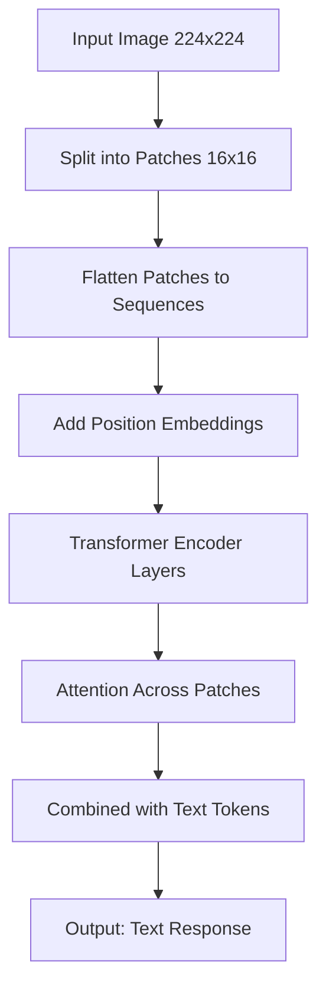

# Vision Models & Image Understanding

Vision models enable AI systems to see, understand, and reason about images just like they do with text. This capability opens up entirely new categories of applications: from document analysis and OCR to visual search and accessibility tools.

## Learning Objectives

By the end of this lesson, you'll understand:
- How vision models work and their architecture
- Claude's vision capabilities and API
- Common vision tasks (classification, OCR, object detection, scene understanding)
- How vision transformers process images
- Best practices for image analysis
- Limitations and edge cases to watch for
- Real-world applications and use cases

## What Are Vision Models?

### Definition

A **vision model** is an AI system that can:
1. **Perceive** visual information from images and videos
2. **Understand** what the image contains (objects, text, scenes, relationships)
3. **Reason** about visual content (answer questions, describe, analyze)
4. **Generate** text outputs based on visual inputs

### How Vision Differs from Text-Only Models

| Text-Only Models | Vision Models |
|------------------|---------------|
| Process sequences of tokens | Process 2D pixel grids |
| Understand language patterns | Understand spatial relationships |
| 1-dimensional context | 2-dimensional spatial context |
| Token embeddings | Image patch embeddings |
| Text → Text | Image + Text → Text |

### The Evolution of Vision AI

**Traditional Computer Vision (Pre-2012)**:
- Hand-crafted features (SIFT, HOG)
- Rule-based algorithms
- Limited generalization

**CNNs - Convolutional Neural Networks (2012-2020)**:
- AlexNet, VGG, ResNet
- Learned features automatically
- Task-specific architectures

**Vision Transformers (2020-Present)**:
- ViT (Vision Transformer)
- Unified architecture for vision and language
- Foundation models like Claude, GPT-4V
- True multimodal understanding

## How Vision Models Work

### The Vision Transformer Architecture

Vision transformers process images similarly to how language models process text, but with a crucial adaptation for 2D spatial data.



### Step-by-Step: From Pixels to Understanding

**Step 1: Patch Extraction**

An image is divided into fixed-size patches (e.g., 16x16 pixels). A 224x224 image becomes 196 patches.

```typescript
// Conceptual representation
interface ImagePatch {
  position: { x: number; y: number }
  pixels: number[16][16][3] // RGB values
  embedding: number[] // Learned vector representation
}

// Example: 224x224 image → 14×14 = 196 patches
const patchSize = 16
const imageSize = 224
const numPatches = (imageSize / patchSize) ** 2 // 196
```

**Step 2: Patch Embeddings**

Each patch is converted to a vector embedding, similar to how words become tokens in text models.

```typescript
function patchToEmbedding(patch: number[][][]): number[] {
  // Flatten the 16x16x3 patch into a single vector
  const flattened = patch.flat(3) // 768 values (16*16*3)

  // Linear projection to embedding dimension (e.g., 768)
  const embedding = linearProjection(flattened)

  return embedding
}
```

**Step 3: Positional Encoding**

Since transformers don't inherently understand spatial position, we add positional information to each patch.

```typescript
interface PatchWithPosition {
  embedding: number[] // The patch content
  positionX: number // Column position (0-13)
  positionY: number // Row position (0-13)
  positionEmbedding: number[] // Learned position vector
}

// The final patch representation combines both
const finalEmbedding = patchEmbedding + positionEmbedding
```

**Step 4: Transformer Processing**

The patch embeddings flow through transformer layers with self-attention, allowing the model to understand relationships between different parts of the image.

```typescript
// Simplified transformer attention for vision
function visionAttention(patches: Embedding[]): Embedding[] {
  // Each patch attends to all other patches
  // This allows understanding spatial relationships:
  // - A wheel patch attends to a car body patch
  // - A person's face attends to their hands
  // - Text patches form words and sentences

  for (const patch of patches) {
    // Compute attention scores with all other patches
    const attentionScores = patches.map(otherPatch =>
      similarity(patch, otherPatch)
    )

    // Update patch representation based on context
    patch.update(weightedSum(patches, attentionScores))
  }

  return patches
}
```

**Step 5: Multimodal Fusion**

Vision transformers combine image patches with text tokens to enable text-based responses about visual content.

```typescript
interface MultimodalInput {
  imagePatches: Embedding[] // 196 patches from image
  textTokens: Embedding[] // User question tokens
  systemPrompt?: Embedding[] // Optional system context
}

// All inputs are processed together in the same transformer
const combinedSequence = [
  ...imagePatches,    // Image content
  ...textTokens,      // "What's in this image?"
]

// The model attends across both modalities
const response = transformer.process(combinedSequence)
```

### How Vision Models "See"

Vision models don't see like humans. They:
- Process images as collections of patches, not holistic scenes
- Build understanding through attention patterns across patches
- Learn visual concepts from vast training data
- Can make mistakes humans wouldn't (and vice versa)

**What they're good at**:
- Recognizing objects and patterns seen during training
- Reading and understanding text (OCR)
- Describing scenes and compositions
- Detecting relationships between objects
- Following spatial instructions

**What they struggle with**:
- Precise counting (especially with many objects)
- Exact spatial measurements
- Very small or low-contrast details
- Unusual perspectives or contexts
- Understanding optical illusions

## Claude's Vision Capabilities

Claude supports vision through its multimodal API, allowing you to send images alongside text prompts.

### Supported Image Formats

- JPEG, PNG, GIF, WebP
- Base64-encoded images
- Image URLs (HTTP/HTTPS)
- Maximum size: 5MB per image
- Maximum resolution: 8000×8000 pixels

### Basic Vision API Usage

```typescript
import Anthropic from '@anthropic-ai/sdk'
import fs from 'fs'

const client = new Anthropic({
  apiKey: process.env.ANTHROPIC_API_KEY,
})

// Method 1: Using Base64-encoded images
async function analyzeImageBase64(imagePath: string, question: string) {
  // Read and encode the image
  const imageData = fs.readFileSync(imagePath)
  const base64Image = imageData.toString('base64')

  // Determine media type
  const mediaType = imagePath.endsWith('.png')
    ? 'image/png'
    : 'image/jpeg'

  const response = await client.messages.create({
    model: 'claude-3-5-sonnet-20250129',
    max_tokens: 1024,
    messages: [
      {
        role: 'user',
        content: [
          {
            type: 'image',
            source: {
              type: 'base64',
              media_type: mediaType,
              data: base64Image,
            },
          },
          {
            type: 'text',
            text: question,
          },
        ],
      },
    ],
  })

  return response.content[0].text
}

// Example usage
const result = await analyzeImageBase64(
  './receipt.jpg',
  'Extract all items and prices from this receipt.'
)
console.log(result)
```

### Method 2: Using Image URLs

```typescript
async function analyzeImageURL(imageUrl: string, question: string) {
  const response = await client.messages.create({
    model: 'claude-3-5-sonnet-20250129',
    max_tokens: 1024,
    messages: [
      {
        role: 'user',
        content: [
          {
            type: 'image',
            source: {
              type: 'url',
              url: imageUrl,
            },
          },
          {
            type: 'text',
            text: question,
          },
        ],
      },
    ],
  })

  return response.content[0].text
}

// Example usage
const analysis = await analyzeImageURL(
  'https://example.com/product-screenshot.png',
  'What UI components are visible in this screenshot?'
)
```

### Multiple Images in One Request

You can send multiple images in a single request for comparison or combined analysis.

```typescript
async function compareImages(
  image1Path: string,
  image2Path: string,
  question: string
) {
  const image1 = fs.readFileSync(image1Path).toString('base64')
  const image2 = fs.readFileSync(image2Path).toString('base64')

  const response = await client.messages.create({
    model: 'claude-3-5-sonnet-20250129',
    max_tokens: 2048,
    messages: [
      {
        role: 'user',
        content: [
          {
            type: 'text',
            text: 'Here are two images to compare:',
          },
          {
            type: 'image',
            source: {
              type: 'base64',
              media_type: 'image/jpeg',
              data: image1,
            },
          },
          {
            type: 'image',
            source: {
              type: 'base64',
              media_type: 'image/jpeg',
              data: image2,
            },
          },
          {
            type: 'text',
            text: question,
          },
        ],
      },
    ],
  })

  return response.content[0].text
}

// Example: Compare before/after screenshots
const diff = await compareImages(
  './before.png',
  './after.png',
  'What changed between these two UI screenshots?'
)
```

## Common Vision Tasks

### 1. Image Classification & Description

Identifying what's in an image and describing it.

```typescript
async function describeImage(imagePath: string): Promise<string> {
  const imageData = fs.readFileSync(imagePath).toString('base64')

  const response = await client.messages.create({
    model: 'claude-3-5-sonnet-20250129',
    max_tokens: 1024,
    messages: [
      {
        role: 'user',
        content: [
          {
            type: 'image',
            source: {
              type: 'base64',
              media_type: 'image/jpeg',
              data: imageData,
            },
          },
          {
            type: 'text',
            text: `Describe this image in detail. Include:
- Main subject(s)
- Setting/environment
- Colors and lighting
- Mood or atmosphere
- Any notable details`,
          },
        ],
      },
    ],
  })

  return response.content[0].text
}
```

### 2. Optical Character Recognition (OCR)

Extracting text from images with high accuracy.

```typescript
interface ExtractedText {
  text: string
  confidence: 'high' | 'medium' | 'low'
  structure?: {
    headings?: string[]
    paragraphs?: string[]
    lists?: string[][]
  }
}

async function extractText(imagePath: string): Promise<ExtractedText> {
  const imageData = fs.readFileSync(imagePath).toString('base64')

  const response = await client.messages.create({
    model: 'claude-3-5-sonnet-20250129',
    max_tokens: 2048,
    messages: [
      {
        role: 'user',
        content: [
          {
            type: 'image',
            source: {
              type: 'base64',
              media_type: 'image/jpeg',
              data: imageData,
            },
          },
          {
            type: 'text',
            text: `Extract all text from this image.
Preserve the structure (headings, paragraphs, lists).
Return as JSON with this format:
{
  "text": "full text content",
  "confidence": "high|medium|low",
  "structure": {
    "headings": [...],
    "paragraphs": [...],
    "lists": [...]
  }
}`,
          },
        ],
      },
    ],
  })

  return JSON.parse(response.content[0].text)
}

// Example: Extract text from a document
const extracted = await extractText('./invoice.pdf')
console.log('Full text:', extracted.text)
console.log('Headings:', extracted.structure?.headings)
```

### 3. Document Analysis

Understanding structured documents like receipts, invoices, forms.

```typescript
interface Receipt {
  merchant: string
  date: string
  items: Array<{
    name: string
    quantity: number
    price: number
  }>
  subtotal: number
  tax: number
  total: number
}

async function parseReceipt(imagePath: string): Promise<Receipt> {
  const imageData = fs.readFileSync(imagePath).toString('base64')

  const response = await client.messages.create({
    model: 'claude-3-5-sonnet-20250129',
    max_tokens: 2048,
    messages: [
      {
        role: 'user',
        content: [
          {
            type: 'image',
            source: {
              type: 'base64',
              media_type: 'image/jpeg',
              data: imageData,
            },
          },
          {
            type: 'text',
            text: `Parse this receipt and extract all information in JSON format:
{
  "merchant": "store name",
  "date": "YYYY-MM-DD",
  "items": [
    {"name": "item name", "quantity": 1, "price": 9.99}
  ],
  "subtotal": 0.00,
  "tax": 0.00,
  "total": 0.00
}

Extract all items accurately. If any field is unclear, use null.`,
          },
        ],
      },
    ],
  })

  return JSON.parse(response.content[0].text)
}

// Example: Process a receipt
const receipt = await parseReceipt('./grocery-receipt.jpg')
console.log(`Total spent at ${receipt.merchant}: $${receipt.total}`)
receipt.items.forEach(item => {
  console.log(`- ${item.quantity}x ${item.name}: $${item.price}`)
})
```

### 4. Object Detection & Counting

Identifying and counting specific objects in images.

```typescript
interface DetectedObject {
  type: string
  count: number
  locations: string[] // Descriptions like "top-left", "center", etc.
  confidence: 'high' | 'medium' | 'low'
}

async function detectObjects(
  imagePath: string,
  objectType: string
): Promise<DetectedObject> {
  const imageData = fs.readFileSync(imagePath).toString('base64')

  const response = await client.messages.create({
    model: 'claude-3-5-sonnet-20250129',
    max_tokens: 1024,
    messages: [
      {
        role: 'user',
        content: [
          {
            type: 'image',
            source: {
              type: 'base64',
              media_type: 'image/jpeg',
              data: imageData,
            },
          },
          {
            type: 'text',
            text: `Find all instances of "${objectType}" in this image.
For each one, note its approximate location.
Return JSON:
{
  "type": "${objectType}",
  "count": number,
  "locations": ["location description"],
  "confidence": "high|medium|low"
}

Note: Counting can be approximate for large numbers.`,
          },
        ],
      },
    ],
  })

  return JSON.parse(response.content[0].text)
}

// Example: Count people in a photo
const people = await detectObjects('./crowd.jpg', 'people')
console.log(`Found approximately ${people.count} people`)
console.log('Locations:', people.locations)
```

### 5. Scene Understanding

Understanding context, relationships, and what's happening in an image.

```typescript
interface SceneAnalysis {
  setting: string
  mainSubjects: string[]
  activities: string[]
  mood: string
  timeOfDay?: string
  weather?: string
  relationships?: string[]
}

async function analyzeScene(imagePath: string): Promise<SceneAnalysis> {
  const imageData = fs.readFileSync(imagePath).toString('base64')

  const response = await client.messages.create({
    model: 'claude-3-5-sonnet-20250129',
    max_tokens: 1024,
    messages: [
      {
        role: 'user',
        content: [
          {
            type: 'image',
            source: {
              type: 'base64',
              media_type: 'image/jpeg',
              data: imageData,
            },
          },
          {
            type: 'text',
            text: `Analyze this scene comprehensively. Return JSON:
{
  "setting": "where this is taking place",
  "mainSubjects": ["key people/objects"],
  "activities": ["what's happening"],
  "mood": "emotional tone or atmosphere",
  "timeOfDay": "morning|afternoon|evening|night",
  "weather": "if visible/relevant",
  "relationships": ["observed relationships between subjects"]
}`,
          },
        ],
      },
    ],
  })

  return JSON.parse(response.content[0].text)
}

// Example: Understand a family photo
const scene = await analyzeScene('./family-dinner.jpg')
console.log('Setting:', scene.setting)
console.log('Activities:', scene.activities)
console.log('Mood:', scene.mood)
```

### 6. Visual Question Answering

Answering specific questions about image content.

```typescript
async function answerVisualQuestion(
  imagePath: string,
  question: string
): Promise<string> {
  const imageData = fs.readFileSync(imagePath).toString('base64')

  const response = await client.messages.create({
    model: 'claude-3-5-sonnet-20250129',
    max_tokens: 512,
    messages: [
      {
        role: 'user',
        content: [
          {
            type: 'image',
            source: {
              type: 'base64',
              media_type: 'image/jpeg',
              data: imageData,
            },
          },
          {
            type: 'text',
            text: question,
          },
        ],
      },
    ],
  })

  return response.content[0].text
}

// Examples of questions you can ask
const questions = [
  'What color is the car?',
  'How many windows are visible?',
  'Is anyone wearing a hat?',
  'What brand logo is visible?',
  'What time does the clock show?',
  'Is this indoors or outdoors?',
]

for (const q of questions) {
  const answer = await answerVisualQuestion('./scene.jpg', q)
  console.log(`Q: ${q}`)
  console.log(`A: ${answer}\n`)
}
```

## Best Practices for Vision Tasks

### 1. Image Quality Matters

```typescript
// Good: High-quality, clear image
const goodResult = await analyzeImageBase64(
  './high-res-receipt.jpg', // 2000x3000, clear, well-lit
  'Extract the receipt data'
)

// Poor: Low-quality image may give incomplete results
const poorResult = await analyzeImageBase64(
  './blurry-receipt.jpg', // 400x600, blurry, dark
  'Extract the receipt data'
)
```

**Tips for best results**:
- Use high-resolution images when possible
- Ensure good lighting and contrast
- Avoid heavily compressed images
- Keep text readable (min ~12pt equivalent)
- Center the subject in frame

### 2. Be Specific in Prompts

```typescript
// Vague prompt
const vague = await analyzeImageURL(
  imageUrl,
  'What is this?'
)

// Specific prompt (better results)
const specific = await analyzeImageURL(
  imageUrl,
  `Identify this product and provide:
1. Product name and brand
2. Key features visible
3. Condition (new/used/damaged)
4. Approximate retail category`
)
```

### 3. Use Structured Output for Data Extraction

```typescript
// Request JSON for structured data
async function extractStructuredData(imagePath: string) {
  const imageData = fs.readFileSync(imagePath).toString('base64')

  const response = await client.messages.create({
    model: 'claude-3-5-sonnet-20250129',
    max_tokens: 2048,
    messages: [
      {
        role: 'user',
        content: [
          {
            type: 'image',
            source: {
              type: 'base64',
              media_type: 'image/jpeg',
              data: imageData,
            },
          },
          {
            type: 'text',
            text: `Extract data from this form. Return valid JSON only:
{
  "name": "full name",
  "email": "email address",
  "phone": "phone number",
  "address": {
    "street": "",
    "city": "",
    "state": "",
    "zip": ""
  }
}

Use null for any field that's not visible or unclear.`,
          },
        ],
      },
    ],
  })

  return JSON.parse(response.content[0].text)
}
```

### 4. Handle Multiple Images Logically

```typescript
// Good: Clear comparison task
async function compareProductVersions() {
  const response = await client.messages.create({
    model: 'claude-3-5-sonnet-20250129',
    max_tokens: 1024,
    messages: [
      {
        role: 'user',
        content: [
          {
            type: 'text',
            text: 'I will show you two versions of the same product.',
          },
          {
            type: 'image',
            source: {
              type: 'base64',
              media_type: 'image/jpeg',
              data: oldVersionImage,
            },
          },
          {
            type: 'text',
            text: 'This is the old version.',
          },
          {
            type: 'image',
            source: {
              type: 'base64',
              media_type: 'image/jpeg',
              data: newVersionImage,
            },
          },
          {
            type: 'text',
            text: 'This is the new version. What are the key differences?',
          },
        ],
      },
    ],
  })

  return response.content[0].text
}
```

### 5. Set Appropriate Expectations for Counting

Vision models can struggle with precise counting, especially for large numbers of similar objects.

```typescript
async function countWithCaveat(imagePath: string, objectType: string) {
  const imageData = fs.readFileSync(imagePath).toString('base64')

  const response = await client.messages.create({
    model: 'claude-3-5-sonnet-20250129',
    max_tokens: 512,
    messages: [
      {
        role: 'user',
        content: [
          {
            type: 'image',
            source: {
              type: 'base64',
              media_type: 'image/jpeg',
              data: imageData,
            },
          },
          {
            type: 'text',
            text: `Count the number of ${objectType} in this image.
If there are many (&gt;20), provide an approximate count and note it's approximate.
If the count is uncertain, provide a range (e.g., "15-20").`,
          },
        ],
      },
    ],
  })

  return response.content[0].text
}
```

## Limitations and Edge Cases

### Known Limitations

**1. Counting Accuracy**
- Precise counts difficult for &gt;10 similar objects
- Overlapping objects can be miscounted
- Small or partially visible objects may be missed

**2. Spatial Precision**
- Cannot provide exact pixel coordinates
- Relative positions (left/right) work better than absolute measurements
- May struggle with complex 3D spatial reasoning

**3. Text Reading**
- Works best with clear, high-contrast text
- Handwriting recognition less reliable than printed text
- Very small text (&lt;10pt) may be difficult
- Stylized fonts can cause errors

**4. Context Dependence**
- May misidentify objects in unusual contexts
- Ambiguous images can lead to multiple interpretations
- Cultural or regional variations may affect recognition

### Handling Edge Cases

```typescript
async function robustImageAnalysis(imagePath: string) {
  try {
    const imageData = fs.readFileSync(imagePath)
    const base64Image = imageData.toString('base64')

    // Check file size
    if (imageData.length &gt; 5 * 1024 * 1024) {
      throw new Error('Image exceeds 5MB limit')
    }

    const response = await client.messages.create({
      model: 'claude-3-5-sonnet-20250129',
      max_tokens: 1024,
      messages: [
        {
          role: 'user',
          content: [
            {
              type: 'image',
              source: {
                type: 'base64',
                media_type: 'image/jpeg',
                data: base64Image,
              },
            },
            {
              type: 'text',
              text: `Analyze this image. If anything is unclear or ambiguous,
explicitly state your uncertainty. Provide confidence levels where appropriate.`,
            },
          ],
        },
      ],
    })

    return {
      success: true,
      analysis: response.content[0].text,
    }

  } catch (error) {
    console.error('Image analysis failed:', error)
    return {
      success: false,
      error: error.message,
    }
  }
}
```

## Real-World Applications

### 1. Accessibility: Image Alt Text Generation

```typescript
async function generateAltText(imagePath: string): Promise<string> {
  const imageData = fs.readFileSync(imagePath).toString('base64')

  const response = await client.messages.create({
    model: 'claude-3-5-sonnet-20250129',
    max_tokens: 256,
    messages: [
      {
        role: 'user',
        content: [
          {
            type: 'image',
            source: {
              type: 'base64',
              media_type: 'image/jpeg',
              data: imageData,
            },
          },
          {
            type: 'text',
            text: `Generate concise alt text for this image for screen readers.
Focus on the most important visual information.
Keep it under 125 characters.`,
          },
        ],
      },
    ],
  })

  return response.content[0].text
}

// Usage in web app
const altText = await generateAltText('./product-photo.jpg')
// Output: "Red leather hiking boots with brown laces on wooden surface"
```

### 2. E-commerce: Product Catalog Enrichment

```typescript
interface ProductData {
  title: string
  category: string
  color: string
  condition: string
  features: string[]
  suggestedTags: string[]
}

async function enrichProductListing(imagePath: string): Promise<ProductData> {
  const imageData = fs.readFileSync(imagePath).toString('base64')

  const response = await client.messages.create({
    model: 'claude-3-5-sonnet-20250129',
    max_tokens: 1024,
    messages: [
      {
        role: 'user',
        content: [
          {
            type: 'image',
            source: {
              type: 'base64',
              media_type: 'image/jpeg',
              data: imageData,
            },
          },
          {
            type: 'text',
            text: `Analyze this product image and generate listing data:
{
  "title": "descriptive product title",
  "category": "product category",
  "color": "primary color",
  "condition": "new/like-new/used/worn",
  "features": ["visible feature 1", "feature 2"],
  "suggestedTags": ["searchable", "tags"]
}`,
          },
        ],
      },
    ],
  })

  return JSON.parse(response.content[0].text)
}
```

### 3. Content Moderation

```typescript
interface ModerationResult {
  safe: boolean
  categories: string[]
  severity: 'none' | 'low' | 'medium' | 'high'
  explanation: string
}

async function moderateImage(imagePath: string): Promise<ModerationResult> {
  const imageData = fs.readFileSync(imagePath).toString('base64')

  const response = await client.messages.create({
    model: 'claude-3-5-sonnet-20250129',
    max_tokens: 512,
    messages: [
      {
        role: 'user',
        content: [
          {
            type: 'image',
            source: {
              type: 'base64',
              media_type: 'image/jpeg',
              data: imageData,
            },
          },
          {
            type: 'text',
            text: `Evaluate this image for content policy violations.
Check for: violence, explicit content, hate symbols, dangerous activities.
Return JSON:
{
  "safe": boolean,
  "categories": ["category if unsafe"],
  "severity": "none|low|medium|high",
  "explanation": "brief explanation"
}`,
          },
        ],
      },
    ],
  })

  return JSON.parse(response.content[0].text)
}
```

### 4. Document Processing Pipeline

```typescript
interface ProcessedDocument {
  type: 'receipt' | 'invoice' | 'form' | 'id' | 'other'
  extractedData: any
  confidence: number
  requiresReview: boolean
}

async function processDocument(imagePath: string): Promise<ProcessedDocument> {
  const imageData = fs.readFileSync(imagePath).toString('base64')

  // Step 1: Classify document type
  const classificationResponse = await client.messages.create({
    model: 'claude-3-5-sonnet-20250129',
    max_tokens: 256,
    messages: [
      {
        role: 'user',
        content: [
          {
            type: 'image',
            source: {
              type: 'base64',
              media_type: 'image/jpeg',
              data: imageData,
            },
          },
          {
            type: 'text',
            text: 'What type of document is this? Reply with one word: receipt, invoice, form, id, or other.',
          },
        ],
      },
    ],
  })

  const docType = classificationResponse.content[0].text.toLowerCase().trim()

  // Step 2: Extract data based on type
  let extractionPrompt = ''

  if (docType === 'receipt') {
    extractionPrompt = `Extract receipt data as JSON:
{
  "merchant": "",
  "date": "",
  "items": [],
  "total": 0
}`
  } else if (docType === 'invoice') {
    extractionPrompt = `Extract invoice data as JSON:
{
  "invoiceNumber": "",
  "date": "",
  "vendor": "",
  "lineItems": [],
  "total": 0
}`
  }

  const extractionResponse = await client.messages.create({
    model: 'claude-3-5-sonnet-20250129',
    max_tokens: 2048,
    messages: [
      {
        role: 'user',
        content: [
          {
            type: 'image',
            source: {
              type: 'base64',
              media_type: 'image/jpeg',
              data: imageData,
            },
          },
          {
            type: 'text',
            text: extractionPrompt,
          },
        ],
      },
    ],
  })

  const extractedData = JSON.parse(extractionResponse.content[0].text)

  return {
    type: docType as any,
    extractedData,
    confidence: 0.85, // Could be calculated from model response
    requiresReview: false, // Could be based on confidence thresholds
  }
}
```

## Summary and Key Takeaways

### What We Learned

1. **Vision models use transformers** adapted for 2D spatial data through patch-based processing
2. **Claude's vision API** supports multiple image formats and can analyze multiple images simultaneously
3. **Common vision tasks** include OCR, object detection, scene understanding, and document analysis
4. **Best practices** include using high-quality images, specific prompts, and structured output formats
5. **Limitations** exist around counting accuracy, spatial precision, and context-dependent recognition

### When to Use Vision Models

Use vision capabilities for:
- Document digitization and data extraction
- Content moderation and safety checks
- Accessibility features (alt text, descriptions)
- Product catalog enrichment
- Visual search and similarity
- Quality control and inspection
- Scene understanding and context analysis

### When NOT to Use Vision Models

Avoid vision models for:
- Tasks requiring exact pixel-level precision
- Real-time video processing (use specialized models)
- Medical diagnosis (requires specialized, certified models)
- Security-critical identification (use dedicated systems)
- Tasks with &lt;95% accuracy requirements for counting

### Next Steps

Now that you understand vision models, you can:
1. Experiment with Claude's vision API on different image types
2. Build document processing pipelines
3. Create accessibility tools
4. Explore advanced multimodal applications
5. Combine vision with tool use for complex agents

In the next lesson, we'll explore **Advanced Multimodal Patterns**, including combining vision with retrieval, streaming vision responses, and building production-ready multimodal applications.

## Practice Exercises

Try these exercises to reinforce your learning:

1. **Receipt Parser**: Build a function that extracts all data from grocery receipts and calculates total savings
2. **Image Comparison Tool**: Create a tool that compares two product photos and highlights differences
3. **Accessibility Helper**: Generate alt text for a folder of images in batch
4. **Document Classifier**: Build a system that routes different document types to appropriate processing pipelines
5. **Visual QA Bot**: Create a chatbot that can answer questions about uploaded images

Remember: vision models are powerful but not perfect. Always validate critical outputs and design systems with appropriate fallbacks.
