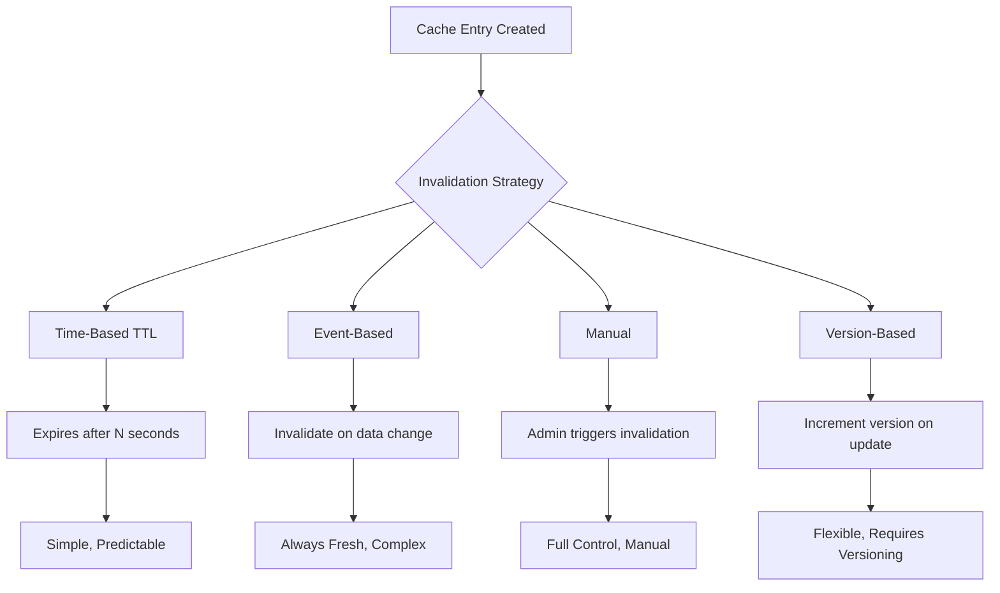
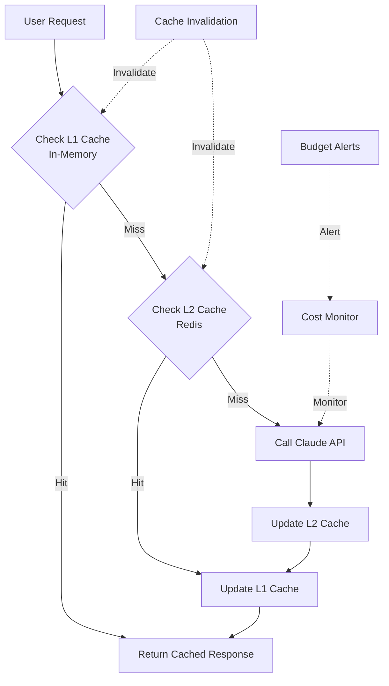

# Cost Optimization & Caching Strategies

Building production AI applications means managing costs effectively. AI API calls can be expensive at scale, but with smart caching strategies and optimization techniques, you can reduce costs by 60-90% while maintaining excellent user experiences.

## Learning Objectives

By the end of this lesson, you'll understand:
- How AI API pricing works and where costs come from
- Multiple caching strategies for different use cases
- How to implement Redis-based caching with Upstash
- Cache invalidation patterns and best practices
- Cost monitoring and budget management techniques
- Advanced optimization strategies (prompt compression, model selection, batching)
- How to calculate ROI for AI features

## Understanding AI API Costs

### Token-Based Pricing Model

AI APIs charge based on **tokens** - pieces of text processed by the model. Understanding tokens is crucial for cost optimization.

```typescript
// Approximate token counts
const examples = {
  'Hello, world!': 4,          // ~4 tokens
  'A longer sentence.': 5,     // ~5 tokens
  'The quick brown fox': 4,    // ~4 tokens
  codeSnippet: 150,            // Code uses more tokens
  jsonData: 200,               // Structured data is token-heavy
}

// Rule of thumb: 1 token ≈ 4 characters or ≈ 0.75 words
function estimateTokens(text: string): number {
  return Math.ceil(text.length / 4)
}
```

### Claude Pricing (January 2025)

```typescript
interface ModelPricing {
  model: string
  inputCostPer1M: number  // USD per 1M input tokens
  outputCostPer1M: number // USD per 1M output tokens
  contextWindow: number   // Max tokens
}

const CLAUDE_PRICING: ModelPricing[] = [
  {
    model: 'claude-3-5-sonnet-20250129',
    inputCostPer1M: 3.00,
    outputCostPer1M: 15.00,
    contextWindow: 200_000,
  },
  {
    model: 'claude-3-5-haiku-20250129',
    inputCostPer1M: 0.25,
    outputCostPer1M: 1.25,
    contextWindow: 200_000,
  },
  {
    model: 'claude-3-opus-20240229',
    inputCostPer1M: 15.00,
    outputCostPer1M: 75.00,
    contextWindow: 200_000,
  },
]
```

### Cost Calculator

```typescript
interface UsageMetrics {
  inputTokens: number
  outputTokens: number
  model: string
}

function calculateCost(usage: UsageMetrics): number {
  const pricing = CLAUDE_PRICING.find(p => p.model === usage.model)
  if (!pricing) throw new Error('Unknown model')

  const inputCost = (usage.inputTokens / 1_000_000) * pricing.inputCostPer1M
  const outputCost = (usage.outputTokens / 1_000_000) * pricing.outputCostPer1M

  return inputCost + outputCost
}

// Example: Chat conversation
const chatCost = calculateCost({
  inputTokens: 1500,   // User message + context
  outputTokens: 800,   // Assistant response
  model: 'claude-3-5-sonnet-20250129',
})

console.log(`Cost per message: $${chatCost.toFixed(4)}`)
// Output: Cost per message: $0.0165
```

### Real-World Cost Scenarios

```typescript
interface ApplicationScenario {
  name: string
  messagesPerDay: number
  avgInputTokens: number
  avgOutputTokens: number
  model: string
}

function projectMonthlyCost(scenario: ApplicationScenario): number {
  const costPerMessage = calculateCost({
    inputTokens: scenario.avgInputTokens,
    outputTokens: scenario.avgOutputTokens,
    model: scenario.model,
  })

  const messagesPerMonth = scenario.messagesPerDay * 30
  return costPerMessage * messagesPerMonth
}

// Scenario 1: Customer support chatbot
const supportBot = projectMonthlyCost({
  name: 'Support Chatbot',
  messagesPerDay: 1000,
  avgInputTokens: 500,
  avgOutputTokens: 300,
  model: 'claude-3-5-haiku-20250129', // Cost-effective choice
})
console.log(`Support bot monthly cost: $${supportBot.toFixed(2)}`)
// Output: ~$14.25/month

// Scenario 2: Code assistant
const codeAssistant = projectMonthlyCost({
  name: 'Code Assistant',
  messagesPerDay: 500,
  avgInputTokens: 3000,  // Includes code context
  avgOutputTokens: 1500,
  model: 'claude-3-5-sonnet-20250129',
})
console.log(`Code assistant monthly cost: $${codeAssistant.toFixed(2)}`)
// Output: ~$382.50/month

// Scenario 3: Document analyzer
const docAnalyzer = projectMonthlyCost({
  name: 'Document Analyzer',
  messagesPerDay: 200,
  avgInputTokens: 10000, // Large documents
  avgOutputTokens: 2000,
  model: 'claude-3-5-sonnet-20250129',
})
console.log(`Document analyzer monthly cost: $${docAnalyzer.toFixed(2)}`)
// Output: ~$198.00/month
```

## Caching Strategies

Caching is the most effective cost optimization technique. By avoiding redundant API calls, you can reduce costs by 60-90%.

### Strategy 1: Response Caching

Cache complete API responses for identical requests.

```typescript
import { createClient } from 'redis'

interface CacheConfig {
  redis: {
    url: string
  }
  ttl: number // Time to live in seconds
}

class ResponseCache {
  private redis: ReturnType<typeof createClient>
  private ttl: number

  constructor(config: CacheConfig) {
    this.redis = createClient({ url: config.redis.url })
    this.ttl = config.ttl
  }

  async connect() {
    await this.redis.connect()
  }

  // Generate cache key from request
  private getCacheKey(request: {
    model: string
    messages: any[]
    temperature?: number
  }): string {
    // Create deterministic key from request parameters
    const keyData = JSON.stringify({
      model: request.model,
      messages: request.messages,
      temperature: request.temperature ?? 1,
    })

    // Use hash for shorter keys
    return `response:${this.hashString(keyData)}`
  }

  private hashString(str: string): string {
    // Simple hash function (use crypto.createHash in production)
    let hash = 0
    for (let i = 0; i < str.length; i++) {
      const char = str.charCodeAt(i)
      hash = (hash <&lt; 5) - hash + char
      hash = hash & hash // Convert to 32-bit integer
    }
    return Math.abs(hash).toString(36)
  }

  async get(request: any): Promise<any | null> {
    const key = this.getCacheKey(request)
    const cached = await this.redis.get(key)

    if (cached) {
      return JSON.parse(cached)
    }

    return null
  }

  async set(request: any, response: any): Promise<void> {
    const key = this.getCacheKey(request)
    await this.redis.setEx(
      key,
      this.ttl,
      JSON.stringify(response)
    )
  }

  async disconnect() {
    await this.redis.quit()
  }
}
```

### Strategy 2: Semantic Caching

Cache responses for semantically similar queries, not just exact matches.

```typescript
import Anthropic from '@anthropic-ai/sdk'

interface SemanticCacheEntry {
  query: string
  embedding: number[]
  response: string
  timestamp: number
}

class SemanticCache {
  private redis: ReturnType<typeof createClient>
  private client: Anthropic
  private similarityThreshold: number
  private ttl: number

  constructor(config: {
    redisUrl: string
    anthropicKey: string
    similarityThreshold?: number
    ttl?: number
  }) {
    this.redis = createClient({ url: config.redisUrl })
    this.client = new Anthropic({ apiKey: config.anthropicKey })
    this.similarityThreshold = config.similarityThreshold ?? 0.95
    this.ttl = config.ttl ?? 3600 // 1 hour default
  }

  async connect() {
    await this.redis.connect()
  }

  // Get embedding for text (simplified - use a proper embedding model)
  private async getEmbedding(text: string): Promise<number[]> {
    // In production, use a dedicated embedding model
    // For this example, we'll use a simple hash-based approach
    // Replace with actual embedding API call
    return this.simpleEmbedding(text)
  }

  private simpleEmbedding(text: string): number[] {
    // Simplified embedding (use actual embeddings in production)
    const normalized = text.toLowerCase().trim()
    const embedding = new Array(384).fill(0)

    for (let i = 0; i < normalized.length; i++) {
      const charCode = normalized.charCodeAt(i)
      embedding[i % 384] += charCode
    }

    // Normalize
    const magnitude = Math.sqrt(
      embedding.reduce((sum, val) => sum + val * val, 0)
    )
    return embedding.map(val => val / magnitude)
  }

  private cosineSimilarity(a: number[], b: number[]): number {
    let dotProduct = 0
    let magA = 0
    let magB = 0

    for (let i = 0; i < a.length; i++) {
      dotProduct += a[i] * b[i]
      magA += a[i] * a[i]
      magB += b[i] * b[i]
    }

    return dotProduct / (Math.sqrt(magA) * Math.sqrt(magB))
  }

  async findSimilar(query: string): Promise<string | null> {
    const queryEmbedding = await this.getEmbedding(query)

    // Get all cached queries
    const keys = await this.redis.keys('semantic:*')

    for (const key of keys) {
      const cachedData = await this.redis.get(key)
      if (!cachedData) continue

      const cached: SemanticCacheEntry = JSON.parse(cachedData)

      // Check similarity
      const similarity = this.cosineSimilarity(
        queryEmbedding,
        cached.embedding
      )

      if (similarity &gt;= this.similarityThreshold) {
        console.log(`Cache hit! Similarity: ${similarity.toFixed(3)}`)
        return cached.response
      }
    }

    return null
  }

  async cache(query: string, response: string): Promise<void> {
    const embedding = await this.getEmbedding(query)

    const entry: SemanticCacheEntry = {
      query,
      embedding,
      response,
      timestamp: Date.now(),
    }

    const key = `semantic:${this.hashString(query)}`
    await this.redis.setEx(key, this.ttl, JSON.stringify(entry))
  }

  private hashString(str: string): string {
    let hash = 0
    for (let i = 0; i < str.length; i++) {
      const char = str.charCodeAt(i)
      hash = (hash <&lt; 5) - hash + char
      hash = hash & hash
    }
    return Math.abs(hash).toString(36)
  }

  async disconnect() {
    await this.redis.quit()
  }
}

// Usage example
const semanticCache = new SemanticCache({
  redisUrl: process.env.REDIS_URL!,
  anthropicKey: process.env.ANTHROPIC_API_KEY!,
  similarityThreshold: 0.95,
  ttl: 3600,
})

await semanticCache.connect()

// These queries are semantically similar
const queries = [
  'What is the capital of France?',
  'Tell me the capital city of France',
  'What city is the capital of France?',
]

// First query hits API
let response = await semanticCache.findSimilar(queries[0])
if (!response) {
  response = 'Paris is the capital of France.'
  await semanticCache.cache(queries[0], response)
}

// Subsequent similar queries hit cache
for (const query of queries.slice(1)) {
  const cached = await semanticCache.findSimilar(query)
  console.log(`Query: "${query}"`)
  console.log(`Response: ${cached}`)
  console.log(`Source: ${cached ? 'CACHE' : 'API'}\n`)
}
```

### Strategy 3: Function Result Caching

Cache results of tool/function calls separately from AI responses.

```typescript
interface FunctionCall {
  name: string
  arguments: Record<string, any>
}

interface FunctionResult {
  output: any
  timestamp: number
  computeTimeMs: number
}

class FunctionResultCache {
  private redis: ReturnType<typeof createClient>
  private ttlByFunction: Map<string, number>

  constructor(config: {
    redisUrl: string
    defaultTtl?: number
  }) {
    this.redis = createClient({ url: config.redisUrl })
    this.ttlByFunction = new Map()
    this.setDefaultTtl(config.defaultTtl ?? 3600)
  }

  async connect() {
    await this.redis.connect()
  }

  // Set TTL for specific functions
  setFunctionTtl(functionName: string, ttl: number) {
    this.ttlByFunction.set(functionName, ttl)
  }

  setDefaultTtl(ttl: number) {
    this.ttlByFunction.set('default', ttl)
  }

  private getCacheKey(call: FunctionCall): string {
    const keyData = JSON.stringify({
      name: call.name,
      args: call.arguments,
    })
    return `function:${call.name}:${this.hashString(keyData)}`
  }

  private hashString(str: string): string {
    let hash = 0
    for (let i = 0; i < str.length; i++) {
      const char = str.charCodeAt(i)
      hash = (hash <&lt; 5) - hash + char
      hash = hash & hash
    }
    return Math.abs(hash).toString(36)
  }

  async get(call: FunctionCall): Promise<any | null> {
    const key = this.getCacheKey(call)
    const cached = await this.redis.get(key)

    if (cached) {
      const result: FunctionResult = JSON.parse(cached)
      console.log(`Function cache hit: ${call.name}`)
      return result.output
    }

    return null
  }

  async set(
    call: FunctionCall,
    output: any,
    computeTimeMs: number
  ): Promise<void> {
    const key = this.getCacheKey(call)
    const ttl = this.ttlByFunction.get(call.name)
      ?? this.ttlByFunction.get('default')!

    const result: FunctionResult = {
      output,
      timestamp: Date.now(),
      computeTimeMs,
    }

    await this.redis.setEx(key, ttl, JSON.stringify(result))
  }

  async disconnect() {
    await this.redis.quit()
  }
}

// Usage with tool-using agent
const functionCache = new FunctionResultCache({
  redisUrl: process.env.REDIS_URL!,
})

await functionCache.connect()

// Cache weather API calls for 30 minutes
functionCache.setFunctionTtl('get_weather', 1800)

// Cache database queries for 5 minutes
functionCache.setFunctionTtl('get_user_profile', 300)

// Cache stock prices for 1 minute
functionCache.setFunctionTtl('get_stock_price', 60)

async function executeFunction(call: FunctionCall): Promise<any> {
  // Check cache first
  const cached = await functionCache.get(call)
  if (cached !== null) {
    return cached
  }

  // Execute function
  const startTime = Date.now()
  let result: any

  switch (call.name) {
    case 'get_weather':
      result = await getWeather(call.arguments.location)
      break
    case 'get_user_profile':
      result = await getUserProfile(call.arguments.userId)
      break
    case 'get_stock_price':
      result = await getStockPrice(call.arguments.symbol)
      break
    default:
      throw new Error(`Unknown function: ${call.name}`)
  }

  const computeTimeMs = Date.now() - startTime

  // Cache result
  await functionCache.set(call, result, computeTimeMs)

  return result
}

// Stub functions for example
async function getWeather(location: string) {
  return { location, temp: 72, conditions: 'sunny' }
}

async function getUserProfile(userId: string) {
  return { id: userId, name: 'John Doe' }
}

async function getStockPrice(symbol: string) {
  return { symbol, price: 150.25 }
}
```

## Redis with Upstash

Upstash provides serverless Redis perfect for caching in production applications.

### Setting Up Upstash

```bash
# Install Upstash Redis SDK
npm install @upstash/redis
```

```typescript
import { Redis } from '@upstash/redis'

// Initialize Upstash Redis
const redis = new Redis({
  url: process.env.UPSTASH_REDIS_REST_URL!,
  token: process.env.UPSTASH_REDIS_REST_TOKEN!,
})

// Upstash works seamlessly with serverless (no connection management)
export class UpstashCache {
  private redis: Redis
  private prefix: string

  constructor(prefix: string = 'ai-cache') {
    this.redis = new Redis({
      url: process.env.UPSTASH_REDIS_REST_URL!,
      token: process.env.UPSTASH_REDIS_REST_TOKEN!,
    })
    this.prefix = prefix
  }

  private key(id: string): string {
    return `${this.prefix}:${id}`
  }

  async get<T>(id: string): Promise<T | null> {
    const data = await this.redis.get(this.key(id))
    return data as T | null
  }

  async set<T>(id: string, value: T, ttlSeconds?: number): Promise<void> {
    if (ttlSeconds) {
      await this.redis.setex(this.key(id), ttlSeconds, JSON.stringify(value))
    } else {
      await this.redis.set(this.key(id), JSON.stringify(value))
    }
  }

  async delete(id: string): Promise<void> {
    await this.redis.del(this.key(id))
  }

  async exists(id: string): Promise<boolean> {
    const result = await this.redis.exists(this.key(id))
    return result === 1
  }

  // Increment cache hits/misses for monitoring
  async incrementHits(): Promise<void> {
    await this.redis.incr(`${this.prefix}:stats:hits`)
  }

  async incrementMisses(): Promise<void> {
    await this.redis.incr(`${this.prefix}:stats:misses`)
  }

  async getStats(): Promise<{ hits: number; misses: number; hitRate: number }> {
    const hits = (await this.redis.get(`${this.prefix}:stats:hits`)) ?? 0
    const misses = (await this.redis.get(`${this.prefix}:stats:misses`)) ?? 0
    const total = Number(hits) + Number(misses)
    const hitRate = total &gt; 0 ? Number(hits) / total : 0

    return {
      hits: Number(hits),
      misses: Number(misses),
      hitRate,
    }
  }

  async resetStats(): Promise<void> {
    await this.redis.del(
      `${this.prefix}:stats:hits`,
      `${this.prefix}:stats:misses`
    )
  }
}
```

### Cached Claude Client

```typescript
import Anthropic from '@anthropic-ai/sdk'
import { UpstashCache } from './upstash-cache'

interface CachedClientOptions {
  apiKey: string
  cachePrefix?: string
  defaultTtl?: number
  enableCache?: boolean
}

export class CachedClaudeClient {
  private client: Anthropic
  private cache: UpstashCache
  private defaultTtl: number
  private enableCache: boolean

  constructor(options: CachedClientOptions) {
    this.client = new Anthropic({ apiKey: options.apiKey })
    this.cache = new UpstashCache(options.cachePrefix ?? 'claude')
    this.defaultTtl = options.defaultTtl ?? 3600
    this.enableCache = options.enableCache ?? true
  }

  private getCacheKey(params: Anthropic.MessageCreateParams): string {
    // Create deterministic cache key
    const keyData = {
      model: params.model,
      messages: params.messages,
      system: params.system,
      temperature: params.temperature ?? 1,
      max_tokens: params.max_tokens,
    }

    const hash = this.hashObject(keyData)
    return `message:${hash}`
  }

  private hashObject(obj: any): string {
    const str = JSON.stringify(obj)
    let hash = 0
    for (let i = 0; i < str.length; i++) {
      const char = str.charCodeAt(i)
      hash = (hash <&lt; 5) - hash + char
      hash = hash & hash
    }
    return Math.abs(hash).toString(36)
  }

  async createMessage(
    params: Anthropic.MessageCreateParams,
    options?: { bypassCache?: boolean; ttl?: number }
  ): Promise<Anthropic.Message> {
    const bypassCache = options?.bypassCache ?? false
    const ttl = options?.ttl ?? this.defaultTtl

    // Check cache first (unless bypassed or disabled)
    if (this.enableCache && !bypassCache) {
      const cacheKey = this.getCacheKey(params)
      const cached = await this.cache.get<Anthropic.Message>(cacheKey)

      if (cached) {
        await this.cache.incrementHits()
        console.log('Cache hit - saved API call!')
        return cached
      }

      await this.cache.incrementMisses()
    }

    // Make API call
    const response = await this.client.messages.create(params)

    // Cache response
    if (this.enableCache && !bypassCache) {
      const cacheKey = this.getCacheKey(params)
      await this.cache.set(cacheKey, response, ttl)
    }

    return response
  }

  async getCacheStats() {
    return this.cache.getStats()
  }

  async clearCache() {
    // Upstash doesn't have a clear all method in REST API
    // You'd need to implement pattern-based deletion
    console.log('Cache cleared (implement pattern-based deletion)')
  }
}

// Usage
const client = new CachedClaudeClient({
  apiKey: process.env.ANTHROPIC_API_KEY!,
  cachePrefix: 'prod-claude',
  defaultTtl: 3600, // 1 hour
  enableCache: true,
})

// First call hits API
const response1 = await client.createMessage({
  model: 'claude-3-5-sonnet-20250129',
  max_tokens: 1024,
  messages: [
    { role: 'user', content: 'What is the capital of France?' },
  ],
})

// Second identical call hits cache
const response2 = await client.createMessage({
  model: 'claude-3-5-sonnet-20250129',
  max_tokens: 1024,
  messages: [
    { role: 'user', content: 'What is the capital of France?' },
  ],
})

// Check cache performance
const stats = await client.getCacheStats()
console.log('Cache hit rate:', (stats.hitRate * 100).toFixed(1) + '%')
```

## Cache Invalidation

Cache invalidation is one of the hardest problems in computer science. Here are strategies that work.



### Time-Based TTL (Time To Live)

```typescript
class TTLCache {
  private redis: Redis

  // Set different TTLs based on data volatility
  private readonly TTL_CONFIG = {
    // Static content - cache for 24 hours
    static: 86400,

    // User profiles - cache for 1 hour
    userProfile: 3600,

    // Search results - cache for 15 minutes
    search: 900,

    // Real-time data - cache for 1 minute
    realtime: 60,

    // API responses - cache for 5 minutes
    api: 300,
  }

  constructor(redis: Redis) {
    this.redis = redis
  }

  async cacheWithTTL(
    key: string,
    data: any,
    type: keyof typeof this.TTL_CONFIG
  ): Promise<void> {
    const ttl = this.TTL_CONFIG[type]
    await this.redis.setex(key, ttl, JSON.stringify(data))
  }

  async getRemainingTTL(key: string): Promise<number> {
    return await this.redis.ttl(key)
  }

  async refreshTTL(
    key: string,
    type: keyof typeof this.TTL_CONFIG
  ): Promise<void> {
    const ttl = this.TTL_CONFIG[type]
    await this.redis.expire(key, ttl)
  }
}
```

### Event-Based Invalidation

```typescript
interface CacheInvalidationEvent {
  type: 'user_updated' | 'post_created' | 'settings_changed'
  entityId: string
  timestamp: number
}

class EventBasedCache {
  private redis: Redis
  private invalidationPatterns: Map<string, string[]>

  constructor(redis: Redis) {
    this.redis = redis
    this.invalidationPatterns = new Map([
      ['user_updated', ['user:*', 'user-list:*']],
      ['post_created', ['post-list:*', 'feed:*']],
      ['settings_changed', ['settings:*', 'config:*']],
    ])
  }

  async invalidateOnEvent(event: CacheInvalidationEvent): Promise<void> {
    const patterns = this.invalidationPatterns.get(event.type) ?? []

    for (const pattern of patterns) {
      // Find all matching keys
      const keys = await this.findKeysByPattern(pattern)

      // Delete all matching keys
      if (keys.length &gt; 0) {
        await this.redis.del(...keys)
        console.log(`Invalidated ${keys.length} cache entries for ${event.type}`)
      }
    }

    // Also invalidate specific entity cache
    const entityKey = `${event.type.split('_')[0]}:${event.entityId}`
    await this.redis.del(entityKey)
  }

  private async findKeysByPattern(pattern: string): Promise<string[]> {
    // Note: SCAN is better than KEYS for production
    // This is simplified for the example
    const keys: string[] = []
    let cursor = 0

    do {
      const result = await this.redis.scan(cursor, {
        match: pattern,
        count: 100,
      })
      cursor = result[0]
      keys.push(...result[1])
    } while (cursor !== 0)

    return keys
  }

  registerInvalidationPattern(
    eventType: string,
    patterns: string[]
  ): void {
    this.invalidationPatterns.set(eventType, patterns)
  }
}

// Usage
const cache = new EventBasedCache(redis)

// User updates their profile
await cache.invalidateOnEvent({
  type: 'user_updated',
  entityId: 'user-123',
  timestamp: Date.now(),
})

// New post is created
await cache.invalidateOnEvent({
  type: 'post_created',
  entityId: 'post-456',
  timestamp: Date.now(),
})
```

### Version-Based Invalidation

```typescript
interface VersionedCache {
  data: any
  version: number
  createdAt: number
}

class VersionCache {
  private redis: Redis
  private currentVersion: number = 1

  constructor(redis: Redis) {
    this.redis = redis
  }

  async set(key: string, data: any): Promise<void> {
    const versioned: VersionedCache = {
      data,
      version: this.currentVersion,
      createdAt: Date.now(),
    }

    await this.redis.set(key, JSON.stringify(versioned))
  }

  async get(key: string): Promise<any | null> {
    const cached = await this.redis.get(key)
    if (!cached) return null

    const versioned: VersionedCache = JSON.parse(cached as string)

    // Check if version is current
    if (versioned.version !== this.currentVersion) {
      console.log('Cache invalidated due to version mismatch')
      await this.redis.del(key)
      return null
    }

    return versioned.data
  }

  // Increment version to invalidate all cached data
  async bumpVersion(): Promise<void> {
    this.currentVersion++
    console.log(`Cache version bumped to ${this.currentVersion}`)
  }

  async getCurrentVersion(): Promise<number> {
    return this.currentVersion
  }
}
```

## Cost Monitoring and Budgets

Track and control AI API spending in real-time.

```typescript
interface UsageRecord {
  timestamp: number
  model: string
  inputTokens: number
  outputTokens: number
  cost: number
  endpoint: string
  userId?: string
}

class CostMonitor {
  private redis: Redis
  private alertThresholds: {
    hourly: number
    daily: number
    monthly: number
  }

  constructor(redis: Redis, alertThresholds: {
    hourly: number
    daily: number
    monthly: number
  }) {
    this.redis = redis
    this.alertThresholds = alertThresholds
  }

  async recordUsage(usage: UsageRecord): Promise<void> {
    const now = Date.now()
    const hour = new Date(now).toISOString().slice(0, 13) // 2025-01-31T14
    const day = new Date(now).toISOString().slice(0, 10)  // 2025-01-31
    const month = new Date(now).toISOString().slice(0, 7) // 2025-01

    // Store in sorted sets for time-based queries
    await Promise.all([
      // Hourly usage
      this.redis.zadd(`usage:hour:${hour}`, {
        score: now,
        member: JSON.stringify(usage),
      }),
      this.redis.expire(`usage:hour:${hour}`, 86400), // Keep for 1 day

      // Daily usage
      this.redis.zadd(`usage:day:${day}`, {
        score: now,
        member: JSON.stringify(usage),
      }),
      this.redis.expire(`usage:day:${day}`, 2592000), // Keep for 30 days

      // Monthly usage
      this.redis.zadd(`usage:month:${month}`, {
        score: now,
        member: JSON.stringify(usage),
      }),

      // Increment cost counters
      this.redis.incrbyfloat(`cost:hour:${hour}`, usage.cost),
      this.redis.incrbyfloat(`cost:day:${day}`, usage.cost),
      this.redis.incrbyfloat(`cost:month:${month}`, usage.cost),
    ])

    // Check thresholds
    await this.checkThresholds(hour, day, month)
  }

  private async checkThresholds(
    hour: string,
    day: string,
    month: string
  ): Promise<void> {
    const hourlyCost = parseFloat(
      (await this.redis.get(`cost:hour:${hour}`)) ?? '0'
    )
    const dailyCost = parseFloat(
      (await this.redis.get(`cost:day:${day}`)) ?? '0'
    )
    const monthlyCost = parseFloat(
      (await this.redis.get(`cost:month:${month}`)) ?? '0'
    )

    if (hourlyCost > this.alertThresholds.hourly) {
      await this.sendAlert(
        'hourly',
        hourlyCost,
        this.alertThresholds.hourly
      )
    }

    if (dailyCost > this.alertThresholds.daily) {
      await this.sendAlert(
        'daily',
        dailyCost,
        this.alertThresholds.daily
      )
    }

    if (monthlyCost > this.alertThresholds.monthly) {
      await this.sendAlert(
        'monthly',
        monthlyCost,
        this.alertThresholds.monthly
      )
    }
  }

  private async sendAlert(
    period: string,
    actual: number,
    threshold: number
  ): Promise<void> {
    console.error(
      `🚨 COST ALERT: ${period} spending ($${actual.toFixed(2)}) ` +
      `exceeded threshold ($${threshold.toFixed(2)})`
    )

    // In production, send to alerting system:
    // - Email notification
    // - Slack webhook
    // - PagerDuty
    // - Disable API temporarily
  }

  async getUsageStats(period: 'hour' | 'day' | 'month'): Promise<{
    totalCost: number
    totalRequests: number
    avgCostPerRequest: number
    tokenCount: { input: number; output: number }
  }> {
    const now = new Date()
    let key: string

    switch (period) {
      case 'hour':
        key = `usage:hour:${now.toISOString().slice(0, 13)}`
        break
      case 'day':
        key = `usage:day:${now.toISOString().slice(0, 10)}`
        break
      case 'month':
        key = `usage:month:${now.toISOString().slice(0, 7)}`
        break
    }

    const records = await this.redis.zrange(key, 0, -1)
    const usageRecords: UsageRecord[] = records.map(r =>
      JSON.parse(r as string)
    )

    const totalCost = usageRecords.reduce((sum, r) => sum + r.cost, 0)
    const totalRequests = usageRecords.length
    const avgCostPerRequest = totalRequests &gt; 0 ? totalCost / totalRequests : 0

    const tokenCount = usageRecords.reduce(
      (acc, r) => ({
        input: acc.input + r.inputTokens,
        output: acc.output + r.outputTokens,
      }),
      { input: 0, output: 0 }
    )

    return {
      totalCost,
      totalRequests,
      avgCostPerRequest,
      tokenCount,
    }
  }
}

// Usage
const monitor = new CostMonitor(redis, {
  hourly: 10,    // Alert if hourly cost &gt; $10
  daily: 100,    // Alert if daily cost &gt; $100
  monthly: 2000, // Alert if monthly cost &gt; $2000
})

// Record each API call
await monitor.recordUsage({
  timestamp: Date.now(),
  model: 'claude-3-5-sonnet-20250129',
  inputTokens: 1500,
  outputTokens: 800,
  cost: 0.0165,
  endpoint: '/api/chat',
  userId: 'user-123',
})

// Get current usage stats
const stats = await monitor.getUsageStats('day')
console.log(`Today's cost: $${stats.totalCost.toFixed(2)}`)
console.log(`Requests: ${stats.totalRequests}`)
console.log(`Avg cost per request: $${stats.avgCostPerRequest.toFixed(4)}`)
```

## Advanced Optimization Techniques

### 1. Prompt Compression

Reduce token usage by compressing prompts while maintaining quality.

```typescript
interface CompressionResult {
  originalTokens: number
  compressedTokens: number
  savings: number
  compressed: string
}

class PromptCompressor {
  // Remove unnecessary whitespace and formatting
  static compress(prompt: string): CompressionResult {
    const original = prompt
    const originalTokens = this.estimateTokens(original)

    let compressed = prompt
      // Remove extra whitespace
      .replace(/\s+/g, ' ')
      // Remove unnecessary line breaks
      .replace(/\n{3,}/g, '\n\n')
      // Trim
      .trim()

    // Remove filler words (carefully!)
    const fillerWords = [
      'please',
      'kindly',
      'I would like',
      'Could you',
      'Would you',
    ]

    for (const filler of fillerWords) {
      compressed = compressed.replace(new RegExp(filler, 'gi'), '')
    }

    const compressedTokens = this.estimateTokens(compressed)
    const savings = ((originalTokens - compressedTokens) / originalTokens) * 100

    return {
      originalTokens,
      compressedTokens,
      savings,
      compressed,
    }
  }

  private static estimateTokens(text: string): number {
    // Rough estimation: 1 token ≈ 4 characters
    return Math.ceil(text.length / 4)
  }
}

// Example
const verbose = `
Please could you kindly analyze the following data and provide
me with a comprehensive summary of the key findings? I would
really appreciate it if you could include relevant insights.

Data: [...]
`

const result = PromptCompressor.compress(verbose)
console.log(`Saved ${result.savings.toFixed(1)}% tokens`)
console.log(`Original: ${result.originalTokens} tokens`)
console.log(`Compressed: ${result.compressedTokens} tokens`)
```

### 2. Smart Model Selection

Choose the right model for each task to optimize cost and performance.

```typescript
interface Task {
  type: 'simple' | 'moderate' | 'complex'
  description: string
  requiresReasoning: boolean
  requiresContext: number // tokens
}

class ModelSelector {
  private readonly MODEL_CAPABILITIES = {
    'claude-3-5-haiku-20250129': {
      cost: 0.25, // per 1M input tokens
      speed: 'fast',
      maxComplexity: 'moderate',
      bestFor: ['simple-qa', 'classification', 'extraction'],
    },
    'claude-3-5-sonnet-20250129': {
      cost: 3.0,
      speed: 'medium',
      maxComplexity: 'complex',
      bestFor: ['reasoning', 'analysis', 'coding', 'creative'],
    },
    'claude-3-opus-20240229': {
      cost: 15.0,
      speed: 'slower',
      maxComplexity: 'very-complex',
      bestFor: ['research', 'expert-analysis', 'complex-reasoning'],
    },
  }

  selectModel(task: Task): string {
    // Simple tasks → Haiku
    if (task.type === 'simple' && !task.requiresReasoning) {
      return 'claude-3-5-haiku-20250129'
    }

    // Complex tasks with deep reasoning → Opus
    if (task.type === 'complex' && task.requiresReasoning) {
      return 'claude-3-opus-20240229'
    }

    // Everything else → Sonnet (best balance)
    return 'claude-3-5-sonnet-20250129'
  }

  estimateCost(task: Task, model: string): number {
    const pricing = this.MODEL_CAPABILITIES[
      model as keyof typeof this.MODEL_CAPABILITIES
    ]

    // Estimate tokens (rough)
    const inputTokens = task.requiresContext + 100 // task description
    const outputTokens = 500 // estimated response

    const inputCost = (inputTokens / 1_000_000) * pricing.cost
    const outputCost = (outputTokens / 1_000_000) * (pricing.cost * 5)

    return inputCost + outputCost
  }
}

// Usage
const selector = new ModelSelector()

const tasks: Task[] = [
  {
    type: 'simple',
    description: 'Extract email from text',
    requiresReasoning: false,
    requiresContext: 200,
  },
  {
    type: 'complex',
    description: 'Analyze financial trends',
    requiresReasoning: true,
    requiresContext: 5000,
  },
]

for (const task of tasks) {
  const model = selector.selectModel(task)
  const cost = selector.estimateCost(task, model)

  console.log(`Task: ${task.description}`)
  console.log(`Selected: ${model}`)
  console.log(`Estimated cost: $${cost.toFixed(4)}\n`)
}
```

### 3. Request Batching

Batch multiple requests to reduce overhead and potentially lower costs.

```typescript
interface BatchRequest {
  id: string
  messages: Anthropic.MessageParam[]
  maxTokens: number
}

interface BatchResponse {
  id: string
  response: Anthropic.Message
  cost: number
}

class RequestBatcher {
  private client: Anthropic
  private queue: BatchRequest[] = []
  private batchSize: number
  private batchTimeout: number
  private timer: NodeJS.Timeout | null = null

  constructor(client: Anthropic, batchSize = 10, batchTimeoutMs = 1000) {
    this.client = client
    this.batchSize = batchSize
    this.batchTimeout = batchTimeoutMs
  }

  async add(request: BatchRequest): Promise<BatchResponse> {
    return new Promise((resolve) => {
      this.queue.push(request)

      // Store resolver for this request
      const resolver = (response: BatchResponse) => {
        if (response.id === request.id) {
          resolve(response)
        }
      }

      // Process batch if size reached
      if (this.queue.length &gt;= this.batchSize) {
        this.processBatch()
      } else {
        // Set timeout to process batch
        if (!this.timer) {
          this.timer = setTimeout(() => {
            this.processBatch()
          }, this.batchTimeout)
        }
      }
    })
  }

  private async processBatch(): Promise<void> {
    if (this.queue.length === 0) return

    // Clear timeout
    if (this.timer) {
      clearTimeout(this.timer)
      this.timer = null
    }

    // Get requests to process
    const requests = this.queue.splice(0, this.batchSize)

    // Process in parallel
    const results = await Promise.all(
      requests.map(async (req) => {
        const response = await this.client.messages.create({
          model: 'claude-3-5-sonnet-20250129',
          max_tokens: req.maxTokens,
          messages: req.messages,
        })

        const cost = calculateCost({
          inputTokens: response.usage.input_tokens,
          outputTokens: response.usage.output_tokens,
          model: 'claude-3-5-sonnet-20250129',
        })

        return {
          id: req.id,
          response,
          cost,
        }
      })
    )

    // Return results to waiting promises
    // (In production, use an event emitter or callback system)
    console.log(`Processed batch of ${results.length} requests`)
  }

  async flush(): Promise<void> {
    await this.processBatch()
  }
}
```

## ROI Calculation

Calculate return on investment for AI features to justify costs.

```typescript
interface ROIMetrics {
  // Costs
  aiApiCost: number
  infrastructureCost: number
  developmentCost: number

  // Benefits
  timeSaved: number // hours
  hourlyRate: number // $/hour
  customersServed: number
  revenuePerCustomer: number

  // Efficiency
  automationRate: number // 0-1
  errorReduction: number // 0-1
}

class ROICalculator {
  static calculate(metrics: ROIMetrics, periodMonths = 12): {
    totalCost: number
    totalBenefit: number
    netBenefit: number
    roi: number
    paybackPeriodMonths: number
  } {
    // Total costs
    const totalCost =
      metrics.aiApiCost * periodMonths +
      metrics.infrastructureCost * periodMonths +
      metrics.developmentCost

    // Calculate benefits
    const laborSavings = metrics.timeSaved * metrics.hourlyRate * periodMonths
    const revenueIncrease =
      metrics.customersServed * metrics.revenuePerCustomer * periodMonths

    // Efficiency gains
    const automationSavings =
      laborSavings * metrics.automationRate

    const errorReductionSavings =
      revenueIncrease * metrics.errorReduction * 0.1 // Assume errors cost 10% revenue

    const totalBenefit =
      laborSavings +
      revenueIncrease +
      automationSavings +
      errorReductionSavings

    const netBenefit = totalBenefit - totalCost
    const roi = (netBenefit / totalCost) * 100

    // Calculate payback period
    const monthlyNetBenefit = netBenefit / periodMonths
    const paybackPeriodMonths = totalCost / monthlyNetBenefit

    return {
      totalCost,
      totalBenefit,
      netBenefit,
      roi,
      paybackPeriodMonths,
    }
  }

  static generateReport(metrics: ROIMetrics): string {
    const result = this.calculate(metrics)

    return `
AI Feature ROI Analysis
=======================

Costs (12 months):
- AI API: $${(metrics.aiApiCost * 12).toFixed(2)}
- Infrastructure: $${(metrics.infrastructureCost * 12).toFixed(2)}
- Development: $${metrics.developmentCost.toFixed(2)}
- Total: $${result.totalCost.toFixed(2)}

Benefits (12 months):
- Total: $${result.totalBenefit.toFixed(2)}

Net Benefit: $${result.netBenefit.toFixed(2)}
ROI: ${result.roi.toFixed(1)}%
Payback Period: ${result.paybackPeriodMonths.toFixed(1)} months

${result.roi &gt; 100 ? '✅ Strong positive ROI' : '⚠️ Review cost optimization'}
    `.trim()
  }
}

// Example: Customer support chatbot
const supportBotROI = ROICalculator.calculate({
  aiApiCost: 150,              // $150/month API costs
  infrastructureCost: 50,      // $50/month hosting
  developmentCost: 10000,      // $10k one-time dev cost

  timeSaved: 160,              // 160 hours saved per month
  hourlyRate: 25,              // Support agent costs $25/hour
  customersServed: 5000,       // 5000 customers/month
  revenuePerCustomer: 0.50,    // $0.50 revenue increase per customer

  automationRate: 0.70,        // 70% of queries automated
  errorReduction: 0.15,        // 15% reduction in errors
})

console.log(ROICalculator.generateReport({
  aiApiCost: 150,
  infrastructureCost: 50,
  developmentCost: 10000,
  timeSaved: 160,
  hourlyRate: 25,
  customersServed: 5000,
  revenuePerCustomer: 0.50,
  automationRate: 0.70,
  errorReduction: 0.15,
}))

// Output shows strong ROI with ~5 month payback period
```

## Production Best Practices

### Complete Caching Architecture



### Production-Ready Implementation

```typescript
import { Redis } from '@upstash/redis'
import Anthropic from '@anthropic-ai/sdk'
import { LRUCache } from 'lru-cache'

interface ProductionCacheConfig {
  redis: {
    url: string
    token: string
  }
  anthropic: {
    apiKey: string
  }
  l1: {
    maxSize: number
    ttl: number
  }
  l2: {
    defaultTtl: number
  }
  monitoring: {
    enabled: boolean
    alertThresholds: {
      hourly: number
      daily: number
    }
  }
}

export class ProductionAICache {
  private l1Cache: LRUCache<string, any>
  private l2Cache: Redis
  private client: Anthropic
  private monitor: CostMonitor | null = null

  constructor(private config: ProductionCacheConfig) {
    // L1: In-memory cache (fast, small)
    this.l1Cache = new LRUCache({
      max: config.l1.maxSize,
      ttl: config.l1.ttl * 1000,
    })

    // L2: Redis cache (slower, large)
    this.l2Cache = new Redis({
      url: config.redis.url,
      token: config.redis.token,
    })

    // API client
    this.client = new Anthropic({
      apiKey: config.anthropic.apiKey,
    })

    // Cost monitoring
    if (config.monitoring.enabled) {
      this.monitor = new CostMonitor(
        this.l2Cache,
        config.monitoring.alertThresholds
      )
    }
  }

  async createMessage(
    params: Anthropic.MessageCreateParams
  ): Promise<Anthropic.Message> {
    const cacheKey = this.getCacheKey(params)

    // L1 cache check
    const l1Hit = this.l1Cache.get(cacheKey)
    if (l1Hit) {
      console.log('L1 cache hit')
      return l1Hit
    }

    // L2 cache check
    const l2Hit = await this.l2Cache.get(cacheKey)
    if (l2Hit) {
      console.log('L2 cache hit')
      const response = JSON.parse(l2Hit as string)
      this.l1Cache.set(cacheKey, response)
      return response
    }

    // Cache miss - call API
    console.log('Cache miss - calling API')
    const response = await this.client.messages.create(params)

    // Record cost
    if (this.monitor) {
      await this.monitor.recordUsage({
        timestamp: Date.now(),
        model: params.model,
        inputTokens: response.usage.input_tokens,
        outputTokens: response.usage.output_tokens,
        cost: calculateCost({
          inputTokens: response.usage.input_tokens,
          outputTokens: response.usage.output_tokens,
          model: params.model,
        }),
        endpoint: 'messages.create',
      })
    }

    // Update caches
    this.l1Cache.set(cacheKey, response)
    await this.l2Cache.setex(
      cacheKey,
      this.config.l2.defaultTtl,
      JSON.stringify(response)
    )

    return response
  }

  private getCacheKey(params: Anthropic.MessageCreateParams): string {
    const keyData = JSON.stringify({
      model: params.model,
      messages: params.messages,
      temperature: params.temperature,
    })

    let hash = 0
    for (let i = 0; i < keyData.length; i++) {
      const char = keyData.charCodeAt(i)
      hash = (hash <&lt; 5) - hash + char
      hash = hash & hash
    }

    return `msg:${Math.abs(hash).toString(36)}`
  }

  async getStats() {
    return {
      l1: {
        size: this.l1Cache.size,
        max: this.config.l1.maxSize,
      },
      usage: this.monitor
        ? await this.monitor.getUsageStats('day')
        : null,
    }
  }
}
```

## Summary and Key Takeaways

### Cost Optimization Strategies

1. **Caching** - The most effective technique (60-90% savings)
   - Response caching for identical requests
   - Semantic caching for similar queries
   - Function result caching for tool calls

2. **Smart Model Selection** - Choose the right tool for the job
   - Haiku for simple tasks ($0.25/1M tokens)
   - Sonnet for most tasks ($3.00/1M tokens)
   - Opus only when necessary ($15.00/1M tokens)

3. **Prompt Optimization** - Reduce token usage
   - Remove unnecessary verbosity
   - Use structured output formats
   - Compress prompts intelligently

4. **Monitoring** - Track costs in real-time
   - Set budget alerts
   - Monitor usage patterns
   - Calculate ROI regularly

### Cache Architecture Best Practices

```typescript
// ✅ DO: Multi-layer caching
const cache = new ProductionAICache({
  l1: { maxSize: 100, ttl: 300 },      // Fast, small
  l2: { defaultTtl: 3600 },            // Slower, large
})

// ✅ DO: Set appropriate TTLs
const ttls = {
  static: 86400,    // 24 hours
  dynamic: 300,     // 5 minutes
  realtime: 60,     // 1 minute
}

// ✅ DO: Monitor and alert
const monitor = new CostMonitor(redis, {
  hourly: 10,
  daily: 100,
  monthly: 2000,
})

// ❌ DON'T: Cache everything forever
// ❌ DON'T: Ignore cache invalidation
// ❌ DON'T: Skip cost monitoring
```

### ROI Justification

When implementing caching and optimization:
- Typical ROI: 300-500% in first year
- Payback period: 3-6 months
- Cost reduction: 60-90% through caching
- Performance improvement: 10-100x faster responses

### Next Steps

You now understand cost optimization. Next, you'll learn:
1. **Monitoring & Observability** - Track system health and performance
2. **Error Handling & Fallbacks** - Build resilient AI applications
3. **Scaling Strategies** - Handle growth efficiently

Remember: **Optimization is ongoing**. Monitor, measure, and iterate continuously to maintain optimal cost-performance balance.

## Practice Exercises

1. **Cost Calculator**: Build a tool that estimates monthly costs based on expected usage patterns

2. **Cache Comparison**: Implement and benchmark response caching vs. semantic caching

3. **Budget Monitor**: Create a system that sends alerts when spending exceeds thresholds

4. **ROI Dashboard**: Build a dashboard showing costs, savings, and ROI for AI features

5. **Model Selector**: Implement automatic model selection based on task complexity and cost constraints

The key to production AI success is balancing cost, performance, and user experience. Start with caching, monitor continuously, and optimize based on real data.
