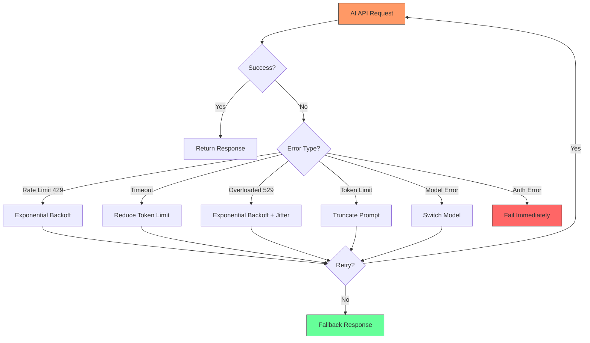
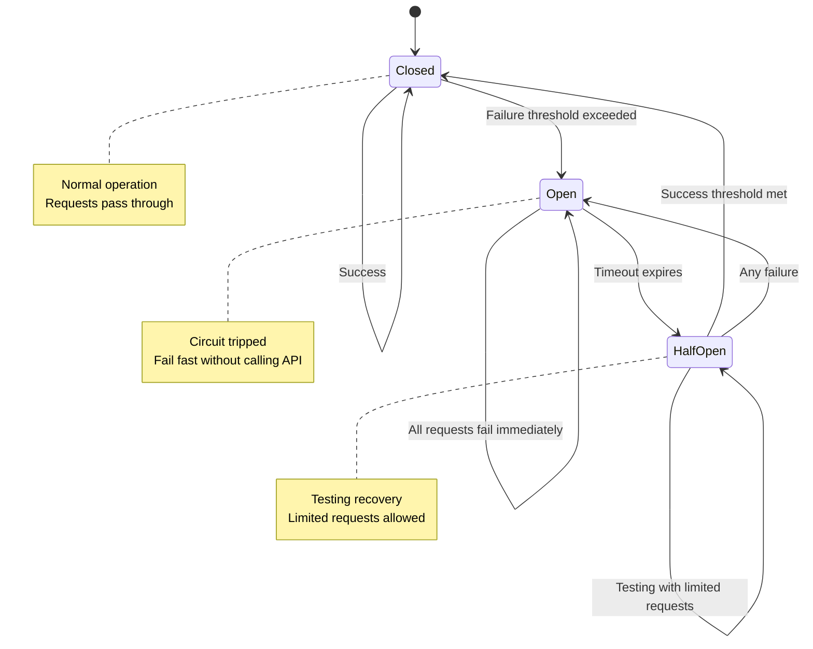
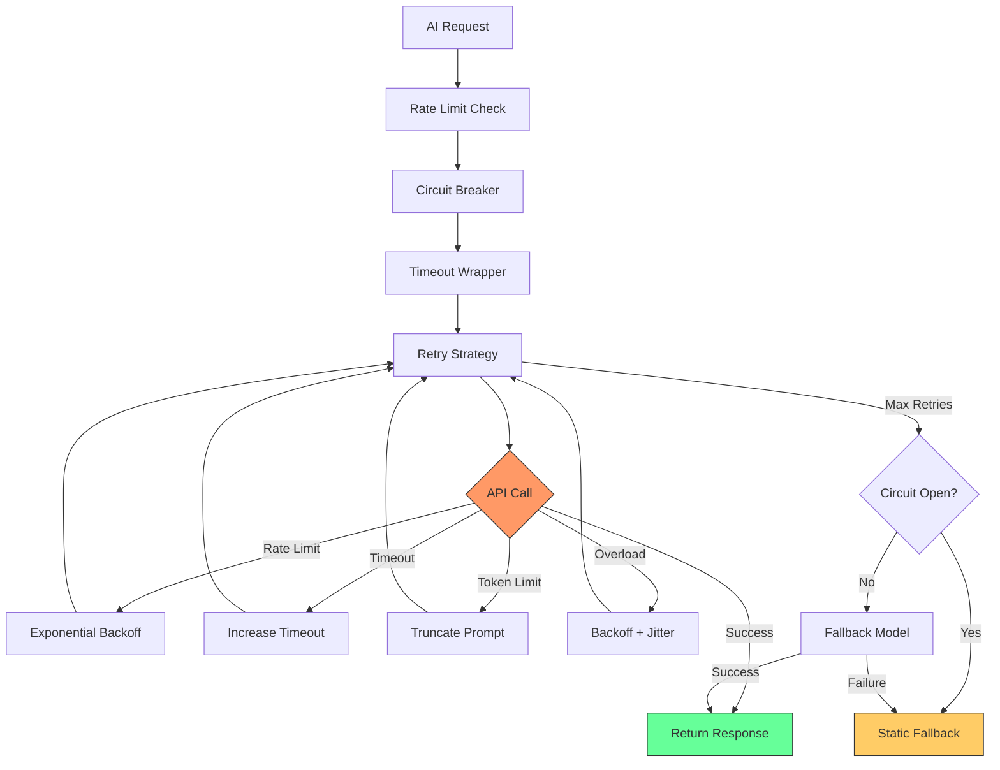

# Error Handling & Fallbacks

AI applications face unique failure modes that traditional error handling doesn't address. API rate limits, token exhaustion, model timeouts, and non-deterministic failures require sophisticated retry strategies, circuit breakers, and graceful degradation. This lesson teaches you to build production-ready resilient AI systems.

## Learning Objectives

By the end of this lesson, you'll understand:
- Common AI API failure modes and their root causes
- Retry strategies with exponential backoff and jitter
- Circuit breaker pattern for preventing cascading failures
- Graceful degradation and fallback mechanisms
- Error recovery workflows for different failure scenarios
- Timeout handling strategies for long-running AI operations
- Rate limit management and request throttling
- Building end-to-end resilient AI applications

## Why AI Applications Need Special Error Handling

Traditional error handling assumes deterministic behavior and predictable failure modes. AI applications operate differently.

```typescript
// Traditional API: Predictable failures
async function fetchUser(id: string): Promise<User> {
  const response = await fetch(`/api/users/${id}`)

  if (!response.ok) {
    // Failures are deterministic:
    // 404 → User not found (don't retry)
    // 500 → Server error (maybe retry)
    // 401 → Unauthorized (don't retry)
    throw new Error(`HTTP ${response.status}`)
  }

  return response.json()
}

// AI API: Complex, non-deterministic failures
async function generateText(prompt: string): Promise<string> {
  const response = await claude.messages.create({
    model: 'claude-3-5-sonnet-20250129',
    max_tokens: 1024,
    messages: [{ role: 'user', content: prompt }],
  })

  // Potential failures:
  // - Rate limit (429) → Retry with backoff
  // - Token limit exceeded → Reduce prompt size
  // - Timeout → Reduce max_tokens
  // - Overloaded (529) → Retry with exponential backoff
  // - Model error → Try different model
  // - Context too long → Truncate or summarize

  return response.content[0].text
}
```

### AI-Specific Failure Modes



## Common AI API Failures

Understanding failure types is the first step to handling them correctly.

### 1. Rate Limit Errors (429)

The most common AI API error. Indicates too many requests in a time window.

```typescript
interface RateLimitError {
  status: 429
  error: {
    type: 'rate_limit_error'
    message: 'Rate limit exceeded'
  }
  // Often includes retry-after header
  retryAfter?: number // Seconds until retry allowed
}

class RateLimitHandler {
  private requestCount = 0
  private resetTime: number | null = null

  async handleRateLimit(error: RateLimitError): Promise<void> {
    // Parse retry-after header
    const retryAfterMs = (error.retryAfter || 60) * 1000

    console.warn(`Rate limited. Waiting ${retryAfterMs}ms before retry`)

    // Wait before retrying
    await new Promise(resolve => setTimeout(resolve, retryAfterMs))
  }

  // Proactive rate limit prevention
  async enforceRateLimit(requestsPerMinute: number): Promise<void> {
    const now = Date.now()

    // Reset counter every minute
    if (!this.resetTime || now > this.resetTime) {
      this.requestCount = 0
      this.resetTime = now + 60000
    }

    // Check if at limit
    if (this.requestCount &gt;= requestsPerMinute) {
      const waitTime = this.resetTime - now
      console.log(`Rate limit prevention: waiting ${waitTime}ms`)
      await new Promise(resolve => setTimeout(resolve, waitTime))

      // Reset after waiting
      this.requestCount = 0
      this.resetTime = Date.now() + 60000
    }

    this.requestCount++
  }
}

// Usage
const rateLimitHandler = new RateLimitHandler()

async function rateLimitedRequest(prompt: string): Promise<string> {
  // Enforce client-side rate limit (50 RPM)
  await rateLimitHandler.enforceRateLimit(50)

  try {
    const response = await claude.messages.create({
      model: 'claude-3-5-sonnet-20250129',
      max_tokens: 1024,
      messages: [{ role: 'user', content: prompt }],
    })

    return response.content[0].text
  } catch (error: any) {
    if (error.status === 429) {
      await rateLimitHandler.handleRateLimit(error)
      // Retry after waiting
      return rateLimitedRequest(prompt)
    }
    throw error
  }
}
```

### 2. Timeout Errors

AI API calls can take seconds or minutes. Proper timeout handling is critical.

```typescript
interface TimeoutConfig {
  requestTimeoutMs: number // Max time for API call
  streamTimeoutMs: number // Max time between stream chunks
  totalTimeoutMs: number // Max time for entire operation
}

class TimeoutHandler {
  async withTimeout<T>(
    operation: () => Promise<T>,
    timeoutMs: number,
    errorMessage: string = 'Operation timed out'
  ): Promise<T> {
    return Promise.race([
      operation(),
      new Promise<T>((_, reject) =>
        setTimeout(() => reject(new Error(errorMessage)), timeoutMs)
      ),
    ])
  }

  async withRetryOnTimeout<T>(
    operation: () => Promise<T>,
    config: TimeoutConfig,
    maxRetries: number = 3
  ): Promise<T> {
    let currentTimeout = config.requestTimeoutMs

    for (let attempt = 0; attempt < maxRetries; attempt++) {
      try {
        return await this.withTimeout(
          operation,
          currentTimeout,
          `Request timed out after ${currentTimeout}ms`
        )
      } catch (error: any) {
        if (error.message.includes('timed out') && attempt < maxRetries - 1) {
          // Increase timeout for next attempt (maybe model is slow)
          currentTimeout = Math.min(
            currentTimeout * 1.5,
            config.totalTimeoutMs
          )

          console.log(`Timeout on attempt ${attempt + 1}, retrying with ${currentTimeout}ms`)
          continue
        }
        throw error
      }
    }

    throw new Error('Max retries exceeded')
  }
}

// Usage
const timeoutHandler = new TimeoutHandler()

async function timeoutAwareGeneration(prompt: string): Promise<string> {
  const config: TimeoutConfig = {
    requestTimeoutMs: 30000, // 30 seconds initial
    streamTimeoutMs: 5000, // 5 seconds between chunks
    totalTimeoutMs: 120000, // 2 minutes max
  }

  return timeoutHandler.withRetryOnTimeout(
    async () => {
      const response = await claude.messages.create({
        model: 'claude-3-5-sonnet-20250129',
        max_tokens: 1024,
        messages: [{ role: 'user', content: prompt }],
      })

      return response.content[0].text
    },
    config,
    3 // Max 3 retries with increasing timeout
  )
}
```

### 3. Token Limit Errors

Exceeding context windows or max_tokens limits.

```typescript
interface TokenLimitError {
  status: 400
  error: {
    type: 'invalid_request_error'
    message: string // Contains "maximum context length" or similar
  }
}

class TokenLimitHandler {
  private readonly MODEL_CONTEXT_LIMITS = {
    'claude-3-5-sonnet-20250129': 200000,
    'claude-3-5-haiku-20250129': 200000,
    'claude-3-opus-20250129': 200000,
  }

  // Estimate token count (rough approximation)
  estimateTokens(text: string): number {
    // Rough estimate: 1 token ≈ 4 characters
    return Math.ceil(text.length / 4)
  }

  truncateToTokenLimit(
    text: string,
    maxTokens: number,
    strategy: 'start' | 'end' | 'middle' = 'end'
  ): string {
    const estimatedTokens = this.estimateTokens(text)

    if (estimatedTokens &lt;= maxTokens) {
      return text
    }

    const targetChars = maxTokens * 4

    switch (strategy) {
      case 'start':
        return text.slice(0, targetChars) + '...'

      case 'end':
        return '...' + text.slice(-targetChars)

      case 'middle':
        const halfChars = Math.floor(targetChars / 2)
        return text.slice(0, halfChars) + '\n\n[...]\n\n' + text.slice(-halfChars)

      default:
        return text.slice(0, targetChars)
    }
  }

  async handleTokenLimit(
    prompt: string,
    maxOutputTokens: number,
    model: string
  ): Promise<string> {
    const contextLimit = this.MODEL_CONTEXT_LIMITS[
      model as keyof typeof this.MODEL_CONTEXT_LIMITS
    ]

    // Reserve tokens for output
    const maxPromptTokens = contextLimit - maxOutputTokens - 100 // 100 token buffer

    const truncatedPrompt = this.truncateToTokenLimit(
      prompt,
      maxPromptTokens,
      'middle'
    )

    console.log(`Truncated prompt from ${this.estimateTokens(prompt)} to ${this.estimateTokens(truncatedPrompt)} tokens`)

    const response = await claude.messages.create({
      model: model as any,
      max_tokens: maxOutputTokens,
      messages: [{ role: 'user', content: truncatedPrompt }],
    })

    return response.content[0].text
  }
}

// Usage
const tokenHandler = new TokenLimitHandler()

async function safeLongContextGeneration(
  longPrompt: string
): Promise<string> {
  try {
    const response = await claude.messages.create({
      model: 'claude-3-5-sonnet-20250129',
      max_tokens: 2048,
      messages: [{ role: 'user', content: longPrompt }],
    })

    return response.content[0].text
  } catch (error: any) {
    // Check if token limit error
    if (
      error.status === 400 &&
      error.error?.message?.includes('maximum context length')
    ) {
      console.warn('Token limit exceeded, truncating prompt')
      return tokenHandler.handleTokenLimit(
        longPrompt,
        2048,
        'claude-3-5-sonnet-20250129'
      )
    }
    throw error
  }
}
```

### 4. Model Overload Errors (529)

API temporarily overloaded. Requires retry with backoff.

```typescript
interface OverloadError {
  status: 529
  error: {
    type: 'overloaded_error'
    message: 'Service temporarily overloaded'
  }
}

class OverloadHandler {
  async handleOverload(
    attempt: number,
    maxRetries: number = 5
  ): Promise<void> {
    if (attempt &gt;= maxRetries) {
      throw new Error('Service overloaded after max retries')
    }

    // Exponential backoff with jitter
    const baseDelay = Math.pow(2, attempt) * 1000 // 1s, 2s, 4s, 8s, 16s
    const jitter = Math.random() * 1000 // 0-1s random jitter
    const delay = baseDelay + jitter

    console.log(`Service overloaded. Retry ${attempt + 1}/${maxRetries} after ${delay}ms`)

    await new Promise(resolve => setTimeout(resolve, delay))
  }
}

// Usage in retry logic (covered in next section)
```

## Retry Strategies with Exponential Backoff

Intelligent retry logic is essential for resilient AI applications.

### Basic Retry with Exponential Backoff

```typescript
interface RetryConfig {
  maxRetries: number
  initialDelayMs: number
  maxDelayMs: number
  backoffMultiplier: number
  jitter: boolean
}

class RetryStrategy {
  async withRetry<T>(
    operation: () => Promise<T>,
    config: RetryConfig,
    shouldRetry: (error: any, attempt: number) => boolean
  ): Promise<T> {
    let lastError: any

    for (let attempt = 0; attempt < config.maxRetries; attempt++) {
      try {
        return await operation()
      } catch (error) {
        lastError = error

        // Check if should retry
        if (!shouldRetry(error, attempt)) {
          throw error
        }

        // Don't wait after last attempt
        if (attempt < config.maxRetries - 1) {
          const delay = this.calculateDelay(attempt, config)
          console.log(`Retry ${attempt + 1}/${config.maxRetries} after ${delay}ms`)
          await new Promise(resolve => setTimeout(resolve, delay))
        }
      }
    }

    throw lastError
  }

  private calculateDelay(attempt: number, config: RetryConfig): number {
    // Calculate exponential backoff
    let delay = config.initialDelayMs * Math.pow(config.backoffMultiplier, attempt)

    // Cap at max delay
    delay = Math.min(delay, config.maxDelayMs)

    // Add jitter to prevent thundering herd
    if (config.jitter) {
      const jitterAmount = delay * 0.1 * Math.random()
      delay = delay + jitterAmount
    }

    return delay
  }
}

// Usage
const retryStrategy = new RetryStrategy()

async function resilientAICall(prompt: string): Promise<string> {
  const config: RetryConfig = {
    maxRetries: 5,
    initialDelayMs: 1000, // Start with 1 second
    maxDelayMs: 32000, // Cap at 32 seconds
    backoffMultiplier: 2, // Double each time
    jitter: true, // Add randomness
  }

  return retryStrategy.withRetry(
    async () => {
      const response = await claude.messages.create({
        model: 'claude-3-5-sonnet-20250129',
        max_tokens: 1024,
        messages: [{ role: 'user', content: prompt }],
      })

      return response.content[0].text
    },
    config,
    (error, attempt) => {
      // Retry on rate limits and overload
      if (error.status === 429 || error.status === 529) {
        return true
      }

      // Retry on timeouts (first 3 attempts)
      if (error.message?.includes('timeout') && attempt &lt; 3) {
        return true
      }

      // Don't retry on auth errors or invalid requests
      if (error.status === 401 || error.status === 403 || error.status === 400) {
        return false
      }

      // Retry on server errors
      if (error.status &gt;= 500 && error.status &lt; 600) {
        return true
      }

      // Don't retry by default
      return false
    }
  )
}
```

### Advanced Retry with Adaptive Backoff

```typescript
interface RetryMetrics {
  successCount: number
  failureCount: number
  avgLatencyMs: number
  lastSuccessTime: number
}

class AdaptiveRetryStrategy extends RetryStrategy {
  private metrics: RetryMetrics = {
    successCount: 0,
    failureCount: 0,
    avgLatencyMs: 0,
    lastSuccessTime: Date.now(),
  }

  async withAdaptiveRetry<T>(
    operation: () => Promise<T>,
    baseConfig: RetryConfig
  ): Promise<T> {
    const startTime = Date.now()

    // Adjust config based on recent performance
    const config = this.adjustConfig(baseConfig)

    try {
      const result = await this.withRetry(
        operation,
        config,
        this.adaptiveShouldRetry.bind(this)
      )

      // Record success
      this.recordSuccess(Date.now() - startTime)

      return result
    } catch (error) {
      // Record failure
      this.recordFailure()
      throw error
    }
  }

  private adjustConfig(baseConfig: RetryConfig): RetryConfig {
    const timeSinceLastSuccess = Date.now() - this.metrics.lastSuccessTime
    const errorRate = this.metrics.failureCount /
      (this.metrics.successCount + this.metrics.failureCount || 1)

    // If high error rate or long time since success, be more conservative
    if (errorRate &gt; 0.5 || timeSinceLastSuccess &gt; 300000) {
      return {
        ...baseConfig,
        initialDelayMs: baseConfig.initialDelayMs * 2,
        maxRetries: Math.max(baseConfig.maxRetries - 1, 2),
      }
    }

    // If performing well, can be more aggressive
    if (errorRate &lt; 0.1 && this.metrics.avgLatencyMs &lt; 2000) {
      return {
        ...baseConfig,
        maxRetries: baseConfig.maxRetries + 1,
      }
    }

    return baseConfig
  }

  private adaptiveShouldRetry(error: any, attempt: number): boolean {
    // Use learned patterns to decide retry
    const errorRate = this.metrics.failureCount /
      (this.metrics.successCount + this.metrics.failureCount || 1)

    // If error rate very high, fail faster
    if (errorRate &gt; 0.8 && attempt &gt; 2) {
      return false
    }

    // Standard retry logic
    return error.status === 429 ||
           error.status === 529 ||
           (error.status &gt;= 500 && error.status &lt; 600)
  }

  private recordSuccess(latencyMs: number): void {
    this.metrics.successCount++
    this.metrics.lastSuccessTime = Date.now()

    // Update rolling average
    this.metrics.avgLatencyMs =
      (this.metrics.avgLatencyMs * (this.metrics.successCount - 1) + latencyMs) /
      this.metrics.successCount
  }

  private recordFailure(): void {
    this.metrics.failureCount++
  }

  getMetrics(): RetryMetrics {
    return { ...this.metrics }
  }
}

// Usage
const adaptiveRetry = new AdaptiveRetryStrategy()

async function intelligentAICall(prompt: string): Promise<string> {
  return adaptiveRetry.withAdaptiveRetry(
    async () => {
      const response = await claude.messages.create({
        model: 'claude-3-5-sonnet-20250129',
        max_tokens: 1024,
        messages: [{ role: 'user', content: prompt }],
      })

      return response.content[0].text
    },
    {
      maxRetries: 5,
      initialDelayMs: 1000,
      maxDelayMs: 32000,
      backoffMultiplier: 2,
      jitter: true,
    }
  )
}

// Monitor retry performance
setInterval(() => {
  const metrics = adaptiveRetry.getMetrics()
  console.log('Retry Metrics:', metrics)
}, 60000)
```

## Circuit Breaker Pattern

Prevent cascading failures by failing fast when a service is unhealthy.

### Circuit Breaker States



### Circuit Breaker Implementation

```typescript
enum CircuitState {
  CLOSED = 'CLOSED', // Normal operation
  OPEN = 'OPEN', // Failing fast
  HALF_OPEN = 'HALF_OPEN', // Testing recovery
}

interface CircuitBreakerConfig {
  failureThreshold: number // Open after N failures
  successThreshold: number // Close after N successes in half-open
  timeout: number // Time before trying half-open (ms)
  volumeThreshold: number // Min requests before checking threshold
}

class CircuitBreaker {
  private state: CircuitState = CircuitState.CLOSED
  private failureCount = 0
  private successCount = 0
  private lastFailureTime: number | null = null
  private requestCount = 0

  constructor(
    private name: string,
    private config: CircuitBreakerConfig
  ) {}

  async execute<T>(operation: () => Promise<T>): Promise<T> {
    // Check circuit state
    if (this.state === CircuitState.OPEN) {
      // Check if timeout expired
      if (this.shouldAttemptReset()) {
        this.state = CircuitState.HALF_OPEN
        this.successCount = 0
        console.log(`Circuit breaker [${this.name}]: Entering HALF_OPEN state`)
      } else {
        throw new Error(`Circuit breaker [${this.name}] is OPEN`)
      }
    }

    try {
      const result = await operation()
      this.onSuccess()
      return result
    } catch (error) {
      this.onFailure()
      throw error
    }
  }

  private onSuccess(): void {
    this.requestCount++
    this.failureCount = 0

    if (this.state === CircuitState.HALF_OPEN) {
      this.successCount++

      // If enough successes in half-open, close circuit
      if (this.successCount &gt;= this.config.successThreshold) {
        this.state = CircuitState.CLOSED
        this.successCount = 0
        console.log(`Circuit breaker [${this.name}]: CLOSED`)
      }
    }
  }

  private onFailure(): void {
    this.requestCount++
    this.failureCount++
    this.lastFailureTime = Date.now()

    if (this.state === CircuitState.HALF_OPEN) {
      // Any failure in half-open reopens circuit
      this.state = CircuitState.OPEN
      console.log(`Circuit breaker [${this.name}]: OPENED (half-open failure)`)
      return
    }

    // Check if should open circuit
    if (
      this.requestCount &gt;= this.config.volumeThreshold &&
      this.failureCount &gt;= this.config.failureThreshold
    ) {
      this.state = CircuitState.OPEN
      console.log(`Circuit breaker [${this.name}]: OPENED (${this.failureCount} failures)`)
    }
  }

  private shouldAttemptReset(): boolean {
    if (!this.lastFailureTime) return false
    return Date.now() - this.lastFailureTime &gt;= this.config.timeout
  }

  getState(): CircuitState {
    return this.state
  }

  getMetrics() {
    return {
      state: this.state,
      failureCount: this.failureCount,
      successCount: this.successCount,
      requestCount: this.requestCount,
    }
  }

  // Manual reset (for admin/testing)
  reset(): void {
    this.state = CircuitState.CLOSED
    this.failureCount = 0
    this.successCount = 0
    this.requestCount = 0
    this.lastFailureTime = null
    console.log(`Circuit breaker [${this.name}]: Manually reset`)
  }
}

// Usage
const claudeCircuitBreaker = new CircuitBreaker('claude-api', {
  failureThreshold: 5, // Open after 5 failures
  successThreshold: 2, // Close after 2 successes in half-open
  timeout: 60000, // Try half-open after 1 minute
  volumeThreshold: 10, // Need at least 10 requests before checking
})

async function circuitProtectedAICall(prompt: string): Promise<string> {
  try {
    return await claudeCircuitBreaker.execute(async () => {
      const response = await claude.messages.create({
        model: 'claude-3-5-sonnet-20250129',
        max_tokens: 1024,
        messages: [{ role: 'user', content: prompt }],
      })

      return response.content[0].text
    })
  } catch (error: any) {
    if (error.message.includes('Circuit breaker')) {
      console.error('Circuit is open, using fallback')
      return getFallbackResponse(prompt)
    }
    throw error
  }
}

function getFallbackResponse(prompt: string): string {
  return 'Service temporarily unavailable. Please try again later.'
}
```

## Graceful Degradation and Fallbacks

When primary AI services fail, provide alternative responses instead of complete failure.

### Fallback Hierarchy

```typescript
interface FallbackConfig {
  primaryModel: string
  fallbackModels: string[]
  cacheEnabled: boolean
  staticFallbackEnabled: boolean
}

class FallbackManager {
  constructor(private config: FallbackConfig) {}

  async generateWithFallback(
    prompt: string,
    maxTokens: number = 1024
  ): Promise<{
    response: string
    source: 'primary' | 'fallback' | 'cache' | 'static'
    model?: string
  }> {
    // 1. Try cache first
    if (this.config.cacheEnabled) {
      const cached = await this.tryCache(prompt)
      if (cached) {
        return { response: cached, source: 'cache' }
      }
    }

    // 2. Try primary model
    try {
      const response = await this.callModel(
        this.config.primaryModel,
        prompt,
        maxTokens
      )

      // Cache successful response
      if (this.config.cacheEnabled) {
        await this.cacheResponse(prompt, response)
      }

      return {
        response,
        source: 'primary',
        model: this.config.primaryModel,
      }
    } catch (error) {
      console.warn(`Primary model failed: ${error}`)
    }

    // 3. Try fallback models in order
    for (const fallbackModel of this.config.fallbackModels) {
      try {
        const response = await this.callModel(
          fallbackModel,
          prompt,
          maxTokens
        )

        return {
          response,
          source: 'fallback',
          model: fallbackModel,
        }
      } catch (error) {
        console.warn(`Fallback model ${fallbackModel} failed: ${error}`)
        continue
      }
    }

    // 4. Use static fallback if enabled
    if (this.config.staticFallbackEnabled) {
      return {
        response: this.getStaticFallback(prompt),
        source: 'static',
      }
    }

    throw new Error('All AI models and fallbacks failed')
  }

  private async callModel(
    model: string,
    prompt: string,
    maxTokens: number
  ): Promise<string> {
    const response = await claude.messages.create({
      model: model as any,
      max_tokens: maxTokens,
      messages: [{ role: 'user', content: prompt }],
    })

    return response.content[0].text
  }

  private async tryCache(prompt: string): Promise<string | null> {
    // Implementation depends on cache backend
    return null
  }

  private async cacheResponse(prompt: string, response: string): Promise<void> {
    // Cache implementation
  }

  private getStaticFallback(prompt: string): string {
    // Provide helpful static response
    return `I apologize, but I'm temporarily unable to process your request.
Our AI service is experiencing issues. Please try again in a few moments.

Your request: ${prompt.slice(0, 100)}...`
  }
}

// Usage
const fallbackManager = new FallbackManager({
  primaryModel: 'claude-3-5-sonnet-20250129',
  fallbackModels: [
    'claude-3-5-haiku-20250129', // Faster, cheaper fallback
  ],
  cacheEnabled: true,
  staticFallbackEnabled: true,
})

async function robustGeneration(prompt: string): Promise<string> {
  const result = await fallbackManager.generateWithFallback(prompt)

  console.log(`Response from: ${result.source}${result.model ? ` (${result.model})` : ''}`)

  return result.response
}
```

### Partial Degradation

```typescript
interface FeatureFlags {
  aiSummary: boolean
  aiRecommendations: boolean
  aiSearch: boolean
}

class GracefulDegradation {
  private features: FeatureFlags = {
    aiSummary: true,
    aiRecommendations: true,
    aiSearch: true,
  }

  private errorCounts: Map<string, number> = new Map()
  private readonly ERROR_THRESHOLD = 3

  async executeWithDegradation<T>(
    feature: keyof FeatureFlags,
    aiOperation: () => Promise<T>,
    fallback: () => T
  ): Promise<T> {
    // Check if feature disabled due to errors
    if (!this.features[feature]) {
      console.log(`Feature ${feature} disabled, using fallback`)
      return fallback()
    }

    try {
      const result = await aiOperation()

      // Reset error count on success
      this.errorCounts.set(feature, 0)

      return result
    } catch (error) {
      const errorCount = (this.errorCounts.get(feature) || 0) + 1
      this.errorCounts.set(feature, errorCount)

      // Disable feature if error threshold exceeded
      if (errorCount &gt;= this.ERROR_THRESHOLD) {
        this.features[feature] = false
        console.error(`Feature ${feature} disabled after ${errorCount} errors`)

        // Re-enable after 5 minutes
        setTimeout(() => {
          this.features[feature] = true
          this.errorCounts.set(feature, 0)
          console.log(`Feature ${feature} re-enabled`)
        }, 300000)
      }

      return fallback()
    }
  }
}

// Usage
const degradation = new GracefulDegradation()

async function summarizeArticle(article: string): Promise<string> {
  return degradation.executeWithDegradation(
    'aiSummary',
    async () => {
      // AI summary
      const response = await claude.messages.create({
        model: 'claude-3-5-sonnet-20250129',
        max_tokens: 500,
        messages: [{
          role: 'user',
          content: `Summarize this article:\n\n${article}`,
        }],
      })

      return response.content[0].text
    },
    () => {
      // Fallback: Simple extraction
      const firstParagraph = article.split('\n\n')[0]
      return `Summary unavailable. First paragraph: ${firstParagraph.slice(0, 200)}...`
    }
  )
}
```

## Error Recovery Workflows

Different errors require different recovery strategies.

### Error Classification and Recovery

```typescript
type ErrorCategory =
  | 'transient' // Retry immediately
  | 'rate_limit' // Retry with backoff
  | 'resource_exhausted' // Reduce load and retry
  | 'invalid_input' // Fix input and retry
  | 'permanent' // Don't retry

interface ClassifiedError {
  category: ErrorCategory
  recoverable: boolean
  suggestedAction: string
  retryAfterMs?: number
}

class ErrorClassifier {
  classify(error: any): ClassifiedError {
    const status = error.status || error.statusCode
    const message = error.message?.toLowerCase() || ''

    // Rate limit errors
    if (status === 429) {
      return {
        category: 'rate_limit',
        recoverable: true,
        suggestedAction: 'Retry with exponential backoff',
        retryAfterMs: this.parseRetryAfter(error),
      }
    }

    // Token/context limit errors
    if (
      status === 400 &&
      (message.includes('token') || message.includes('context'))
    ) {
      return {
        category: 'resource_exhausted',
        recoverable: true,
        suggestedAction: 'Reduce prompt size or max_tokens',
      }
    }

    // Invalid input errors
    if (status === 400) {
      return {
        category: 'invalid_input',
        recoverable: false,
        suggestedAction: 'Fix input validation',
      }
    }

    // Authentication errors
    if (status === 401 || status === 403) {
      return {
        category: 'permanent',
        recoverable: false,
        suggestedAction: 'Check API key and permissions',
      }
    }

    // Service overload
    if (status === 529) {
      return {
        category: 'transient',
        recoverable: true,
        suggestedAction: 'Retry with exponential backoff and jitter',
        retryAfterMs: 1000,
      }
    }

    // Server errors
    if (status &gt;= 500 && status &lt; 600) {
      return {
        category: 'transient',
        recoverable: true,
        suggestedAction: 'Retry with backoff',
        retryAfterMs: 2000,
      }
    }

    // Timeout errors
    if (message.includes('timeout')) {
      return {
        category: 'transient',
        recoverable: true,
        suggestedAction: 'Retry with increased timeout',
        retryAfterMs: 500,
      }
    }

    // Unknown errors - be conservative
    return {
      category: 'permanent',
      recoverable: false,
      suggestedAction: 'Log error and alert team',
    }
  }

  private parseRetryAfter(error: any): number {
    // Parse Retry-After header (seconds)
    const retryAfter = error.headers?.['retry-after']
    if (retryAfter) {
      return parseInt(retryAfter) * 1000
    }
    return 60000 // Default 60 seconds
  }
}

// Recovery coordinator
class ErrorRecoveryCoordinator {
  private classifier = new ErrorClassifier()
  private retryStrategy = new AdaptiveRetryStrategy()
  private tokenHandler = new TokenLimitHandler()

  async executeWithRecovery<T>(
    operation: () => Promise<T>,
    context: {
      prompt?: string
      maxTokens?: number
      model?: string
    }
  ): Promise<T> {
    try {
      return await operation()
    } catch (error) {
      const classified = this.classifier.classify(error)

      console.log(`Error classified as: ${classified.category}`)
      console.log(`Recovery: ${classified.suggestedAction}`)

      // Handle based on category
      switch (classified.category) {
        case 'rate_limit':
        case 'transient':
          return this.handleTransientError(operation, classified)

        case 'resource_exhausted':
          return this.handleResourceExhausted(context)

        case 'invalid_input':
          throw new Error(`Invalid input: ${error.message}`)

        case 'permanent':
          throw error

        default:
          throw error
      }
    }
  }

  private async handleTransientError<T>(
    operation: () => Promise<T>,
    classified: ClassifiedError
  ): Promise<T> {
    // Wait if retry-after specified
    if (classified.retryAfterMs) {
      await new Promise(resolve =>
        setTimeout(resolve, classified.retryAfterMs)
      )
    }

    // Retry with adaptive strategy
    return this.retryStrategy.withAdaptiveRetry(operation, {
      maxRetries: 3,
      initialDelayMs: 1000,
      maxDelayMs: 32000,
      backoffMultiplier: 2,
      jitter: true,
    })
  }

  private async handleResourceExhausted<T>(context: {
    prompt?: string
    maxTokens?: number
    model?: string
  }): Promise<T> {
    if (!context.prompt || !context.maxTokens || !context.model) {
      throw new Error('Cannot recover: missing context')
    }

    // Reduce token usage and retry
    const response = await this.tokenHandler.handleTokenLimit(
      context.prompt,
      Math.floor(context.maxTokens * 0.7), // Reduce by 30%
      context.model
    )

    return response as T
  }
}

// Usage
const recoveryCoordinator = new ErrorRecoveryCoordinator()

async function resilientAIGeneration(prompt: string): Promise<string> {
  return recoveryCoordinator.executeWithRecovery(
    async () => {
      const response = await claude.messages.create({
        model: 'claude-3-5-sonnet-20250129',
        max_tokens: 2048,
        messages: [{ role: 'user', content: prompt }],
      })

      return response.content[0].text
    },
    {
      prompt,
      maxTokens: 2048,
      model: 'claude-3-5-sonnet-20250129',
    }
  )
}
```

## Building Resilient AI Applications

Combine all patterns into a production-ready resilient client.

### Complete Resilient AI Client

```typescript
interface ResilientClientConfig {
  apiKey: string
  defaultModel: string

  // Retry configuration
  retryConfig: RetryConfig

  // Circuit breaker configuration
  circuitBreakerConfig: CircuitBreakerConfig

  // Fallback configuration
  fallbackConfig: FallbackConfig

  // Timeout configuration
  timeoutConfig: TimeoutConfig

  // Rate limiting
  requestsPerMinute: number
}

class ResilientAIClient {
  private claude: Anthropic
  private retryStrategy: AdaptiveRetryStrategy
  private circuitBreaker: CircuitBreaker
  private fallbackManager: FallbackManager
  private timeoutHandler: TimeoutHandler
  private rateLimitHandler: RateLimitHandler
  private errorClassifier: ErrorClassifier
  private tokenHandler: TokenLimitHandler

  constructor(private config: ResilientClientConfig) {
    this.claude = new Anthropic({ apiKey: config.apiKey })
    this.retryStrategy = new AdaptiveRetryStrategy()
    this.circuitBreaker = new CircuitBreaker(
      'ai-client',
      config.circuitBreakerConfig
    )
    this.fallbackManager = new FallbackManager(config.fallbackConfig)
    this.timeoutHandler = new TimeoutHandler()
    this.rateLimitHandler = new RateLimitHandler()
    this.errorClassifier = new ErrorClassifier()
    this.tokenHandler = new TokenLimitHandler()
  }

  async generate(
    prompt: string,
    options: {
      model?: string
      maxTokens?: number
      temperature?: number
    } = {}
  ): Promise<{
    text: string
    metadata: {
      source: string
      model: string
      latencyMs: number
      retriesUsed: number
      fromCache: boolean
    }
  }> {
    const startTime = Date.now()
    let retriesUsed = 0

    // Enforce rate limiting
    await this.rateLimitHandler.enforceRateLimit(
      this.config.requestsPerMinute
    )

    try {
      // Execute through circuit breaker
      const result = await this.circuitBreaker.execute(async () => {
        // Execute with timeout
        return this.timeoutHandler.withRetryOnTimeout(
          async () => {
            // Execute with retry
            return this.retryStrategy.withAdaptiveRetry(
              async () => {
                retriesUsed++

                const response = await this.claude.messages.create({
                  model: options.model || this.config.defaultModel,
                  max_tokens: options.maxTokens || 1024,
                  temperature: options.temperature,
                  messages: [{ role: 'user', content: prompt }],
                })

                return response.content[0].text
              },
              this.config.retryConfig
            )
          },
          this.config.timeoutConfig
        )
      })

      return {
        text: result,
        metadata: {
          source: 'primary',
          model: options.model || this.config.defaultModel,
          latencyMs: Date.now() - startTime,
          retriesUsed: retriesUsed - 1,
          fromCache: false,
        },
      }
    } catch (error) {
      // Circuit is open or all retries failed - use fallback
      const fallbackResult = await this.fallbackManager.generateWithFallback(
        prompt,
        options.maxTokens
      )

      return {
        text: fallbackResult.response,
        metadata: {
          source: fallbackResult.source,
          model: fallbackResult.model || 'fallback',
          latencyMs: Date.now() - startTime,
          retriesUsed: retriesUsed - 1,
          fromCache: fallbackResult.source === 'cache',
        },
      }
    }
  }

  // Health check
  async healthCheck(): Promise<{
    healthy: boolean
    circuitState: CircuitState
    retryMetrics: RetryMetrics
  }> {
    const circuitState = this.circuitBreaker.getState()
    const retryMetrics = this.retryStrategy.getMetrics()

    return {
      healthy: circuitState === CircuitState.CLOSED,
      circuitState,
      retryMetrics,
    }
  }

  // Manual circuit reset (admin)
  resetCircuit(): void {
    this.circuitBreaker.reset()
  }
}

// Usage
const resilientClient = new ResilientAIClient({
  apiKey: process.env.ANTHROPIC_API_KEY!,
  defaultModel: 'claude-3-5-sonnet-20250129',

  retryConfig: {
    maxRetries: 5,
    initialDelayMs: 1000,
    maxDelayMs: 32000,
    backoffMultiplier: 2,
    jitter: true,
  },

  circuitBreakerConfig: {
    failureThreshold: 5,
    successThreshold: 2,
    timeout: 60000,
    volumeThreshold: 10,
  },

  fallbackConfig: {
    primaryModel: 'claude-3-5-sonnet-20250129',
    fallbackModels: ['claude-3-5-haiku-20250129'],
    cacheEnabled: true,
    staticFallbackEnabled: true,
  },

  timeoutConfig: {
    requestTimeoutMs: 30000,
    streamTimeoutMs: 5000,
    totalTimeoutMs: 120000,
  },

  requestsPerMinute: 50,
})

// Simple, resilient API
async function generateText(prompt: string): Promise<string> {
  const result = await resilientClient.generate(prompt)

  console.log('Generation metadata:', result.metadata)

  return result.text
}

// Monitor health
setInterval(async () => {
  const health = await resilientClient.healthCheck()
  console.log('AI Client Health:', health)
}, 60000)
```

## Summary and Key Takeaways

### Error Handling Architecture



### Best Practices Checklist

```typescript
const errorHandlingBestPractices = {
  retry: {
    useExponentialBackoff: true,
    addJitter: true,
    respectRetryAfter: true,
    maxRetries: 'Set reasonable limit (3-5)',
    dontRetryOn: ['401', '403', '400 validation'],
  },

  circuitBreaker: {
    implement: 'For all external AI APIs',
    volumeThreshold: 'Require min requests before triggering',
    timeout: 'Auto-reset after cool-down period',
    monitoring: 'Track state changes',
  },

  fallbacks: {
    multiLevel: 'Primary → Fallback model → Cache → Static',
    caching: 'Cache successful responses',
    staticResponses: 'Provide helpful error messages',
  },

  timeout: {
    set: 'Always set timeouts',
    adaptive: 'Increase on retry for slow operations',
    separate: 'Different timeouts for different operations',
  },

  rateLimit: {
    clientSide: 'Enforce limits before API',
    respectHeaders: 'Parse retry-after headers',
    distribute: 'Add jitter to prevent thundering herd',
  },

  monitoring: {
    logErrors: 'Structured logging with context',
    trackMetrics: 'Error rates, retry counts, circuit states',
    alert: 'Set thresholds for error rates',
  },
}
```

### Common Pitfalls to Avoid

1. **Infinite Retry Loops** - Always set max retries
2. **No Timeout** - Can hang indefinitely
3. **Retrying Permanent Errors** - Wastes resources (don't retry 400s, 401s)
4. **No Circuit Breaker** - Cascading failures overwhelm system
5. **Poor Fallback UX** - Generic errors confuse users
6. **Ignoring Rate Limit Headers** - Leads to more rate limiting
7. **No Jitter in Backoff** - Thundering herd problem

### Production Readiness Checklist

- [ ] Exponential backoff with jitter implemented
- [ ] Circuit breaker for API protection
- [ ] Multi-level fallback strategy
- [ ] Timeout handling with adaptive retry
- [ ] Rate limiting enforcement
- [ ] Token limit handling and truncation
- [ ] Error classification and routing
- [ ] Comprehensive logging and monitoring
- [ ] Health check endpoints
- [ ] Manual circuit reset capability
- [ ] Alert on high error rates
- [ ] Graceful degradation for non-critical features

## Practice Exercises

1. **Retry Simulator**: Build a tool that simulates different error scenarios and tests your retry logic

2. **Circuit Breaker Dashboard**: Create a real-time dashboard showing circuit breaker states and metrics

3. **Error Recovery Pipeline**: Implement a complete error recovery workflow with classification, retry, and fallback

4. **Chaos Testing**: Write tests that inject random failures to verify resilience

5. **Cost-Aware Fallbacks**: Build a system that balances cost and quality when choosing fallback strategies

Start with basic retry logic, then add circuit breakers and fallbacks as you build production systems. Resilience is built in layers.
