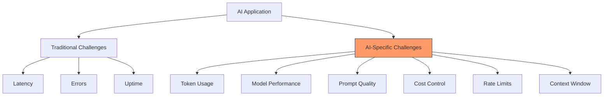
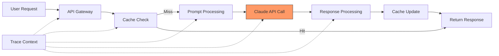
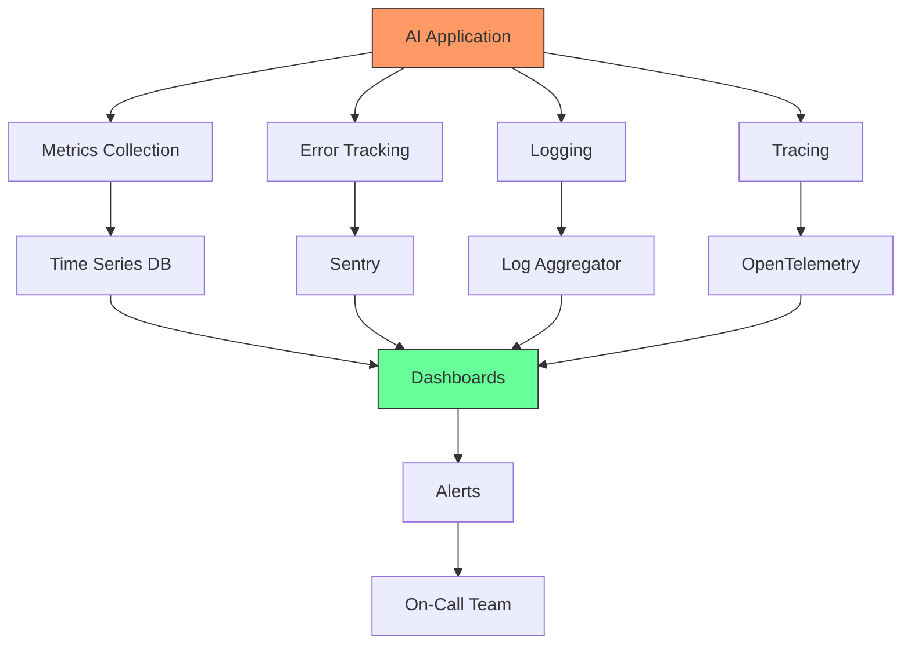

# Monitoring & Observability

Building reliable AI applications requires comprehensive monitoring and observability. Unlike traditional applications, AI systems have unique challenges: non-deterministic outputs, token-based costs, model performance variations, and complex failure modes. This lesson teaches you to monitor, debug, and optimize production AI applications effectively.

## Learning Objectives

By the end of this lesson, you'll understand:
- Why monitoring matters for AI applications and what makes them unique
- Key metrics to track: latency, token usage, error rates, and costs
- How to implement error tracking with Sentry
- Logging best practices for AI applications
- Performance monitoring and distributed tracing
- Building custom dashboards for AI metrics
- Alerting strategies for proactive incident response
- OpenTelemetry integration for comprehensive observability

## Why AI Applications Need Special Monitoring

Traditional application monitoring isn't enough for AI systems. Here's why:

```typescript
// Traditional app: Deterministic
function calculateTotal(items: number[]): number {
  return items.reduce((sum, item) => sum + item, 0)
  // Same input → Same output (always)
}

// AI app: Non-deterministic
async function generateSummary(text: string): Promise<string> {
  const response = await claude.messages.create({
    model: 'claude-3-5-sonnet-20250129',
    max_tokens: 200,
    messages: [{ role: 'user', content: `Summarize: ${text}` }],
  })
  // Same input → Different outputs (temperature > 0)
  // Variable latency, token usage, costs
  // Potential rate limits, API errors
  return response.content[0].text
}
```

### Unique AI Monitoring Challenges



## Key Metrics for AI Applications

### 1. Latency Metrics

Track how long AI operations take, broken down by component.

```typescript
interface LatencyMetrics {
  // End-to-end latency
  totalMs: number

  // Component breakdown
  preProcessingMs: number
  apiCallMs: number
  postProcessingMs: number

  // Percentiles
  p50: number
  p95: number
  p99: number
}

class LatencyTracker {
  private measurements: number[] = []

  startTimer(): () => number {
    const startTime = Date.now()
    return () => Date.now() - startTime
  }

  record(latencyMs: number): void {
    this.measurements.push(latencyMs)

    // Keep only recent measurements (last 1000)
    if (this.measurements.length > 1000) {
      this.measurements.shift()
    }
  }

  getPercentile(p: number): number {
    if (this.measurements.length === 0) return 0

    const sorted = [...this.measurements].sort((a, b) => a - b)
    const index = Math.ceil((p / 100) * sorted.length) - 1
    return sorted[Math.max(0, index)]
  }

  getStats(): LatencyMetrics {
    return {
      totalMs: this.getAverage(),
      preProcessingMs: 0, // Implement based on your tracking
      apiCallMs: 0,
      postProcessingMs: 0,
      p50: this.getPercentile(50),
      p95: this.getPercentile(95),
      p99: this.getPercentile(99),
    }
  }

  private getAverage(): number {
    if (this.measurements.length === 0) return 0
    return this.measurements.reduce((a, b) => a + b, 0) / this.measurements.length
  }
}

// Usage
const latencyTracker = new LatencyTracker()

async function monitoredAICall(prompt: string): Promise<string> {
  const timer = latencyTracker.startTimer()

  try {
    const response = await claude.messages.create({
      model: 'claude-3-5-sonnet-20250129',
      max_tokens: 1024,
      messages: [{ role: 'user', content: prompt }],
    })

    const latencyMs = timer()
    latencyTracker.record(latencyMs)

    console.log(`Latency: ${latencyMs}ms`)
    return response.content[0].text
  } catch (error) {
    const latencyMs = timer()
    latencyTracker.record(latencyMs)
    throw error
  }
}

// Get statistics
const stats = latencyTracker.getStats()
console.log(`P95 latency: ${stats.p95}ms`)
console.log(`P99 latency: ${stats.p99}ms`)
```

### 2. Token Usage Metrics

Monitor token consumption to track costs and optimize prompts.

```typescript
interface TokenMetrics {
  inputTokens: number
  outputTokens: number
  totalTokens: number
  cost: number
  model: string
  timestamp: number
}

class TokenUsageTracker {
  private usageHistory: TokenMetrics[] = []

  private readonly PRICING = {
    'claude-3-5-sonnet-20250129': {
      input: 3.00 / 1_000_000,
      output: 15.00 / 1_000_000,
    },
    'claude-3-5-haiku-20250129': {
      input: 0.25 / 1_000_000,
      output: 1.25 / 1_000_000,
    },
  }

  recordUsage(
    model: string,
    inputTokens: number,
    outputTokens: number
  ): TokenMetrics {
    const pricing = this.PRICING[model as keyof typeof this.PRICING]
    if (!pricing) {
      throw new Error(`Unknown model: ${model}`)
    }

    const cost =
      (inputTokens * pricing.input) +
      (outputTokens * pricing.output)

    const metrics: TokenMetrics = {
      inputTokens,
      outputTokens,
      totalTokens: inputTokens + outputTokens,
      cost,
      model,
      timestamp: Date.now(),
    }

    this.usageHistory.push(metrics)
    return metrics
  }

  getAggregateStats(periodMs: number = 3600000): {
    totalCost: number
    totalTokens: number
    avgTokensPerRequest: number
    requestCount: number
  } {
    const cutoff = Date.now() - periodMs
    const recent = this.usageHistory.filter(m => m.timestamp > cutoff)

    const totalCost = recent.reduce((sum, m) => sum + m.cost, 0)
    const totalTokens = recent.reduce((sum, m) => sum + m.totalTokens, 0)
    const requestCount = recent.length
    const avgTokensPerRequest = requestCount > 0 ? totalTokens / requestCount : 0

    return {
      totalCost,
      totalTokens,
      avgTokensPerRequest,
      requestCount,
    }
  }

  getTopExpensiveRequests(limit: number = 10): TokenMetrics[] {
    return [...this.usageHistory]
      .sort((a, b) => b.cost - a.cost)
      .slice(0, limit)
  }
}

// Usage with Claude
import Anthropic from '@anthropic-ai/sdk'

const tokenTracker = new TokenUsageTracker()
const claude = new Anthropic({ apiKey: process.env.ANTHROPIC_API_KEY! })

async function trackedGeneration(prompt: string): Promise<string> {
  const response = await claude.messages.create({
    model: 'claude-3-5-sonnet-20250129',
    max_tokens: 1024,
    messages: [{ role: 'user', content: prompt }],
  })

  const metrics = tokenTracker.recordUsage(
    'claude-3-5-sonnet-20250129',
    response.usage.input_tokens,
    response.usage.output_tokens
  )

  console.log(`Cost: $${metrics.cost.toFixed(4)}`)
  console.log(`Tokens: ${metrics.totalTokens}`)

  return response.content[0].text
}

// Get hourly statistics
const hourlyStats = tokenTracker.getAggregateStats(3600000)
console.log(`Hourly cost: $${hourlyStats.totalCost.toFixed(2)}`)
console.log(`Requests: ${hourlyStats.requestCount}`)
```

### 3. Error Rate Metrics

Track different types of errors and their patterns.

```typescript
interface ErrorMetrics {
  type: 'rate_limit' | 'api_error' | 'timeout' | 'validation' | 'unknown'
  message: string
  timestamp: number
  model?: string
  retryCount?: number
}

class ErrorTracker {
  private errors: ErrorMetrics[] = []
  private errorCounts: Map<string, number> = new Map()

  recordError(error: Error, context?: {
    model?: string
    retryCount?: number
  }): void {
    const errorType = this.classifyError(error)

    const metrics: ErrorMetrics = {
      type: errorType,
      message: error.message,
      timestamp: Date.now(),
      model: context?.model,
      retryCount: context?.retryCount,
    }

    this.errors.push(metrics)

    // Increment error count
    const count = this.errorCounts.get(errorType) || 0
    this.errorCounts.set(errorType, count + 1)

    // Log critical errors immediately
    if (errorType === 'rate_limit') {
      console.error('RATE LIMIT HIT:', error.message)
    }
  }

  private classifyError(error: Error): ErrorMetrics['type'] {
    const message = error.message.toLowerCase()

    if (message.includes('rate limit') || message.includes('429')) {
      return 'rate_limit'
    }
    if (message.includes('timeout')) {
      return 'timeout'
    }
    if (message.includes('validation') || message.includes('invalid')) {
      return 'validation'
    }
    if (message.includes('api') || message.includes('500') || message.includes('503')) {
      return 'api_error'
    }

    return 'unknown'
  }

  getErrorRate(periodMs: number = 3600000): {
    totalErrors: number
    errorRate: number
    byType: Record<string, number>
  } {
    const cutoff = Date.now() - periodMs
    const recent = this.errors.filter(e => e.timestamp > cutoff)

    const byType: Record<string, number> = {}
    recent.forEach(error => {
      byType[error.type] = (byType[error.type] || 0) + 1
    })

    return {
      totalErrors: recent.length,
      errorRate: recent.length / (periodMs / 1000), // errors per second
      byType,
    }
  }

  shouldAlert(): boolean {
    const stats = this.getErrorRate(300000) // Last 5 minutes

    // Alert if error rate > 1 error per second
    if (stats.errorRate > 1) return true

    // Alert if rate limits hit
    if (stats.byType.rate_limit > 0) return true

    return false
  }
}

// Usage
const errorTracker = new ErrorTracker()

async function resilientAICall(prompt: string, maxRetries = 3): Promise<string> {
  let lastError: Error | null = null

  for (let attempt = 0; attempt < maxRetries; attempt++) {
    try {
      const response = await claude.messages.create({
        model: 'claude-3-5-sonnet-20250129',
        max_tokens: 1024,
        messages: [{ role: 'user', content: prompt }],
      })

      return response.content[0].text
    } catch (error) {
      lastError = error as Error

      errorTracker.recordError(lastError, {
        model: 'claude-3-5-sonnet-20250129',
        retryCount: attempt,
      })

      // Exponential backoff
      await new Promise(resolve =>
        setTimeout(resolve, Math.pow(2, attempt) * 1000)
      )
    }
  }

  throw lastError
}

// Check if alerts needed
if (errorTracker.shouldAlert()) {
  console.error('HIGH ERROR RATE DETECTED!')
  // Send alert to monitoring system
}
```

## Setting Up Sentry for Error Tracking

Sentry provides powerful error tracking, performance monitoring, and alerting for production applications.

### Installation and Setup

```bash
# Install Sentry SDK
npm install @sentry/node @sentry/integrations
```

```typescript
import * as Sentry from '@sentry/node'
import { ProfilingIntegration } from '@sentry/profiling-node'

// Initialize Sentry
Sentry.init({
  dsn: process.env.SENTRY_DSN,
  environment: process.env.NODE_ENV || 'development',

  // Set sample rate
  tracesSampleRate: 1.0, // 100% in dev, lower in production

  // Performance monitoring
  integrations: [
    new ProfilingIntegration(),
  ],

  // Release tracking
  release: process.env.VERCEL_GIT_COMMIT_SHA,

  // Before send hook for filtering
  beforeSend(event, hint) {
    // Don't send API key errors
    if (event.exception?.values?.[0]?.value?.includes('API_KEY')) {
      return null
    }
    return event
  },
})
```

### Tracking AI-Specific Errors

```typescript
interface AIErrorContext {
  model: string
  prompt: string
  maxTokens: number
  temperature?: number
  inputTokens?: number
  outputTokens?: number
  cost?: number
}

class SentryAIMonitor {
  static captureAIError(
    error: Error,
    context: AIErrorContext
  ): void {
    Sentry.withScope(scope => {
      // Add AI-specific context
      scope.setContext('ai_request', {
        model: context.model,
        maxTokens: context.maxTokens,
        temperature: context.temperature,
        promptLength: context.prompt.length,
      })

      // Add usage metrics if available
      if (context.inputTokens && context.outputTokens) {
        scope.setContext('ai_usage', {
          inputTokens: context.inputTokens,
          outputTokens: context.outputTokens,
          cost: context.cost,
        })
      }

      // Add tags for filtering
      scope.setTag('ai_model', context.model)
      scope.setTag('error_type', this.classifyError(error))

      // Set level based on error type
      if (error.message.includes('rate limit')) {
        scope.setLevel('warning')
      } else {
        scope.setLevel('error')
      }

      // Capture the error
      Sentry.captureException(error)
    })
  }

  private static classifyError(error: Error): string {
    const message = error.message.toLowerCase()

    if (message.includes('rate limit')) return 'rate_limit'
    if (message.includes('timeout')) return 'timeout'
    if (message.includes('authentication')) return 'auth'
    if (message.includes('validation')) return 'validation'

    return 'unknown'
  }

  static startTransaction(name: string): Sentry.Transaction {
    return Sentry.startTransaction({
      op: 'ai.generation',
      name,
    })
  }
}

// Usage in API routes
async function monitoredAIGeneration(prompt: string): Promise<string> {
  const transaction = SentryAIMonitor.startTransaction('generate_summary')

  try {
    const span = transaction.startChild({
      op: 'ai.api_call',
      description: 'Claude API call',
    })

    const response = await claude.messages.create({
      model: 'claude-3-5-sonnet-20250129',
      max_tokens: 1024,
      messages: [{ role: 'user', content: prompt }],
    })

    span.finish()
    transaction.finish()

    return response.content[0].text
  } catch (error) {
    SentryAIMonitor.captureAIError(error as Error, {
      model: 'claude-3-5-sonnet-20250129',
      prompt,
      maxTokens: 1024,
    })

    transaction.setStatus('internal_error')
    transaction.finish()

    throw error
  }
}
```

### Custom Sentry Breadcrumbs for AI Workflows

```typescript
class AIBreadcrumbs {
  static addPromptBreadcrumb(prompt: string): void {
    Sentry.addBreadcrumb({
      category: 'ai.prompt',
      message: 'Prompt sent to AI',
      level: 'info',
      data: {
        promptLength: prompt.length,
        promptPreview: prompt.slice(0, 100) + '...',
      },
    })
  }

  static addResponseBreadcrumb(
    response: string,
    tokenUsage: { input: number; output: number }
  ): void {
    Sentry.addBreadcrumb({
      category: 'ai.response',
      message: 'Received AI response',
      level: 'info',
      data: {
        responseLength: response.length,
        inputTokens: tokenUsage.input,
        outputTokens: tokenUsage.output,
      },
    })
  }

  static addCacheBreadcrumb(hit: boolean, key: string): void {
    Sentry.addBreadcrumb({
      category: 'ai.cache',
      message: hit ? 'Cache hit' : 'Cache miss',
      level: 'debug',
      data: { cacheKey: key },
    })
  }
}

// Usage in AI workflow
async function trackedAIWorkflow(userInput: string): Promise<string> {
  AIBreadcrumbs.addPromptBreadcrumb(userInput)

  // Check cache
  const cacheKey = generateCacheKey(userInput)
  const cached = await cache.get(cacheKey)

  if (cached) {
    AIBreadcrumbs.addCacheBreadcrumb(true, cacheKey)
    return cached
  }

  AIBreadcrumbs.addCacheBreadcrumb(false, cacheKey)

  // Make API call
  const response = await claude.messages.create({
    model: 'claude-3-5-sonnet-20250129',
    max_tokens: 1024,
    messages: [{ role: 'user', content: userInput }],
  })

  AIBreadcrumbs.addResponseBreadcrumb(
    response.content[0].text,
    {
      input: response.usage.input_tokens,
      output: response.usage.output_tokens,
    }
  )

  return response.content[0].text
}
```

## Logging Best Practices for AI Applications

### Structured Logging

Use structured logging for better querying and analysis.

```typescript
import pino from 'pino'

// Create logger with AI-specific configuration
const logger = pino({
  level: process.env.LOG_LEVEL || 'info',

  // Production: JSON format
  // Development: Pretty print
  transport: process.env.NODE_ENV === 'development'
    ? {
        target: 'pino-pretty',
        options: {
          colorize: true,
          translateTime: 'SYS:standard',
        },
      }
    : undefined,
})

interface AILogContext {
  model: string
  operation: string
  userId?: string
  sessionId?: string
}

class AILogger {
  private logger = logger

  logAIRequest(context: AILogContext, details: {
    prompt: string
    maxTokens: number
    temperature?: number
  }): void {
    this.logger.info({
      type: 'ai_request',
      ...context,
      promptLength: details.prompt.length,
      maxTokens: details.maxTokens,
      temperature: details.temperature,
    }, 'AI request initiated')
  }

  logAIResponse(context: AILogContext, details: {
    inputTokens: number
    outputTokens: number
    latencyMs: number
    cost: number
  }): void {
    this.logger.info({
      type: 'ai_response',
      ...context,
      ...details,
    }, 'AI response received')
  }

  logAIError(context: AILogContext, error: Error, details?: {
    retryCount?: number
    willRetry?: boolean
  }): void {
    this.logger.error({
      type: 'ai_error',
      ...context,
      error: {
        message: error.message,
        name: error.name,
        stack: error.stack,
      },
      ...details,
    }, 'AI operation failed')
  }

  logCacheEvent(hit: boolean, key: string, metadata?: {
    ttl?: number
    size?: number
  }): void {
    this.logger.debug({
      type: 'cache_event',
      hit,
      cacheKey: key,
      ...metadata,
    }, hit ? 'Cache hit' : 'Cache miss')
  }

  logCostAlert(level: 'warning' | 'critical', details: {
    currentCost: number
    threshold: number
    period: string
  }): void {
    this.logger.warn({
      type: 'cost_alert',
      level,
      ...details,
    }, `Cost ${level}: ${details.period} spending exceeded threshold`)
  }
}

// Usage
const aiLogger = new AILogger()

async function loggedAIGeneration(prompt: string): Promise<string> {
  const context: AILogContext = {
    model: 'claude-3-5-sonnet-20250129',
    operation: 'text_generation',
    sessionId: generateSessionId(),
  }

  // Log request
  aiLogger.logAIRequest(context, {
    prompt,
    maxTokens: 1024,
    temperature: 1,
  })

  const startTime = Date.now()

  try {
    const response = await claude.messages.create({
      model: 'claude-3-5-sonnet-20250129',
      max_tokens: 1024,
      messages: [{ role: 'user', content: prompt }],
    })

    const latencyMs = Date.now() - startTime
    const cost = calculateCost(response.usage)

    // Log response
    aiLogger.logAIResponse(context, {
      inputTokens: response.usage.input_tokens,
      outputTokens: response.usage.output_tokens,
      latencyMs,
      cost,
    })

    return response.content[0].text
  } catch (error) {
    aiLogger.logAIError(context, error as Error)
    throw error
  }
}

function calculateCost(usage: { input_tokens: number; output_tokens: number }): number {
  return (usage.input_tokens * 3.00 + usage.output_tokens * 15.00) / 1_000_000
}

function generateSessionId(): string {
  return `session_${Date.now()}_${Math.random().toString(36).slice(2)}`
}
```

### Log Aggregation and Analysis

```typescript
// Query logs for insights
class LogAnalyzer {
  async getSlowRequests(thresholdMs: number = 5000): Promise<any[]> {
    // Query logs where latencyMs > threshold
    // Implementation depends on log aggregation service (e.g., Datadog, LogDNA)
    return []
  }

  async getExpensiveRequests(thresholdCost: number = 0.01): Promise<any[]> {
    // Query logs where cost > threshold
    return []
  }

  async getErrorPatterns(timeRangeHours: number = 24): Promise<{
    errorType: string
    count: number
    percentage: number
  }[]> {
    // Aggregate errors by type
    return []
  }
}
```

## Performance Monitoring and Tracing

### Distributed Tracing Architecture



### Performance Tracking

```typescript
interface PerformanceMetrics {
  operationName: string
  startTime: number
  endTime: number
  duration: number
  success: boolean
  metadata?: Record<string, any>
}

class PerformanceMonitor {
  private metrics: PerformanceMetrics[] = []

  async track<T>(
    operationName: string,
    operation: () => Promise<T>,
    metadata?: Record<string, any>
  ): Promise<T> {
    const startTime = Date.now()
    let success = true

    try {
      const result = await operation()
      return result
    } catch (error) {
      success = false
      throw error
    } finally {
      const endTime = Date.now()

      this.metrics.push({
        operationName,
        startTime,
        endTime,
        duration: endTime - startTime,
        success,
        metadata,
      })
    }
  }

  getStats(operationName: string): {
    count: number
    avgDuration: number
    p95Duration: number
    successRate: number
  } {
    const operations = this.metrics.filter(m => m.operationName === operationName)

    if (operations.length === 0) {
      return { count: 0, avgDuration: 0, p95Duration: 0, successRate: 0 }
    }

    const durations = operations.map(o => o.duration).sort((a, b) => a - b)
    const successes = operations.filter(o => o.success).length

    return {
      count: operations.length,
      avgDuration: durations.reduce((a, b) => a + b, 0) / durations.length,
      p95Duration: durations[Math.floor(durations.length * 0.95)],
      successRate: successes / operations.length,
    }
  }
}

// Usage
const perfMonitor = new PerformanceMonitor()

async function performanceTrackedAI(prompt: string): Promise<string> {
  // Track cache check
  const cached = await perfMonitor.track(
    'cache_check',
    async () => cache.get(generateCacheKey(prompt))
  )

  if (cached) {
    return cached
  }

  // Track API call
  const response = await perfMonitor.track(
    'claude_api_call',
    async () => claude.messages.create({
      model: 'claude-3-5-sonnet-20250129',
      max_tokens: 1024,
      messages: [{ role: 'user', content: prompt }],
    }),
    { model: 'claude-3-5-sonnet-20250129' }
  )

  // Track cache update
  await perfMonitor.track(
    'cache_update',
    async () => cache.set(generateCacheKey(prompt), response.content[0].text)
  )

  return response.content[0].text
}

// Get performance statistics
const apiStats = perfMonitor.getStats('claude_api_call')
console.log(`API calls: ${apiStats.count}`)
console.log(`Avg duration: ${apiStats.avgDuration}ms`)
console.log(`P95 duration: ${apiStats.p95Duration}ms`)
console.log(`Success rate: ${(apiStats.successRate * 100).toFixed(1)}%`)
```

## OpenTelemetry Integration

OpenTelemetry provides vendor-neutral observability instrumentation.

### Setup

```bash
npm install @opentelemetry/api @opentelemetry/sdk-node @opentelemetry/auto-instrumentations-node
```

```typescript
import { NodeSDK } from '@opentelemetry/sdk-node'
import { getNodeAutoInstrumentations } from '@opentelemetry/auto-instrumentations-node'
import { Resource } from '@opentelemetry/resources'
import { SemanticResourceAttributes } from '@opentelemetry/semantic-conventions'

// Initialize OpenTelemetry
const sdk = new NodeSDK({
  resource: new Resource({
    [SemanticResourceAttributes.SERVICE_NAME]: 'ai-application',
    [SemanticResourceAttributes.SERVICE_VERSION]: '1.0.0',
  }),
  instrumentations: [
    getNodeAutoInstrumentations({
      '@opentelemetry/instrumentation-fs': {
        enabled: false,
      },
    }),
  ],
})

sdk.start()

// Graceful shutdown
process.on('SIGTERM', () => {
  sdk.shutdown()
    .then(() => console.log('OpenTelemetry shut down'))
    .catch(error => console.error('Error shutting down OpenTelemetry', error))
})
```

### Custom Spans for AI Operations

```typescript
import { trace, context, SpanStatusCode } from '@opentelemetry/api'

const tracer = trace.getTracer('ai-operations', '1.0.0')

async function tracedAIOperation(prompt: string): Promise<string> {
  return tracer.startActiveSpan('ai.generation', async span => {
    try {
      // Add attributes
      span.setAttribute('ai.model', 'claude-3-5-sonnet-20250129')
      span.setAttribute('ai.prompt.length', prompt.length)
      span.setAttribute('ai.max_tokens', 1024)

      // Create child span for API call
      const response = await tracer.startActiveSpan('ai.api_call', async apiSpan => {
        try {
          const result = await claude.messages.create({
            model: 'claude-3-5-sonnet-20250129',
            max_tokens: 1024,
            messages: [{ role: 'user', content: prompt }],
          })

          // Add API response attributes
          apiSpan.setAttribute('ai.usage.input_tokens', result.usage.input_tokens)
          apiSpan.setAttribute('ai.usage.output_tokens', result.usage.output_tokens)

          return result
        } finally {
          apiSpan.end()
        }
      })

      // Mark success
      span.setStatus({ code: SpanStatusCode.OK })

      return response.content[0].text
    } catch (error) {
      // Record error
      span.recordException(error as Error)
      span.setStatus({
        code: SpanStatusCode.ERROR,
        message: (error as Error).message,
      })

      throw error
    } finally {
      span.end()
    }
  })
}
```

## Building Custom Dashboards

### Metrics Collection

```typescript
interface DashboardMetrics {
  timestamp: number

  // Performance
  avgLatencyMs: number
  p95LatencyMs: number
  requestsPerMinute: number

  // Usage
  totalTokens: number
  totalCost: number

  // Health
  errorRate: number
  successRate: number
  cacheHitRate: number
}

class MetricsCollector {
  private metrics: DashboardMetrics[] = []
  private window = 60000 // 1 minute window

  async collect(): Promise<DashboardMetrics> {
    const metrics: DashboardMetrics = {
      timestamp: Date.now(),
      avgLatencyMs: latencyTracker.getStats().totalMs,
      p95LatencyMs: latencyTracker.getStats().p95,
      requestsPerMinute: this.calculateRPM(),
      totalTokens: tokenTracker.getAggregateStats(this.window).totalTokens,
      totalCost: tokenTracker.getAggregateStats(this.window).totalCost,
      errorRate: errorTracker.getErrorRate(this.window).errorRate,
      successRate: this.calculateSuccessRate(),
      cacheHitRate: await this.getCacheHitRate(),
    }

    this.metrics.push(metrics)

    // Keep last hour of data
    const cutoff = Date.now() - 3600000
    this.metrics = this.metrics.filter(m => m.timestamp > cutoff)

    return metrics
  }

  private calculateRPM(): number {
    // Implementation
    return 0
  }

  private calculateSuccessRate(): number {
    const stats = errorTracker.getErrorRate(this.window)
    const totalRequests = stats.totalErrors + 100 // Assume 100 successful
    return totalRequests > 0 ? (100 / totalRequests) : 1
  }

  private async getCacheHitRate(): Promise<number> {
    // Get from cache stats
    return 0.75 // 75% cache hit rate
  }

  getMetrics(periodMs: number = 3600000): DashboardMetrics[] {
    const cutoff = Date.now() - periodMs
    return this.metrics.filter(m => m.timestamp > cutoff)
  }
}

// Export metrics for visualization
const metricsCollector = new MetricsCollector()

// Collect metrics every minute
setInterval(async () => {
  const metrics = await metricsCollector.collect()

  // Send to monitoring service (Datadog, Grafana, etc.)
  console.log('Metrics:', JSON.stringify(metrics, null, 2))
}, 60000)
```

### Dashboard API Endpoint

```typescript
import { NextApiRequest, NextApiResponse } from 'next'

export default async function handler(
  req: NextApiRequest,
  res: NextApiResponse
) {
  if (req.method !== 'GET') {
    return res.status(405).json({ error: 'Method not allowed' })
  }

  const periodMs = parseInt(req.query.period as string) || 3600000

  const metrics = metricsCollector.getMetrics(periodMs)

  // Calculate aggregates
  const avgLatency = metrics.reduce((sum, m) => sum + m.avgLatencyMs, 0) / metrics.length
  const totalCost = metrics.reduce((sum, m) => sum + m.totalCost, 0)
  const avgCacheHitRate = metrics.reduce((sum, m) => sum + m.cacheHitRate, 0) / metrics.length

  res.status(200).json({
    period: periodMs,
    dataPoints: metrics.length,
    aggregates: {
      avgLatency,
      totalCost,
      avgCacheHitRate,
    },
    timeSeries: metrics,
  })
}
```

## Alerting Strategies

### Multi-Level Alerting

```typescript
interface Alert {
  level: 'info' | 'warning' | 'critical'
  category: 'cost' | 'performance' | 'errors' | 'availability'
  message: string
  timestamp: number
  metadata?: Record<string, any>
}

class AlertManager {
  private alerts: Alert[] = []
  private alertChannels: Map<string, (alert: Alert) => Promise<void>> = new Map()

  registerChannel(name: string, handler: (alert: Alert) => Promise<void>): void {
    this.alertChannels.set(name, handler)
  }

  async sendAlert(alert: Alert): Promise<void> {
    this.alerts.push(alert)

    // Send to all registered channels
    for (const [name, handler] of this.alertChannels) {
      try {
        await handler(alert)
      } catch (error) {
        console.error(`Failed to send alert via ${name}:`, error)
      }
    }
  }

  // Pre-configured alert conditions
  async checkCostThresholds(currentCost: number, thresholds: {
    warning: number
    critical: number
  }): Promise<void> {
    if (currentCost >= thresholds.critical) {
      await this.sendAlert({
        level: 'critical',
        category: 'cost',
        message: `Cost exceeded critical threshold: $${currentCost}`,
        timestamp: Date.now(),
        metadata: { currentCost, threshold: thresholds.critical },
      })
    } else if (currentCost >= thresholds.warning) {
      await this.sendAlert({
        level: 'warning',
        category: 'cost',
        message: `Cost exceeded warning threshold: $${currentCost}`,
        timestamp: Date.now(),
        metadata: { currentCost, threshold: thresholds.warning },
      })
    }
  }

  async checkLatencyThresholds(p95Latency: number, thresholds: {
    warning: number
    critical: number
  }): Promise<void> {
    if (p95Latency >= thresholds.critical) {
      await this.sendAlert({
        level: 'critical',
        category: 'performance',
        message: `P95 latency exceeded critical threshold: ${p95Latency}ms`,
        timestamp: Date.now(),
        metadata: { p95Latency, threshold: thresholds.critical },
      })
    } else if (p95Latency >= thresholds.warning) {
      await this.sendAlert({
        level: 'warning',
        category: 'performance',
        message: `P95 latency exceeded warning threshold: ${p95Latency}ms`,
        timestamp: Date.now(),
        metadata: { p95Latency, threshold: thresholds.warning },
      })
    }
  }

  async checkErrorRate(errorRate: number, threshold: number): Promise<void> {
    if (errorRate > threshold) {
      await this.sendAlert({
        level: 'critical',
        category: 'errors',
        message: `Error rate too high: ${errorRate.toFixed(2)} errors/sec`,
        timestamp: Date.now(),
        metadata: { errorRate, threshold },
      })
    }
  }
}

// Setup alert channels
const alertManager = new AlertManager()

// Console logging (development)
alertManager.registerChannel('console', async (alert) => {
  const emoji = alert.level === 'critical' ? '🚨' : alert.level === 'warning' ? '⚠️' : 'ℹ️'
  console.log(`${emoji} [${alert.level.toUpperCase()}] ${alert.message}`)
})

// Slack webhook (production)
alertManager.registerChannel('slack', async (alert) => {
  if (process.env.SLACK_WEBHOOK_URL) {
    await fetch(process.env.SLACK_WEBHOOK_URL, {
      method: 'POST',
      headers: { 'Content-Type': 'application/json' },
      body: JSON.stringify({
        text: `${alert.level.toUpperCase()}: ${alert.message}`,
        attachments: [{
          color: alert.level === 'critical' ? 'danger' : 'warning',
          fields: Object.entries(alert.metadata || {}).map(([key, value]) => ({
            title: key,
            value: String(value),
            short: true,
          })),
        }],
      }),
    })
  }
})

// Email (critical only)
alertManager.registerChannel('email', async (alert) => {
  if (alert.level === 'critical' && process.env.ALERT_EMAIL) {
    // Send email via service (SendGrid, Mailgun, etc.)
  }
})

// Monitor and alert
setInterval(async () => {
  const hourlyStats = tokenTracker.getAggregateStats(3600000)
  await alertManager.checkCostThresholds(hourlyStats.totalCost, {
    warning: 10,
    critical: 25,
  })

  const latencyStats = latencyTracker.getStats()
  await alertManager.checkLatencyThresholds(latencyStats.p95, {
    warning: 5000,
    critical: 10000,
  })

  const errorStats = errorTracker.getErrorRate(300000)
  await alertManager.checkErrorRate(errorStats.errorRate, 1.0)
}, 60000) // Check every minute
```

## Summary and Key Takeaways

### Monitoring Architecture



### Essential Metrics Checklist

```typescript
// ✅ Track these metrics for every AI application
const essentialMetrics = {
  // Performance
  latency: {
    p50: 'Median response time',
    p95: '95th percentile',
    p99: '99th percentile',
  },

  // Usage
  tokens: {
    input: 'Input tokens per request',
    output: 'Output tokens per request',
    total: 'Total tokens',
  },

  // Cost
  cost: {
    perRequest: 'Cost per API call',
    hourly: 'Hourly spending',
    daily: 'Daily spending',
  },

  // Reliability
  errors: {
    rate: 'Errors per second',
    byType: 'Error breakdown',
    retries: 'Retry attempts',
  },

  // Efficiency
  cache: {
    hitRate: 'Cache hit percentage',
    size: 'Cache entries',
  },
}
```

### Best Practices

1. **Monitor proactively** - Set up alerts before issues occur
2. **Track AI-specific metrics** - Tokens, costs, model performance
3. **Use structured logging** - JSON logs for easy querying
4. **Implement distributed tracing** - Understand request flows
5. **Build dashboards** - Visualize trends and patterns
6. **Alert intelligently** - Multi-level alerts based on severity
7. **Review regularly** - Weekly metric reviews to spot trends

### Next Steps

With monitoring in place, you'll learn:
1. **Error Handling & Fallbacks** - Build resilient systems
2. **Rate Limiting & Throttling** - Control API usage
3. **Testing AI Applications** - Ensure quality and reliability

Remember: **You can't optimize what you don't measure**. Comprehensive observability is essential for production AI applications.

## Practice Exercises

1. **Metrics Dashboard**: Build a real-time dashboard showing latency, token usage, and costs

2. **Alert System**: Implement multi-level alerting for cost, performance, and errors

3. **Error Analysis**: Create a tool that categorizes and reports error patterns

4. **Performance Profiler**: Build a system that identifies slow operations in AI workflows

5. **Cost Attribution**: Track costs by user, feature, or endpoint to identify optimization opportunities

Start with basic metrics, then gradually add more sophisticated monitoring as your application grows.
