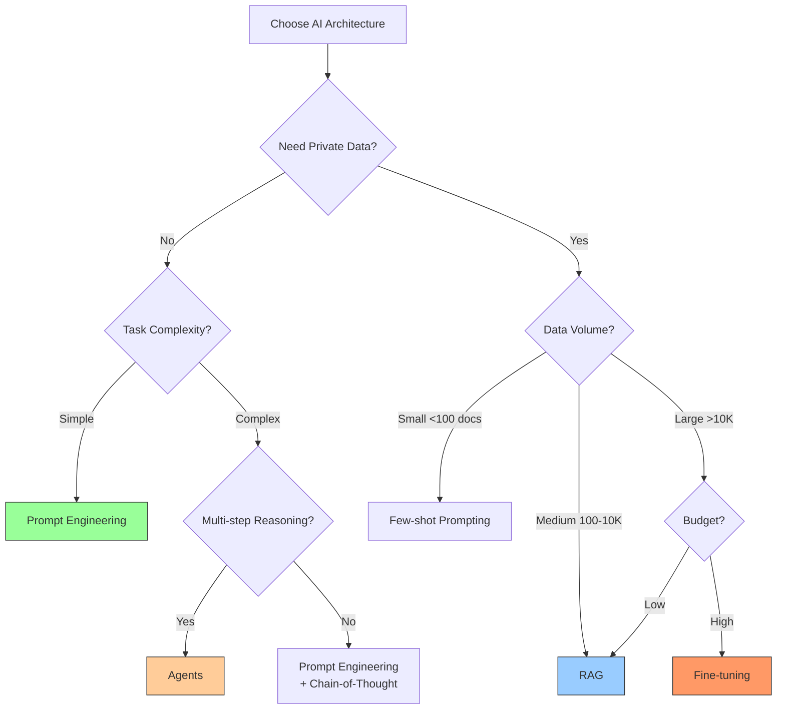

# Architecture Tradeoffs & Decision Framework

Building production AI applications requires choosing the right architecture for your specific needs. This lesson provides a comprehensive framework for comparing prompt engineering, RAG (Retrieval-Augmented Generation), fine-tuning, and agents. You'll learn to evaluate tradeoffs across cost, latency, accuracy, and complexity, make data-driven architecture decisions, and design hybrid approaches that combine multiple patterns.

## Learning Objectives

By the end of this lesson, you'll understand:
- The three core AI architectures: prompting, RAG, fine-tuning, and agents
- When to use each approach and why
- How to compare architectures across multiple dimensions
- Cost, latency, and accuracy tradeoffs
- Hybrid architectures that combine multiple patterns
- Decision frameworks for choosing the right approach
- Real-world case studies with quantitative comparisons
- Migration paths between architectures

## The Three Core Patterns

### Pattern 1: Prompt Engineering

Pure prompting with no external data or tools.

```typescript
import Anthropic from '@anthropic-ai/sdk'

class PromptBasedSystem {
  private claude: Anthropic

  constructor(apiKey: string) {
    this.claude = new Anthropic({ apiKey })
  }

  async classify(text: string, categories: string[]): Promise<string> {
    const response = await this.claude.messages.create({
      model: 'claude-3-5-sonnet-20250129',
      max_tokens: 50,
      messages: [
        {
          role: 'user',
          content: `Classify this text into one of these categories: ${categories.join(', ')}

Text: "${text}"

Respond with just the category name.`,
        },
      ],
    })

    return response.content[0].text.trim()
  }
}

// Strengths:
// ✅ Fastest to implement (hours)
// ✅ Lowest latency (~1-2s)
// ✅ No infrastructure needed
// ✅ Easy to iterate and update

// Weaknesses:
// ❌ Limited by context window
// ❌ No access to private data
// ❌ Can't learn from examples
// ❌ Higher token costs for complex tasks
```

### Pattern 2: RAG (Retrieval-Augmented Generation)

Retrieve relevant context before generation.

```typescript
interface Document {
  id: string
  content: string
  embedding: number[]
  metadata: Record<string, any>
}

class RAGSystem {
  private claude: Anthropic
  private documents: Document[] = []

  constructor(apiKey: string) {
    this.claude = new Anthropic({ apiKey })
  }

  async indexDocument(doc: { id: string; content: string; metadata?: any }): Promise<void> {
    // Generate embedding (simplified - use actual embedding API)
    const embedding = await this.generateEmbedding(doc.content)

    this.documents.push({
      id: doc.id,
      content: doc.content,
      embedding,
      metadata: doc.metadata || {},
    })
  }

  async query(question: string, topK = 3): Promise<string> {
    // 1. Retrieve relevant documents
    const queryEmbedding = await this.generateEmbedding(question)
    const relevant = this.retrieveTopK(queryEmbedding, topK)

    // 2. Build context from retrieved docs
    const context = relevant
      .map((doc, i) => `[${i + 1}] ${doc.content}`)
      .join('\n\n')

    // 3. Generate answer with context
    const response = await this.claude.messages.create({
      model: 'claude-3-5-sonnet-20250129',
      max_tokens: 1024,
      messages: [
        {
          role: 'user',
          content: `Answer this question using the provided context.

Context:
${context}

Question: ${question}

Answer based on the context above.`,
        },
      ],
    })

    return response.content[0].text
  }

  private async generateEmbedding(text: string): Promise<number[]> {
    // Simplified - use text-embedding-3-small in production
    return new Array(384).fill(0).map(() => Math.random())
  }

  private retrieveTopK(queryEmbedding: number[], k: number): Document[] {
    // Calculate cosine similarity
    const scored = this.documents.map((doc) => ({
      doc,
      score: this.cosineSimilarity(queryEmbedding, doc.embedding),
    }))

    // Sort by score and return top K
    return scored
      .sort((a, b) => b.score - a.score)
      .slice(0, k)
      .map((s) => s.doc)
  }

  private cosineSimilarity(a: number[], b: number[]): number {
    let dotProduct = 0
    let magA = 0
    let magB = 0

    for (let i = 0; i < a.length; i++) {
      dotProduct += a[i] * b[i]
      magA += a[i] * a[i]
      magB += b[i] * b[i]
    }

    return dotProduct / (Math.sqrt(magA) * Math.sqrt(magB))
  }
}

// Strengths:
// ✅ Access to private/dynamic data
// ✅ Scales to millions of documents
// ✅ No model training required
// ✅ Easy to update knowledge base

// Weaknesses:
// ❌ Retrieval quality critical
// ❌ Higher latency (retrieval + generation)
// ❌ More infrastructure (vector DB)
// ❌ Context window limitations still apply
```

### Pattern 3: Agentic Systems

Multi-step reasoning with tool use.

```typescript
interface Tool {
  name: string
  description: string
  inputSchema: any
  execute: (input: any) => Promise<any>
}

class AgenticSystem {
  private claude: Anthropic
  private tools: Map<string, Tool>

  constructor(apiKey: string) {
    this.claude = new Anthropic({ apiKey })
    this.tools = new Map()
  }

  registerTool(tool: Tool): void {
    this.tools.set(tool.name, tool)
  }

  async execute(task: string, maxIterations = 10): Promise<{
    result: string
    iterations: number
    toolCalls: number
  }> {
    let iterations = 0
    let toolCalls = 0
    const conversationHistory: Anthropic.MessageParam[] = [
      { role: 'user', content: task },
    ]

    while (iterations < maxIterations) {
      iterations++

      const response = await this.claude.messages.create({
        model: 'claude-3-5-sonnet-20250129',
        max_tokens: 2048,
        tools: Array.from(this.tools.values()).map((t) => ({
          name: t.name,
          description: t.description,
          input_schema: t.inputSchema,
        })),
        messages: conversationHistory,
      })

      // Check if done
      if (response.stop_reason === 'end_turn') {
        const textContent = response.content.find((c) => c.type === 'text')
        return {
          result: textContent ? (textContent as any).text : '',
          iterations,
          toolCalls,
        }
      }

      // Execute tool calls
      conversationHistory.push({ role: 'assistant', content: response.content })

      const toolResults: any[] = []
      for (const content of response.content) {
        if (content.type === 'tool_use') {
          toolCalls++
          const tool = this.tools.get(content.name)
          if (tool) {
            const result = await tool.execute(content.input)
            toolResults.push({
              type: 'tool_result',
              tool_use_id: content.id,
              content: JSON.stringify(result),
            })
          }
        }
      }

      conversationHistory.push({ role: 'user', content: toolResults })
    }

    return {
      result: 'Max iterations reached',
      iterations,
      toolCalls,
    }
  }
}

// Strengths:
// ✅ Multi-step reasoning
// ✅ Access to external tools/APIs
// ✅ Handles complex workflows
// ✅ Self-correcting

// Weaknesses:
// ❌ Highest complexity
// ❌ Highest latency (multiple API calls)
// ❌ Most expensive (multiple iterations)
// ❌ Requires robust error handling
```

## Comparison Table

### Quantitative Comparison

```typescript
interface ArchitectureMetrics {
  approach: string
  developmentTime: string
  latency: string
  costPerRequest: string
  accuracy: string
  scalability: string
  complexity: number // 1-10
  maintenance: number // 1-10 (lower is better)
}

const architectureComparison: ArchitectureMetrics[] = [
  {
    approach: 'Prompt Engineering',
    developmentTime: '1-2 days',
    latency: '1-2s',
    costPerRequest: '$0.003-0.015',
    accuracy: '70-85%',
    scalability: 'Excellent',
    complexity: 2,
    maintenance: 2,
  },
  {
    approach: 'RAG',
    developmentTime: '1-2 weeks',
    latency: '2-4s',
    costPerRequest: '$0.005-0.025',
    accuracy: '80-92%',
    scalability: 'Very Good',
    complexity: 5,
    maintenance: 4,
  },
  {
    approach: 'Fine-tuning',
    developmentTime: '2-4 weeks',
    latency: '1-2s',
    costPerRequest: '$0.003-0.015',
    accuracy: '85-95%',
    scalability: 'Excellent',
    complexity: 7,
    maintenance: 6,
  },
  {
    approach: 'Agents',
    developmentTime: '2-6 weeks',
    latency: '5-15s',
    costPerRequest: '$0.020-0.100',
    accuracy: '75-90%',
    scalability: 'Good',
    complexity: 9,
    maintenance: 7,
  },
]

// Print comparison table
console.table(architectureComparison)
```

### Visual Decision Tree



## Fine-tuning Deep Dive

Fine-tuning creates a specialized model for your use case.

### When to Fine-tune

```typescript
interface FineTuningDecision {
  useCase: string
  shouldFineTune: boolean
  reasons: string[]
  estimatedROI: string
}

const fineTuningDecisions: FineTuningDecision[] = [
  {
    useCase: 'Customer support classification (50 categories)',
    shouldFineTune: true,
    reasons: [
      'High volume (10K+ requests/day)',
      'Consistent format',
      'Clear training data available',
      '30% cost reduction potential',
    ],
    estimatedROI: '+$2,000/month',
  },
  {
    useCase: 'Code generation from specs',
    shouldFineTune: false,
    reasons: [
      'Low volume (<100 requests/day)',
      'Highly varied inputs',
      'Base model already excellent',
      'Fine-tuning cost > benefits',
    ],
    estimatedROI: '-$500/month',
  },
  {
    useCase: 'Medical diagnosis assistance',
    shouldFineTune: true,
    reasons: [
      'Domain-specific terminology',
      'High accuracy requirements',
      'Consistent format (symptoms → diagnosis)',
      'Regulatory compliance needs',
    ],
    estimatedROI: '+$5,000/month',
  },
]

function shouldFineTune(criteria: {
  volume: number // requests/day
  budgetPerMonth: number
  hasTrainingData: boolean
  domainSpecific: boolean
  accuracyRequirement: number // 0-1
}): {
  recommendation: 'fine-tune' | 'rag' | 'prompt'
  confidence: number
  reasoning: string[]
} {
  const reasons: string[] = []
  let score = 0

  // Volume check
  if (criteria.volume > 1000) {
    score += 2
    reasons.push('High volume justifies upfront investment')
  } else if (criteria.volume < 100) {
    score -= 2
    reasons.push('Low volume - simpler approach more cost-effective')
  }

  // Training data
  if (criteria.hasTrainingData) {
    score += 2
    reasons.push('Training data available')
  } else {
    score -= 3
    reasons.push('No training data - fine-tuning not feasible')
  }

  // Domain specificity
  if (criteria.domainSpecific) {
    score += 1
    reasons.push('Domain-specific knowledge needed')
  }

  // Accuracy requirements
  if (criteria.accuracyRequirement > 0.9) {
    score += 1
    reasons.push('High accuracy requirement')
  }

  // Budget
  if (criteria.budgetPerMonth < 500) {
    score -= 2
    reasons.push('Limited budget - choose cost-effective approach')
  }

  // Decision
  let recommendation: 'fine-tune' | 'rag' | 'prompt'
  let confidence: number

  if (score >= 4) {
    recommendation = 'fine-tune'
    confidence = Math.min(score / 6, 0.95)
  } else if (score >= 0) {
    recommendation = 'rag'
    confidence = 0.7
  } else {
    recommendation = 'prompt'
    confidence = 0.8
  }

  return { recommendation, confidence, reasoning: reasons }
}

// Example
const decision = shouldFineTune({
  volume: 5000,
  budgetPerMonth: 2000,
  hasTrainingData: true,
  domainSpecific: true,
  accuracyRequirement: 0.92,
})

console.log('Recommendation:', decision.recommendation)
console.log('Confidence:', (decision.confidence * 100).toFixed(0) + '%')
console.log('Reasoning:', decision.reasoning.join(', '))
```

### Fine-tuning Cost Analysis

```typescript
interface FineTuningCost {
  trainingCost: number
  inferenceReduction: number // % cost reduction vs base model
  monthlyVolume: number
  baseModelCostPerRequest: number
}

function calculateFineTuningROI(params: FineTuningCost): {
  upfrontCost: number
  monthlySavings: number
  breakEvenMonths: number
  yearOneROI: number
} {
  const upfrontCost = params.trainingCost

  // Monthly savings from cheaper inference
  const baseModelMonthlyCost =
    params.monthlyVolume * params.baseModelCostPerRequest
  const fineTunedMonthlyCost =
    baseModelMonthlyCost * (1 - params.inferenceReduction / 100)
  const monthlySavings = baseModelMonthlyCost - fineTunedMonthlyCost

  // Break-even point
  const breakEvenMonths = upfrontCost / monthlySavings

  // Year one ROI
  const yearOneSavings = monthlySavings * 12
  const yearOneROI = ((yearOneSavings - upfrontCost) / upfrontCost) * 100

  return {
    upfrontCost,
    monthlySavings,
    breakEvenMonths,
    yearOneROI,
  }
}

// Example: Customer support classification
const supportClassifierROI = calculateFineTuningROI({
  trainingCost: 500, // Hypothetical fine-tuning cost
  inferenceReduction: 30, // 30% cheaper inference
  monthlyVolume: 100000, // 100K requests/month
  baseModelCostPerRequest: 0.01, // $0.01 per request
})

console.log('Fine-tuning ROI Analysis:')
console.log(`Upfront cost: $${supportClassifierROI.upfrontCost}`)
console.log(
  `Monthly savings: $${supportClassifierROI.monthlySavings.toFixed(2)}`
)
console.log(
  `Break-even: ${supportClassifierROI.breakEvenMonths.toFixed(1)} months`
)
console.log(`Year one ROI: ${supportClassifierROI.yearOneROI.toFixed(0)}%`)
```

## RAG Deep Dive

RAG is the sweet spot for many applications.

### RAG Architecture Variations

```typescript
// 1. Simple RAG: Retrieve → Generate
class SimpleRAG {
  async query(question: string): Promise<string> {
    const docs = await this.retrieve(question, 3)
    return await this.generate(question, docs)
  }

  private async retrieve(query: string, k: number): Promise<string[]> {
    // Vector search
    return []
  }

  private async generate(question: string, docs: string[]): Promise<string> {
    // Generate with context
    return ''
  }
}

// 2. Hypothetical Document Embeddings (HyDE)
class HyDERAG {
  async query(question: string): Promise<string> {
    // Generate hypothetical answer first
    const hypotheticalAnswer = await this.generateHypothetical(question)

    // Retrieve based on hypothetical answer
    const docs = await this.retrieve(hypotheticalAnswer, 3)

    // Generate final answer
    return await this.generate(question, docs)
  }

  private async generateHypothetical(question: string): Promise<string> {
    // Generate what a good answer might look like
    return ''
  }

  private async retrieve(query: string, k: number): Promise<string[]> {
    return []
  }

  private async generate(question: string, docs: string[]): Promise<string> {
    return ''
  }
}

// 3. Multi-Query RAG
class MultiQueryRAG {
  async query(question: string): Promise<string> {
    // Generate multiple query variations
    const queries = await this.generateQueryVariations(question)

    // Retrieve for each query
    const allDocs: string[] = []
    for (const query of queries) {
      const docs = await this.retrieve(query, 2)
      allDocs.push(...docs)
    }

    // Deduplicate and rank
    const uniqueDocs = this.deduplicate(allDocs)

    // Generate answer
    return await this.generate(question, uniqueDocs)
  }

  private async generateQueryVariations(question: string): Promise<string[]> {
    // Generate 3-5 variations of the query
    return [question]
  }

  private async retrieve(query: string, k: number): Promise<string[]> {
    return []
  }

  private deduplicate(docs: string[]): string[] {
    return Array.from(new Set(docs))
  }

  private async generate(question: string, docs: string[]): Promise<string> {
    return ''
  }
}

// 4. Re-ranking RAG
class ReRankingRAG {
  async query(question: string): Promise<string> {
    // Initial retrieval (broader)
    const candidates = await this.retrieve(question, 10)

    // Re-rank with cross-encoder or LLM
    const reranked = await this.rerank(question, candidates)

    // Generate with top-ranked
    return await this.generate(question, reranked.slice(0, 3))
  }

  private async retrieve(query: string, k: number): Promise<string[]> {
    return []
  }

  private async rerank(question: string, docs: string[]): Promise<string[]> {
    // Use cross-encoder or LLM to re-score relevance
    return docs
  }

  private async generate(question: string, docs: string[]): Promise<string> {
    return ''
  }
}
```

### RAG Performance Optimization

```typescript
interface RAGMetrics {
  retrievalPrecision: number // Relevant docs / retrieved docs
  retrievalRecall: number // Retrieved relevant / total relevant
  answerAccuracy: number // Correct answers / total questions
  latency: {
    retrieval: number
    generation: number
    total: number
  }
  cost: {
    embedding: number
    retrieval: number
    generation: number
    total: number
  }
}

class RAGOptimizer {
  async benchmarkConfiguration(config: {
    topK: number
    chunkSize: number
    chunkOverlap: number
    retrievalMethod: 'dense' | 'sparse' | 'hybrid'
  }): Promise<RAGMetrics> {
    // Run evaluation with this configuration
    return {
      retrievalPrecision: 0.85,
      retrievalRecall: 0.75,
      answerAccuracy: 0.88,
      latency: {
        retrieval: 150,
        generation: 1200,
        total: 1350,
      },
      cost: {
        embedding: 0.0001,
        retrieval: 0.0002,
        generation: 0.015,
        total: 0.0153,
      },
    }
  }

  async findOptimalConfig(): Promise<{
    config: any
    metrics: RAGMetrics
  }> {
    const configurations = [
      { topK: 3, chunkSize: 500, chunkOverlap: 50, retrievalMethod: 'dense' as const },
      { topK: 5, chunkSize: 500, chunkOverlap: 50, retrievalMethod: 'dense' as const },
      { topK: 3, chunkSize: 1000, chunkOverlap: 100, retrievalMethod: 'dense' as const },
      { topK: 3, chunkSize: 500, chunkOverlap: 50, retrievalMethod: 'hybrid' as const },
    ]

    let bestConfig = configurations[0]
    let bestMetrics = await this.benchmarkConfiguration(bestConfig)
    let bestScore = this.calculateScore(bestMetrics)

    for (const config of configurations.slice(1)) {
      const metrics = await this.benchmarkConfiguration(config)
      const score = this.calculateScore(metrics)

      if (score > bestScore) {
        bestConfig = config
        bestMetrics = metrics
        bestScore = score
      }
    }

    return { config: bestConfig, metrics: bestMetrics }
  }

  private calculateScore(metrics: RAGMetrics): number {
    // Weighted score (customize weights for your use case)
    return (
      metrics.answerAccuracy * 0.5 +
      metrics.retrievalPrecision * 0.2 +
      metrics.retrievalRecall * 0.2 +
      (1 - metrics.latency.total / 5000) * 0.1 // Penalize high latency
    )
  }
}
```

## Agents vs. Workflows

Compare agentic vs. deterministic approaches.

### Agent Architecture

```typescript
// Autonomous agent makes decisions
class AutonomousAgent {
  async solve(task: string): Promise<string> {
    let result = ''
    let iterations = 0
    const maxIterations = 10

    while (iterations < maxIterations) {
      // Agent decides what to do next
      const decision = await this.planNextAction(task, result)

      if (decision.action === 'complete') {
        return result
      }

      // Execute chosen action
      const actionResult = await this.executeAction(decision)
      result += actionResult

      iterations++
    }

    return result
  }

  private async planNextAction(
    task: string,
    progress: string
  ): Promise<{ action: string; params: any }> {
    // Agent decides autonomously
    return { action: 'search', params: {} }
  }

  private async executeAction(decision: any): Promise<string> {
    return ''
  }
}

// Deterministic workflow with fixed steps
class DeterministicWorkflow {
  async solve(task: string): Promise<string> {
    // Step 1: Always extract entities
    const entities = await this.extractEntities(task)

    // Step 2: Always search for each entity
    const searchResults = await this.searchEntities(entities)

    // Step 3: Always synthesize results
    const answer = await this.synthesize(task, searchResults)

    return answer
  }

  private async extractEntities(task: string): Promise<string[]> {
    return []
  }

  private async searchEntities(entities: string[]): Promise<any[]> {
    return []
  }

  private async synthesize(task: string, results: any[]): Promise<string> {
    return ''
  }
}

// Comparison
const comparison = {
  agent: {
    flexibility: 'High - adapts to task',
    predictability: 'Low - non-deterministic',
    cost: 'Variable - depends on iterations',
    latency: 'Variable - 5-30s typical',
    debuggability: 'Hard - complex decision paths',
  },
  workflow: {
    flexibility: 'Low - fixed steps',
    predictability: 'High - always same steps',
    cost: 'Fixed - predictable cost',
    latency: 'Fixed - 3-8s typical',
    debuggability: 'Easy - clear execution path',
  },
}

console.table(comparison)
```

## Hybrid Architectures

Combine multiple patterns for optimal results.

### RAG + Fine-tuning

```typescript
class HybridRAGFineTuned {
  private ragSystem: RAGSystem
  private fineTunedModel: string

  constructor(apiKey: string, fineTunedModelId: string) {
    this.ragSystem = new RAGSystem(apiKey)
    this.fineTunedModel = fineTunedModelId
  }

  async query(question: string): Promise<string> {
    // 1. RAG retrieval for context
    const context = await this.ragSystem.query(question, 3)

    // 2. Fine-tuned model for domain-specific generation
    const claude = new Anthropic({ apiKey: process.env.ANTHROPIC_API_KEY! })
    const response = await claude.messages.create({
      model: this.fineTunedModel, // Fine-tuned for your domain
      max_tokens: 1024,
      messages: [
        {
          role: 'user',
          content: `Context: ${context}

Question: ${question}`,
        },
      ],
    })

    return response.content[0].text
  }

  // Benefits:
  // ✅ RAG provides up-to-date information
  // ✅ Fine-tuning provides domain expertise
  // ✅ Best of both worlds
}
```

### Prompt → RAG → Agent Cascade

```typescript
class CascadingSystem {
  async solve(task: string): Promise<{
    result: string
    method: 'prompt' | 'rag' | 'agent'
    cost: number
  }> {
    // Try simple prompt first (cheapest)
    const promptResult = await this.tryPrompt(task)
    if (promptResult.confidence > 0.9) {
      return { result: promptResult.answer, method: 'prompt', cost: 0.003 }
    }

    // Try RAG if prompt insufficient
    const ragResult = await this.tryRAG(task)
    if (ragResult.confidence > 0.85) {
      return { result: ragResult.answer, method: 'rag', cost: 0.015 }
    }

    // Fall back to agent for complex cases
    const agentResult = await this.tryAgent(task)
    return { result: agentResult.answer, method: 'agent', cost: 0.050 }
  }

  private async tryPrompt(task: string): Promise<{
    answer: string
    confidence: number
  }> {
    // Simple prompt-based approach
    return { answer: '', confidence: 0.7 }
  }

  private async tryRAG(task: string): Promise<{
    answer: string
    confidence: number
  }> {
    // RAG approach
    return { answer: '', confidence: 0.85 }
  }

  private async tryAgent(task: string): Promise<{
    answer: string
    confidence: number
  }> {
    // Full agent approach
    return { answer: '', confidence: 0.95 }
  }

  // Benefits:
  // ✅ Cost-efficient (use cheapest method that works)
  // ✅ Optimal latency (fast path for simple cases)
  // ✅ High success rate (fallback to complex methods)
}
```

## Cost Analysis Framework

### Total Cost of Ownership

```typescript
interface TCOAnalysis {
  approach: string
  costs: {
    development: number
    infrastructure: number
    apiCalls: number
    maintenance: number
  }
  monthlyTotal: number
  yearOneTotal: number
}

function calculateTCO(
  approach: 'prompt' | 'rag' | 'finetune' | 'agent',
  volume: number // requests/month
): TCOAnalysis {
  const scenarios: Record<typeof approach, TCOAnalysis> = {
    prompt: {
      approach: 'Prompt Engineering',
      costs: {
        development: 2000, // 2 days @ $1000/day
        infrastructure: 0, // No infrastructure
        apiCalls: volume * 0.005, // $0.005 per request
        maintenance: 500, // Minimal maintenance
      },
      monthlyTotal: 0,
      yearOneTotal: 0,
    },
    rag: {
      approach: 'RAG',
      costs: {
        development: 10000, // 10 days @ $1000/day
        infrastructure: 100, // Vector DB
        apiCalls: volume * 0.008, // $0.008 per request
        maintenance: 2000, // Moderate maintenance
      },
      monthlyTotal: 0,
      yearOneTotal: 0,
    },
    finetune: {
      approach: 'Fine-tuning',
      costs: {
        development: 20000, // 20 days @ $1000/day
        infrastructure: 50, // Minimal infrastructure
        apiCalls: volume * 0.004, // $0.004 per request (cheaper inference)
        maintenance: 3000, // Regular retraining
      },
      monthlyTotal: 0,
      yearOneTotal: 0,
    },
    agent: {
      approach: 'Agents',
      costs: {
        development: 30000, // 30 days @ $1000/day
        infrastructure: 200, // Tool infrastructure
        apiCalls: volume * 0.025, // $0.025 per request (multiple calls)
        maintenance: 4000, // High maintenance
      },
      monthlyTotal: 0,
      yearOneTotal: 0,
    },
  }

  const tco = scenarios[approach]

  // Calculate totals
  tco.monthlyTotal =
    tco.costs.infrastructure + tco.costs.apiCalls + tco.costs.maintenance / 12

  tco.yearOneTotal =
    tco.costs.development +
    tco.costs.infrastructure * 12 +
    tco.costs.apiCalls * 12 +
    tco.costs.maintenance

  return tco
}

// Compare at different volumes
const volumes = [1000, 10000, 100000] // requests/month

console.log('TCO Comparison:')
for (const volume of volumes) {
  console.log(`\nVolume: ${volume.toLocaleString()} requests/month`)

  const approaches = ['prompt', 'rag', 'finetune', 'agent'] as const
  const tcos = approaches.map((a) => calculateTCO(a, volume))

  console.table(
    tcos.map((t) => ({
      Approach: t.approach,
      'Monthly Cost': `$${t.monthlyTotal.toFixed(0)}`,
      'Year One Total': `$${t.yearOneTotal.toFixed(0)}`,
    }))
  )
}
```

## Decision Framework

### Step-by-step Decision Process

```typescript
interface DecisionCriteria {
  // Requirements
  hasPrivateData: boolean
  dataVolume: number // number of documents
  requestVolume: number // requests per month
  latencyRequirement: number // max acceptable latency (ms)
  accuracyRequirement: number // min acceptable accuracy (0-1)
  budgetPerMonth: number

  // Constraints
  developmentTime: number // available days
  teamExpertise: 'beginner' | 'intermediate' | 'advanced'

  // Use case characteristics
  taskComplexity: 'simple' | 'moderate' | 'complex'
  requiresMultiStep: boolean
  requiresExternalTools: boolean
}

class ArchitectureDecisionFramework {
  decide(criteria: DecisionCriteria): {
    recommended: string[]
    reasoning: string[]
    notRecommended: string[]
    estimatedMetrics: {
      accuracy: number
      latency: number
      cost: number
    }
  } {
    const recommended: string[] = []
    const notRecommended: string[] = []
    const reasoning: string[] = []

    // Rule 1: External tools required → Must use Agents
    if (criteria.requiresExternalTools) {
      recommended.push('Agents')
      reasoning.push('External tool access required')
    }

    // Rule 2: Multi-step reasoning → Agents or Workflow
    if (criteria.requiresMultiStep && !criteria.requiresExternalTools) {
      recommended.push('Workflow (deterministic)')
      reasoning.push('Multi-step task without tools')
    }

    // Rule 3: Private data → RAG or Fine-tuning
    if (criteria.hasPrivateData) {
      if (criteria.dataVolume < 1000) {
        recommended.push('Few-shot Prompting')
        reasoning.push('Small dataset - use few-shot examples')
      } else if (criteria.requestVolume > 10000) {
        recommended.push('Fine-tuning')
        reasoning.push('High volume justifies fine-tuning investment')
      } else {
        recommended.push('RAG')
        reasoning.push('Medium volume - RAG is cost-effective')
      }
    }

    // Rule 4: No private data → Prompt Engineering
    if (!criteria.hasPrivateData && !criteria.requiresExternalTools) {
      recommended.push('Prompt Engineering')
      reasoning.push('No private data needed - prompting is simplest')
    }

    // Rule 5: Strict latency requirements
    if (criteria.latencyRequirement < 2000) {
      notRecommended.push('Agents')
      reasoning.push('Agents too slow for strict latency requirement')

      if (recommended.includes('RAG')) {
        reasoning.push('Optimize RAG retrieval or consider fine-tuning')
      }
    }

    // Rule 6: Limited budget
    if (criteria.budgetPerMonth < 500) {
      notRecommended.push('Fine-tuning', 'Agents')
      reasoning.push('Limited budget - choose cost-effective approach')
    }

    // Rule 7: Team expertise
    if (criteria.teamExpertise === 'beginner') {
      notRecommended.push('Agents', 'Fine-tuning')
      reasoning.push('Start with simpler approaches given team experience')
    }

    // Estimate metrics for top recommendation
    const topChoice = recommended[0] || 'Prompt Engineering'
    const estimatedMetrics = this.estimateMetrics(topChoice, criteria)

    return {
      recommended: Array.from(new Set(recommended)),
      reasoning,
      notRecommended: Array.from(new Set(notRecommended)),
      estimatedMetrics,
    }
  }

  private estimateMetrics(
    approach: string,
    criteria: DecisionCriteria
  ): { accuracy: number; latency: number; cost: number } {
    const estimates: Record<string, any> = {
      'Prompt Engineering': { accuracy: 0.75, latency: 1500, cost: 0.005 },
      RAG: { accuracy: 0.85, latency: 2500, cost: 0.012 },
      'Fine-tuning': { accuracy: 0.90, latency: 1500, cost: 0.008 },
      Agents: { accuracy: 0.82, latency: 8000, cost: 0.035 },
      'Few-shot Prompting': { accuracy: 0.78, latency: 1800, cost: 0.008 },
    }

    return estimates[approach] || estimates['Prompt Engineering']
  }
}

// Example usage
const framework = new ArchitectureDecisionFramework()

const decision = framework.decide({
  hasPrivateData: true,
  dataVolume: 5000,
  requestVolume: 15000,
  latencyRequirement: 3000,
  accuracyRequirement: 0.88,
  budgetPerMonth: 2000,
  developmentTime: 14,
  teamExpertise: 'intermediate',
  taskComplexity: 'moderate',
  requiresMultiStep: false,
  requiresExternalTools: false,
})

console.log('Recommended approaches:', decision.recommended.join(', '))
console.log('\nReasoning:')
decision.reasoning.forEach((r) => console.log(`  - ${r}`))
console.log('\nNot recommended:', decision.notRecommended.join(', '))
console.log('\nEstimated metrics:', decision.estimatedMetrics)
```

## Case Studies

### Case Study 1: Customer Support Chatbot

```typescript
const customerSupportAnalysis = {
  requirements: {
    hasPrivateData: true, // Company knowledge base
    dataVolume: 1500, // 1500 support articles
    requestVolume: 8000, // 8K requests/month
    latencyRequirement: 3000,
    accuracyRequirement: 0.85,
  },
  evaluatedApproaches: [
    {
      name: 'RAG',
      metrics: {
        accuracy: 0.88,
        latency: 2200,
        cost: 96, // $96/month
      },
      verdict: '✅ Recommended',
    },
    {
      name: 'Fine-tuning',
      metrics: {
        accuracy: 0.91,
        latency: 1500,
        cost: 450, // Higher upfront + monthly
      },
      verdict: '❌ Over-budget',
    },
    {
      name: 'Agents',
      metrics: {
        accuracy: 0.85,
        latency: 5500,
        cost: 280,
      },
      verdict: '❌ Too slow',
    },
  ],
  finalDecision: 'RAG',
  reasoning:
    'RAG meets accuracy and latency requirements within budget. Fine-tuning not justified for this volume.',
}
```

### Case Study 2: Code Generation Tool

```typescript
const codeGenerationAnalysis = {
  requirements: {
    hasPrivateData: false, // Public coding knowledge
    requestVolume: 500,
    latencyRequirement: 5000,
    accuracyRequirement: 0.80,
  },
  evaluatedApproaches: [
    {
      name: 'Prompt Engineering',
      metrics: {
        accuracy: 0.82,
        latency: 2000,
        cost: 2.5,
      },
      verdict: '✅ Recommended',
    },
    {
      name: 'Agents (with code execution)',
      metrics: {
        accuracy: 0.87,
        latency: 8000,
        cost: 17.5,
      },
      verdict: '⚠️ Overkill for current volume',
    },
  ],
  finalDecision: 'Prompt Engineering → Agents when volume grows',
  reasoning:
    'Start simple with prompt engineering. Add agent capabilities if volume justifies cost.',
}
```

## Summary and Decision Matrix

### Quick Reference Matrix

```typescript
const decisionMatrix = {
  'No private data + Simple task': 'Prompt Engineering',
  'No private data + Complex task': 'Agents',
  'Private data + <1000 docs': 'Few-shot Prompting',
  'Private data + 1K-10K docs': 'RAG',
  'Private data + >10K docs + High volume': 'Fine-tuning',
  'Multi-step + External tools': 'Agents',
  'Multi-step + No external tools': 'Deterministic Workflow',
  'Strict latency + High accuracy': 'Fine-tuning',
  'Limited budget + Private data': 'RAG',
  'High volume + Domain-specific': 'Fine-tuning',
}

console.log('Decision Matrix:')
Object.entries(decisionMatrix).forEach(([scenario, recommendation]) => {
  console.log(`${scenario} → ${recommendation}`)
})
```

### Migration Paths

```typescript
const migrationPaths = {
  'Prompt → RAG': {
    trigger: 'Need access to private knowledge base',
    effort: 'Medium (1-2 weeks)',
    steps: [
      'Set up vector database',
      'Index documents',
      'Implement retrieval',
      'Integrate with existing prompts',
    ],
  },
  'RAG → Fine-tuning': {
    trigger: 'High volume + budget justifies optimization',
    effort: 'High (3-4 weeks)',
    steps: [
      'Collect training data from RAG logs',
      'Prepare fine-tuning dataset',
      'Train and evaluate model',
      'Gradual rollout with A/B testing',
    ],
  },
  'Prompt → Agents': {
    trigger: 'Need multi-step reasoning or tool use',
    effort: 'High (2-3 weeks)',
    steps: [
      'Define tools and schemas',
      'Implement tool execution',
      'Build agent loop',
      'Add error handling and guardrails',
    ],
  },
  'RAG → Hybrid RAG+Fine-tuning': {
    trigger: 'Need both current data and domain expertise',
    effort: 'Very High (4-6 weeks)',
    steps: [
      'Maintain RAG system',
      'Create fine-tuning dataset',
      'Train domain-specific model',
      'Integrate both systems',
    ],
  },
}
```

## Practice Exercises

1. **Architecture Comparison**: For a specific use case, evaluate all four architectures with quantitative metrics (accuracy, latency, cost)

2. **TCO Calculator**: Build a tool that calculates Total Cost of Ownership for different architectures at various scales

3. **Decision Framework**: Implement the decision framework and test it on 10 different use cases

4. **Hybrid Architecture**: Design and implement a cascade system (Prompt → RAG → Agent) with automatic fallback

5. **Migration Plan**: Create a detailed migration plan from prompt engineering to RAG for an existing application

6. **Cost-Performance Frontier**: Plot accuracy vs. cost for different approaches to find the optimal tradeoff

The key is understanding that **there's no one-size-fits-all solution**. Choose based on your specific requirements, constraints, and scale.
