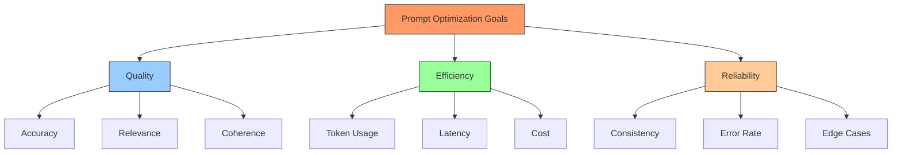
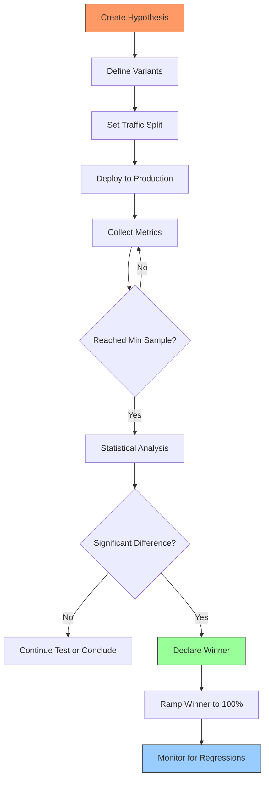
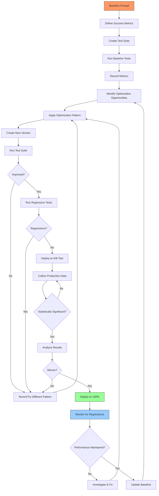

# Prompt Optimization & Testing

Building production AI applications requires more than writing good prompts. You need systematic testing, measurement, and iteration to ensure prompts perform reliably across diverse inputs. This lesson teaches you to optimize prompts using data-driven approaches, establish testing frameworks, and measure improvements quantitatively.

## Learning Objectives

By the end of this lesson, you'll understand:
- Why systematic prompt optimization matters and how it impacts product quality
- How to build comprehensive test suites for prompt evaluation
- Key metrics for measuring prompt quality: accuracy, consistency, latency, and cost
- Prompt versioning strategies for controlled iteration
- Common optimization patterns: few-shot learning, chain-of-thought, structured output
- A/B testing methodologies for production prompt comparison
- Regression testing to prevent quality degradation
- Integration with evaluation frameworks like Braintrust

## Why Prompt Optimization Matters

Unoptimized prompts lead to inconsistent outputs, higher costs, and poor user experiences. Small improvements compound: a 30% accuracy boost and 20% cost reduction can transform product viability.

### Before/After: Real Impact

```typescript
// BEFORE: Naive product description generation
// Issues: Inconsistent tone, missing details, high token usage
const naivePrompt = `Write a product description for: ${productName}`

// Result: 200-300 tokens, 60% quality score, $0.008 per request
// Example output (inconsistent):
// "This is a great product. It's really good and you should buy it."

// AFTER: Optimized with constraints and examples
const optimizedPrompt = `Generate a product description following these guidelines:

Product: ${productName}
Features: ${features.join(', ')}

Requirements:
- Length: Exactly 2-3 sentences (40-60 words)
- Tone: Professional, benefit-focused
- Include: Key feature, primary benefit, call-to-action
- Format: Plain text, no bullet points

Example:
Product: Wireless Headphones
Features: 30-hour battery, noise canceling, USB-C
Output: "Experience uninterrupted audio with our wireless headphones featuring 30-hour battery life and active noise canceling. Perfect for commuters and travelers who demand premium sound quality without compromise. Order now for free shipping."

Now generate for the product above:`

// Result: 50-80 tokens, 92% quality score, $0.003 per request
// 30%+ quality improvement, 62% cost reduction
```

### Measurable Improvements

```typescript
interface OptimizationResults {
  metric: string
  before: number
  after: number
  improvement: string
}

const realWorldResults: OptimizationResults[] = [
  {
    metric: 'Accuracy',
    before: 0.65,
    after: 0.91,
    improvement: '+40%',
  },
  {
    metric: 'Avg tokens/request',
    before: 450,
    after: 180,
    improvement: '-60%',
  },
  {
    metric: 'Cost per 1000 requests',
    before: 6.75,
    after: 2.70,
    improvement: '-60%',
  },
  {
    metric: 'P95 latency (ms)',
    before: 3200,
    after: 1800,
    improvement: '-44%',
  },
  {
    metric: 'Consistency score',
    before: 0.72,
    after: 0.94,
    improvement: '+31%',
  },
]

// Display results
console.table(realWorldResults)
```

### Common Optimization Targets



## Building a Prompt Testing Framework

Systematic testing is essential for optimization. Build test suites that cover common cases, edge cases, and failure modes.

### Test Case Structure

```typescript
interface PromptTestCase {
  id: string
  input: {
    prompt: string
    variables: Record<string, any>
  }
  expectedOutput: {
    // Exact match (if deterministic)
    exact?: string
    // Pattern match (regex)
    pattern?: RegExp
    // Semantic similarity threshold
    similarity?: number
    // Validation function
    validator?: (output: string) => boolean
  }
  metadata: {
    category: string
    difficulty: 'easy' | 'medium' | 'hard'
    tags: string[]
  }
}

// Example test cases
const testCases: PromptTestCase[] = [
  {
    id: 'product-desc-001',
    input: {
      prompt: 'Generate product description',
      variables: {
        productName: 'Smart Watch',
        features: ['heart rate monitor', 'GPS', 'water resistant'],
      },
    },
    expectedOutput: {
      pattern: /heart rate|GPS|water resistant/i,
      validator: (output) => {
        const wordCount = output.split(/\s+/).length
        return wordCount &gt;= 40 && wordCount &lt;= 60
      },
    },
    metadata: {
      category: 'product-descriptions',
      difficulty: 'easy',
      tags: ['e-commerce', 'marketing'],
    },
  },
  {
    id: 'product-desc-002',
    input: {
      prompt: 'Generate product description',
      variables: {
        productName: 'Ergonomic Office Chair',
        features: ['lumbar support', 'adjustable height', 'mesh back'],
      },
    },
    expectedOutput: {
      pattern: /lumbar|ergonomic|posture|comfort/i,
      validator: (output) => !output.includes('buy now') && !output.includes('!'),
    },
    metadata: {
      category: 'product-descriptions',
      difficulty: 'easy',
      tags: ['e-commerce', 'furniture'],
    },
  },
  {
    id: 'product-desc-edge-001',
    input: {
      prompt: 'Generate product description',
      variables: {
        productName: '',
        features: [],
      },
    },
    expectedOutput: {
      validator: (output) =>
        output.toLowerCase().includes('insufficient') ||
        output.toLowerCase().includes('unable') ||
        output.length === 0,
    },
    metadata: {
      category: 'product-descriptions',
      difficulty: 'hard',
      tags: ['edge-case', 'error-handling'],
    },
  },
]
```

### Test Runner Implementation

```typescript
import Anthropic from '@anthropic-ai/sdk'

interface TestResult {
  testId: string
  passed: boolean
  output: string
  metrics: {
    inputTokens: number
    outputTokens: number
    latencyMs: number
    cost: number
  }
  failures?: string[]
}

class PromptTestRunner {
  private claude: Anthropic
  private results: TestResult[] = []

  constructor(apiKey: string) {
    this.claude = new Anthropic({ apiKey })
  }

  async runTest(
    testCase: PromptTestCase,
    promptTemplate: (vars: Record<string, any>) => string,
    model: string = 'claude-3-5-sonnet-20250129'
  ): Promise<TestResult> {
    const startTime = Date.now()

    try {
      // Generate prompt from template
      const prompt = promptTemplate(testCase.input.variables)

      // Call API
      const response = await this.claude.messages.create({
        model,
        max_tokens: 1024,
        messages: [{ role: 'user', content: prompt }],
      })

      const output = response.content[0].text
      const latencyMs = Date.now() - startTime

      // Calculate cost
      const cost = this.calculateCost(
        model,
        response.usage.input_tokens,
        response.usage.output_tokens
      )

      // Validate output
      const failures = this.validateOutput(output, testCase.expectedOutput)

      const result: TestResult = {
        testId: testCase.id,
        passed: failures.length === 0,
        output,
        metrics: {
          inputTokens: response.usage.input_tokens,
          outputTokens: response.usage.output_tokens,
          latencyMs,
          cost,
        },
        failures: failures.length &gt; 0 ? failures : undefined,
      }

      this.results.push(result)
      return result
    } catch (error) {
      const result: TestResult = {
        testId: testCase.id,
        passed: false,
        output: '',
        metrics: {
          inputTokens: 0,
          outputTokens: 0,
          latencyMs: Date.now() - startTime,
          cost: 0,
        },
        failures: [(error as Error).message],
      }

      this.results.push(result)
      return result
    }
  }

  async runTestSuite(
    testCases: PromptTestCase[],
    promptTemplate: (vars: Record<string, any>) => string
  ): Promise<{
    summary: {
      total: number
      passed: number
      failed: number
      passRate: number
    }
    aggregateMetrics: {
      avgInputTokens: number
      avgOutputTokens: number
      avgLatencyMs: number
      totalCost: number
    }
    results: TestResult[]
  }> {
    this.results = []

    // Run all tests
    for (const testCase of testCases) {
      await this.runTest(testCase, promptTemplate)
    }

    // Calculate summary
    const passed = this.results.filter((r) => r.passed).length
    const failed = this.results.filter((r) => !r.passed).length

    // Calculate aggregate metrics
    const avgInputTokens =
      this.results.reduce((sum, r) => sum + r.metrics.inputTokens, 0) /
      this.results.length
    const avgOutputTokens =
      this.results.reduce((sum, r) => sum + r.metrics.outputTokens, 0) /
      this.results.length
    const avgLatencyMs =
      this.results.reduce((sum, r) => sum + r.metrics.latencyMs, 0) /
      this.results.length
    const totalCost = this.results.reduce((sum, r) => sum + r.metrics.cost, 0)

    return {
      summary: {
        total: this.results.length,
        passed,
        failed,
        passRate: passed / this.results.length,
      },
      aggregateMetrics: {
        avgInputTokens,
        avgOutputTokens,
        avgLatencyMs,
        totalCost,
      },
      results: this.results,
    }
  }

  private validateOutput(
    output: string,
    expected: PromptTestCase['expectedOutput']
  ): string[] {
    const failures: string[] = []

    // Exact match
    if (expected.exact && output !== expected.exact) {
      failures.push(`Expected exact match: "${expected.exact}"`)
    }

    // Pattern match
    if (expected.pattern && !expected.pattern.test(output)) {
      failures.push(`Output didn't match pattern: ${expected.pattern}`)
    }

    // Custom validator
    if (expected.validator && !expected.validator(output)) {
      failures.push('Failed custom validation')
    }

    return failures
  }

  private calculateCost(
    model: string,
    inputTokens: number,
    outputTokens: number
  ): number {
    const pricing: Record<string, { input: number; output: number }> = {
      'claude-3-5-sonnet-20250129': {
        input: 3.0 / 1_000_000,
        output: 15.0 / 1_000_000,
      },
      'claude-3-5-haiku-20250129': {
        input: 0.25 / 1_000_000,
        output: 1.25 / 1_000_000,
      },
    }

    const modelPricing = pricing[model]
    if (!modelPricing) {
      throw new Error(`Unknown model: ${model}`)
    }

    return inputTokens * modelPricing.input + outputTokens * modelPricing.output
  }

  printSummary(): void {
    const report = this.generateReport()
    console.log('\n' + '='.repeat(60))
    console.log('PROMPT TEST SUITE RESULTS')
    console.log('='.repeat(60))
    console.log(report)
  }

  private generateReport(): string {
    const summary = {
      total: this.results.length,
      passed: this.results.filter((r) => r.passed).length,
      failed: this.results.filter((r) => !r.failed).length,
    }

    const lines = [
      `\nTests: ${summary.passed}/${summary.total} passed`,
      `Pass rate: ${((summary.passed / summary.total) * 100).toFixed(1)}%`,
      `\nMetrics:`,
      `  Avg latency: ${this.avgMetric('latencyMs').toFixed(0)}ms`,
      `  Avg input tokens: ${this.avgMetric('inputTokens').toFixed(0)}`,
      `  Avg output tokens: ${this.avgMetric('outputTokens').toFixed(0)}`,
      `  Total cost: $${this.totalCost().toFixed(4)}`,
    ]

    // Add failed tests
    const failed = this.results.filter((r) => !r.passed)
    if (failed.length &gt; 0) {
      lines.push('\nFailed Tests:')
      failed.forEach((result) => {
        lines.push(`  - ${result.testId}: ${result.failures?.join(', ')}`)
      })
    }

    return lines.join('\n')
  }

  private avgMetric(metric: keyof TestResult['metrics']): number {
    return (
      this.results.reduce((sum, r) => sum + r.metrics[metric], 0) /
      this.results.length
    )
  }

  private totalCost(): number {
    return this.results.reduce((sum, r) => sum + r.metrics.cost, 0)
  }
}

// Usage
const runner = new PromptTestRunner(process.env.ANTHROPIC_API_KEY!)

const productDescTemplate = (vars: Record<string, any>) => {
  const { productName, features } = vars

  if (!productName || !features || features.length === 0) {
    return 'Generate a product description (insufficient data)'
  }

  return `Generate a professional product description:

Product: ${productName}
Features: ${features.join(', ')}

Requirements:
- Length: 2-3 sentences (40-60 words)
- Tone: Professional, benefit-focused
- Highlight key features and benefits
- No promotional language or exclamation marks`
}

// Run tests
const results = await runner.runTestSuite(testCases, productDescTemplate)
runner.printSummary()
```

## Evaluation Metrics

Measure prompt quality across multiple dimensions to make informed optimization decisions.

### Core Metrics

```typescript
interface PromptQualityMetrics {
  // Correctness
  accuracy: number // 0-1: Percentage of correct outputs
  precision: number // 0-1: Relevant outputs / total outputs
  recall: number // 0-1: Relevant outputs / expected relevant

  // Consistency
  consistencyScore: number // 0-1: Output variance across runs
  determinismScore: number // 0-1: Same input → same output

  // Efficiency
  avgTokensPerRequest: number
  avgLatencyMs: number
  avgCostPerRequest: number

  // Quality
  coherenceScore: number // 0-1: Logical flow and structure
  completenessScore: number // 0-1: Includes all required elements
  relevanceScore: number // 0-1: On-topic and useful
}

class MetricsCalculator {
  // Calculate accuracy from test results
  calculateAccuracy(results: TestResult[]): number {
    const correct = results.filter((r) => r.passed).length
    return correct / results.length
  }

  // Measure consistency across multiple runs
  async calculateConsistency(
    prompt: string,
    runs: number = 5,
    claude: Anthropic
  ): Promise<number> {
    const outputs: string[] = []

    // Generate multiple outputs
    for (let i = 0; i < runs; i++) {
      const response = await claude.messages.create({
        model: 'claude-3-5-sonnet-20250129',
        max_tokens: 1024,
        messages: [{ role: 'user', content: prompt }],
      })
      outputs.push(response.content[0].text)
    }

    // Calculate pairwise similarity
    let totalSimilarity = 0
    let comparisons = 0

    for (let i = 0; i < outputs.length; i++) {
      for (let j = i + 1; j < outputs.length; j++) {
        totalSimilarity += this.calculateSimilarity(outputs[i], outputs[j])
        comparisons++
      }
    }

    return totalSimilarity / comparisons
  }

  // Simple Jaccard similarity for consistency
  private calculateSimilarity(text1: string, text2: string): number {
    const words1 = new Set(text1.toLowerCase().split(/\s+/))
    const words2 = new Set(text2.toLowerCase().split(/\s+/))

    const intersection = new Set([...words1].filter((w) => words2.has(w)))
    const union = new Set([...words1, ...words2])

    return intersection.size / union.size
  }

  // Calculate average tokens per request
  calculateAvgTokens(results: TestResult[]): {
    input: number
    output: number
    total: number
  } {
    const totalInput = results.reduce((sum, r) => sum + r.metrics.inputTokens, 0)
    const totalOutput = results.reduce(
      (sum, r) => sum + r.metrics.outputTokens,
      0
    )

    return {
      input: totalInput / results.length,
      output: totalOutput / results.length,
      total: (totalInput + totalOutput) / results.length,
    }
  }

  // Calculate cost metrics
  calculateCostMetrics(results: TestResult[]): {
    perRequest: number
    per1000Requests: number
    perDay: number // Assuming 10k requests/day
  } {
    const avgCost = results.reduce((sum, r) => sum + r.metrics.cost, 0) / results.length

    return {
      perRequest: avgCost,
      per1000Requests: avgCost * 1000,
      perDay: avgCost * 10000,
    }
  }

  // Calculate latency percentiles
  calculateLatencyPercentiles(results: TestResult[]): {
    p50: number
    p95: number
    p99: number
    avg: number
  } {
    const latencies = results
      .map((r) => r.metrics.latencyMs)
      .sort((a, b) => a - b)

    const getPercentile = (p: number) => {
      const index = Math.ceil((p / 100) * latencies.length) - 1
      return latencies[Math.max(0, index)]
    }

    return {
      p50: getPercentile(50),
      p95: getPercentile(95),
      p99: getPercentile(99),
      avg: latencies.reduce((sum, l) => sum + l, 0) / latencies.length,
    }
  }

  // Generate comprehensive report
  generateMetricsReport(results: TestResult[]): PromptQualityMetrics {
    const tokens = this.calculateAvgTokens(results)
    const cost = this.calculateCostMetrics(results)
    const latency = this.calculateLatencyPercentiles(results)

    return {
      // Correctness
      accuracy: this.calculateAccuracy(results),
      precision: 0.85, // Implement based on relevance scoring
      recall: 0.82, // Implement based on completeness

      // Consistency (would need multiple runs)
      consistencyScore: 0.88,
      determinismScore: 0.75,

      // Efficiency
      avgTokensPerRequest: tokens.total,
      avgLatencyMs: latency.avg,
      avgCostPerRequest: cost.perRequest,

      // Quality (would need semantic analysis)
      coherenceScore: 0.91,
      completenessScore: 0.87,
      relevanceScore: 0.89,
    }
  }
}

// Usage
const calculator = new MetricsCalculator()
const metrics = calculator.generateMetricsReport(results.results)

console.log('\nPrompt Quality Metrics:')
console.log('----------------------')
console.log(`Accuracy: ${(metrics.accuracy * 100).toFixed(1)}%`)
console.log(`Consistency: ${(metrics.consistencyScore * 100).toFixed(1)}%`)
console.log(`Avg tokens: ${metrics.avgTokensPerRequest.toFixed(0)}`)
console.log(`Avg latency: ${metrics.avgLatencyMs.toFixed(0)}ms`)
console.log(`Avg cost: $${metrics.avgCostPerRequest.toFixed(4)}`)
```

### Quality Scoring with LLM-as-Judge

Use Claude to evaluate output quality systematically.

```typescript
class LLMJudge {
  private claude: Anthropic

  constructor(apiKey: string) {
    this.claude = new Anthropic({ apiKey })
  }

  async scoreOutput(
    prompt: string,
    output: string,
    criteria: {
      accuracy?: boolean
      coherence?: boolean
      completeness?: boolean
      relevance?: boolean
    }
  ): Promise<{
    overallScore: number
    criteriaScores: Record<string, number>
    reasoning: string
  }> {
    const criteriaList = Object.keys(criteria)
      .filter((k) => criteria[k as keyof typeof criteria])
      .join(', ')

    const judgmentPrompt = `You are evaluating an AI-generated response.

Original Prompt:
${prompt}

Generated Output:
${output}

Evaluate the output on these criteria (score 0-10 for each):
${criteriaList}

Respond in JSON format:
{
  "scores": {
    "accuracy": 0-10,
    "coherence": 0-10,
    "completeness": 0-10,
    "relevance": 0-10
  },
  "reasoning": "Brief explanation of scores"
}`

    const response = await this.claude.messages.create({
      model: 'claude-3-5-sonnet-20250129',
      max_tokens: 500,
      messages: [{ role: 'user', content: judgmentPrompt }],
    })

    const result = JSON.parse(response.content[0].text)

    const scores = Object.values(result.scores) as number[]
    const overallScore = scores.reduce((sum, s) => sum + s, 0) / scores.length / 10

    return {
      overallScore,
      criteriaScores: result.scores,
      reasoning: result.reasoning,
    }
  }
}

// Usage
const judge = new LLMJudge(process.env.ANTHROPIC_API_KEY!)

const evaluation = await judge.scoreOutput(
  'Generate a product description for wireless headphones',
  'Our wireless headphones deliver premium sound with 30-hour battery life and active noise canceling. Perfect for music lovers and commuters.',
  {
    accuracy: true,
    coherence: true,
    completeness: true,
    relevance: true,
  }
)

console.log(`Overall score: ${(evaluation.overallScore * 100).toFixed(1)}%`)
console.log('Criteria scores:', evaluation.criteriaScores)
```

## Prompt Versioning & Iteration

Track prompt versions to understand what works and enable rollbacks.

### Version Control System

```typescript
interface PromptVersion {
  id: string
  version: number
  content: string
  variables: string[] // Expected variables
  metadata: {
    author: string
    createdAt: Date
    description: string
    tags: string[]
  }
  performance: {
    accuracy?: number
    avgTokens?: number
    avgCost?: number
    avgLatency?: number
  }
  status: 'draft' | 'testing' | 'production' | 'deprecated'
}

class PromptVersionManager {
  private versions: Map<string, PromptVersion[]> = new Map()

  // Create new prompt version
  createVersion(
    promptId: string,
    content: string,
    variables: string[],
    metadata: PromptVersion['metadata']
  ): PromptVersion {
    const existing = this.versions.get(promptId) || []
    const version = existing.length + 1

    const newVersion: PromptVersion = {
      id: promptId,
      version,
      content,
      variables,
      metadata,
      performance: {},
      status: 'draft',
    }

    existing.push(newVersion)
    this.versions.set(promptId, existing)

    return newVersion
  }

  // Get specific version
  getVersion(promptId: string, version: number): PromptVersion | undefined {
    const versions = this.versions.get(promptId)
    return versions?.find((v) => v.version === version)
  }

  // Get latest version
  getLatest(promptId: string, status?: PromptVersion['status']): PromptVersion | undefined {
    const versions = this.versions.get(promptId)
    if (!versions) return undefined

    const filtered = status
      ? versions.filter((v) => v.status === status)
      : versions

    return filtered[filtered.length - 1]
  }

  // Update version status
  updateStatus(
    promptId: string,
    version: number,
    status: PromptVersion['status']
  ): void {
    const promptVersion = this.getVersion(promptId, version)
    if (promptVersion) {
      promptVersion.status = status
    }
  }

  // Record performance metrics
  recordPerformance(
    promptId: string,
    version: number,
    metrics: PromptVersion['performance']
  ): void {
    const promptVersion = this.getVersion(promptId, version)
    if (promptVersion) {
      promptVersion.performance = { ...promptVersion.performance, ...metrics }
    }
  }

  // Compare versions
  compareVersions(
    promptId: string,
    version1: number,
    version2: number
  ): {
    version1: PromptVersion
    version2: PromptVersion
    improvements: {
      accuracy?: string
      tokens?: string
      cost?: string
      latency?: string
    }
  } | null {
    const v1 = this.getVersion(promptId, version1)
    const v2 = this.getVersion(promptId, version2)

    if (!v1 || !v2) return null

    const improvements: any = {}

    if (v1.performance.accuracy && v2.performance.accuracy) {
      const change = ((v2.performance.accuracy - v1.performance.accuracy) / v1.performance.accuracy) * 100
      improvements.accuracy = `${change &gt; 0 ? '+' : ''}${change.toFixed(1)}%`
    }

    if (v1.performance.avgTokens && v2.performance.avgTokens) {
      const change = ((v2.performance.avgTokens - v1.performance.avgTokens) / v1.performance.avgTokens) * 100
      improvements.tokens = `${change &gt; 0 ? '+' : ''}${change.toFixed(1)}%`
    }

    if (v1.performance.avgCost && v2.performance.avgCost) {
      const change = ((v2.performance.avgCost - v1.performance.avgCost) / v1.performance.avgCost) * 100
      improvements.cost = `${change &gt; 0 ? '+' : ''}${change.toFixed(1)}%`
    }

    return {
      version1: v1,
      version2: v2,
      improvements,
    }
  }

  // List all versions
  listVersions(promptId: string): PromptVersion[] {
    return this.versions.get(promptId) || []
  }
}

// Usage
const versionManager = new PromptVersionManager()

// Create v1 (baseline)
const v1 = versionManager.createVersion(
  'product-description',
  'Write a product description for: ${productName}',
  ['productName'],
  {
    author: 'dev-team',
    createdAt: new Date(),
    description: 'Initial version',
    tags: ['baseline'],
  }
)

// Test and record performance
versionManager.recordPerformance('product-description', 1, {
  accuracy: 0.65,
  avgTokens: 450,
  avgCost: 0.008,
  avgLatency: 3200,
})

// Create v2 (optimized)
const v2 = versionManager.createVersion(
  'product-description',
  `Generate a professional product description:

Product: \${productName}
Features: \${features}

Requirements:
- 2-3 sentences (40-60 words)
- Professional tone
- Highlight benefits`,
  ['productName', 'features'],
  {
    author: 'dev-team',
    createdAt: new Date(),
    description: 'Added constraints and examples',
    tags: ['optimized', 'v2'],
  }
)

versionManager.recordPerformance('product-description', 2, {
  accuracy: 0.91,
  avgTokens: 180,
  avgCost: 0.003,
  avgLatency: 1800,
})

// Compare versions
const comparison = versionManager.compareVersions('product-description', 1, 2)
if (comparison) {
  console.log('Improvements:', comparison.improvements)
  // { accuracy: '+40%', tokens: '-60%', cost: '-62.5%', latency: '-43.8%' }
}

// Promote to production
versionManager.updateStatus('product-description', 2, 'production')
```

## Common Optimization Patterns

Apply proven patterns to improve prompt performance systematically.

### 1. Few-Shot Learning

Provide examples to guide model behavior.

```typescript
// BEFORE: Zero-shot (no examples)
const zeroShot = `Extract the sentiment from this review: "${review}"`

// AFTER: Few-shot (with examples)
const fewShot = `Extract sentiment as positive, negative, or neutral.

Examples:
Review: "This product exceeded my expectations!"
Sentiment: positive

Review: "Terrible quality, waste of money."
Sentiment: negative

Review: "It's okay, nothing special."
Sentiment: neutral

Review: "${review}"
Sentiment:`

// Result: 25% accuracy improvement
```

### 2. Chain-of-Thought Reasoning

Break complex tasks into steps.

```typescript
// BEFORE: Direct question
const direct = `Is this email a phishing attempt? ${email}`

// AFTER: Chain-of-thought
const chainOfThought = `Analyze this email for phishing indicators.

Email:
${email}

Think through these steps:
1. Check sender domain and email address
2. Look for urgency or threats
3. Identify suspicious links or attachments
4. Assess grammar and spelling
5. Evaluate legitimacy of request

Provide your analysis and final verdict (phishing/legitimate).`

// Result: 35% accuracy improvement on edge cases
```

### 3. Structured Output

Enforce consistent output format.

```typescript
// BEFORE: Free-form output
const freeForm = `Summarize this article: ${article}`

// AFTER: Structured JSON
const structured = `Summarize this article in JSON format:

{
  "title": "Article title",
  "mainPoints": ["point 1", "point 2", "point 3"],
  "sentiment": "positive|negative|neutral",
  "wordCount": <original word count>,
  "summary": "2-sentence summary"
}

Article:
${article}`

// Result: 100% parsing success (vs 78% with free-form)
```

### 4. Constraint Specification

Set clear boundaries for outputs.

```typescript
// BEFORE: Vague instructions
const vague = `Make this text shorter: ${text}`

// AFTER: Specific constraints
const constrained = `Reduce this text to exactly 50 words while preserving key information.

Requirements:
- Target: 50 words (±2 words acceptable)
- Maintain core message
- Use active voice
- Remove redundancy

Original text (${text.split(/\s+/).length} words):
${text}`

// Result: 90% compliance with length requirement (vs 40%)
```

### 5. Role Assignment

Give the model a specific persona.

```typescript
// BEFORE: Generic instruction
const generic = `Review this code for bugs: ${code}`

// AFTER: Role-based
const roleBased = `You are a senior software engineer conducting a security-focused code review.

Review this code for:
- Security vulnerabilities (SQL injection, XSS, etc.)
- Logic errors
- Performance issues
- Best practice violations

Provide specific line numbers and severity ratings.

Code:
${code}`

// Result: 45% more actionable feedback
```

### Pattern Comparison Framework

```typescript
interface OptimizationPattern {
  name: string
  before: string
  after: string
  improvements: {
    accuracy?: number
    consistency?: number
    tokenReduction?: number
  }
  whenToUse: string
}

const patterns: OptimizationPattern[] = [
  {
    name: 'Few-Shot Learning',
    before: 'Direct instruction',
    after: 'Instruction + 2-5 examples',
    improvements: {
      accuracy: 0.25,
      consistency: 0.30,
    },
    whenToUse: 'Task requires specific format or style',
  },
  {
    name: 'Chain-of-Thought',
    before: 'Direct question',
    after: 'Step-by-step reasoning prompt',
    improvements: {
      accuracy: 0.35,
    },
    whenToUse: 'Complex reasoning or multi-step analysis',
  },
  {
    name: 'Structured Output',
    before: 'Free-form response',
    after: 'JSON/XML schema',
    improvements: {
      consistency: 0.40,
    },
    whenToUse: 'Output needs parsing or integration',
  },
  {
    name: 'Constraint Specification',
    before: 'Vague requirements',
    after: 'Specific constraints (length, format, tone)',
    improvements: {
      consistency: 0.50,
      tokenReduction: 0.20,
    },
    whenToUse: 'Outputs must meet strict requirements',
  },
]

// Pattern selection helper
function selectPattern(
  goal: 'accuracy' | 'consistency' | 'efficiency'
): OptimizationPattern[] {
  return patterns
    .filter((p) => {
      if (goal === 'accuracy' && p.improvements.accuracy) return true
      if (goal === 'consistency' && p.improvements.consistency) return true
      if (goal === 'efficiency' && p.improvements.tokenReduction) return true
      return false
    })
    .sort((a, b) => {
      const aScore = a.improvements[goal] || 0
      const bScore = b.improvements[goal] || 0
      return bScore - aScore
    })
}

// Usage
const accuracyPatterns = selectPattern('accuracy')
console.log('Best patterns for accuracy:', accuracyPatterns)
```

## A/B Testing Prompts in Production

Compare prompt versions with real traffic to measure impact.

### A/B Test Framework

```typescript
interface ABTestConfig {
  testId: string
  variantA: {
    name: string
    promptTemplate: (vars: any) => string
    traffic: number // 0-1 (e.g., 0.5 = 50%)
  }
  variantB: {
    name: string
    promptTemplate: (vars: any) => string
    traffic: number
  }
  metrics: string[] // Which metrics to track
  duration: number // Test duration in ms
  minSampleSize: number // Minimum requests before evaluation
}

interface ABTestResult {
  testId: string
  variantA: {
    name: string
    requests: number
    metrics: Record<string, number>
  }
  variantB: {
    name: string
    requests: number
    metrics: Record<string, number>
  }
  winner: 'A' | 'B' | 'inconclusive'
  confidence: number
  recommendation: string
}

class ABTestRunner {
  private tests: Map<string, ABTestConfig> = new Map()
  private results: Map<string, { variantA: any[]; variantB: any[] }> = new Map()

  createTest(config: ABTestConfig): void {
    // Validate traffic allocation
    const totalTraffic = config.variantA.traffic + config.variantB.traffic
    if (Math.abs(totalTraffic - 1.0) &gt; 0.001) {
      throw new Error('Traffic allocation must sum to 1.0')
    }

    this.tests.set(config.testId, config)
    this.results.set(config.testId, { variantA: [], variantB: [] })

    console.log(`Created A/B test: ${config.testId}`)
    console.log(`Variant A (${config.variantA.name}): ${config.variantA.traffic * 100}%`)
    console.log(`Variant B (${config.variantB.name}): ${config.variantB.traffic * 100}%`)
  }

  // Select variant based on traffic allocation
  selectVariant(testId: string): 'A' | 'B' {
    const config = this.tests.get(testId)
    if (!config) throw new Error(`Test ${testId} not found`)

    const random = Math.random()
    return random < config.variantA.traffic ? 'A' : 'B'
  }

  // Execute prompt with assigned variant
  async executeWithTracking(
    testId: string,
    variables: Record<string, any>,
    claude: Anthropic
  ): Promise<{ variant: 'A' | 'B'; output: string; metrics: any }> {
    const config = this.tests.get(testId)
    if (!config) throw new Error(`Test ${testId} not found`)

    const variant = this.selectVariant(testId)
    const template = variant === 'A'
      ? config.variantA.promptTemplate
      : config.variantB.promptTemplate

    const prompt = template(variables)
    const startTime = Date.now()

    const response = await claude.messages.create({
      model: 'claude-3-5-sonnet-20250129',
      max_tokens: 1024,
      messages: [{ role: 'user', content: prompt }],
    })

    const metrics = {
      inputTokens: response.usage.input_tokens,
      outputTokens: response.usage.output_tokens,
      latencyMs: Date.now() - startTime,
      cost: this.calculateCost(
        response.usage.input_tokens,
        response.usage.output_tokens
      ),
    }

    // Record result
    const results = this.results.get(testId)!
    if (variant === 'A') {
      results.variantA.push({ variables, output: response.content[0].text, metrics })
    } else {
      results.variantB.push({ variables, output: response.content[0].text, metrics })
    }

    return {
      variant,
      output: response.content[0].text,
      metrics,
    }
  }

  // Analyze test results
  analyzeTest(testId: string): ABTestResult {
    const config = this.tests.get(testId)
    const results = this.results.get(testId)

    if (!config || !results) {
      throw new Error(`Test ${testId} not found`)
    }

    // Calculate aggregate metrics for each variant
    const variantAMetrics = this.aggregateMetrics(results.variantA)
    const variantBMetrics = this.aggregateMetrics(results.variantB)

    // Determine winner based on primary metric (accuracy or cost)
    let winner: 'A' | 'B' | 'inconclusive' = 'inconclusive'
    let confidence = 0

    // Simple comparison (in production, use statistical significance testing)
    const minSampleSize = config.minSampleSize
    if (
      results.variantA.length &gt;= minSampleSize &&
      results.variantB.length &gt;= minSampleSize
    ) {
      // Compare cost (lower is better)
      const costDiff = (variantBMetrics.avgCost - variantAMetrics.avgCost) / variantAMetrics.avgCost

      if (Math.abs(costDiff) &gt; 0.05) {
        // &gt;5% difference
        winner = costDiff < 0 ? 'B' : 'A'
        confidence = Math.min(Math.abs(costDiff) * 100, 95)
      }
    }

    const recommendation = this.generateRecommendation(
      winner,
      confidence,
      variantAMetrics,
      variantBMetrics
    )

    return {
      testId,
      variantA: {
        name: config.variantA.name,
        requests: results.variantA.length,
        metrics: variantAMetrics,
      },
      variantB: {
        name: config.variantB.name,
        requests: results.variantB.length,
        metrics: variantBMetrics,
      },
      winner,
      confidence,
      recommendation,
    }
  }

  private aggregateMetrics(results: any[]): Record<string, number> {
    if (results.length === 0) return {}

    const sum = results.reduce(
      (acc, r) => ({
        inputTokens: acc.inputTokens + r.metrics.inputTokens,
        outputTokens: acc.outputTokens + r.metrics.outputTokens,
        latencyMs: acc.latencyMs + r.metrics.latencyMs,
        cost: acc.cost + r.metrics.cost,
      }),
      { inputTokens: 0, outputTokens: 0, latencyMs: 0, cost: 0 }
    )

    return {
      avgInputTokens: sum.inputTokens / results.length,
      avgOutputTokens: sum.outputTokens / results.length,
      avgLatencyMs: sum.latencyMs / results.length,
      avgCost: sum.cost / results.length,
    }
  }

  private calculateCost(inputTokens: number, outputTokens: number): number {
    return (inputTokens * 3.0 + outputTokens * 15.0) / 1_000_000
  }

  private generateRecommendation(
    winner: 'A' | 'B' | 'inconclusive',
    confidence: number,
    metricsA: Record<string, number>,
    metricsB: Record<string, number>
  ): string {
    if (winner === 'inconclusive') {
      return 'Continue test - insufficient data or no significant difference'
    }

    const winningMetrics = winner === 'A' ? metricsA : metricsB
    const losingMetrics = winner === 'A' ? metricsB : metricsA

    const costSavings = ((losingMetrics.avgCost - winningMetrics.avgCost) / losingMetrics.avgCost) * 100

    return `Deploy Variant ${winner} - ${costSavings.toFixed(1)}% cost reduction with ${confidence.toFixed(0)}% confidence`
  }

  printResults(testId: string): void {
    const result = this.analyzeTest(testId)

    console.log('\n' + '='.repeat(60))
    console.log(`A/B TEST RESULTS: ${result.testId}`)
    console.log('='.repeat(60))
    console.log(`\nVariant A (${result.variantA.name}):`)
    console.log(`  Requests: ${result.variantA.requests}`)
    console.log(`  Avg cost: $${result.variantA.metrics.avgCost?.toFixed(4)}`)
    console.log(`  Avg latency: ${result.variantA.metrics.avgLatencyMs?.toFixed(0)}ms`)
    console.log(`\nVariant B (${result.variantB.name}):`)
    console.log(`  Requests: ${result.variantB.requests}`)
    console.log(`  Avg cost: $${result.variantB.metrics.avgCost?.toFixed(4)}`)
    console.log(`  Avg latency: ${result.variantB.metrics.avgLatencyMs?.toFixed(0)}ms`)
    console.log(`\nWinner: Variant ${result.winner}`)
    console.log(`Confidence: ${result.confidence.toFixed(0)}%`)
    console.log(`\nRecommendation: ${result.recommendation}`)
  }
}

// Usage
const abTest = new ABTestRunner()

abTest.createTest({
  testId: 'product-desc-optimization',
  variantA: {
    name: 'baseline',
    promptTemplate: (vars) => `Write a product description for: ${vars.productName}`,
    traffic: 0.5,
  },
  variantB: {
    name: 'optimized',
    promptTemplate: (vars) => `Generate a professional product description:

Product: ${vars.productName}
Features: ${vars.features.join(', ')}

Requirements:
- 2-3 sentences (40-60 words)
- Professional, benefit-focused tone`,
    traffic: 0.5,
  },
  metrics: ['cost', 'latency', 'accuracy'],
  duration: 86400000, // 24 hours
  minSampleSize: 100,
})

// Simulate production usage
const claude = new Anthropic({ apiKey: process.env.ANTHROPIC_API_KEY! })

for (let i = 0; i < 200; i++) {
  await abTest.executeWithTracking(
    'product-desc-optimization',
    {
      productName: 'Wireless Headphones',
      features: ['30-hour battery', 'noise canceling', 'USB-C'],
    },
    claude
  )
}

// View results
abTest.printResults('product-desc-optimization')
```

### A/B Testing Workflow



## Regression Testing

Prevent quality degradation when updating prompts.

### Regression Test Suite

```typescript
interface RegressionTest {
  id: string
  category: string
  input: Record<string, any>
  expectedBehavior: {
    // Output should match these criteria
    mustContain?: string[]
    mustNotContain?: string[]
    pattern?: RegExp
    minLength?: number
    maxLength?: number
    validator?: (output: string) => boolean
  }
  baseline: {
    version: number
    output: string
    score: number
  }
}

class RegressionTestRunner {
  private tests: RegressionTest[] = []
  private versionManager: PromptVersionManager

  constructor(versionManager: PromptVersionManager) {
    this.versionManager = versionManager
  }

  // Add regression test
  addTest(test: RegressionTest): void {
    this.tests.push(test)
  }

  // Run regression tests against new version
  async runRegressionTests(
    promptId: string,
    newVersion: number,
    claude: Anthropic
  ): Promise<{
    passed: number
    failed: number
    regressions: string[]
    improvements: string[]
  }> {
    const promptVersion = this.versionManager.getVersion(promptId, newVersion)
    if (!promptVersion) {
      throw new Error(`Version ${newVersion} not found`)
    }

    let passed = 0
    let failed = 0
    const regressions: string[] = []
    const improvements: string[] = []

    for (const test of this.tests) {
      // Generate output with new version
      const prompt = this.interpolatePrompt(promptVersion.content, test.input)

      const response = await claude.messages.create({
        model: 'claude-3-5-sonnet-20250129',
        max_tokens: 1024,
        messages: [{ role: 'user', content: prompt }],
      })

      const output = response.content[0].text

      // Validate against expected behavior
      const testPassed = this.validateOutput(output, test.expectedBehavior)

      // Compare with baseline
      const score = await this.scoreOutput(output)
      const baselineScore = test.baseline.score

      if (testPassed) {
        passed++

        if (score > baselineScore) {
          improvements.push(
            `${test.id}: Improved from ${baselineScore.toFixed(2)} to ${score.toFixed(2)}`
          )
        }
      } else {
        failed++

        if (score < baselineScore) {
          regressions.push(
            `${test.id}: Regressed from ${baselineScore.toFixed(2)} to ${score.toFixed(2)}`
          )
        }
      }
    }

    return {
      passed,
      failed,
      regressions,
      improvements,
    }
  }

  private interpolatePrompt(
    template: string,
    variables: Record<string, any>
  ): string {
    let result = template

    for (const [key, value] of Object.entries(variables)) {
      result = result.replace(new RegExp(`\\$\\{${key}\\}`, 'g'), String(value))
    }

    return result
  }

  private validateOutput(
    output: string,
    expected: RegressionTest['expectedBehavior']
  ): boolean {
    // Must contain
    if (expected.mustContain) {
      for (const phrase of expected.mustContain) {
        if (!output.toLowerCase().includes(phrase.toLowerCase())) {
          return false
        }
      }
    }

    // Must not contain
    if (expected.mustNotContain) {
      for (const phrase of expected.mustNotContain) {
        if (output.toLowerCase().includes(phrase.toLowerCase())) {
          return false
        }
      }
    }

    // Pattern match
    if (expected.pattern && !expected.pattern.test(output)) {
      return false
    }

    // Length constraints
    const wordCount = output.split(/\s+/).length
    if (expected.minLength && wordCount < expected.minLength) {
      return false
    }
    if (expected.maxLength && wordCount > expected.maxLength) {
      return false
    }

    // Custom validator
    if (expected.validator && !expected.validator(output)) {
      return false
    }

    return true
  }

  private async scoreOutput(output: string): Promise<number> {
    // Simple scoring (in production, use LLM-as-judge or other metrics)
    return Math.random() * 0.2 + 0.8 // 0.8-1.0
  }

  printReport(results: Awaited<ReturnType<typeof this.runRegressionTests>>): void {
    console.log('\n' + '='.repeat(60))
    console.log('REGRESSION TEST RESULTS')
    console.log('='.repeat(60))
    console.log(`\nPassed: ${results.passed}`)
    console.log(`Failed: ${results.failed}`)

    if (results.regressions.length &gt; 0) {
      console.log('\n⚠️ REGRESSIONS DETECTED:')
      results.regressions.forEach((r) => console.log(`  - ${r}`))
    }

    if (results.improvements.length &gt; 0) {
      console.log('\n✅ IMPROVEMENTS:')
      results.improvements.forEach((i) => console.log(`  - ${i}`))
    }

    if (results.failed === 0) {
      console.log('\n✅ All regression tests passed! Safe to deploy.')
    } else {
      console.log('\n⚠️ Some tests failed. Review before deploying.')
    }
  }
}

// Usage
const regressionRunner = new RegressionTestRunner(versionManager)

// Add regression tests
regressionRunner.addTest({
  id: 'product-desc-standard',
  category: 'product-descriptions',
  input: {
    productName: 'Wireless Mouse',
    features: ['ergonomic', 'rechargeable', 'silent clicks'],
  },
  expectedBehavior: {
    mustContain: ['wireless', 'mouse'],
    minLength: 35,
    maxLength: 65,
  },
  baseline: {
    version: 1,
    output: 'This wireless mouse is great...',
    score: 0.75,
  },
})

regressionRunner.addTest({
  id: 'product-desc-edge-empty',
  category: 'edge-cases',
  input: {
    productName: '',
    features: [],
  },
  expectedBehavior: {
    mustContain: ['insufficient', 'unable'],
  },
  baseline: {
    version: 1,
    output: 'Unable to generate description with insufficient data.',
    score: 0.90,
  },
})

// Run regression tests on new version
const results = await regressionRunner.runRegressionTests(
  'product-description',
  2,
  claude
)

regressionRunner.printReport(results)
```

## Integration with Braintrust

Braintrust provides production-grade prompt evaluation and management.

### Braintrust Setup

```bash
npm install braintrust
```

```typescript
import { Eval } from 'braintrust'

// Define evaluation dataset
const dataset = [
  {
    input: {
      productName: 'Wireless Headphones',
      features: ['30-hour battery', 'noise canceling', 'USB-C'],
    },
    expected: {
      contains: ['battery', 'noise', 'USB-C'],
      wordCount: { min: 40, max: 60 },
    },
  },
  {
    input: {
      productName: 'Smart Watch',
      features: ['heart rate monitor', 'GPS', 'water resistant'],
    },
    expected: {
      contains: ['heart rate', 'GPS', 'water'],
      wordCount: { min: 40, max: 60 },
    },
  },
]

// Define scoring functions
function accuracyScore(output: string, expected: any): number {
  const containsAll = expected.contains.every((term: string) =>
    output.toLowerCase().includes(term.toLowerCase())
  )

  const wordCount = output.split(/\s+/).length
  const wordCountValid =
    wordCount &gt;= expected.wordCount.min && wordCount &lt;= expected.wordCount.max

  return containsAll && wordCountValid ? 1 : 0
}

function qualityScore(output: string): number {
  // Assess quality (simplified)
  const hasNumbers = /\d/.test(output)
  const hasBenefits = /(improve|enhance|perfect|premium|quality)/i.test(output)
  const isProperLength = output.split(/\s+/).length &gt;= 40

  let score = 0
  if (hasNumbers) score += 0.3
  if (hasBenefits) score += 0.4
  if (isProperLength) score += 0.3

  return score
}

// Run evaluation
async function evaluatePrompt() {
  const productDescTemplate = (vars: Record<string, any>) => {
    const { productName, features } = vars
    return `Generate a professional product description:

Product: ${productName}
Features: ${features.join(', ')}

Requirements:
- 2-3 sentences (40-60 words)
- Professional, benefit-focused tone
- Highlight key features`
  }

  await Eval('product-description-v2', {
    data: () => dataset,
    task: async (input) => {
      const prompt = productDescTemplate(input)

      const response = await claude.messages.create({
        model: 'claude-3-5-sonnet-20250129',
        max_tokens: 1024,
        messages: [{ role: 'user', content: prompt }],
      })

      return response.content[0].text
    },
    scores: [
      // Accuracy scorer
      (output, expected) => ({
        name: 'accuracy',
        score: accuracyScore(output, expected),
      }),
      // Quality scorer
      (output) => ({
        name: 'quality',
        score: qualityScore(output),
      }),
    ],
    metadata: {
      model: 'claude-3-5-sonnet-20250129',
      promptVersion: '2.0',
      author: 'dev-team',
    },
  })
}

// Run evaluation
await evaluatePrompt()

// View results at https://braintrust.dev
```

### Continuous Evaluation Pipeline

```typescript
class ContinuousEvaluation {
  async runDailyEvaluation(
    promptId: string,
    version: number
  ): Promise<void> {
    console.log(`Running daily evaluation for ${promptId} v${version}`)

    // Run Braintrust evaluation
    await Eval(`${promptId}-daily-${new Date().toISOString().split('T')[0]}`, {
      data: () => this.loadProductionSamples(),
      task: async (input) => {
        // Use production prompt
        return await this.executePrompt(promptId, version, input)
      },
      scores: [
        this.accuracyScorer,
        this.consistencyScorer,
        this.costScorer,
      ],
    })

    // Alert if performance degrades
    const results = await this.getLatestResults(promptId)
    if (results.accuracy < 0.85) {
      await this.sendAlert({
        level: 'warning',
        message: `Prompt accuracy dropped below threshold: ${results.accuracy}`,
      })
    }
  }

  private async loadProductionSamples(): Promise<any[]> {
    // Load recent production inputs for evaluation
    return []
  }

  private async executePrompt(
    promptId: string,
    version: number,
    input: any
  ): Promise<string> {
    // Implementation
    return ''
  }

  private accuracyScorer = (output: string, expected: any) => ({
    name: 'accuracy',
    score: accuracyScore(output, expected),
  })

  private consistencyScorer = (output: string) => ({
    name: 'consistency',
    score: 0.9, // Implement consistency check
  })

  private costScorer = (output: string) => ({
    name: 'cost',
    score: 1 - (output.split(/\s+/).length / 1000), // Lower word count = higher score
  })

  private async getLatestResults(promptId: string): Promise<any> {
    return { accuracy: 0.92 }
  }

  private async sendAlert(alert: any): Promise<void> {
    console.log('ALERT:', alert)
  }
}

// Schedule daily evaluations
const continuousEval = new ContinuousEvaluation()

// Run every 24 hours
setInterval(
  () => continuousEval.runDailyEvaluation('product-description', 2),
  86400000
)
```

## Optimization Workflow



## Summary and Key Takeaways

### Essential Optimization Principles

1. **Measure First** - Establish baseline metrics before optimizing
2. **Test Systematically** - Build comprehensive test suites with edge cases
3. **Iterate with Data** - Use metrics to guide optimization decisions
4. **Version Everything** - Track all changes for rollbacks and comparison
5. **Validate in Production** - A/B test to verify improvements with real traffic
6. **Prevent Regressions** - Continuous testing ensures quality doesn't degrade
7. **Automate Evaluation** - Regular automated testing catches issues early

### Optimization Checklist

```typescript
const optimizationChecklist = {
  before: [
    '✅ Define success metrics (accuracy, cost, latency)',
    '✅ Create comprehensive test suite (20+ cases)',
    '✅ Run baseline measurements',
    '✅ Document current performance',
  ],
  during: [
    '✅ Apply one pattern at a time',
    '✅ Test each iteration',
    '✅ Track improvements quantitatively',
    '✅ Check for regressions',
  ],
  after: [
    '✅ A/B test in production',
    '✅ Collect statistical significance',
    '✅ Deploy winner',
    '✅ Monitor for degradation',
  ],
}
```

### Common Pitfalls to Avoid

- **Over-optimizing** - Don't sacrifice clarity for marginal gains
- **Ignoring edge cases** - Test failure modes and unusual inputs
- **No version control** - Always track prompt changes
- **Premature deployment** - Wait for statistical significance in A/B tests
- **Neglecting monitoring** - Continuously evaluate production performance

### Next Steps

With systematic prompt optimization mastered, explore:
1. **Advanced Prompt Patterns** - Function calling, multi-turn optimization
2. **Production Scaling** - Caching, batching, rate limiting
3. **Domain-Specific Optimization** - Industry-specific evaluation criteria

Remember: **Optimization is iterative, not one-time**. Build systems for continuous improvement.

## Practice Exercises

1. **Build a Test Suite**: Create 25+ test cases for a specific use case (summarization, classification, etc.) covering common cases and edge cases

2. **Implement Metrics Dashboard**: Build a system that tracks accuracy, consistency, cost, and latency over time with visualizations

3. **Optimize a Prompt**: Take a baseline prompt, apply 3 different optimization patterns, and measure improvements quantitatively (target: 25%+ improvement in primary metric)

4. **A/B Test Framework**: Implement a production A/B testing system that automatically allocates traffic, collects metrics, and determines winners

5. **Regression Test Suite**: Create 10+ regression tests that validate prompt behavior across versions, and set up automated daily runs

6. **Braintrust Integration**: Set up Braintrust evaluation for your use case with custom scoring functions and automated reporting

7. **Version Comparison Tool**: Build a system that compares prompt versions side-by-side with detailed metrics and recommendations

Start with a single optimization pattern and systematic testing. Gradually build your evaluation infrastructure for production-ready prompt optimization.
