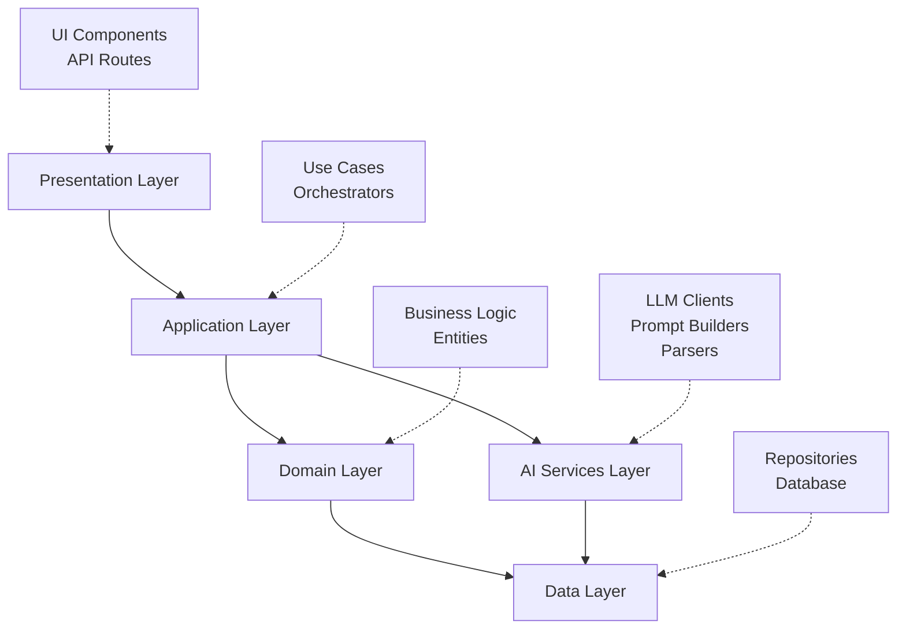
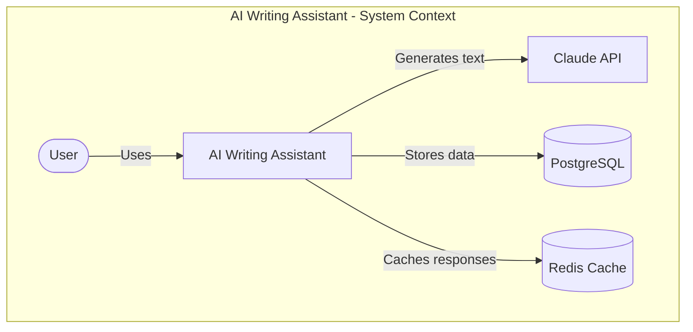

# Architecture Design Patterns

Great AI products require thoughtful architecture. Poor architecture leads to unmaintainable code, scaling problems, and bugs that compound over time. This lesson teaches you to design AI applications that are modular, testable, scalable, and maintainable.

## Learning Objectives

By the end of this lesson, you'll understand:
- Core architecture principles (SOLID) applied to AI applications
- How to structure AI application components for maintainability
- Data flow patterns for AI systems
- State management strategies for LLM interactions
- API design patterns for AI features
- Database schema design for AI applications
- Common architecture patterns (Clean Architecture, Hexagonal)
- Architecture documentation practices (C4 diagrams, ADRs)

## Architecture Principles for AI Applications

AI applications have unique architecture challenges: non-deterministic outputs, long-running operations, high latency, and significant API costs. Good architecture manages these challenges systematically.

### SOLID Principles for AI

```typescript
// S - Single Responsibility Principle
// ❌ BAD: One class does everything
class ChatBot {
  generateResponse(message: string) {
    // Validates input
    // Builds prompt
    // Calls LLM
    // Parses response
    // Logs everything
    // Handles errors
    // Updates database
    // Returns response
  }
}

// ✅ GOOD: Each class has one responsibility
class InputValidator {
  validate(message: string): ValidationResult {
    // Only validates input
  }
}

class PromptBuilder {
  build(message: string, context: Context): Prompt {
    // Only builds prompts
  }
}

class LLMClient {
  async generate(prompt: Prompt): Promise<LLMResponse> {
    // Only calls LLM
  }
}

class ResponseParser {
  parse(response: LLMResponse): ParsedResponse {
    // Only parses responses
  }
}

class ChatOrchestrator {
  constructor(
    private validator: InputValidator,
    private promptBuilder: PromptBuilder,
    private llm: LLMClient,
    private parser: ResponseParser
  ) {}

  async handleMessage(message: string, context: Context): Promise<Response> {
    const validation = this.validator.validate(message)
    if (!validation.valid) throw new Error(validation.error)

    const prompt = this.promptBuilder.build(message, context)
    const llmResponse = await this.llm.generate(prompt)
    return this.parser.parse(llmResponse)
  }
}
```

```typescript
// O - Open/Closed Principle
// ✅ Open for extension, closed for modification
interface LLMProvider {
  generate(prompt: string): Promise<string>
}

class ClaudeProvider implements LLMProvider {
  async generate(prompt: string): Promise<string> {
    // Claude-specific implementation
  }
}

class OpenAIProvider implements LLMProvider {
  async generate(prompt: string): Promise<string> {
    // OpenAI-specific implementation
  }
}

// Add new providers without modifying existing code
class GeminiProvider implements LLMProvider {
  async generate(prompt: string): Promise<string> {
    // Gemini-specific implementation
  }
}
```

```typescript
// L - Liskov Substitution Principle
// Subtypes must be substitutable for their base types
interface MessageFormatter {
  format(content: string): FormattedMessage
}

class PlainTextFormatter implements MessageFormatter {
  format(content: string): FormattedMessage {
    return { content, format: 'text' }
  }
}

class MarkdownFormatter implements MessageFormatter {
  format(content: string): FormattedMessage {
    return { content: this.toMarkdown(content), format: 'markdown' }
  }
}

// Any MessageFormatter can be used interchangeably
function sendMessage(formatter: MessageFormatter, content: string) {
  const formatted = formatter.format(content)
  // Works with any formatter
}
```

```typescript
// I - Interface Segregation Principle
// Don't force clients to depend on interfaces they don't use

// ❌ BAD: Fat interface
interface AIService {
  generateText(prompt: string): Promise<string>
  generateImage(prompt: string): Promise<string>
  generateEmbedding(text: string): Promise<number[]>
  transcribeAudio(audio: Buffer): Promise<string>
}

// ✅ GOOD: Segregated interfaces
interface TextGenerator {
  generateText(prompt: string): Promise<string>
}

interface ImageGenerator {
  generateImage(prompt: string): Promise<string>
}

interface EmbeddingGenerator {
  generateEmbedding(text: string): Promise<number[]>
}

// Clients only depend on what they need
class ChatService {
  constructor(private textGen: TextGenerator) {
    // Only needs text generation
  }
}
```

```typescript
// D - Dependency Inversion Principle
// Depend on abstractions, not concretions

// ❌ BAD: Direct dependency on concrete class
class ChatController {
  private anthropic = new Anthropic({ apiKey: process.env.ANTHROPIC_API_KEY })

  async chat(message: string) {
    // Tightly coupled to Anthropic
    const response = await this.anthropic.messages.create({...})
  }
}

// ✅ GOOD: Depend on abstraction
interface LLMService {
  chat(message: string): Promise<string>
}

class ChatController {
  constructor(private llm: LLMService) {
    // Can use any LLM implementation
  }

  async chat(message: string) {
    return this.llm.chat(message)
  }
}

class AnthropicService implements LLMService {
  async chat(message: string): Promise<string> {
    // Implementation
  }
}
```

### AI-Specific Architecture Principles

```typescript
/**
 * 1. Isolate Non-Determinism
 * Keep LLM calls in dedicated layer, don't mix with business logic
 */
class RecommendationEngine {
  // ❌ BAD: LLM call mixed with business logic
  async getRecommendations(userId: string) {
    const user = await db.users.find(userId)
    const prompt = `Recommend products for ${user.preferences}`
    const llmResponse = await anthropic.generate(prompt) // Non-deterministic!
    return this.parseProducts(llmResponse)
  }

  // ✅ GOOD: Separate layers
  async getRecommendations(userId: string) {
    const user = await this.userRepo.getUser(userId)
    const context = this.buildContext(user)
    const llmInput = this.promptBuilder.build(context)
    const llmOutput = await this.llmService.generate(llmInput)
    const parsed = this.parser.parse(llmOutput)
    return this.recommendationMapper.toDomain(parsed)
  }
}

/**
 * 2. Make LLM Calls Observable
 * Log inputs, outputs, latency, costs
 */
class ObservableLLMService implements LLMService {
  async generate(prompt: string): Promise<string> {
    const startTime = Date.now()
    const inputTokens = this.estimateTokens(prompt)

    try {
      const response = await this.llm.generate(prompt)
      const outputTokens = this.estimateTokens(response)
      const latency = Date.now() - startTime

      this.logger.info('LLM call succeeded', {
        inputTokens,
        outputTokens,
        latency,
        cost: this.calculateCost(inputTokens, outputTokens)
      })

      return response
    } catch (error) {
      this.logger.error('LLM call failed', { error, latency: Date.now() - startTime })
      throw error
    }
  }
}

/**
 * 3. Design for Retry and Fallback
 * LLM APIs fail, plan for it
 */
class ResilientLLMService implements LLMService {
  async generate(prompt: string): Promise<string> {
    // Retry with exponential backoff
    for (let attempt = 0; attempt < 3; attempt++) {
      try {
        return await this.primaryLLM.generate(prompt)
      } catch (error) {
        if (attempt === 2) {
          // Fall back to secondary LLM
          return this.fallbackLLM.generate(prompt)
        }
        await this.sleep(Math.pow(2, attempt) * 1000)
      }
    }
  }
}

/**
 * 4. Cache Aggressively
 * LLM calls are expensive and slow
 */
class CachedLLMService implements LLMService {
  constructor(
    private llm: LLMService,
    private cache: Cache
  ) {}

  async generate(prompt: string): Promise<string> {
    const cacheKey = this.hashPrompt(prompt)
    const cached = await this.cache.get(cacheKey)

    if (cached) {
      this.metrics.increment('llm.cache.hit')
      return cached
    }

    this.metrics.increment('llm.cache.miss')
    const response = await this.llm.generate(prompt)
    await this.cache.set(cacheKey, response, { ttl: 3600 })
    return response
  }
}
```

## Component Architecture

Break AI applications into clear, composable components. Each component has a single responsibility and clear interfaces.

### Layered Architecture



### Component Structure

```typescript
// src/
//   presentation/     - UI components, API routes
//   application/      - Use cases, orchestrators
//   domain/          - Business logic, entities
//   ai-services/     - LLM clients, prompts, parsers
//   infrastructure/  - Database, external services
//   shared/          - Utilities, types

/**
 * Example: Code Review Feature
 */

// 1. Presentation Layer (Next.js API route)
// src/presentation/api/code-review/route.ts
export async function POST(req: Request) {
  const { code, language } = await req.json()

  const reviewCodeUseCase = container.resolve(ReviewCodeUseCase)
  const review = await reviewCodeUseCase.execute({ code, language })

  return Response.json(review)
}

// 2. Application Layer (Use Case)
// src/application/use-cases/ReviewCodeUseCase.ts
export class ReviewCodeUseCase {
  constructor(
    private codeReviewer: CodeReviewer,
    private reviewRepo: ReviewRepository
  ) {}

  async execute(input: ReviewInput): Promise<CodeReview> {
    // Orchestrate the workflow
    const review = await this.codeReviewer.review(input.code, input.language)
    await this.reviewRepo.save(review)
    return review
  }
}

// 3. Domain Layer (Business Logic)
// src/domain/code-review/CodeReviewer.ts
export class CodeReviewer {
  constructor(
    private llmService: LLMService,
    private promptBuilder: CodeReviewPromptBuilder,
    private reviewParser: ReviewParser
  ) {}

  async review(code: string, language: string): Promise<CodeReview> {
    const prompt = this.promptBuilder.build(code, language)
    const llmResponse = await this.llmService.generate(prompt)
    return this.reviewParser.parse(llmResponse)
  }
}

// 4. AI Services Layer
// src/ai-services/prompts/CodeReviewPromptBuilder.ts
export class CodeReviewPromptBuilder {
  build(code: string, language: string): Prompt {
    return {
      system: `You are an expert code reviewer. Review code for:
- Bugs and potential errors
- Code quality and best practices
- Security vulnerabilities
- Performance issues`,
      user: `Review this ${language} code:\n\n\`\`\`${language}\n${code}\n\`\`\``
    }
  }
}

// src/ai-services/parsers/ReviewParser.ts
export class ReviewParser {
  parse(response: string): CodeReview {
    // Parse LLM response into structured review
    return {
      overall: this.extractOverall(response),
      issues: this.extractIssues(response),
      suggestions: this.extractSuggestions(response)
    }
  }
}

// 5. Infrastructure Layer
// src/infrastructure/repositories/ReviewRepository.ts
export class ReviewRepository {
  async save(review: CodeReview): Promise<void> {
    await db.reviews.create({ data: review })
  }
}
```

### Component Communication

```typescript
/**
 * Use dependency injection for loose coupling
 */

// src/shared/container.ts
import { Container } from 'inversify'

const container = new Container()

// Register dependencies
container.bind(LLMService).to(ClaudeLLMService)
container.bind(CodeReviewPromptBuilder).toSelf()
container.bind(ReviewParser).toSelf()
container.bind(CodeReviewer).toSelf()
container.bind(ReviewRepository).toSelf()
container.bind(ReviewCodeUseCase).toSelf()

export { container }

/**
 * Benefits:
 * - Easy to swap implementations (e.g., switch LLM providers)
 * - Testable (inject mocks)
 * - Clear dependencies
 */
```

## Data Flow Patterns

AI applications have complex data flows: user input → context retrieval → prompt building → LLM call → parsing → response. Design clear data flow patterns.

### Request-Response Flow

```typescript
/**
 * Synchronous flow for simple AI features
 */
interface RequestResponseFlow {
  input: UserInput
  context?: Context
  prompt: Prompt
  llmResponse: LLMResponse
  parsed: ParsedOutput
  result: UserResult
}

// Example: Text summarization
async function summarizeText(text: string): Promise<Summary> {
  // 1. Validate input
  if (text.length < 100) throw new Error('Text too short')

  // 2. Build prompt
  const prompt = {
    system: 'Summarize text concisely',
    user: `Summarize:\n\n${text}`
  }

  // 3. Call LLM
  const llmResponse = await llmService.generate(prompt)

  // 4. Parse response
  const summary = {
    text: llmResponse,
    length: llmResponse.split(' ').length
  }

  return summary
}
```

### Context-Augmented Flow (RAG)

```typescript
/**
 * Retrieve context before LLM call
 */
async function answerQuestion(question: string): Promise<Answer> {
  // 1. Retrieve relevant context
  const questionEmbedding = await embeddingService.embed(question)
  const relevantDocs = await vectorDB.similaritySearch(questionEmbedding, 5)

  // 2. Build context-augmented prompt
  const prompt = {
    system: 'Answer questions based on provided context',
    user: `Context:\n${relevantDocs.map(d => d.content).join('\n\n')}\n\nQuestion: ${question}`
  }

  // 3. Generate answer
  const llmResponse = await llmService.generate(prompt)

  // 4. Return with citations
  return {
    answer: llmResponse,
    sources: relevantDocs.map(d => ({ title: d.title, url: d.url }))
  }
}
```

### Streaming Flow

```typescript
/**
 * Stream responses for better UX
 */
async function* streamChatResponse(message: string): AsyncGenerator<string> {
  const prompt = buildPrompt(message)

  // Stream from LLM
  const stream = await llmService.streamGenerate(prompt)

  for await (const chunk of stream) {
    // Process and yield chunks
    yield chunk.content
  }
}

// Usage in Next.js
export async function POST(req: Request) {
  const { message } = await req.json()

  const stream = new ReadableStream({
    async start(controller) {
      for await (const chunk of streamChatResponse(message)) {
        controller.enqueue(new TextEncoder().encode(chunk))
      }
      controller.close()
    }
  })

  return new Response(stream)
}
```

### Agent Flow (Multi-Step)

```typescript
/**
 * Iterative flow for agent tasks
 */
async function runAgent(task: string): Promise<AgentResult> {
  const maxIterations = 10
  let iteration = 0
  const steps: AgentStep[] = []

  while (iteration < maxIterations) {
    // 1. Agent thinks about next action
    const thought = await this.think(task, steps)

    // 2. Agent decides to use tool or finish
    if (thought.action === 'final_answer') {
      return {
        result: thought.answer,
        steps
      }
    }

    // 3. Execute tool
    const toolResult = await this.executeTool(thought.tool, thought.input)

    // 4. Add to history
    steps.push({
      thought: thought.reasoning,
      action: thought.tool,
      observation: toolResult
    })

    iteration++
  }

  throw new Error('Max iterations reached')
}
```

## State Management

AI applications need to manage conversation state, user context, and agent memory. Design clear state management strategies.

### Conversation State

```typescript
/**
 * Manage conversation history for context
 */
interface Message {
  role: 'user' | 'assistant' | 'system'
  content: string
  timestamp: Date
}

interface Conversation {
  id: string
  userId: string
  messages: Message[]
  metadata: Record<string, any>
}

class ConversationManager {
  async getConversation(conversationId: string): Promise<Conversation> {
    return await db.conversations.findUnique({ where: { id: conversationId } })
  }

  async addMessage(conversationId: string, message: Message): Promise<void> {
    await db.conversations.update({
      where: { id: conversationId },
      data: {
        messages: {
          push: message
        }
      }
    })
  }

  buildPromptWithHistory(conversation: Conversation, newMessage: string): Prompt {
    // Include recent history for context
    const recentMessages = conversation.messages.slice(-10) // Last 10 messages

    return {
      system: 'You are a helpful assistant',
      messages: [
        ...recentMessages.map(m => ({ role: m.role, content: m.content })),
        { role: 'user', content: newMessage }
      ]
    }
  }
}
```

### Session State (Short-term)

```typescript
/**
 * Manage state within a session (Redis, in-memory)
 */
interface SessionState {
  userId: string
  context: Record<string, any>
  preferences: UserPreferences
  tempData: any
}

class SessionStateManager {
  constructor(private redis: Redis) {}

  async getState(sessionId: string): Promise<SessionState | null> {
    const data = await this.redis.get(`session:${sessionId}`)
    return data ? JSON.parse(data) : null
  }

  async setState(sessionId: string, state: SessionState): Promise<void> {
    await this.redis.setex(
      `session:${sessionId}`,
      3600, // 1 hour TTL
      JSON.stringify(state)
    )
  }

  async updateContext(sessionId: string, updates: Record<string, any>): Promise<void> {
    const state = await this.getState(sessionId)
    if (state) {
      state.context = { ...state.context, ...updates }
      await this.setState(sessionId, state)
    }
  }
}
```

### User State (Long-term)

```typescript
/**
 * Persist user preferences, history (Database)
 */
interface UserProfile {
  id: string
  preferences: {
    tone: 'casual' | 'professional' | 'technical'
    verbosity: 'concise' | 'detailed'
    language: string
  }
  history: {
    totalInteractions: number
    favoriteFeatures: string[]
    averageSessionLength: number
  }
}

class UserStateManager {
  async getProfile(userId: string): Promise<UserProfile> {
    return await db.users.findUnique({ where: { id: userId } })
  }

  async updatePreferences(userId: string, preferences: Partial<UserProfile['preferences']>): Promise<void> {
    await db.users.update({
      where: { id: userId },
      data: { preferences }
    })
  }

  async recordInteraction(userId: string, interaction: Interaction): Promise<void> {
    await db.interactions.create({
      data: {
        userId,
        ...interaction
      }
    })
  }
}
```

## API Design Patterns

Design clean, predictable APIs for AI features. Handle long-running operations, streaming, and errors gracefully.

### REST API Design

```typescript
/**
 * RESTful endpoints for AI features
 */

// POST /api/v1/chat - Send message, get response
interface ChatRequest {
  message: string
  conversationId?: string
  stream?: boolean
}

interface ChatResponse {
  response: string
  conversationId: string
  usage: {
    inputTokens: number
    outputTokens: number
  }
}

// POST /api/v1/generate - Generate content
interface GenerateRequest {
  prompt: string
  options?: {
    maxTokens?: number
    temperature?: number
    model?: string
  }
}

interface GenerateResponse {
  content: string
  finishReason: 'complete' | 'length' | 'stop'
  usage: TokenUsage
}

// POST /api/v1/analyze - Analyze content
interface AnalyzeRequest {
  content: string
  analysisType: 'sentiment' | 'summary' | 'keywords'
}

interface AnalyzeResponse {
  analysis: any // Type depends on analysisType
  confidence: number
}
```

### Async Job Pattern

```typescript
/**
 * For long-running AI tasks, return job ID, poll for results
 */

// POST /api/v1/jobs/research - Create research job
interface CreateJobRequest {
  task: string
  parameters: Record<string, any>
}

interface CreateJobResponse {
  jobId: string
  status: 'queued'
  estimatedDuration: number
}

// GET /api/v1/jobs/:jobId - Check job status
interface JobStatusResponse {
  jobId: string
  status: 'queued' | 'running' | 'completed' | 'failed'
  progress?: number // 0-100
  result?: any
  error?: string
  createdAt: Date
  completedAt?: Date
}

// Implementation
export async function POST(req: Request) {
  const { task } = await req.json()

  // Create job in database
  const job = await db.jobs.create({
    data: {
      task,
      status: 'queued'
    }
  })

  // Queue for background processing
  await queue.add('research-job', { jobId: job.id, task })

  return Response.json({
    jobId: job.id,
    status: 'queued',
    estimatedDuration: 60
  })
}
```

### Streaming API

```typescript
/**
 * Server-Sent Events for streaming responses
 */
export async function POST(req: Request) {
  const { message } = await req.json()

  const encoder = new TextEncoder()
  const stream = new ReadableStream({
    async start(controller) {
      try {
        const chunks = streamChatResponse(message)

        for await (const chunk of chunks) {
          const data = `data: ${JSON.stringify({ content: chunk })}\n\n`
          controller.enqueue(encoder.encode(data))
        }

        controller.enqueue(encoder.encode('data: [DONE]\n\n'))
        controller.close()
      } catch (error) {
        controller.error(error)
      }
    }
  })

  return new Response(stream, {
    headers: {
      'Content-Type': 'text/event-stream',
      'Cache-Control': 'no-cache',
      'Connection': 'keep-alive'
    }
  })
}
```

### Error Handling

```typescript
/**
 * Consistent error responses
 */
interface APIError {
  error: {
    code: string
    message: string
    details?: any
  }
}

// Error codes
enum ErrorCode {
  INVALID_INPUT = 'invalid_input',
  RATE_LIMITED = 'rate_limited',
  LLM_ERROR = 'llm_error',
  INTERNAL_ERROR = 'internal_error'
}

function handleAPIError(error: any): Response {
  if (error instanceof ValidationError) {
    return Response.json({
      error: {
        code: ErrorCode.INVALID_INPUT,
        message: error.message,
        details: error.validationErrors
      }
    }, { status: 400 })
  }

  if (error instanceof RateLimitError) {
    return Response.json({
      error: {
        code: ErrorCode.RATE_LIMITED,
        message: 'Rate limit exceeded',
        details: { retryAfter: error.retryAfter }
      }
    }, { status: 429 })
  }

  // Log internal errors
  logger.error('API error', { error })

  return Response.json({
    error: {
      code: ErrorCode.INTERNAL_ERROR,
      message: 'An internal error occurred'
    }
  }, { status: 500 })
}
```

## Database Schema Design

Design database schemas that support AI workflows: storing prompts, caching responses, tracking usage, managing conversations.

### Core Tables

```typescript
/**
 * Database schema for AI application
 */

// Conversations
interface ConversationTable {
  id: string // UUID
  userId: string
  title: string
  createdAt: Date
  updatedAt: Date
  metadata: JSONB // Flexible metadata
}

// Messages
interface MessageTable {
  id: string
  conversationId: string
  role: 'user' | 'assistant' | 'system'
  content: string
  tokens: number
  cost: number
  createdAt: Date
  metadata: JSONB // Model version, temperature, etc.
}

// Prompt Templates
interface PromptTemplateTable {
  id: string
  name: string
  version: number
  template: string
  variables: string[] // Variable names
  active: boolean
  createdAt: Date
}

// LLM Cache
interface LLMCacheTable {
  id: string
  promptHash: string // Hash of prompt for lookup
  prompt: string
  response: string
  model: string
  tokens: number
  createdAt: Date
  expiresAt: Date
  hitCount: number
}

// Usage Tracking
interface UsageTable {
  id: string
  userId: string
  feature: string
  inputTokens: number
  outputTokens: number
  cost: number
  latency: number
  createdAt: Date
}

// User Preferences
interface UserPreferenceTable {
  userId: string
  preferences: JSONB
  updatedAt: Date
}
```

### Prisma Schema Example

```prisma
// schema.prisma
model Conversation {
  id        String    @id @default(uuid())
  userId    String
  title     String
  messages  Message[]
  createdAt DateTime  @default(now())
  updatedAt DateTime  @updatedAt
  metadata  Json?

  user User @relation(fields: [userId], references: [id])

  @@index([userId])
  @@index([createdAt])
}

model Message {
  id             String       @id @default(uuid())
  conversationId String
  role           String       // 'user' | 'assistant' | 'system'
  content        String       @db.Text
  tokens         Int
  cost           Float
  createdAt      DateTime     @default(now())
  metadata       Json?

  conversation Conversation @relation(fields: [conversationId], references: [id], onDelete: Cascade)

  @@index([conversationId])
  @@index([createdAt])
}

model LLMCache {
  id         String   @id @default(uuid())
  promptHash String   @unique
  prompt     String   @db.Text
  response   String   @db.Text
  model      String
  tokens     Int
  hitCount   Int      @default(0)
  createdAt  DateTime @default(now())
  expiresAt  DateTime

  @@index([promptHash])
  @@index([expiresAt])
}

model Usage {
  id           String   @id @default(uuid())
  userId       String
  feature      String
  inputTokens  Int
  outputTokens Int
  cost         Float
  latency      Int      // milliseconds
  createdAt    DateTime @default(now())

  @@index([userId])
  @@index([createdAt])
  @@index([feature])
}
```

### Query Patterns

```typescript
/**
 * Efficient database queries for AI features
 */
class ConversationRepository {
  // Get conversation with recent messages
  async getWithRecentMessages(conversationId: string, limit: number = 20) {
    return await db.conversation.findUnique({
      where: { id: conversationId },
      include: {
        messages: {
          orderBy: { createdAt: 'desc' },
          take: limit
        }
      }
    })
  }

  // Get user's conversations with message count
  async getUserConversations(userId: string) {
    return await db.conversation.findMany({
      where: { userId },
      select: {
        id: true,
        title: true,
        updatedAt: true,
        _count: {
          select: { messages: true }
        }
      },
      orderBy: { updatedAt: 'desc' }
    })
  }
}

class CacheRepository {
  // Check cache before LLM call
  async get(promptHash: string): Promise<string | null> {
    const cached = await db.lLMCache.findUnique({
      where: { promptHash }
    })

    if (cached && cached.expiresAt > new Date()) {
      // Increment hit count
      await db.lLMCache.update({
        where: { id: cached.id },
        data: { hitCount: { increment: 1 } }
      })
      return cached.response
    }

    return null
  }

  // Store in cache
  async set(promptHash: string, prompt: string, response: string, ttl: number) {
    const expiresAt = new Date(Date.now() + ttl * 1000)

    await db.lLMCache.upsert({
      where: { promptHash },
      create: {
        promptHash,
        prompt,
        response,
        model: 'claude-3',
        tokens: this.estimateTokens(response),
        expiresAt
      },
      update: {
        response,
        expiresAt,
        hitCount: 0
      }
    })
  }
}

class UsageRepository {
  // Track usage for billing
  async recordUsage(userId: string, usage: UsageData) {
    await db.usage.create({
      data: {
        userId,
        feature: usage.feature,
        inputTokens: usage.inputTokens,
        outputTokens: usage.outputTokens,
        cost: this.calculateCost(usage.inputTokens, usage.outputTokens),
        latency: usage.latency
      }
    })
  }

  // Get user's monthly usage
  async getMonthlyUsage(userId: string): Promise<UsageSummary> {
    const startOfMonth = new Date()
    startOfMonth.setDate(1)
    startOfMonth.setHours(0, 0, 0, 0)

    const usage = await db.usage.aggregate({
      where: {
        userId,
        createdAt: { gte: startOfMonth }
      },
      _sum: {
        inputTokens: true,
        outputTokens: true,
        cost: true
      },
      _count: true
    })

    return {
      totalRequests: usage._count,
      totalTokens: (usage._sum.inputTokens ?? 0) + (usage._sum.outputTokens ?? 0),
      totalCost: usage._sum.cost ?? 0
    }
  }
}
```

## Architecture Documentation

Document architecture decisions, component relationships, and system design. Good documentation enables team collaboration and future maintenance.

### Architecture Decision Records (ADRs)

```markdown
# ADR 001: Use Claude API for Text Generation

## Status
Accepted

## Context
Need to choose an LLM provider for our AI writing assistant. Options: OpenAI, Anthropic Claude, Google Gemini.

## Decision
Use Anthropic Claude API (Claude 3.5 Sonnet) as primary LLM provider.

## Rationale
- Superior output quality for long-form content (tested on 50 samples)
- Better instruction following for complex formatting
- Prompt caching reduces costs by 40% for repeated context
- Strong safety features align with our use case
- Comparable pricing to OpenAI

## Consequences
**Positive:**
- High-quality outputs reduce editing time
- Prompt caching significantly reduces costs
- Good API reliability (99.9% uptime)

**Negative:**
- Less market share than OpenAI (smaller community)
- Fewer fine-tuning options currently

**Mitigations:**
- Abstract LLM provider behind interface (easy to switch)
- Implement fallback to OpenAI for redundancy

## Alternatives Considered
- **OpenAI GPT-4**: Strong quality but higher cost, no prompt caching
- **Google Gemini**: Lower cost but inconsistent quality in our tests
```

### C4 Architecture Diagrams



```typescript
/**
 * Component Diagram: AI Writing Assistant
 */
const componentDiagram = `
┌─────────────────────────────────────────────────────┐
│              AI Writing Assistant                    │
├─────────────────────────────────────────────────────┤
│                                                      │
│  ┌─────────────┐    ┌──────────────┐               │
│  │   Next.js   │───>│  API Routes  │               │
│  │  Frontend   │    └──────┬───────┘               │
│  └─────────────┘           │                        │
│                             v                        │
│                    ┌────────────────┐               │
│                    │   Use Cases    │               │
│                    └────────┬───────┘               │
│                             │                        │
│         ┌───────────────────┼───────────────┐       │
│         v                   v               v       │
│  ┌─────────────┐   ┌─────────────┐  ┌──────────┐  │
│  │ Text        │   │ Prompt      │  │  Cache   │  │
│  │ Generator   │   │ Builder     │  │  Service │  │
│  └──────┬──────┘   └─────────────┘  └────┬─────┘  │
│         │                                  │        │
│         v                                  v        │
│  ┌─────────────┐                   ┌──────────┐   │
│  │   Claude    │                   │  Redis   │   │
│  │   Client    │                   │          │   │
│  └─────────────┘                   └──────────┘   │
│                                                     │
└─────────────────────────────────────────────────────┘
`
```

### System Documentation Template

```markdown
# AI Writing Assistant - Architecture Overview

## System Purpose
AI-powered writing assistant that helps users generate, edit, and improve content using Claude AI.

## Core Components

### 1. Frontend (Next.js)
- **Responsibility**: User interface, form handling, display
- **Key Files**: `app/page.tsx`, `components/Editor.tsx`
- **Dependencies**: React, Tailwind CSS

### 2. API Layer
- **Responsibility**: HTTP endpoints, request validation, response formatting
- **Key Files**: `app/api/generate/route.ts`, `app/api/chat/route.ts`
- **Dependencies**: Next.js API routes

### 3. Application Layer
- **Responsibility**: Business logic orchestration, use cases
- **Key Files**: `src/application/use-cases/*.ts`
- **Dependencies**: Domain services

### 4. AI Services Layer
- **Responsibility**: LLM interaction, prompt management, response parsing
- **Key Files**: `src/ai-services/claude-client.ts`, `src/ai-services/prompts/*.ts`
- **Dependencies**: Anthropic SDK

### 5. Data Layer
- **Responsibility**: Persistence, caching, retrieval
- **Key Files**: `src/infrastructure/repositories/*.ts`
- **Dependencies**: Prisma, Redis

## Data Flow

1. User submits content request
2. Frontend sends request to API route
3. API route validates and calls use case
4. Use case orchestrates:
   - Build prompt from template
   - Check cache for similar request
   - Call Claude API if cache miss
   - Parse and validate response
   - Store in cache
5. Response returned to frontend
6. Frontend displays result

## Key Design Decisions

- **Layered Architecture**: Clear separation of concerns
- **Dependency Injection**: Loose coupling, easy testing
- **Caching**: Redis for LLM response caching (40% cost reduction)
- **Streaming**: Server-sent events for real-time responses
- **Error Handling**: Retry with exponential backoff, fallback to cached responses

## Deployment

- **Platform**: Vercel
- **Database**: Vercel Postgres
- **Cache**: Upstash Redis
- **AI Provider**: Anthropic Claude API

## Monitoring

- **Errors**: Sentry
- **Analytics**: Vercel Analytics
- **LLM Metrics**: Custom logging to database
```

## Common Architecture Patterns

### Clean Architecture

```typescript
/**
 * Clean Architecture for AI applications
 * Dependencies point inward: Presentation -> Application -> Domain
 */

// Domain Layer (Core business logic, no dependencies)
class Document {
  constructor(
    public id: string,
    public content: string,
    public metadata: DocumentMetadata
  ) {}

  validate(): ValidationResult {
    // Domain validation logic
  }
}

interface DocumentRepository {
  save(doc: Document): Promise<void>
  findById(id: string): Promise<Document | null>
}

// Application Layer (Use cases, depends on domain)
class SummarizeDocumentUseCase {
  constructor(
    private docRepo: DocumentRepository,
    private summarizer: DocumentSummarizer
  ) {}

  async execute(documentId: string): Promise<Summary> {
    const doc = await this.docRepo.findById(documentId)
    if (!doc) throw new Error('Document not found')

    const summary = await this.summarizer.summarize(doc)
    return summary
  }
}

// Infrastructure Layer (Implementations, depends on domain interfaces)
class PrismaDocumentRepository implements DocumentRepository {
  async save(doc: Document): Promise<void> {
    await prisma.document.create({ data: doc })
  }

  async findById(id: string): Promise<Document | null> {
    const data = await prisma.document.findUnique({ where: { id } })
    return data ? new Document(data.id, data.content, data.metadata) : null
  }
}
```

### Repository Pattern

```typescript
/**
 * Abstract data access behind repositories
 */
interface ConversationRepository {
  create(conversation: Conversation): Promise<Conversation>
  findById(id: string): Promise<Conversation | null>
  findByUserId(userId: string): Promise<Conversation[]>
  update(id: string, updates: Partial<Conversation>): Promise<Conversation>
  delete(id: string): Promise<void>
}

class PrismaConversationRepository implements ConversationRepository {
  async create(conversation: Conversation): Promise<Conversation> {
    return await db.conversation.create({ data: conversation })
  }

  async findById(id: string): Promise<Conversation | null> {
    return await db.conversation.findUnique({ where: { id } })
  }

  // ... other implementations
}

// Easy to swap implementations (e.g., for testing)
class InMemoryConversationRepository implements ConversationRepository {
  private conversations = new Map<string, Conversation>()

  async create(conversation: Conversation): Promise<Conversation> {
    this.conversations.set(conversation.id, conversation)
    return conversation
  }

  // ... other implementations
}
```

## Exercises

### Exercise 1: Refactor to SOLID

Take this monolithic class and refactor it to follow SOLID principles:

```typescript
class AIAssistant {
  async handleRequest(message: string): Promise<string> {
    // Validates, builds prompt, calls API, parses, logs, everything
  }
}
```

### Exercise 2: Design Component Architecture

Design the component architecture for an AI-powered code review tool. Define layers, components, and their responsibilities.

### Exercise 3: Create ADR

Write an Architecture Decision Record for choosing between RAG and fine-tuning for a customer support chatbot.

### Exercise 4: Database Schema

Design a database schema for a multi-tenant AI application with conversation history, usage tracking, and caching.

### Exercise 5: API Design

Design REST API endpoints for an AI research assistant with support for long-running jobs and streaming responses.

## Summary

Great architecture makes AI applications maintainable, testable, and scalable:

1. **Follow SOLID principles**: Single responsibility, dependency injection, abstraction
2. **Layer your architecture**: Separate presentation, application, domain, infrastructure
3. **Design clear data flows**: Request-response, RAG, streaming, agent patterns
4. **Manage state carefully**: Conversation, session, and user state
5. **Design predictable APIs**: REST, async jobs, streaming, consistent errors
6. **Schema for AI workflows**: Conversations, caching, usage tracking
7. **Document decisions**: ADRs, C4 diagrams, architecture overviews
8. **Use proven patterns**: Clean architecture, repository pattern

Good architecture is invisible to users but essential for long-term success.

## Additional Resources

- [Clean Architecture](https://blog.cleancoder.com/uncle-bob/2012/08/13/the-clean-architecture.html) by Robert C. Martin
- [Domain-Driven Design](https://martinfowler.com/bliki/DomainDrivenDesign.html) by Eric Evans
- [C4 Model](https://c4model.com/) for architecture diagrams
- [ADR GitHub](https://adr.github.io/) - Architecture Decision Records
- [System Design Primer](https://github.com/donnemartin/system-design-primer)

## Next Steps

With product thinking and architecture design mastered, the final lesson covers **Launch Planning & Deployment** - how to deploy, monitor, and successfully launch your AI product.
