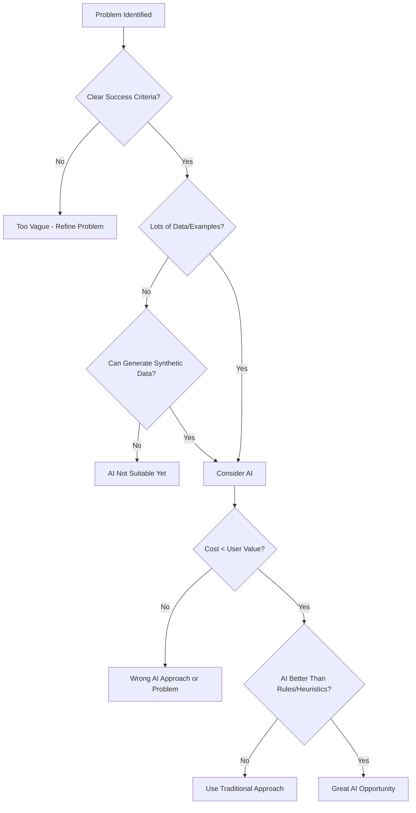
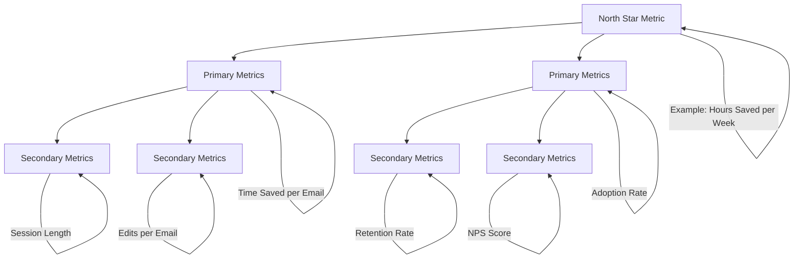
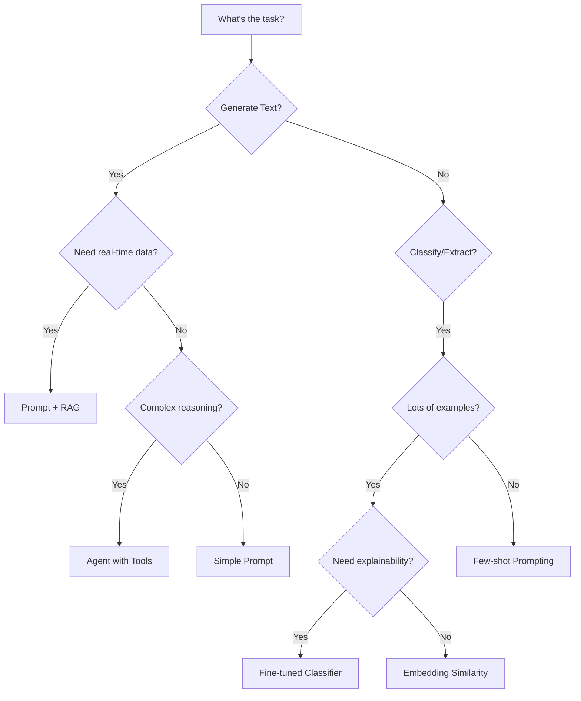

# Product Thinking for AI

Building successful AI products requires more than technical skills. You need to identify real problems, understand users deeply, scope effectively, and make strategic decisions about which AI techniques to apply. This lesson teaches you product thinking frameworks specifically adapted for AI applications.

## Learning Objectives

By the end of this lesson, you'll understand:
- Why product thinking matters more than technical prowess for AI success
- How to identify problems worth solving with AI (vs. traditional solutions)
- User research techniques for understanding AI product needs
- Frameworks for defining success metrics before building
- Scoping strategies to ship AI products quickly
- Decision frameworks for choosing AI techniques based on constraints
- Cost-benefit analysis for AI features
- Building in public and getting early user feedback

## Why Product Thinking Matters

The graveyard of failed AI products is filled with technically impressive projects that solved problems nobody had. Great AI products start with deep user understanding, not the latest model.

### Common AI Product Failures

```typescript
// Anti-pattern: Starting with technology
const failedApproach = {
  thinking: "GPT-4 is amazing, let's build something with it!",
  process: [
    "Choose AI technique first",
    "Look for problems it might solve",
    "Build impressive demo",
    "Wonder why nobody uses it"
  ],
  outcome: "A solution searching for a problem"
}

// Success pattern: Starting with problem
const successfulApproach = {
  thinking: "Users struggle to write professional emails in 30+ minutes",
  process: [
    "Deeply understand the pain point",
    "Validate users will pay to solve it",
    "Evaluate if AI is the right solution",
    "Choose simplest AI technique that works",
    "Ship MVP and iterate"
  ],
  outcome: "A product people actually want"
}
```

### Real-World Examples

**Failed AI Product: "Smart Meeting Summarizer"**
- Technology: GPT-4, RAG, vector embeddings
- Problem: Nobody asked for it, existing tools work fine
- Mistake: Built features, not solutions
- Result: 50 users, 5% retention

**Successful AI Product: "Grain" (Meeting Recorder)**
- Technology: Started with simple transcription + GPT-3.5
- Problem: Sales teams waste 10+ hours/week on meeting notes
- Discovery: Users willing to pay $20/user/month to save time
- Result: $10M+ ARR, 85% retention

The difference? Deep user understanding and ruthless focus on the real problem.

## Identifying Problems Worth Solving

Not all problems are worth solving with AI. The best opportunities have clear pain, willingness to pay, and AI provides unique advantages over traditional solutions.

### Problem Identification Framework

```typescript
interface ProblemEvaluation {
  problem: string
  pain_level: 'low' | 'medium' | 'high' | 'critical'
  frequency: 'rare' | 'weekly' | 'daily' | 'hourly'
  current_solutions: string[]
  willingness_to_pay: number // $/month
  ai_advantage: string
  verdict: 'pursue' | 'explore' | 'skip'
}

// Example: Email Writing Assistant
const emailAssistantEval: ProblemEvaluation = {
  problem: "Professionals spend 2+ hours daily writing emails, struggle with tone",
  pain_level: 'high',
  frequency: 'hourly',
  current_solutions: ['Templates', 'Grammarly', 'Copy-paste'],
  willingness_to_pay: 15,
  ai_advantage: "Understands context, adapts tone, generates personalized content",
  verdict: 'pursue'
}

// Example: AI-Powered Sock Matcher
const sockMatcherEval: ProblemEvaluation = {
  problem: "Finding matching socks takes 30 seconds",
  pain_level: 'low',
  frequency: 'daily',
  current_solutions: ['Looking at socks', 'Buying same socks'],
  willingness_to_pay: 0,
  ai_advantage: "None - visual matching is trivial for humans",
  verdict: 'skip'
}
```

### The "Hair on Fire" Test

```typescript
/**
 * Evaluate if a problem is urgent enough to solve
 * Great products solve "hair on fire" problems
 */
function hairOnFireTest(problem: string): {
  score: number
  recommendation: string
} {
  const questions = [
    "Do users actively search for solutions right now?",
    "Do they cobble together workarounds?",
    "Do they complain about it unprompted?",
    "Would they pay to solve it today?",
    "Does it cause measurable loss (time/money/opportunity)?"
  ]

  // Score: 4-5 = hair on fire, 2-3 = nice-to-have, 0-1 = skip
  return {
    score: 4, // Example
    recommendation: "Strong signal. Users are desperate for solution."
  }
}
```

### AI Suitability Matrix



### Problems AI Excels At

```typescript
const aiStrengths = {
  pattern_recognition: {
    examples: [
      "Categorizing support tickets",
      "Detecting spam/fraud",
      "Identifying code bugs"
    ],
    why_ai: "Too many edge cases for rules, patterns emerge from data"
  },

  content_generation: {
    examples: [
      "Writing product descriptions",
      "Generating email responses",
      "Creating marketing copy"
    ],
    why_ai: "Infinite variations, context-aware, adapts to tone"
  },

  complex_summarization: {
    examples: [
      "Meeting summaries",
      "Research synthesis",
      "Document Q&A"
    ],
    why_ai: "Understands context, extracts key points, handles nuance"
  },

  personalization: {
    examples: [
      "Customized learning paths",
      "Adaptive UI suggestions",
      "Content recommendations"
    ],
    why_ai: "Learns user preferences, adapts over time"
  }
}
```

## User Research for AI Products

AI products have unique research challenges: users don't know what AI can do, they overestimate capabilities, and they struggle to articulate needs around ambiguous tasks.

### Research Techniques

**1. Problem-First Interviews**

```typescript
const interviewScript = {
  setup: "I'm researching how people handle [task], not selling anything",

  questions: [
    {
      q: "Walk me through the last time you [did task]",
      purpose: "Concrete details, not hypotheticals",
      listen_for: "Pain points, workarounds, time spent"
    },
    {
      q: "What's the hardest part about [task]?",
      purpose: "Identify core pain",
      listen_for: "Emotional language ('frustrating', 'waste of time')"
    },
    {
      q: "What have you tried to make this easier?",
      purpose: "Understand current solutions",
      listen_for: "Existing tools, workarounds, willingness to try new things"
    },
    {
      q: "If you could wave a magic wand, how would this work?",
      purpose: "Ideal outcome",
      listen_for: "Must-haves vs nice-to-haves"
    },
    {
      q: "How much time/money does this problem cost you?",
      purpose: "Quantify pain",
      listen_for: "Specific numbers, business impact"
    }
  ],

  avoid: [
    "Would you use an AI tool that...", // Hypothetical
    "What features would you want?", // Leads to feature lists
    "How much would you pay for...", // Unreliable
  ]
}
```

**2. Show, Don't Tell**

```typescript
// Instead of asking "Would you use this?"
// Build a prototype and observe behavior

interface PrototypeTest {
  task: string
  current_method: string
  ai_prototype: string
  metrics: {
    time_saved: number
    quality_improvement: number
    user_satisfaction: number
    actual_usage_rate: number // Most important!
  }
}

const exampleTest: PrototypeTest = {
  task: "Writing performance review summaries",
  current_method: "Manual writing, 45 min/review",
  ai_prototype: "AI draft generation + editing",
  metrics: {
    time_saved: 30, // minutes
    quality_improvement: 0.2, // 20% better rated by managers
    user_satisfaction: 4.5, // /5
    actual_usage_rate: 0.85 // 85% of users adopt it
  }
}
```

**3. The Mom Test**

```typescript
/**
 * The Mom Test: Ask questions your mom can't lie to you about
 * Focus on past behavior, not future intentions
 */
const momTestExamples = {
  bad: [
    "Would you use an AI email writer?", // Polite yes
    "Is this a problem for you?", // Polite sympathy
    "How much would you pay?", // Fake number
  ],

  good: [
    "When's the last time you wrote a difficult email? What made it hard?",
    "How long did you spend on emails last week?",
    "What email tools are in your browser history?",
    "Show me your email drafts folder - what's in there?"
  ]
}
```

### User Research Template

```typescript
interface UserResearchPlan {
  hypothesis: string
  target_users: string[]
  research_methods: ResearchMethod[]
  sample_size: number
  timeline: string
  success_criteria: string
}

const exampleResearchPlan: UserResearchPlan = {
  hypothesis: "Software engineers waste 10+ hours/week explaining code to teammates",
  target_users: [
    "Senior engineers at tech companies (50+ devs)",
    "Engineering managers",
    "Dev advocates"
  ],
  research_methods: [
    {
      method: "User interviews",
      count: 15,
      format: "30-min remote calls",
      focus: "Code review workflow, documentation pain"
    },
    {
      method: "Workflow observation",
      count: 5,
      format: "Screen share during code review",
      focus: "Time spent, context switching"
    },
    {
      method: "Prototype testing",
      count: 10,
      format: "Use AI explainer on real code",
      focus: "Actual time saved, quality of explanations"
    }
  ],
  sample_size: 30,
  timeline: "2 weeks",
  success_criteria: "Validate 10+ hours/week pain, 70%+ say they'd use solution"
}
```

## Defining Success Metrics

Define success metrics before writing code. Metrics guide decisions, prevent scope creep, and tell you when you're done.

### The SMART Framework (Adapted for AI)

```typescript
interface SuccessMetric {
  name: string
  specific: string // Exactly what you're measuring
  measurable: string // How to quantify
  achievable: boolean // Realistic given constraints
  relevant: string // Ties to user value
  time_bound: string // When you'll measure
  target: number
  current: number
}

// Example: AI Email Assistant
const emailMetrics: SuccessMetric[] = [
  {
    name: "Time Saved",
    specific: "Minutes saved per email written using AI vs manual",
    measurable: "Track start time, end time for 100 emails",
    achievable: true,
    relevant: "Primary user value is saving time",
    time_bound: "After 2 weeks of beta usage",
    target: 5, // 5 min saved per email
    current: 0
  },
  {
    name: "Adoption Rate",
    specific: "% of users who use AI for &gt;50% of emails after onboarding",
    measurable: "Track AI usage vs total emails sent",
    achievable: true,
    relevant: "Shows product is better than manual",
    time_bound: "After 4 weeks",
    target: 0.70, // 70% adoption
    current: 0
  },
  {
    name: "Quality Score",
    specific: "User-rated quality of AI-generated emails (1-5 scale)",
    measurable: "In-app rating after sending",
    achievable: true,
    relevant: "Must maintain quality to save time",
    time_bound: "Ongoing",
    target: 4.0,
    current: 0
  },
  {
    name: "Cost per User",
    specific: "Total AI API costs / MAU",
    measurable: "Track API usage, user count",
    achievable: true,
    relevant: "Must be profitable at target price ($15/mo)",
    time_bound: "After 1 month",
    target: 3, // $3/user/month
    current: 0
  }
]
```

### Metric Hierarchy



### Tracking Implementation

```typescript
/**
 * Metric tracking system for AI product
 */
interface MetricEvent {
  user_id: string
  event: string
  timestamp: Date
  metadata: Record<string, any>
}

class MetricsTracker {
  // Track time saved
  trackEmailSession(userId: string, startTime: Date, endTime: Date, usedAI: boolean) {
    const duration = (endTime.getTime() - startTime.getTime()) / 1000 / 60 // minutes

    this.logEvent({
      user_id: userId,
      event: 'email_completed',
      timestamp: new Date(),
      metadata: {
        duration_minutes: duration,
        used_ai: usedAI,
        baseline: 15 // avg time without AI
      }
    })
  }

  // Track quality
  trackQualityRating(userId: string, emailId: string, rating: number) {
    this.logEvent({
      user_id: userId,
      event: 'quality_rating',
      timestamp: new Date(),
      metadata: {
        email_id: emailId,
        rating: rating,
        scale: 5
      }
    })
  }

  // Track adoption
  trackAIUsage(userId: string, totalEmails: number, aiEmails: number) {
    this.logEvent({
      user_id: userId,
      event: 'weekly_usage',
      timestamp: new Date(),
      metadata: {
        total_emails: totalEmails,
        ai_emails: aiEmails,
        adoption_rate: aiEmails / totalEmails
      }
    })
  }

  // Calculate weekly metrics
  async getWeeklyMetrics(): Promise<{
    avg_time_saved: number
    avg_quality: number
    adoption_rate: number
    cost_per_user: number
  }> {
    // Implementation: Query events, aggregate data
    return {
      avg_time_saved: 6.2,
      avg_quality: 4.3,
      adoption_rate: 0.73,
      cost_per_user: 2.85
    }
  }

  private logEvent(event: MetricEvent) {
    // Send to analytics platform
    console.log('[METRIC]', event)
  }
}
```

## Scoping for Speed

The best AI products ship fast, learn, and iterate. Scope ruthlessly to ship your MVP in 2-4 weeks, not 2-4 months.

### MVP Scoping Framework

```typescript
interface FeatureScope {
  feature: string
  user_value: 'critical' | 'important' | 'nice-to-have'
  complexity: 'simple' | 'medium' | 'complex'
  mvp_decision: 'must-have' | 'v2' | 'skip'
  rationale: string
}

// Example: AI Code Explainer MVP
const codeExplainerScope: FeatureScope[] = [
  {
    feature: "Explain any code snippet",
    user_value: 'critical',
    complexity: 'simple',
    mvp_decision: 'must-have',
    rationale: "Core value prop, can implement with single GPT-4 call"
  },
  {
    feature: "Interactive Q&A about code",
    user_value: 'important',
    complexity: 'medium',
    mvp_decision: 'v2',
    rationale: "Adds value but not critical for first use, requires conversation state"
  },
  {
    feature: "Support 50+ languages",
    user_value: 'important',
    complexity: 'simple',
    mvp_decision: 'must-have',
    rationale: "GPT-4 already handles this, no extra work"
  },
  {
    feature: "Generate architecture diagrams",
    user_value: 'nice-to-have',
    complexity: 'complex',
    mvp_decision: 'skip',
    rationale: "Cool but not core value, complex integration with Mermaid/D2"
  },
  {
    feature: "Team collaboration features",
    user_value: 'important',
    complexity: 'complex',
    mvp_decision: 'v2',
    rationale: "Important for enterprise but can validate solo use first"
  },
  {
    feature: "CLI tool",
    user_value: 'critical',
    complexity: 'simple',
    mvp_decision: 'must-have',
    rationale: "Target users are devs, CLI is natural interface"
  }
]

// MVP Scope: 3 must-have features, ship in 2 weeks
```

### The 80/20 Rule for AI Products

```typescript
/**
 * Focus on 20% of features that deliver 80% of value
 */
const eightyTwentyAnalysis = {
  total_possible_features: 25,
  mvp_features: 5, // 20%
  user_value_delivered: 0.80, // 80%

  how_to_identify: [
    "What's the one thing users can't live without?",
    "What's the simplest version that solves the core problem?",
    "What can we test with fake doors or manual processes?",
    "What features exist just to impress, not to solve problems?"
  ],

  example_cuts: {
    "Multi-language support": "Start with English only",
    "Advanced customization": "Use smart defaults",
    "Team features": "Single-player mode first",
    "Mobile app": "Web-first, mobile later",
    "AI model selection": "Use GPT-4 for everything, optimize later"
  }
}
```

### Time-boxed Development

```typescript
interface SprintPlan {
  week: number
  goal: string
  deliverable: string
  success_metric: string
}

const fourWeekMVP: SprintPlan[] = [
  {
    week: 1,
    goal: "Validate core AI capability",
    deliverable: "Script that explains code using Claude API",
    success_metric: "10 developers say explanations are helpful"
  },
  {
    week: 2,
    goal: "Build minimal interface",
    deliverable: "CLI tool that accepts code files",
    success_metric: "5 developers use it for real work"
  },
  {
    week: 3,
    goal: "Add essential UX",
    deliverable: "Syntax highlighting, copy/paste, error handling",
    success_metric: "Users can complete workflow without manual help"
  },
  {
    week: 4,
    goal: "Deploy and get feedback",
    deliverable: "Public npm package, landing page, 50 beta users",
    success_metric: "20+ users provide feedback, 10+ become weekly active"
  }
]
```

## Choosing the Right AI Technique

Different problems need different AI approaches. Choose based on constraints, not hype.

### Decision Tree



### Technique Selection Matrix

```typescript
interface TechniqueEvaluation {
  technique: string
  best_for: string[]
  cost: 'low' | 'medium' | 'high'
  complexity: 'simple' | 'medium' | 'complex'
  accuracy: 'variable' | 'good' | 'excellent'
  latency: string
  when_to_use: string
}

const techniqueComparison: TechniqueEvaluation[] = [
  {
    technique: "Simple Prompting",
    best_for: ["Content generation", "Summarization", "Simple Q&A"],
    cost: 'low',
    complexity: 'simple',
    accuracy: 'good',
    latency: "1-3s",
    when_to_use: "Default choice for most text tasks, start here"
  },
  {
    technique: "Few-shot Prompting",
    best_for: ["Formatting", "Classification", "Style matching"],
    cost: 'medium',
    complexity: 'simple',
    accuracy: 'good',
    latency: "2-5s",
    when_to_use: "Need consistent output format, have 3-10 examples"
  },
  {
    technique: "RAG (Retrieval)",
    best_for: ["Document Q&A", "Knowledge bases", "Context-specific answers"],
    cost: 'medium',
    complexity: 'medium',
    accuracy: 'excellent',
    latency: "3-6s",
    when_to_use: "Need up-to-date or proprietary information"
  },
  {
    technique: "Agents (Tool Use)",
    best_for: ["Multi-step tasks", "Research", "Complex workflows"],
    cost: 'high',
    complexity: 'complex',
    accuracy: 'variable',
    latency: "10-60s",
    when_to_use: "Task requires planning, multiple tools, iteration"
  },
  {
    technique: "Fine-tuning",
    best_for: ["Specialized tone", "Domain-specific tasks", "High volume"],
    cost: 'high',
    complexity: 'complex',
    accuracy: 'excellent',
    latency: "1-2s",
    when_to_use: "Have 1000+ examples, high volume justifies upfront cost"
  }
]
```

### Real-World Technique Choices

```typescript
// Use Case: Customer Support Bot
const supportBotDecision = {
  initial_idea: "Build agent with 10 tools, fine-tuned model, vector DB",
  reality_check: {
    volume: "50 tickets/day",
    budget: "$500/month",
    timeline: "2 weeks"
  },
  right_choice: {
    technique: "RAG with simple prompting",
    rationale: "Low volume doesn't justify fine-tuning, most questions answered in docs",
    implementation: "Embed docs, retrieve context, generate response with GPT-4",
    cost: "$150/month",
    accuracy: "85%"
  },
  avoided_overengineering: [
    "Fine-tuning: $2000 upfront, not justified",
    "Complex agent: Weeks to build, unnecessary for straightforward Q&A",
    "Custom model: No benefit over GPT-4 for this use case"
  ]
}

// Use Case: Code Generation Tool
const codeGenDecision = {
  initial_idea: "Simple prompting",
  reality_check: {
    accuracy_needed: "95%+",
    style_consistency: "Must match company conventions",
    volume: "10,000 requests/day"
  },
  right_choice: {
    technique: "Fine-tuned model",
    rationale: "High volume, strict style requirements, ROI on fine-tuning",
    implementation: "Fine-tune on 5000 examples of company code",
    cost: "$1500 upfront, $300/month",
    accuracy: "96%"
  },
  why_not_prompting: "Inconsistent style, too expensive at volume"
}
```

## Cost-Benefit Analysis

AI products have unique cost structures: mostly variable (API costs scale with usage), upfront experimentation costs, and hidden costs (latency, errors).

### Total Cost of Ownership

```typescript
interface AICostModel {
  development: {
    research_weeks: number
    engineering_weeks: number
    hourly_rate: number
    total: number
  }
  monthly_operating: {
    ai_api: number
    hosting: number
    monitoring: number
    other_apis: number
    total: number
  }
  per_request: {
    input_tokens: number
    output_tokens: number
    cost_per_1m_tokens: number
    avg_cost: number
  }
  hidden_costs: {
    error_handling: number
    latency_optimization: number
    quality_monitoring: number
  }
}

const emailAssistantCosts: AICostModel = {
  development: {
    research_weeks: 2,
    engineering_weeks: 4,
    hourly_rate: 100,
    total: 24000 // 6 weeks * 40 hrs * $100
  },
  monthly_operating: {
    ai_api: 500, // Based on 1000 MAU * 50 emails/mo
    hosting: 50, // Vercel Pro
    monitoring: 30, // Sentry
    other_apis: 0,
    total: 580
  },
  per_request: {
    input_tokens: 500, // Context + email draft
    output_tokens: 300, // Generated email
    cost_per_1m_tokens: 15, // GPT-4
    avg_cost: 0.012 // $0.012 per email
  },
  hidden_costs: {
    error_handling: 1000, // Dealing with API failures, edge cases
    latency_optimization: 2000, // Making it feel fast
    quality_monitoring: 1500 // Evaluating output quality
  }
}

// Break-even analysis
const breakEven = {
  price_per_user: 15, // $/month
  variable_cost_per_user: 0.58, // API + hosting / MAU
  contribution_margin: 14.42, // $15 - $0.58
  fixed_costs: 28500, // Development + hidden costs
  break_even_users: Math.ceil(28500 / 14.42), // 1976 users
  break_even_months: 12 // Assume 165 new users/month
}
```

### Value Calculation

```typescript
/**
 * Calculate user value to justify pricing
 */
interface ValueCalculation {
  time_saved_hours_per_month: number
  user_hourly_value: number
  monthly_value_created: number
  price_per_month: number
  value_to_price_ratio: number
}

const emailAssistantValue: ValueCalculation = {
  time_saved_hours_per_month: 8, // 5min/email * 100 emails/month
  user_hourly_value: 75, // Average professional wage
  monthly_value_created: 600, // 8 hours * $75
  price_per_month: 15,
  value_to_price_ratio: 40 // 40x value
}

// Rule of thumb: Capture 10-20% of value created
// $600 value created -> $60-120 fair price
// Pricing at $15 leaves massive value on table -> room to grow
```

### Optimization Strategies

```typescript
const costOptimization = {
  quick_wins: [
    {
      strategy: "Prompt caching",
      savings: "40% reduction in input tokens",
      effort: "Low - Claude API supports this",
      impact: "$200/month saved"
    },
    {
      strategy: "Use GPT-4-mini for simple tasks",
      savings: "10x cheaper for classification",
      effort: "Low - separate endpoint",
      impact: "$150/month saved"
    },
    {
      strategy: "Batch processing",
      savings: "Reduce API calls by grouping",
      effort: "Medium - change UX",
      impact: "$100/month saved"
    }
  ],

  advanced: [
    {
      strategy: "Fine-tune smaller model",
      savings: "5x cheaper inference",
      effort: "High - need training data",
      impact: "$300/month saved, $2000 upfront"
    },
    {
      strategy: "Aggressive caching",
      savings: "50% fewer API calls",
      effort: "Medium - Redis setup",
      impact: "$250/month saved"
    }
  ]
}
```

## Building in Public

Launch early, gather feedback continuously, and iterate based on real usage. Building in public accelerates learning and builds community.

### Public Launch Strategy

```typescript
interface LaunchPlan {
  phase: string
  timeline: string
  audience: string
  goal: string
  channels: string[]
  content: string
}

const launchPhases: LaunchPlan[] = [
  {
    phase: "Alpha (Private)",
    timeline: "Week 1-2",
    audience: "5 close friends/colleagues",
    goal: "Validate core functionality, find breaking bugs",
    channels: ["Direct outreach"],
    content: "DM: 'Building X, would love your brutal feedback on early version'"
  },
  {
    phase: "Beta (Semi-public)",
    timeline: "Week 3-4",
    audience: "50 target users from network",
    goal: "Validate value prop, gather testimonials",
    channels: ["Twitter", "LinkedIn", "Email"],
    content: "Post: 'Built an AI tool for X. Looking for 50 beta users. DM for access.'"
  },
  {
    phase: "Public Launch",
    timeline: "Week 5",
    audience: "Anyone interested",
    goal: "Drive awareness, get first 500 users",
    channels: ["Product Hunt", "Hacker News", "Reddit", "Twitter"],
    content: "Launch post with demo video, use cases, testimonials"
  },
  {
    phase: "Continuous",
    timeline: "Week 6+",
    audience: "Growing user base",
    goal: "Build in public, share learnings",
    channels: ["Twitter threads", "Blog posts"],
    content: "Weekly updates: metrics, learnings, feature releases"
  }
]
```

### Building in Public Content

```typescript
const buildInPublicPosts = {
  week_1: {
    type: "Progress update",
    example: "Week 1 building AI Code Explainer:\n✅ Core prompt works (85% helpful)\n✅ CLI tool functional\n❌ Terrible error handling\n❌ 8 second latency\n\nNext week: Speed & polish\n\nBuilding in public. Follow along 👇"
  },

  week_2: {
    type: "Learning share",
    example: "TIL: GPT-4 responses for code are 40% faster with streaming.\n\nWent from 8s to 3s perceived latency.\n\nCode:\n[snippet]\n\nBuilding an AI code explainer, sharing what I learn."
  },

  week_3: {
    type: "User feedback",
    example: "Got incredible feedback from 10 beta users:\n\n😍 'Saves me 2hrs/week on code reviews'\n🤔 'Confused on how to use for debugging'\n💡 'Add support for full repos, not just files'\n\nShipping fixes this week."
  },

  week_4: {
    type: "Metrics",
    example: "4 weeks building AI Code Explainer:\n\n👥 50 beta users\n⏱️ Avg 1.2hrs saved/week\n💬 94% say they'll keep using\n💰 $50 in API costs\n\nLaunching publicly next week on Product Hunt!"
  }
}
```

### Feedback Collection

```typescript
/**
 * Systematic feedback collection
 */
class FeedbackSystem {
  // In-app feedback
  collectInAppFeedback() {
    return {
      trigger: "After 3rd use",
      question: "What's the most valuable thing about this tool?",
      format: "Open text + 1-5 rating",
      follow_up: "What would make it even better?"
    }
  }

  // User interviews
  scheduleInterviews() {
    return {
      frequency: "5 users per week",
      selection: "Mix of power users and churned users",
      duration: "20 minutes",
      questions: [
        "Walk me through how you used it this week",
        "What problem were you trying to solve?",
        "What almost made you stop using it?",
        "What would you pay for this?"
      ]
    }
  }

  // Analytics
  trackBehavior() {
    return {
      key_events: [
        "First use",
        "Third use (activation)",
        "Weekly active",
        "Feature usage",
        "Churn indicators"
      ],
      segments: [
        "Power users (daily)",
        "Regular users (weekly)",
        "At-risk (no use in 2 weeks)"
      ]
    }
  }
}
```

## Case Study: Successful AI Product Launch

**Product: "ExplainDev" - AI Code Explainer**

### Week-by-Week Journey

```typescript
const explainDevJourney = {
  week_0: {
    insight: "Spent 10 hours explaining code to junior devs this week",
    validation: "Talked to 15 engineers - all had same problem",
    decision: "Build AI code explainer"
  },

  week_1: {
    built: "Python script with Claude API",
    tested: "Explained 50 code snippets to 5 devs",
    learned: "85% said explanations were helpful, wanted CLI tool",
    decision: "Build CLI, focus on dev workflow"
  },

  week_2: {
    built: "npm package, CLI tool",
    tested: "20 developers installed it",
    learned: "12 used it daily, loved 1-command simplicity",
    decision: "Polish UX, add syntax highlighting"
  },

  week_3: {
    built: "Better UX, error handling, tests",
    launched: "Posted on Twitter, got 500 stars on GitHub",
    learned: "Viral tweet: 'Stop reading docs, just run `explain-dev file.py`'",
    decision: "Launch on Product Hunt next week"
  },

  week_4: {
    launched: "Product Hunt #2 Product of the Day",
    metrics: {
      users: 2500,
      weekly_active: 800,
      avg_time_saved: "1.5 hrs/week",
      testimonials: 50
    },
    learned: "Enterprises asking for team features, API access",
    decision: "Build team plan ($50/user/month), API for $200/month"
  },

  month_3: {
    metrics: {
      users: 15000,
      paying_customers: 120,
      mrr: 8400,
      churn: 0.05
    },
    outcome: "Quit job to work on ExplainDev full-time"
  }
}
```

### Key Success Factors

1. **Started with clear problem**: Engineers waste time explaining code
2. **Validated before building**: 15 interviews confirmed pain
3. **Shipped MVP in 2 weeks**: CLI tool, not complex web app
4. **Built in public**: Weekly updates built audience
5. **Listened to users**: Team features came from user requests, not assumptions
6. **Focused on metrics**: Time saved, not vanity metrics

## Exercises

### Exercise 1: Problem Identification

Identify 3 problems you experience regularly. Evaluate each using the problem evaluation framework. Which is most suitable for an AI solution?

```typescript
// Your solution
const myProblems: ProblemEvaluation[] = [
  // Fill in your 3 problems
]
```

### Exercise 2: User Research Plan

Create a research plan for your chosen problem. Who will you talk to? What questions will you ask? What's your success criteria?

### Exercise 3: MVP Scoping

List 10 possible features for your AI product. Categorize as must-have, v2, or skip. What's your 2-week MVP?

### Exercise 4: Metrics Definition

Define 3-5 SMART metrics for your product. How will you track them? What are your targets?

### Exercise 5: Cost-Benefit Analysis

Estimate costs (development, API, hosting) and value created (time saved, revenue generated). What's your break-even point?

## Summary

Product thinking separates successful AI products from technical demos:

1. **Start with problems, not technology**: Validate pain before building
2. **Do user research**: Talk to users, observe behavior, show prototypes
3. **Define metrics first**: Know what success looks like before writing code
4. **Scope ruthlessly**: Ship 2-week MVP, not 2-month masterpiece
5. **Choose simple techniques**: Start with prompts, add complexity only when needed
6. **Calculate costs and value**: Ensure unit economics work
7. **Build in public**: Launch early, gather feedback, iterate fast

The best AI products solve real problems for real users. Technology is just the implementation detail.

## Additional Resources

- [The Mom Test](http://momtestbook.com/) by Rob Fitzpatrick
- [Lean Product Playbook](https://leanproductplaybook.com/) by Dan Olsen
- [Good Strategy, Bad Strategy](https://www.goodreads.com/book/show/11721966-good-strategy-bad-strategy) by Richard Rumelt
- [AI Product Engineering](https://www.latent.space/p/ai-engineer) by Latent Space
- [OpenAI Cookbook - Production Best Practices](https://cookbook.openai.com/)

## Next Steps

Now that you understand product thinking for AI, the next lesson covers **Architecture Design Patterns** - how to structure your AI application for scale, maintainability, and success.
