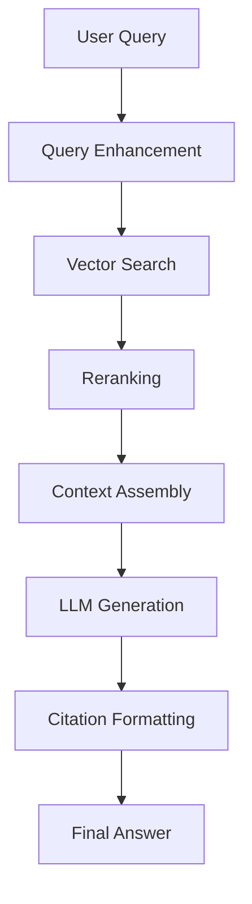

# Sprint 2: RAG System Implementation Plan

> **For Claude:** REQUIRED SUB-SKILL: Use superpowers:executing-plans to implement this plan task-by-task.

**Goal:** Implement Sprint 2 (RAG System) with minimal vector DB infrastructure and complete learning content (3 concepts, 4 labs, 1 project spec).

**Architecture:** Hybrid approach - add pgvector to existing PostgreSQL (no new DB), create Sprint 2 MDX content following Sprint 1 structure, extend lab infrastructure for RAG exercises.

**Tech Stack:** PostgreSQL + pgvector extension, Prisma, Next.js 14, TypeScript, MDX, Claude API

---

## Task 1: Add Vector Database Support (pgvector)

**Files:**
- Modify: `prisma/schema.prisma`
- Create: `prisma/migrations/[timestamp]_add_pgvector_support/migration.sql`
- Create: `lib/vector-db.ts`

**Step 1: Enable pgvector extension in Prisma schema**

Add to top of `prisma/schema.prisma` after datasource block:

```prisma
datasource db {
  provider = "postgresql"
  url      = env("DATABASE_URL")
  extensions = [pgvector(map: "vector")]
}
```

**Step 2: Add Document and DocumentChunk models**

Add to `prisma/schema.prisma`:

```prisma
model Document {
  id          String   @id @default(cuid())
  userId      String
  title       String
  fileName    String
  fileSize    Int
  contentType String
  createdAt   DateTime @default(now())

  user   User            @relation(fields: [userId], references: [id], onDelete: Cascade)
  chunks DocumentChunk[]

  @@index([userId, createdAt])
}

model DocumentChunk {
  id            String                        @id @default(cuid())
  documentId    String
  content       String                        @db.Text
  embedding     Unsupported("vector(1536)")?
  chunkIndex    Int
  pageNumber    Int?
  metadata      Json?
  createdAt     DateTime                      @default(now())

  document Document @relation(fields: [documentId], references: [id], onDelete: Cascade)

  @@index([documentId, chunkIndex])
}
```

Add to User model relations:

```prisma
documents  Document[]
```

**Step 3: Create migration**

Run:
```bash
npx prisma migrate dev --name add_pgvector_support
```

Expected: Migration created successfully

**Step 4: Create vector database utility**

Create `lib/vector-db.ts`:

```typescript
import { prisma } from './db'

/**
 * Generate embedding using Claude's text-embedding model
 * Note: Claude doesn't have embeddings API, so we'll use a placeholder
 * In production, use OpenAI embeddings or Voyage AI
 */
export async function generateEmbedding(text: string): Promise<number[]> {
  // TODO: Replace with actual embedding API call
  // For now, return a dummy 1536-dimension vector
  return Array(1536).fill(0).map(() => Math.random())
}

/**
 * Search for similar chunks using cosine similarity
 */
export async function searchSimilarChunks(
  query: string,
  limit: number = 5,
  userId?: string
): Promise<any[]> {
  const queryEmbedding = await generateEmbedding(query)

  // For now, return empty array until we implement proper vector search
  // This will be enhanced in the labs
  return []
}

/**
 * Store document chunks with embeddings
 */
export async function storeDocumentChunks(
  documentId: string,
  chunks: { content: string; chunkIndex: number; pageNumber?: number }[]
): Promise<void> {
  for (const chunk of chunks) {
    const embedding = await generateEmbedding(chunk.content)

    await prisma.documentChunk.create({
      data: {
        documentId,
        content: chunk.content,
        chunkIndex: chunk.chunkIndex,
        pageNumber: chunk.pageNumber,
        embedding: `[${embedding.join(',')}]` as any, // pgvector format
      },
    })
  }
}

/**
 * Chunk text into optimal segments
 * Simple implementation - can be enhanced in labs
 */
export function chunkText(
  text: string,
  chunkSize: number = 500,
  overlap: number = 50
): string[] {
  const chunks: string[] = []
  let start = 0

  while (start < text.length) {
    const end = Math.min(start + chunkSize, text.length)
    chunks.push(text.slice(start, end))
    start = end - overlap
  }

  return chunks
}
```

**Step 5: Commit**

```bash
git add prisma/schema.prisma prisma/migrations lib/vector-db.ts
git commit -m "feat: add pgvector support for RAG system

- Enable pgvector extension in Prisma
- Add Document and DocumentChunk models
- Create vector database utilities
- Implement basic chunking and embedding functions

Co-Authored-By: Claude Sonnet 4.5 <noreply@anthropic.com>"
```

---

## Task 2: Create Sprint 2 Content Structure

**Files:**
- Create: `content/sprints/sprint-2/metadata.json`
- Create: `content/sprints/sprint-2/concepts/` (directory)

**Step 1: Create sprint-2 directory structure**

Run:
```bash
mkdir -p content/sprints/sprint-2/concepts
```

**Step 2: Create Sprint 2 metadata**

Create `content/sprints/sprint-2/metadata.json`:

```json
{
  "id": "sprint-2",
  "title": "RAG System (Retrieval-Augmented Generation)",
  "description": "Build intelligent document Q&A systems with vector search and citation tracking",
  "order": 2,
  "concepts": [
    {
      "id": "vector-embeddings",
      "title": "Vector Embeddings & Similarity Search",
      "description": "Learn how to convert text to vectors and find semantically similar content",
      "difficulty": "intermediate",
      "estimatedMinutes": 60,
      "order": 1,
      "prerequisites": ["llm-fundamentals"],
      "tags": ["rag", "embeddings", "vectors", "similarity-search"]
    },
    {
      "id": "chunking-strategies",
      "title": "Chunking Strategies & Document Processing",
      "description": "Master techniques for breaking documents into optimal chunks for retrieval",
      "difficulty": "intermediate",
      "estimatedMinutes": 60,
      "order": 2,
      "prerequisites": ["vector-embeddings"],
      "tags": ["rag", "chunking", "preprocessing", "document-processing"]
    },
    {
      "id": "retrieval-pipelines",
      "title": "Retrieval Pipelines & Citation Tracking",
      "description": "Build end-to-end RAG systems with proper source attribution",
      "difficulty": "advanced",
      "estimatedMinutes": 90,
      "order": 3,
      "prerequisites": ["vector-embeddings", "chunking-strategies"],
      "tags": ["rag", "pipeline", "citations", "production"]
    }
  ]
}
```

**Step 3: Commit**

```bash
git add content/sprints/sprint-2/metadata.json
git commit -m "feat: add Sprint 2 metadata structure

Co-Authored-By: Claude Sonnet 4.5 <noreply@anthropic.com>"
```

---

## Task 3: Create Concept 1 - Vector Embeddings

**Files:**
- Create: `content/sprints/sprint-2/concepts/vector-embeddings.mdx`

**Step 1: Write vector embeddings concept**

Create `content/sprints/sprint-2/concepts/vector-embeddings.mdx`:

```mdx
---
id: vector-embeddings
title: Vector Embeddings & Similarity Search
description: Learn how to convert text to vectors and find semantically similar content
difficulty: intermediate
estimatedMinutes: 60
order: 1
prerequisites: [llm-fundamentals]
tags: [rag, embeddings, vectors, similarity-search]
---

# Vector Embeddings & Similarity Search

RAG (Retrieval-Augmented Generation) systems rely on finding relevant information to answer questions. Vector embeddings are the key technology that makes semantic search possible.

## What are Vector Embeddings?

A **vector embedding** is a numerical representation of text that captures its semantic meaning. Instead of comparing words character-by-character, embeddings let us compare the *meaning* of text.

### Key Characteristics

- **Dense vectors**: Typically 768-1536 dimensions (numbers)
- **Semantic similarity**: Similar meanings → similar vectors
- **Learned representations**: Trained on massive text corpora
- **Language agnostic**: Works across languages

## How Embeddings Work


### The Process

1. **Input**: "What is machine learning?"
2. **Embedding Model**: Converts to vector `[0.23, -0.45, 0.67, ...]`
3. **Storage**: Saved in vector database
4. **Search**: Find vectors close to query vector

## Similarity Metrics

### Cosine Similarity

Measures the angle between two vectors (most common for text):

```
similarity = (A · B) / (||A|| × ||B||)
```

- Range: -1 to 1
- 1 = identical meaning
- 0 = unrelated
- -1 = opposite meaning

### Euclidean Distance

Measures straight-line distance between vectors:

```
distance = √(Σ(A_i - B_i)²)
```

- Lower distance = more similar
- Used when magnitude matters

### Dot Product

Fast similarity measure:

```
similarity = Σ(A_i × B_i)
```

- Higher value = more similar
- Efficient for normalized vectors

## Popular Embedding Models

### OpenAI Embeddings
- **Model**: `text-embedding-3-small`, `text-embedding-3-large`
- **Dimensions**: 1536 (configurable)
- **Cost**: $0.02 per 1M tokens
- **Best for**: General purpose, multilingual

### Voyage AI
- **Model**: `voyage-2`, `voyage-code-2`
- **Dimensions**: 1024
- **Cost**: $0.10 per 1M tokens
- **Best for**: Higher quality, specialized domains

### Cohere Embed
- **Model**: `embed-english-v3.0`
- **Dimensions**: 1024
- **Cost**: Free tier available
- **Best for**: Budget-friendly projects

## Vector Databases

### Purpose-Built Vector DBs

**Pinecone**
- Fully managed, serverless
- Easy to use, scales automatically
- Good free tier (1M vectors)

**Weaviate**
- Open source, self-hosted
- Supports hybrid search (vector + keyword)
- GraphQL API

**Qdrant**
- Open source, Rust-based
- Fast performance
- Docker-friendly

### PostgreSQL + pgvector

**Pros**:
- Use existing PostgreSQL database
- No new infrastructure
- Familiar SQL interface
- Good for <1M vectors

**Cons**:
- Not as fast as purpose-built DBs
- Limited scaling compared to Pinecone

## Building a Simple Semantic Search

### Step 1: Generate Embeddings

```typescript
import OpenAI from 'openai'

const openai = new OpenAI()

async function getEmbedding(text: string): Promise<number[]> {
  const response = await openai.embeddings.create({
    model: 'text-embedding-3-small',
    input: text,
  })

  return response.data[0].embedding
}
```

### Step 2: Store in Database

```typescript
import { prisma } from '@/lib/db'

async function storeDocument(
  content: string,
  metadata: { title: string; source: string }
) {
  const embedding = await getEmbedding(content)

  await prisma.documentChunk.create({
    data: {
      content,
      embedding: `[${embedding.join(',')}]`,
      metadata,
    },
  })
}
```

### Step 3: Semantic Search

```sql
-- Using pgvector cosine similarity
SELECT
  content,
  1 - (embedding <=> '[query_vector]') AS similarity
FROM document_chunks
ORDER BY embedding <=> '[query_vector]'
LIMIT 5;
```

## Common Pitfalls

### 1. Not Normalizing Vectors

Always normalize vectors before cosine similarity if your embedding model doesn't do it automatically.

### 2. Ignoring Context Window

Embeddings work best on ~500 token chunks. Don't embed entire documents.

### 3. Wrong Similarity Metric

- Text: Use cosine similarity
- Images: Use Euclidean distance
- Don't mix metrics

### 4. No Reranking

Initial vector search returns ~20-50 results. Use a reranker for final top-5.

## Real-World Applications

### Document Q&A
"Which contract mentions payment terms?"
→ Find relevant contract chunks
→ LLM answers with context

### Code Search
"Find functions that handle authentication"
→ Search codebase semantically
→ More accurate than keyword search

### Customer Support
"How do I reset my password?"
→ Find relevant help articles
→ Generate personalized answer

## Best Practices

1. **Chunk strategically**: 200-500 tokens per chunk
2. **Include metadata**: Store title, source, page number
3. **Batch embed**: Process multiple chunks together
4. **Cache embeddings**: Don't re-embed the same text
5. **Monitor costs**: Track embedding API usage

## Next Steps

In the next lesson, you'll learn chunking strategies to prepare documents for optimal retrieval performance.

## Resources

- [OpenAI Embeddings Guide](https://platform.openai.com/docs/guides/embeddings)
- [Vector Database Comparison](https://www.pinecone.io/learn/vector-database/)
- [pgvector Documentation](https://github.com/pgvector/pgvector)
```

**Step 2: Commit**

```bash
git add content/sprints/sprint-2/concepts/vector-embeddings.mdx
git commit -m "feat: add vector embeddings concept content

Co-Authored-By: Claude Sonnet 4.5 <noreply@anthropic.com>"
```

---

## Task 4: Create Concept 2 - Chunking Strategies

**Files:**
- Create: `content/sprints/sprint-2/concepts/chunking-strategies.mdx`

**Step 1: Write chunking strategies concept**

Create `content/sprints/sprint-2/concepts/chunking-strategies.mdx`:

```mdx
---
id: chunking-strategies
title: Chunking Strategies & Document Processing
description: Master techniques for breaking documents into optimal chunks for retrieval
difficulty: intermediate
estimatedMinutes: 60
order: 2
prerequisites: [vector-embeddings]
tags: [rag, chunking, preprocessing, document-processing]
---

# Chunking Strategies & Document Processing

The quality of your RAG system depends heavily on how you chunk documents. Good chunking improves retrieval accuracy and answer quality.

## Why Chunking Matters

### The Problem

LLMs have context limits, but documents can be huge:
- 100-page PDF = 50,000+ tokens
- Can't embed entire document as one vector
- Can't fit entire document in LLM context

### The Solution

Break documents into **chunks**: smaller, self-contained segments that can be:
- Embedded individually
- Retrieved independently
- Fit in LLM context window

## Chunking Trade-offs

### Chunk Size

**Small Chunks (100-200 tokens)**
- ✅ More precise retrieval
- ✅ Less noise in context
- ❌ May lose broader context
- ❌ More chunks to manage

**Large Chunks (500-1000 tokens)**
- ✅ More context per chunk
- ✅ Fewer chunks to store
- ❌ Less precise retrieval
- ❌ More irrelevant info

**Sweet Spot**: 200-500 tokens (~150-400 words)

### Overlap

**Purpose**: Ensure important info isn't split across chunk boundaries

```
Chunk 1: [0...500] tokens
Chunk 2: [450...950] tokens  ← 50 token overlap
Chunk 3: [900...1400] tokens
```

**Typical overlap**: 10-20% of chunk size (50-100 tokens)

## Chunking Strategies

### 1. Fixed-Size Chunking

Split text every N tokens/characters:

```typescript
function fixedSizeChunk(
  text: string,
  chunkSize: number = 500,
  overlap: number = 50
): string[] {
  const chunks: string[] = []
  let start = 0

  while (start < text.length) {
    const end = Math.min(start + chunkSize, text.length)
    chunks.push(text.slice(start, end))
    start = end - overlap
  }

  return chunks
}
```

**Pros**: Simple, predictable
**Cons**: May split sentences/paragraphs awkwardly

**Best for**: Unstructured text, quick prototypes

### 2. Sentence-Aware Chunking

Respect sentence boundaries:

```typescript
function sentenceAwareChunk(
  text: string,
  targetSize: number = 500
): string[] {
  const sentences = text.match(/[^.!?]+[.!?]+/g) || []
  const chunks: string[] = []
  let currentChunk = ''

  for (const sentence of sentences) {
    if ((currentChunk + sentence).length > targetSize && currentChunk) {
      chunks.push(currentChunk.trim())
      currentChunk = sentence
    } else {
      currentChunk += sentence
    }
  }

  if (currentChunk) chunks.push(currentChunk.trim())
  return chunks
}
```

**Pros**: Natural boundaries, coherent chunks
**Cons**: Variable chunk sizes

**Best for**: Articles, blog posts, general prose

### 3. Paragraph-Based Chunking

Use paragraph breaks as natural boundaries:

```typescript
function paragraphChunk(
  text: string,
  targetSize: number = 500
): string[] {
  const paragraphs = text.split(/\n\n+/)
  const chunks: string[] = []
  let currentChunk = ''

  for (const para of paragraphs) {
    if ((currentChunk + para).length > targetSize && currentChunk) {
      chunks.push(currentChunk.trim())
      currentChunk = para
    } else {
      currentChunk += '\n\n' + para
    }
  }

  if (currentChunk) chunks.push(currentChunk.trim())
  return chunks
}
```

**Pros**: Preserves document structure
**Cons**: Variable sizes, some paragraphs too large

**Best for**: Structured documents, markdown

### 4. Semantic Chunking

Use NLP to find topically coherent segments:

```typescript
// Conceptual example - requires ML model
async function semanticChunk(text: string): Promise<string[]> {
  // 1. Embed each sentence
  const sentences = splitIntoSentences(text)
  const embeddings = await embedSentences(sentences)

  // 2. Find similarity breakpoints
  const chunks: string[] = []
  let currentChunk: string[] = []

  for (let i = 0; i < sentences.length - 1; i++) {
    currentChunk.push(sentences[i])

    // If similarity drops, start new chunk
    const similarity = cosineSimilarity(embeddings[i], embeddings[i + 1])
    if (similarity < 0.7) {
      chunks.push(currentChunk.join(' '))
      currentChunk = []
    }
  }

  return chunks
}
```

**Pros**: Topically coherent, best retrieval quality
**Cons**: Expensive (requires embeddings), slower

**Best for**: High-value documents, production systems

### 5. Markdown-Aware Chunking

Respect markdown structure (headers, code blocks):

```typescript
function markdownChunk(markdown: string, targetSize: number = 500): string[] {
  const sections = markdown.split(/^#{1,6} /gm)
  const chunks: string[] = []

  for (const section of sections) {
    if (section.length <= targetSize) {
      chunks.push(section.trim())
    } else {
      // Fall back to paragraph chunking for large sections
      chunks.push(...paragraphChunk(section, targetSize))
    }
  }

  return chunks
}
```

**Pros**: Preserves document hierarchy
**Cons**: Complex parsing

**Best for**: Documentation, technical content

## Metadata Enrichment

Add context to each chunk:

```typescript
interface EnrichedChunk {
  content: string
  metadata: {
    documentId: string
    documentTitle: string
    chunkIndex: number
    pageNumber?: number
    section?: string
    subsection?: string
    author?: string
    createdAt: Date
  }
}

function enrichChunk(
  chunk: string,
  index: number,
  doc: Document
): EnrichedChunk {
  return {
    content: chunk,
    metadata: {
      documentId: doc.id,
      documentTitle: doc.title,
      chunkIndex: index,
      pageNumber: extractPageNumber(chunk, doc),
      section: extractSection(chunk, doc),
      author: doc.author,
      createdAt: doc.createdAt,
    },
  }
}
```

**Why metadata matters**:
- Better citations ("From page 5 of Contract.pdf")
- Filtering ("Only show results from 2024")
- Reranking (prefer recent documents)

## Document Processing Pipeline

### Complete RAG Preprocessing

```typescript
async function processDocument(filePath: string): Promise<void> {
  // 1. Extract text
  const text = await extractText(filePath)

  // 2. Clean text
  const cleaned = cleanText(text)

  // 3. Chunk strategically
  const chunks = sentenceAwareChunk(cleaned, 500)

  // 4. Enrich with metadata
  const enriched = chunks.map((chunk, i) => enrichChunk(chunk, i, doc))

  // 5. Generate embeddings
  const embeddings = await batchEmbed(enriched.map(c => c.content))

  // 6. Store in vector DB
  await storeChunks(enriched, embeddings)
}
```

### Text Extraction

```typescript
import pdf from 'pdf-parse'
import mammoth from 'mammoth'

async function extractText(filePath: string): Promise<string> {
  const ext = path.extname(filePath).toLowerCase()

  if (ext === '.pdf') {
    const dataBuffer = fs.readFileSync(filePath)
    const data = await pdf(dataBuffer)
    return data.text
  }

  if (ext === '.docx') {
    const result = await mammoth.extractRawText({ path: filePath })
    return result.value
  }

  if (ext === '.txt' || ext === '.md') {
    return fs.readFileSync(filePath, 'utf-8')
  }

  throw new Error(`Unsupported file type: ${ext}`)
}
```

### Text Cleaning

```typescript
function cleanText(text: string): string {
  return text
    .replace(/\s+/g, ' ')           // Normalize whitespace
    .replace(/\n{3,}/g, '\n\n')     // Max 2 newlines
    .replace(/[^\S\n]+/g, ' ')      // Remove weird spaces
    .trim()
}
```

## Advanced Techniques

### 1. Hierarchical Chunking

Store multiple chunk sizes:

```
Document
├─ Large chunks (1000 tokens) → For context
└─ Small chunks (200 tokens)  → For retrieval
```

Search small chunks, but return large chunks to LLM.

### 2. Sliding Window with Context

Include surrounding chunks in metadata:

```typescript
interface ChunkWithContext {
  content: string
  previousChunk?: string
  nextChunk?: string
}
```

Helps LLM understand chunk in broader context.

### 3. Parent-Child Chunking

Small chunks for search, retrieve parent for context:

```typescript
{
  childChunk: "The contract expires on Dec 31, 2024",
  parentChunk: "Section 3: Term and Termination. This agreement..."
}
```

## Common Mistakes

### 1. Too Small Chunks
Chunks like "Yes" or "See above" have no context.
**Fix**: Minimum 100 tokens per chunk

### 2. No Overlap
Information at chunk boundaries gets lost.
**Fix**: 10-20% overlap

### 3. Ignoring Structure
Splitting mid-sentence or mid-code block.
**Fix**: Use structure-aware chunking

### 4. No Metadata
Can't cite sources or filter results.
**Fix**: Always store document metadata

## Choosing the Right Strategy

| Document Type | Best Strategy | Typical Size |
|--------------|---------------|--------------|
| Legal docs | Paragraph + metadata | 400-600 tokens |
| Technical docs | Markdown-aware | 300-500 tokens |
| Chatbot FAQs | Semantic | 200-400 tokens |
| Code repos | File/function-based | 200-800 tokens |
| General articles | Sentence-aware | 400-600 tokens |

## Testing Your Chunking

### Evaluation Criteria

1. **Chunk coherence**: Does each chunk make sense alone?
2. **Retrieval precision**: Do queries find the right chunks?
3. **Answer quality**: Can LLM answer from retrieved chunks?
4. **Coverage**: Are all important parts captured?

### Simple Test

```typescript
// Test: Can you answer questions from retrieved chunks?
const testCases = [
  { question: "What is the payment term?", expectedChunk: "Payment due within 30 days..." },
  { question: "Who is the contractor?", expectedChunk: "Contractor: Acme Corp..." },
]

for (const test of testCases) {
  const retrieved = await search(test.question)
  assert(retrieved[0].content.includes(test.expectedChunk))
}
```

## Next Steps

In the next lesson, you'll learn how to build complete retrieval pipelines with citation tracking, combining chunking, embedding, and generation.

## Resources

- [LangChain Text Splitters](https://js.langchain.com/docs/modules/data_connection/document_transformers/)
- [Pinecone Chunking Guide](https://www.pinecone.io/learn/chunking-strategies/)
- [pdf-parse npm package](https://www.npmjs.com/package/pdf-parse)
```

**Step 2: Commit**

```bash
git add content/sprints/sprint-2/concepts/chunking-strategies.mdx
git commit -m "feat: add chunking strategies concept content

Co-Authored-By: Claude Sonnet 4.5 <noreply@anthropic.com>"
```

---

## Task 5: Create Concept 3 - Retrieval Pipelines

**Files:**
- Create: `content/sprints/sprint-2/concepts/retrieval-pipelines.mdx`

**Step 1: Write retrieval pipelines concept**

Create `content/sprints/sprint-2/concepts/retrieval-pipelines.mdx`:

```mdx
---
id: retrieval-pipelines
title: Retrieval Pipelines & Citation Tracking
description: Build end-to-end RAG systems with proper source attribution
difficulty: advanced
estimatedMinutes: 90
order: 3
prerequisites: [vector-embeddings, chunking-strategies]
tags: [rag, pipeline, citations, production]
---

# Retrieval Pipelines & Citation Tracking

Now that you understand embeddings and chunking, let's build complete RAG systems that retrieve relevant information and generate cited answers.

## RAG Pipeline Architecture



## Step 1: Query Enhancement

Transform user queries for better retrieval:

### Query Expansion

```typescript
async function expandQuery(query: string): Promise<string> {
  const prompt = `Given this user question, generate 2-3 alternative phrasings:

Question: ${query}

Alternative phrasings (one per line):`

  const response = await claude.messages.create({
    model: 'claude-3-haiku-20240307',
    max_tokens: 200,
    messages: [{ role: 'user', content: prompt }],
  })

  const alternatives = response.content[0].text.split('\n')
  return [query, ...alternatives].join(' ')
}
```

### Hypothetical Document Embeddings (HyDE)

Generate an ideal answer, then search for documents matching it:

```typescript
async function hypotheticalAnswer(query: string): Promise<string> {
  const prompt = `Write a passage that would answer this question:

Question: ${query}

Passage:`

  const response = await claude.messages.create({
    model: 'claude-3-haiku-20240307',
    max_tokens: 500,
    messages: [{ role: 'user', content: prompt }],
  })

  return response.content[0].text
}

// Then embed and search with this hypothetical answer
const hydeText = await hypotheticalAnswer(query)
const embedding = await getEmbedding(hydeText)
const results = await vectorSearch(embedding)
```

## Step 2: Vector Search

Retrieve top-k most similar chunks:

```typescript
interface SearchResult {
  chunkId: string
  content: string
  similarity: number
  metadata: {
    documentId: string
    documentTitle: string
    pageNumber?: number
    section?: string
  }
}

async function vectorSearch(
  query: string,
  topK: number = 20
): Promise<SearchResult[]> {
  const queryEmbedding = await getEmbedding(query)

  // Using pgvector
  const results = await prisma.$queryRaw<SearchResult[]>`
    SELECT
      id as "chunkId",
      content,
      1 - (embedding <=> ${`[${queryEmbedding.join(',')}]`}::vector) as similarity,
      metadata
    FROM document_chunks
    WHERE 1 - (embedding <=> ${`[${queryEmbedding.join(',')}]`}::vector) > 0.7
    ORDER BY embedding <=> ${`[${queryEmbedding.join(',')}]`}::vector
    LIMIT ${topK}
  `

  return results
}
```

### Hybrid Search (Vector + Keyword)

Combine semantic and keyword search:

```typescript
async function hybridSearch(
  query: string,
  topK: number = 20
): Promise<SearchResult[]> {
  // Vector search
  const vectorResults = await vectorSearch(query, topK)

  // Keyword search (PostgreSQL full-text search)
  const keywordResults = await prisma.$queryRaw<SearchResult[]>`
    SELECT
      id as "chunkId",
      content,
      ts_rank(to_tsvector('english', content), plainto_tsquery('english', ${query})) as similarity,
      metadata
    FROM document_chunks
    WHERE to_tsvector('english', content) @@ plainto_tsquery('english', ${query})
    ORDER BY similarity DESC
    LIMIT ${topK}
  `

  // Merge and rerank
  return mergeResults(vectorResults, keywordResults)
}

function mergeResults(
  vectorResults: SearchResult[],
  keywordResults: SearchResult[]
): SearchResult[] {
  const merged = new Map<string, SearchResult>()

  // RRF (Reciprocal Rank Fusion)
  const k = 60

  vectorResults.forEach((result, i) => {
    const score = 1 / (k + i + 1)
    merged.set(result.chunkId, { ...result, similarity: score })
  })

  keywordResults.forEach((result, i) => {
    const score = 1 / (k + i + 1)
    const existing = merged.get(result.chunkId)
    if (existing) {
      existing.similarity += score
    } else {
      merged.set(result.chunkId, { ...result, similarity: score })
    }
  })

  return Array.from(merged.values())
    .sort((a, b) => b.similarity - a.similarity)
    .slice(0, 20)
}
```

## Step 3: Reranking

Use a more powerful model to rerank top results:

```typescript
async function rerank(
  query: string,
  results: SearchResult[],
  topK: number = 5
): Promise<SearchResult[]> {
  // Score each result's relevance to query
  const scored = await Promise.all(
    results.map(async (result) => {
      const prompt = `On a scale of 0-10, how relevant is this passage to the question?

Question: ${query}

Passage: ${result.content}

Relevance score (just the number):`

      const response = await claude.messages.create({
        model: 'claude-3-haiku-20240307',
        max_tokens: 10,
        messages: [{ role: 'user', content: prompt }],
      })

      const score = parseInt(response.content[0].text.trim()) || 0

      return { ...result, rerankScore: score }
    })
  )

  return scored
    .sort((a, b) => b.rerankScore - a.rerankScore)
    .slice(0, topK)
}
```

## Step 4: Context Assembly

Prepare context for LLM:

```typescript
function assembleContext(results: SearchResult[]): string {
  return results
    .map((result, i) => {
      const citation = `[${i + 1}]`
      const source = result.metadata.pageNumber
        ? `${result.metadata.documentTitle}, page ${result.metadata.pageNumber}`
        : result.metadata.documentTitle

      return `${citation} From "${source}":
${result.content}
`
    })
    .join('\n\n')
}
```

## Step 5: LLM Generation with Citations

Generate answer with source attribution:

```typescript
interface CitedAnswer {
  answer: string
  citations: Array<{
    number: number
    documentTitle: string
    pageNumber?: number
    chunkId: string
  }>
}

async function generateCitedAnswer(
  query: string,
  context: string,
  results: SearchResult[]
): Promise<CitedAnswer> {
  const prompt = `Answer the question using ONLY the provided context. Cite sources using [1], [2], etc.

Context:
${context}

Question: ${query}

Instructions:
- Use ONLY information from the context
- Cite sources after each claim: [1]
- If the context doesn't contain the answer, say "I don't have enough information to answer this question."
- Be concise and direct

Answer:`

  const response = await claude.messages.create({
    model: 'claude-3-5-sonnet-20241022',
    max_tokens: 1000,
    messages: [{ role: 'user', content: prompt }],
  })

  const answer = response.content[0].text

  // Extract citations from results
  const citations = results.map((result, i) => ({
    number: i + 1,
    documentTitle: result.metadata.documentTitle,
    pageNumber: result.metadata.pageNumber,
    chunkId: result.chunkId,
  }))

  return { answer, citations }
}
```

## Complete RAG Pipeline

Put it all together:

```typescript
async function ragPipeline(query: string): Promise<CitedAnswer> {
  console.log('1. Enhancing query...')
  const enhancedQuery = await expandQuery(query)

  console.log('2. Vector search...')
  const searchResults = await vectorSearch(enhancedQuery, 20)

  console.log('3. Reranking...')
  const reranked = await rerank(query, searchResults, 5)

  console.log('4. Assembling context...')
  const context = assembleContext(reranked)

  console.log('5. Generating answer...')
  const answer = await generateCitedAnswer(query, context, reranked)

  return answer
}

// Usage
const result = await ragPipeline("What are the payment terms in the contract?")
console.log(result.answer)
console.log('\nSources:')
result.citations.forEach(c => {
  console.log(`[${c.number}] ${c.documentTitle}${c.pageNumber ? `, page ${c.pageNumber}` : ''}`)
})
```

## Citation Formatting

### Inline Citations

```
The contract expires on December 31, 2024 [1], with an option to renew for one additional year [2].
```

### Footnote Citations

```
Answer: The contract expires on December 31, 2024.

Sources:
[1] Master Service Agreement, page 5
[2] Amendment No. 3, page 2
```

### Clickable Citations

```typescript
interface InteractiveCitation {
  text: string
  documentId: string
  chunkId: string
  pageNumber?: number
}

function formatInteractiveCitation(
  answer: string,
  citations: InteractiveCitation[]
): React.ReactNode {
  // Replace [1], [2], etc. with clickable links
  let formatted = answer
  citations.forEach((citation, i) => {
    const citationMark = `[${i + 1}]`
    formatted = formatted.replace(
      citationMark,
      `<a href="/document/${citation.documentId}?page=${citation.pageNumber}" class="citation">${citationMark}</a>`
    )
  })

  return <div dangerouslySetInnerHTML={{ __html: formatted }} />
}
```

## Advanced Techniques

### 1. Contextual Compression

Remove irrelevant parts from retrieved chunks:

```typescript
async function compressContext(
  query: string,
  chunks: string[]
): Promise<string[]> {
  return Promise.all(
    chunks.map(async (chunk) => {
      const prompt = `Extract ONLY the parts of this passage relevant to the question:

Question: ${query}

Passage: ${chunk}

Relevant excerpt:`

      const response = await claude.messages.create({
        model: 'claude-3-haiku-20240307',
        max_tokens: 500,
        messages: [{ role: 'user', content: prompt }],
      })

      return response.content[0].text
    })
  )
}
```

### 2. Multi-Hop Retrieval

Answer complex questions requiring multiple lookups:

```typescript
async function multiHopRAG(query: string): Promise<CitedAnswer> {
  // Step 1: Initial retrieval
  const step1Results = await vectorSearch(query, 5)
  const step1Context = assembleContext(step1Results)

  // Step 2: Generate follow-up questions
  const followUpPrompt = `Based on this context, what follow-up question would help answer the original question?

Original question: ${query}
Context: ${step1Context}

Follow-up question:`

  const followUp = await claude.messages.create({
    model: 'claude-3-5-sonnet-20241022',
    max_tokens: 100,
    messages: [{ role: 'user', content: followUpPrompt }],
  })

  // Step 3: Second retrieval
  const step2Results = await vectorSearch(followUp.content[0].text, 5)

  // Step 4: Combine contexts
  const allResults = [...step1Results, ...step2Results]
  const finalContext = assembleContext(allResults)

  // Step 5: Generate final answer
  return generateCitedAnswer(query, finalContext, allResults)
}
```

### 3. Confidence Scoring

Indicate how confident the answer is:

```typescript
interface ConfidentAnswer extends CitedAnswer {
  confidence: 'high' | 'medium' | 'low'
  reasoning: string
}

async function generateConfidentAnswer(
  query: string,
  context: string,
  results: SearchResult[]
): Promise<ConfidentAnswer> {
  const prompt = `Answer the question and rate your confidence.

Context:
${context}

Question: ${query}

Provide:
1. Answer with citations [1], [2], etc.
2. Confidence (high/medium/low)
3. Reasoning for confidence level

Format:
ANSWER: [your answer]
CONFIDENCE: [high/medium/low]
REASONING: [why this confidence level]`

  const response = await claude.messages.create({
    model: 'claude-3-5-sonnet-20241022',
    max_tokens: 1000,
    messages: [{ role: 'user', content: prompt }],
  })

  const text = response.content[0].text
  const answer = text.match(/ANSWER: (.+?)(?=CONFIDENCE:|$)/s)?.[1]?.trim() || ''
  const confidence = text.match(/CONFIDENCE: (high|medium|low)/)?.[1] as 'high' | 'medium' | 'low' || 'low'
  const reasoning = text.match(/REASONING: (.+?)$/s)?.[1]?.trim() || ''

  const citations = results.map((result, i) => ({
    number: i + 1,
    documentTitle: result.metadata.documentTitle,
    pageNumber: result.metadata.pageNumber,
    chunkId: result.chunkId,
  }))

  return { answer, confidence, reasoning, citations }
}
```

## Production Considerations

### 1. Caching

Cache embeddings and search results:

```typescript
import Redis from 'ioredis'

const redis = new Redis(process.env.REDIS_URL)

async function cachedEmbedding(text: string): Promise<number[]> {
  const cacheKey = `embedding:${hashString(text)}`
  const cached = await redis.get(cacheKey)

  if (cached) {
    return JSON.parse(cached)
  }

  const embedding = await getEmbedding(text)
  await redis.setex(cacheKey, 86400, JSON.stringify(embedding)) // 24h TTL

  return embedding
}
```

### 2. Rate Limiting

Prevent abuse:

```typescript
import rateLimit from 'express-rate-limit'

const ragLimiter = rateLimit({
  windowMs: 60 * 1000, // 1 minute
  max: 10, // 10 requests per minute
  message: 'Too many RAG queries, please try again later',
})

app.post('/api/rag/query', ragLimiter, async (req, res) => {
  const { query } = req.body
  const answer = await ragPipeline(query)
  res.json(answer)
})
```

### 3. Cost Monitoring

Track API usage:

```typescript
async function trackedEmbedding(text: string, userId: string): Promise<number[]> {
  const embedding = await getEmbedding(text)

  // Log usage
  await prisma.apiUsage.create({
    data: {
      userId,
      service: 'openai-embedding',
      tokens: estimateTokens(text),
      cost: estimateTokens(text) * 0.00002, // $0.02 per 1M tokens
    },
  })

  return embedding
}
```

### 4. Error Handling

Graceful degradation:

```typescript
async function robustRAG(query: string): Promise<CitedAnswer> {
  try {
    return await ragPipeline(query)
  } catch (error) {
    console.error('RAG pipeline error:', error)

    // Fallback: Direct LLM without retrieval
    const response = await claude.messages.create({
      model: 'claude-3-5-sonnet-20241022',
      max_tokens: 1000,
      messages: [{
        role: 'user',
        content: `Answer this question to the best of your ability:\n\n${query}\n\nNote: Document context temporarily unavailable.`
      }],
    })

    return {
      answer: response.content[0].text + '\n\n⚠️ Note: This answer is based on general knowledge, not your documents.',
      citations: [],
    }
  }
}
```

## Evaluation

### Metrics

1. **Retrieval Precision**: % of retrieved chunks that are relevant
2. **Retrieval Recall**: % of relevant chunks that were retrieved
3. **Answer Accuracy**: Human eval of answer correctness
4. **Citation Accuracy**: Do citations point to correct sources?
5. **Latency**: Time to generate answer

### Simple Evaluation

```typescript
interface EvalCase {
  query: string
  expectedAnswer: string
  expectedSources: string[]
}

async function evaluateRAG(cases: EvalCase[]): Promise<void> {
  for (const testCase of cases) {
    const result = await ragPipeline(testCase.query)

    // Check answer relevance
    const answerScore = await scoreAnswer(testCase.query, result.answer, testCase.expectedAnswer)

    // Check citation coverage
    const citationScore = result.citations.some(c =>
      testCase.expectedSources.includes(c.documentTitle)
    ) ? 1 : 0

    console.log(`Query: ${testCase.query}`)
    console.log(`Answer Score: ${answerScore}/10`)
    console.log(`Citation Score: ${citationScore}`)
  }
}
```

## Common Pitfalls

1. **Too few chunks retrieved**: Increase top-k to 20-50 before reranking
2. **No reranking**: Initial retrieval isn't always accurate
3. **Ignoring metadata**: Citation quality suffers
4. **No confidence scoring**: Users don't know when to trust answers
5. **Embedding query directly**: Query expansion improves results

## Next Steps

You're ready to build the Sprint 2 project: a Document Q&A System that uploads PDFs, chunks them, embeds them, and answers questions with citations.

## Resources

- [LangChain RAG Tutorial](https://js.langchain.com/docs/use_cases/question_answering/)
- [Anthropic Contextual Retrieval](https://www.anthropic.com/news/contextual-retrieval)
- [RAG Best Practices](https://www.pinecone.io/learn/retrieval-augmented-generation/)
```

**Step 2: Commit**

```bash
git add content/sprints/sprint-2/concepts/retrieval-pipelines.mdx
git commit -m "feat: add retrieval pipelines concept content

Co-Authored-By: Claude Sonnet 4.5 <noreply@anthropic.com>"
```

---

## Task 6: Create Lab Exercises Specifications

**Files:**
- Create: `content/sprints/sprint-2/labs/` (directory)
- Create: `content/sprints/sprint-2/labs/lab-1-chunking.json`
- Create: `content/sprints/sprint-2/labs/lab-2-embeddings.json`
- Create: `content/sprints/sprint-2/labs/lab-3-similarity-search.json`
- Create: `content/sprints/sprint-2/labs/lab-4-rag-pipeline.json`

**Step 1: Create labs directory**

Run:
```bash
mkdir -p content/sprints/sprint-2/labs
```

**Step 2: Create Lab 1 - Document Chunking**

Create `content/sprints/sprint-2/labs/lab-1-chunking.json`:

```json
{
  "id": "lab-1-chunking",
  "title": "Document Chunking Exercise",
  "description": "Implement optimal document chunking with overlap",
  "difficulty": "intermediate",
  "estimatedMinutes": 30,
  "language": "javascript",
  "starterCode": "/**\n * Chunk a document into optimal segments\n * @param {string} text - The input text to chunk\n * @param {number} chunkSize - Target chunk size in characters\n * @param {number} overlap - Overlap between chunks in characters\n * @returns {string[]} - Array of text chunks\n */\nfunction chunkDocument(text, chunkSize = 500, overlap = 50) {\n  // Your code here\n  return []\n}\n",
  "instructions": "Implement the `chunkDocument` function that:\n1. Splits text into chunks of approximately `chunkSize` characters\n2. Maintains `overlap` characters between consecutive chunks\n3. Avoids splitting in the middle of words\n4. Returns an array of chunk strings\n\nExample:\nchunkDocument('The quick brown fox...', 20, 5)\n// Should return chunks with ~20 chars each, 5 char overlap",
  "testCases": [
    {
      "input": "chunkDocument('Hello world from chunking!', 10, 2)",
      "expectedOutput": "[\"Hello worl\", \"rld from c\", \"chunking!\"]",
      "description": "Basic chunking with overlap"
    },
    {
      "input": "chunkDocument('AI', 500, 50)",
      "expectedOutput": "[\"AI\"]",
      "description": "Text shorter than chunk size"
    },
    {
      "input": "chunkDocument('a'.repeat(1000), 100, 20)",
      "expectedOutput": "Array(10)",
      "description": "Long text creates multiple chunks"
    }
  ],
  "hints": [
    "Use a while loop to process the text from start to end",
    "Calculate the end position as min(start + chunkSize, text.length)",
    "Move start forward by (chunkSize - overlap) each iteration",
    "Handle the last chunk carefully to avoid negative indices"
  ]
}
```

**Step 3: Create Lab 2 - Embeddings**

Create `content/sprints/sprint-2/labs/lab-2-embeddings.json`:

```json
{
  "id": "lab-2-embeddings",
  "title": "Vector Embeddings Exercise",
  "description": "Generate and store vector embeddings for text chunks",
  "difficulty": "intermediate",
  "estimatedMinutes": 30,
  "language": "javascript",
  "starterCode": "/**\n * Generate a mock embedding vector for text\n * In production, call OpenAI or Voyage AI API\n * @param {string} text - Text to embed\n * @returns {number[]} - 1536-dimension vector\n */\nfunction generateEmbedding(text) {\n  // For this exercise, create a deterministic mock embedding\n  // Hash the text and generate a vector\n  // Your code here\n  return []\n}\n\n/**\n * Batch embed multiple texts\n * @param {string[]} texts - Array of texts\n * @returns {number[][]} - Array of embedding vectors\n */\nasync function batchEmbed(texts) {\n  // Your code here\n  return []\n}\n",
  "instructions": "Implement:\n1. `generateEmbedding(text)`: Creates a deterministic 1536-dimension vector\n   - Use a simple hash function on the text\n   - Generate consistent vectors for same input\n   - Normalize the vector (unit length)\n\n2. `batchEmbed(texts)`: Process multiple texts\n   - Call generateEmbedding for each text\n   - Return array of vectors",
  "testCases": [
    {
      "input": "generateEmbedding('hello').length",
      "expectedOutput": "1536",
      "description": "Embedding has correct dimensions"
    },
    {
      "input": "generateEmbedding('test') === generateEmbedding('test')",
      "expectedOutput": "true",
      "description": "Same input produces same embedding (deterministic)"
    },
    {
      "input": "batchEmbed(['a', 'b', 'c']).length",
      "expectedOutput": "3",
      "description": "Batch embed processes all inputs"
    }
  ],
  "hints": [
    "For mock embedding, use text.length and charCodeAt() to generate numbers",
    "Normalize by dividing each component by vector magnitude",
    "Math.sqrt(vector.reduce((sum, x) => sum + x*x, 0)) gives magnitude",
    "Use Array.from({ length: 1536 }) to create vector"
  ]
}
```

**Step 4: Create Lab 3 - Similarity Search**

Create `content/sprints/sprint-2/labs/lab-3-similarity-search.json`:

```json
{
  "id": "lab-3-similarity-search",
  "title": "Similarity Search Exercise",
  "description": "Implement cosine similarity and semantic search",
  "difficulty": "advanced",
  "estimatedMinutes": 45,
  "language": "javascript",
  "starterCode": "/**\n * Calculate cosine similarity between two vectors\n * @param {number[]} vecA - First vector\n * @param {number[]} vecB - Second vector\n * @returns {number} - Similarity score between -1 and 1\n */\nfunction cosineSimilarity(vecA, vecB) {\n  // Your code here\n  return 0\n}\n\n/**\n * Find top-k most similar chunks to query\n * @param {number[]} queryEmbedding - Query vector\n * @param {Array<{content: string, embedding: number[]}>} chunks - Document chunks\n * @param {number} k - Number of results to return\n * @returns {Array<{content: string, similarity: number}>} - Top-k results\n */\nfunction findSimilar(queryEmbedding, chunks, k = 5) {\n  // Your code here\n  return []\n}\n",
  "instructions": "Implement:\n1. `cosineSimilarity(vecA, vecB)`: Calculate cosine similarity\n   - Formula: (A · B) / (||A|| × ||B||)\n   - Dot product divided by product of magnitudes\n   - Returns value between -1 (opposite) and 1 (identical)\n\n2. `findSimilar(queryEmbedding, chunks, k)`: Search for similar chunks\n   - Calculate similarity between query and each chunk\n   - Sort by similarity (highest first)\n   - Return top-k results with content and similarity score",
  "testCases": [
    {
      "input": "cosineSimilarity([1, 0, 0], [1, 0, 0])",
      "expectedOutput": "1",
      "description": "Identical vectors have similarity 1"
    },
    {
      "input": "cosineSimilarity([1, 0], [0, 1])",
      "expectedOutput": "0",
      "description": "Orthogonal vectors have similarity 0"
    },
    {
      "input": "findSimilar([1, 0], [{content: 'a', embedding: [1, 0]}, {content: 'b', embedding: [0, 1]}], 1)[0].content",
      "expectedOutput": "a",
      "description": "Returns most similar chunk"
    }
  ],
  "hints": [
    "Dot product: vecA.reduce((sum, a, i) => sum + a * vecB[i], 0)",
    "Magnitude: Math.sqrt(vec.reduce((sum, x) => sum + x*x, 0))",
    "Use map() to calculate similarities, then sort() and slice(0, k)",
    "Sort descending: (a, b) => b.similarity - a.similarity"
  ]
}
```

**Step 5: Create Lab 4 - RAG Pipeline**

Create `content/sprints/sprint-2/labs/lab-4-rag-pipeline.json`:

```json
{
  "id": "lab-4-rag-pipeline",
  "title": "RAG Pipeline Exercise",
  "description": "Build a complete retrieval-augmented generation pipeline",
  "difficulty": "advanced",
  "estimatedMinutes": 60,
  "language": "javascript",
  "starterCode": "/**\n * Complete RAG pipeline\n * @param {string} query - User question\n * @param {string[]} documents - Array of documents\n * @returns {Object} - {answer: string, sources: string[]}\n */\nasync function ragPipeline(query, documents) {\n  // Step 1: Chunk documents\n  const chunks = []\n  // Your code here\n  \n  // Step 2: Generate embeddings\n  const embeddings = []\n  // Your code here\n  \n  // Step 3: Search for relevant chunks\n  const relevant = []\n  // Your code here\n  \n  // Step 4: Generate answer (mock for this exercise)\n  const answer = ''\n  // Your code here\n  \n  return {\n    answer,\n    sources: relevant.map(r => r.content.slice(0, 50) + '...')\n  }\n}\n\n// Helper: Mock LLM generation\nfunction generateAnswer(context, query) {\n  return `Based on the context, here's the answer to \"${query}\": ${context.slice(0, 100)}...`\n}\n",
  "instructions": "Build a complete RAG pipeline that:\n1. Chunks input documents (use 200 char chunks, 20 char overlap)\n2. Generates embeddings for each chunk\n3. Embeds the user query\n4. Finds top-3 most similar chunks\n5. Generates an answer using the relevant chunks\n6. Returns answer with source attributions\n\nUse the helper functions from previous labs.",
  "testCases": [
    {
      "input": "ragPipeline('test query', ['doc1', 'doc2']).sources.length",
      "expectedOutput": "3",
      "description": "Returns top-3 sources"
    },
    {
      "input": "ragPipeline('question', ['The answer is 42']).answer.includes('answer')",
      "expectedOutput": "true",
      "description": "Answer relates to retrieved content"
    }
  ],
  "hints": [
    "Reuse chunkDocument() from Lab 1",
    "Reuse generateEmbedding() from Lab 2",
    "Reuse cosineSimilarity() and findSimilar() from Lab 3",
    "Combine retrieved chunks into context string",
    "Call generateAnswer() with context and query"
  ]
}
```

**Step 6: Commit**

```bash
git add content/sprints/sprint-2/labs/
git commit -m "feat: add Sprint 2 lab exercise specifications

- Lab 1: Document chunking with overlap
- Lab 2: Vector embeddings generation
- Lab 3: Cosine similarity and semantic search
- Lab 4: Complete RAG pipeline

Co-Authored-By: Claude Sonnet 4.5 <noreply@anthropic.com>"
```

---

## Task 7: Create Project Specification

**Files:**
- Create: `content/sprints/sprint-2/project.json`

**Step 1: Create project specification**

Create `content/sprints/sprint-2/project.json`:

```json
{
  "id": "document-qa-system",
  "title": "Document Q&A System with Citations",
  "description": "Build an intelligent document Q&A system that uploads PDFs, processes them into chunks, and answers questions with proper citations",
  "difficulty": "advanced",
  "estimatedHours": 4,
  "technologies": ["Next.js", "PostgreSQL", "pgvector", "Claude API", "pdf-parse"],
  "learningObjectives": [
    "Implement document upload and text extraction",
    "Chunk documents optimally for RAG",
    "Generate and store vector embeddings",
    "Build semantic search with pgvector",
    "Create citation-tracked answers",
    "Handle multiple documents in one knowledge base"
  ],
  "requirements": {
    "functional": [
      "Upload 3-5 PDF documents",
      "Extract and chunk document text automatically",
      "Generate embeddings and store in vector database",
      "Answer user questions using RAG pipeline",
      "Provide citations with page numbers",
      "Display confidence scores for answers",
      "Support follow-up questions in same conversation"
    ],
    "technical": [
      "Use PostgreSQL with pgvector for vector storage",
      "Implement document chunking with 400-500 token chunks",
      "Use OpenAI embeddings or compatible API",
      "Generate answers with Claude API",
      "Track and display source citations",
      "Cache embeddings to reduce API costs"
    ],
    "ui": [
      "Document upload interface (drag-and-drop)",
      "List of uploaded documents with delete option",
      "Chat interface for asking questions",
      "Display citations below answers",
      "Clickable citations linking to source documents",
      "Confidence indicator (high/medium/low)"
    ]
  },
  "successCriteria": [
    {
      "criterion": "Document Processing",
      "description": "Successfully uploads and processes 3-5 PDFs",
      "weight": 20
    },
    {
      "criterion": "Answer Accuracy",
      "description": "Correctly answers 8/10 test questions about uploaded documents",
      "weight": 30
    },
    {
      "criterion": "Citation Quality",
      "description": "All answers include valid citations with page numbers",
      "weight": 25
    },
    {
      "criterion": "Code Quality",
      "description": "Clean code, proper error handling, good UX",
      "weight": 15
    },
    {
      "criterion": "Performance",
      "description": "Answers generated in <5 seconds",
      "weight": 10
    }
  ],
  "testQuestions": [
    "What are the key terms mentioned in document X?",
    "On which page is [specific topic] discussed?",
    "Compare the approaches in documents X and Y",
    "What does the document say about [specific detail]?",
    "Find the section about [topic] and summarize it",
    "Who is mentioned as responsible for [task] in the document?",
    "What is the deadline mentioned in document X?",
    "How many times is [term] mentioned across all documents?",
    "What evidence supports [claim] in the documents?",
    "Synthesize information from multiple documents about [topic]"
  ],
  "starterFiles": {
    "structure": [
      "app/api/documents/upload/route.ts",
      "app/api/documents/[id]/route.ts",
      "app/api/rag/query/route.ts",
      "lib/document-processor.ts",
      "lib/vector-db.ts (from Task 1)",
      "components/DocumentUpload.tsx",
      "components/ChatInterface.tsx",
      "components/CitedAnswer.tsx"
    ]
  },
  "technicalGuidance": {
    "fileExtraction": "Use pdf-parse npm package for PDF text extraction",
    "chunking": "Aim for 400-500 tokens (~300-400 words) per chunk with 50 token overlap",
    "embeddings": "Use text-embedding-3-small from OpenAI ($0.02 per 1M tokens)",
    "vectorSearch": "pgvector cosine similarity search with threshold > 0.7",
    "llm": "Claude 3.5 Sonnet for answer generation with citation instructions",
    "caching": "Cache document embeddings in database, cache search results for 5 minutes"
  },
  "deploymentRequirements": {
    "platform": "Vercel",
    "database": "Neon or Supabase PostgreSQL with pgvector",
    "environment": [
      "DATABASE_URL",
      "OPENAI_API_KEY (for embeddings)",
      "ANTHROPIC_API_KEY (for Claude)"
    ],
    "instructions": "Deploy to Vercel, ensure PostgreSQL has pgvector extension enabled, configure environment variables"
  },
  "estimatedCosts": {
    "development": {
      "embeddings": "$0.10 (5000 chunks × $0.02/1M tokens)",
      "llm": "$0.50 (testing 50 questions)",
      "total": "$0.60"
    },
    "production": {
      "embeddings": "$1/month (caching reduces re-embedding)",
      "llm": "$5/month (100 questions/day)",
      "database": "Free tier (Neon) or $5/month"
    }
  },
  "extensionIdeas": [
    "Support DOCX and TXT files in addition to PDFs",
    "Implement hybrid search (vector + keyword)",
    "Add reranking with a separate model",
    "Build conversation memory for multi-turn Q&A",
    "Add document comparison feature",
    "Implement semantic highlighting (show exact chunk that answers question)",
    "Add export answers to PDF report",
    "Build admin dashboard to monitor usage and costs"
  ],
  "rubric": {
    "exceeds": "All 10/10 test questions answered correctly, citations accurate, <3s response time, polished UI with interactive citations",
    "meets": "8/10 questions correct, valid citations, <5s response time, functional UI",
    "approaching": "6/10 questions correct, some citations missing, slow responses, basic UI",
    "incomplete": "<6/10 questions correct, no citations, or not deployed"
  }
}
```

**Step 2: Commit**

```bash
git add content/sprints/sprint-2/project.json
git commit -m "feat: add Sprint 2 project specification

Document Q&A System with:
- PDF upload and processing
- Vector search with citations
- 10 test questions for evaluation
- Deployment guide and cost estimates

Co-Authored-By: Claude Sonnet 4.5 <noreply@anthropic.com>"
```

---

## Task 8: Build and Test Sprint 2 Content

**Files:**
- Test: All Sprint 2 routes load correctly
- Verify: Content displays properly

**Step 1: Run build to verify no errors**

Run:
```bash
npm run build
```

Expected: Build succeeds with no errors

**Step 2: Start dev server and test Sprint 2 routes**

Run:
```bash
npm run dev
```

Then navigate to:
- http://localhost:3000/learn/sprint-2
- http://localhost:3000/learn/sprint-2/vector-embeddings
- http://localhost:3000/learn/sprint-2/chunking-strategies
- http://localhost:3000/learn/sprint-2/retrieval-pipelines

Expected: All pages load without errors, content displays correctly

**Step 3: Test lab pages**

Navigate to:
- http://localhost:3000/learn/sprint-2/lab/lab-1-chunking
- http://localhost:3000/learn/sprint-2/lab/lab-2-embeddings
- http://localhost:3000/learn/sprint-2/lab/lab-3-similarity-search
- http://localhost:3000/learn/sprint-2/lab/lab-4-rag-pipeline

Expected: Monaco editor loads, test cases display, starter code shows

**Step 4: Commit**

```bash
git add .
git commit -m "test: verify Sprint 2 content loads correctly

All concept pages, lab exercises, and routes tested

Co-Authored-By: Claude Sonnet 4.5 <noreply@anthropic.com>"
```

---

## Task 9: Update Dashboard to Show Sprint 2

**Files:**
- Modify: `app/(dashboard)/dashboard/page.tsx`

**Step 1: Read current dashboard**

Read `app/(dashboard)/dashboard/page.tsx` to see current structure.

**Step 2: Ensure Sprint 2 appears in dashboard**

The dashboard should automatically pick up Sprint 2 from `getAllSprints()` which reads metadata.json files. Verify this works.

**Step 3: Test dashboard**

Navigate to http://localhost:3000/dashboard

Expected: Sprint 2 card appears with title, description, and concepts

**Step 4: Commit if changes needed**

```bash
git add app/(dashboard)/dashboard/page.tsx
git commit -m "feat: add Sprint 2 to dashboard display

Co-Authored-By: Claude Sonnet 4.5 <noreply@anthropic.com>"
```

---

## Task 10: Documentation and README Update

**Files:**
- Modify: `README.md`
- Create: `docs/SPRINT-2-GUIDE.md`

**Step 1: Update README**

Add Sprint 2 to features list in `README.md`:

```markdown
### Learning Platform
- ✅ 7 learning sprints with structured content
- ✅ **Sprint 1**: AI Engineering Foundations (LLMs, prompts, chat)
- ✅ **Sprint 2**: RAG System (embeddings, chunking, retrieval, citations)
- ✅ MDX-based concept pages
```

**Step 2: Create Sprint 2 guide**

Create `docs/SPRINT-2-GUIDE.md`:

```markdown
# Sprint 2: RAG System - Implementation Guide

## Overview

Sprint 2 teaches learners how to build Retrieval-Augmented Generation (RAG) systems. They'll learn vector embeddings, document chunking, similarity search, and citation tracking.

## Learning Path

### Concept 1: Vector Embeddings & Similarity Search (60 min)
- What are vector embeddings
- Similarity metrics (cosine, euclidean, dot product)
- Popular embedding models (OpenAI, Voyage, Cohere)
- Vector databases (Pinecone, pgvector)

### Concept 2: Chunking Strategies & Document Processing (60 min)
- Why chunking matters
- Fixed-size vs sentence-aware vs semantic chunking
- Chunk overlap and metadata enrichment
- Document processing pipeline

### Concept 3: Retrieval Pipelines & Citation Tracking (90 min)
- Complete RAG pipeline architecture
- Query enhancement (expansion, HyDE)
- Vector search and reranking
- Citation formatting and confidence scoring
- Production considerations

## Lab Exercises

### Lab 1: Document Chunking (30 min)
Implement optimal document chunking with overlap.

**Skills**: Text processing, chunking algorithms

### Lab 2: Vector Embeddings (30 min)
Generate and batch process vector embeddings.

**Skills**: Embedding generation, vector normalization

### Lab 3: Similarity Search (45 min)
Implement cosine similarity and semantic search.

**Skills**: Vector mathematics, similarity scoring, ranking

### Lab 4: RAG Pipeline (60 min)
Build complete retrieval-augmented generation pipeline.

**Skills**: Pipeline orchestration, context assembly, generation

## Project: Document Q&A System

### Requirements
- Upload 3-5 PDF documents
- Extract and chunk text automatically
- Generate embeddings and store in pgvector
- Answer questions with citations
- Display confidence scores

### Tech Stack
- PostgreSQL + pgvector
- pdf-parse for text extraction
- OpenAI for embeddings
- Claude for answer generation

### Success Criteria
- 8/10 test questions answered correctly
- All answers include valid citations with page numbers
- <5 second response time
- Clean, functional UI

### Estimated Time
3-5 hours

### Estimated Cost
- Development: $0.60 (embeddings + testing)
- Production: ~$6/month (embeddings + LLM + DB)

## Infrastructure Added

### Database Changes
- Added pgvector extension
- Created Document model
- Created DocumentChunk model with vector embeddings
- Added vector similarity search support

### New Utilities
- `lib/vector-db.ts`: Vector operations
  - `generateEmbedding()`: Create embeddings
  - `searchSimilarChunks()`: Semantic search
  - `storeDocumentChunks()`: Store with embeddings
  - `chunkText()`: Text chunking utility

## Testing Sprint 2

### Manual Testing Checklist
- [ ] Navigate to /learn/sprint-2
- [ ] Read all 3 concept pages
- [ ] Complete all 4 lab exercises
- [ ] Understand project requirements
- [ ] Verify embedded code examples render
- [ ] Check mermaid diagrams display

### Lab Testing
- [ ] Lab 1: Implement chunking, pass all test cases
- [ ] Lab 2: Generate embeddings, verify dimensions
- [ ] Lab 3: Calculate similarity, rank results
- [ ] Lab 4: Build full RAG pipeline

## Common Issues

### pgvector Not Enabled
**Error**: `type "vector" does not exist`

**Solution**:
```sql
CREATE EXTENSION IF NOT EXISTS vector;
```

Run this in your PostgreSQL database or enable via Supabase/Neon dashboard.

### Embedding API Costs
For production, cache embeddings aggressively:
- Store document embeddings in database
- Don't re-embed unchanged documents
- Use smaller embedding models for development

### Vector Search Performance
For >100k chunks, consider:
- Index the vector column: `CREATE INDEX ON document_chunks USING ivfflat (embedding vector_cosine_ops)`
- Use approximate search with HNSW indexes
- Upgrade to dedicated vector DB (Pinecone/Weaviate)

## Resources

- [OpenAI Embeddings Guide](https://platform.openai.com/docs/guides/embeddings)
- [pgvector Documentation](https://github.com/pgvector/pgvector)
- [RAG Best Practices](https://www.pinecone.io/learn/retrieval-augmented-generation/)
```

**Step 3: Commit**

```bash
git add README.md docs/SPRINT-2-GUIDE.md
git commit -m "docs: add Sprint 2 documentation and guide

- Update README with Sprint 2 features
- Create comprehensive Sprint 2 implementation guide
- Document infrastructure changes and testing

Co-Authored-By: Claude Sonnet 4.5 <noreply@anthropic.com>"
```

---

## Verification

After completing all tasks:

1. **Build passes**: `npm run build` succeeds
2. **All routes load**: Sprint 2 pages accessible
3. **Content quality**: Concepts are comprehensive and accurate
4. **Labs functional**: Lab exercises have clear instructions and test cases
5. **Project well-defined**: Project spec has clear requirements and rubric
6. **Documentation complete**: README and guides updated

---

## Summary

This plan implements Sprint 2 with:
- ✅ Minimal infrastructure (pgvector in PostgreSQL)
- ✅ 3 comprehensive concept lessons (vector embeddings, chunking, RAG pipelines)
- ✅ 4 hands-on lab exercises
- ✅ 1 real-world project (Document Q&A System)
- ✅ Complete documentation

**Total estimated time**: 8-12 hours of content creation
**Learner time**: 8-12 hours to complete sprint
**Infrastructure**: Reuses existing PostgreSQL, adds pgvector extension
